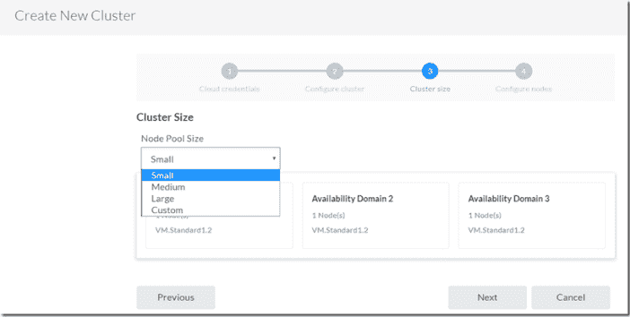
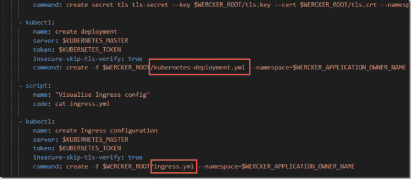

# Oracle 托管的 Kubernetes 云—使用 Wercker 管道实现自动化部署的第一步

> 原文：<https://medium.com/oracledevs/oracle-managed-kubernetes-cloud-first-steps-with-automated-deployment-using-wercker-pipelines-3cad7ff70142?source=collection_archive---------0----------------------->

甲骨文在甲骨文全球大会 2017 期间宣布托管 Kubernetes 云服务。12 月初，我有机会使用这个新的容器原生云产品。这很简单:

通过 Wercker 控制台

可以在 Oracle 裸机云(也称为 Oracle 云基础架构)环境中创建新的集群。提供了云凭据

指定名称和 K8S 版本:

群集大小配置如下:

并且节点配置被指示为:

随后，Oracle 将根据这些规范向指定的云基础架构部署 Kubernetes 集群。

该群集的地址在此屏幕截图中突出显示。稍后将需要此端点来配置自动化部署管道。

这个集群可以通过 Kubernetes 仪表板进行管理。部署到集群可以使用普通的方法来完成——比如 kubectl 命令行工具。Oracle 建议使用 Wercker 管道实现所有部署的自动化。我将在本文中说明这是如何做到的。

源代码可以在 GitHub 上找到:[https://github.com/lucasjellema/the-simple-app](https://github.com/lucasjellema/the-simple-app)。请注意，代码非常简单。

步骤是:(假设一个人已经有了一个 GitHub 帐户、一个 Wercker 帐户和一个本地 kubectl 安装)

1.  在 Wercker 帐户中生成一个个人令牌(用于 Wercker 与 Kubernetes 集群的直接交互)
2.  准备(本地)Kubernetes 配置文件—以便使用本地 kubectl 命令行处理集群
3.  实现将要部署到 Kubernetes 集群上的应用程序——例如一个简单的节点应用程序
4.  创建 wercker.yml 文件(以及 Kubernetes 部署文件的模板),该文件描述了应用程序的构建步骤及其在 Kubernetes 上的部署
5.  将应用程序推送到 GitHub 存储库
6.  在 Wercker 控制台中创建一个与 GitHub 存储库相关联的*版本*
7.  使用 wercker.yml 文件中的管道为应用程序定义 Wercker 管道
8.  定义自动化管道——上一步中定义的管道链，由 GitHub repo 中的提交等事件触发
9.  定义环境变量——特别是用于从自动化管道连接到 Kubernetes 集群的 Kubernetes 端点和用户令牌
10.  触发自动化管道——例如通过提交给 GitHub
11.  在 Kubernetes 中——仪表板或命令行——验证应用程序是否已部署，并确定公共端点
12.  访问应用程序
13.  重复步骤 10..12 在发展应用程序时

# 生成 Wercker 令牌

# 准备本地 Kubernetes 配置文件

在用户/ <current user="">/中创建配置文件。kube 目录，包含 Kubernetes 集群的服务器地址和在 Wercker 用户设置中生成的令牌。该文件类似于此屏幕截图:</current>

通过运行以下示例来验证配置文件的正确性:

> *库比特版本*

或者任何其他的库比特命令。

# 实现要部署到 Kubernetes 集群上的应用程序

在本例中，该应用程序是一个非常简单的 Node/Express 应用程序，它处理两种类型的 HTTP 请求:对 url 路径/about 的 GET 请求和对/simple-app 的 POST 请求。这种应用没有什么特别之处——事实上，它完全没有吸引力。该功能包括返回一个结果，证明应用程序已被成功调用，仅此而已。

应用程序来源于[https://github.com/lucasjellema/the-simple-app](https://github.com/lucasjellema/the-simple-app)——主要是文件 app.js。

在实现 app.js 之后，我可以在本地运行和调用应用程序:

# 为应用程序创建 wercker.yml 文件

wercker.yml 文件为 wercker 引擎提供了如何执行构建和部署步骤的说明。这一步利用了 Wercker 构建引擎在运行时提供的参数值，部分来自于在组织、应用程序或管道级别为环境变量定义的值。

这里显示了三条管道:

*构建*管道以节点:6.10 base Docker 容器图像为起点。它添加源代码，执行 npm 安装并生成 TLS 密钥和证书。*推式发布*管道将构建结果(容器图像)存储在配置的容器注册表中。*部署到 oke*(oke = = Oracle Kubernetes Engine)管道获取容器映像，并使用 Kubernetes 模板文件将其部署到 Kubernetes 集群，如该屏幕截图所示。

除了 wercker.yml 文件，我们还获得了 Kubernetes 部署文件的模板，这些模板描述了对 Kubernetes 的部署。

*原载于 2017 年 12 月 2 日*[*technology . amis . nl*](https://technology.amis.nl/2017/12/02/oracle-managed-kubernetes-cloud-first-steps-with-automated-deployment-using-wercker-pipelines/)*。*