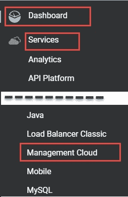
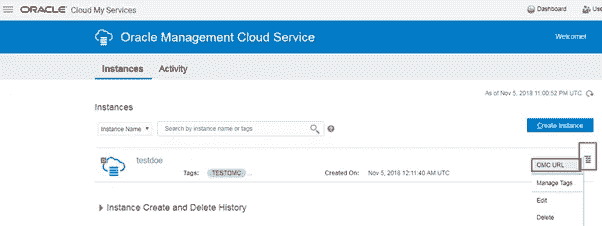
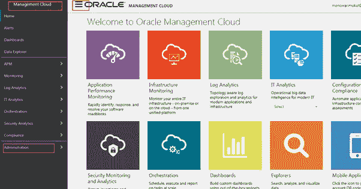
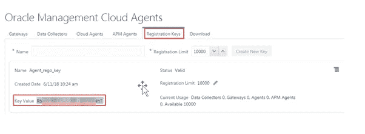
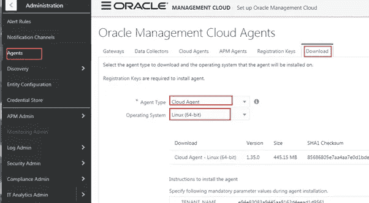
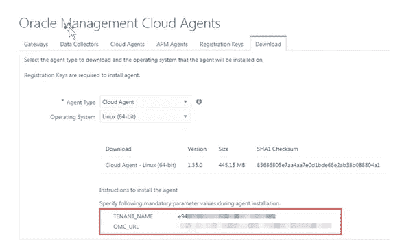
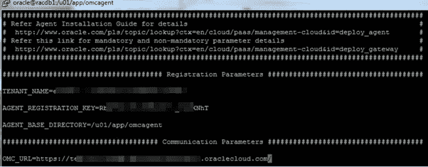
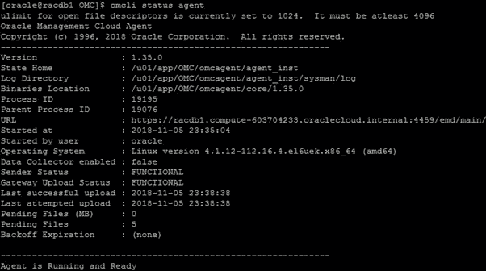
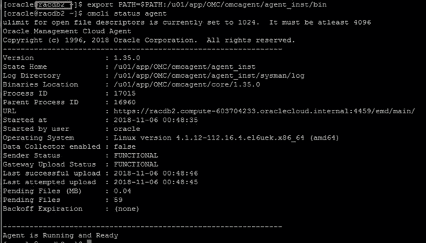
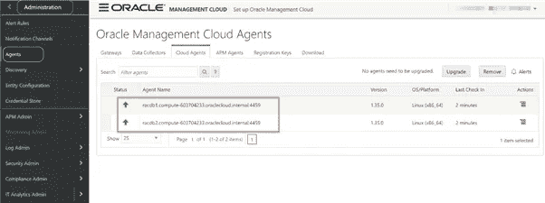

# Oracle 管理云—代理部署

> 原文：<https://medium.com/oracledevs/oracle-management-cloud-agent-deployment-24394dde017f?source=collection_archive---------0----------------------->

## 作者:[mono war Mukul](https://medium.com/u/3757393c69bd?source=post_page-----24394dde017f--------------------------------)(OCM)&[NASS yam Basha](https://medium.com/u/ba3f0a72ff81?source=post_page-----24394dde017f--------------------------------)(甲骨文王牌总监，OCM)

## 介绍

在第一篇文章中，我们已经了解了如何创建和配置 Oracle 管理云实例。在本文中，我们将按照后续步骤在目标端下载并安装 Oracle 管理云代理。在此示例中，目标将是一个双节点 RAC 群集。

## **OMC 代理**

Oracle Management Cloud agent 在将分析数据发送到 OMC 服务器方面发挥着主要和关键的作用，在吸引人的图形用户界面中为少数人提供了漂亮的图形。我们将在下一篇文章中看到如何应用分析以及如何收集数据。在本文中，我们将纯粹关注代理安装以及如何注册密钥。

要下载适用于 OMC 的代理软件，请访问 Oracle 管理云门户，并按照“控制面板→服务→管理云”的导航进行操作这个导航将我们重定向到 OMC 实例和 OMC 界面。



Navigation to Management Cloud Page

从 OMC 服务访问 OMC 门户网站如下。



OMC Portal Access

现在，OMC 网址将带我们进入 OMC 界面，以管理、监控和控制管理云。最初，我们将通过导航“管理云à管理à代理”从 OMC 界面下载所需平台的代理软件



OMC Interface

在 Oracle Management Cloud Agent 页面中，我们将执行两项操作。

1.  注册密钥
2.  下载代理软件
3.  代理的安装。

## **创建注册密钥**

最初，我们将创建注册密钥—针对身份域颁发的注册密钥，这些密钥将在代理安装时使用。创建注册密钥后，确保状态处于有效状态。



Creating registration keys for OMC agents

创建注册密钥后，使用导航“操作菜单→管理注册密钥”按照导航下载密钥。它将显示到目前为止创建的所有注册密钥。选择适当的注册码并下载。

## **下载代理软件**

现在，我们将继续下一步，下载所需平台的代理文件。在同一个 OMC 代理中，我们将通过选择 I)代理类型 ii)操作系统，从“下载”选项卡下载代理。



Download the platform based agent software.

下载页面中有值得注意的信息来保存值

1.  租户名称
2.  OMC _ 网址
3.  AGENT_REGISTRATION_KEY —这些值将在代理安装时使用。



Save the information related to OMC, TENANT Names

## 正在安装 OMC 代理

下载代理软件后，我们将移动到目标服务器，并确保校验和值与上述图像相同。

```
[oracle@racdb1 tmp]$ unzip cloudagent_linux.x64_1.35.0.zip -d /u01/app/OMC
Archive: cloudagent_linux.x64_1.35.0.zip
inflating: /u01/app/omcagent/unzip
inflating: /u01/app/omcagent/AgentDeployment.sh
inflating: /u01/app/omcagent/agentimage.properties
inflating: /u01/app/omcagent/agent.rsp
inflating: /u01/app/omcagent/agent_software_build.xml
extracting: /u01/app/omcagent/agentcoreimage.zip
inflating: /u01/app/omcagent/AgentInstall.sh
```

从解压缩的文件夹中，我们可以看到带有“agent.rsp”的文件，我们将制作该文件的副本，这样我们就不会干扰原始文件。

```
$ cp agent.rsp agent.rsp.bkp
$ vi agent.rsp
```

在代理响应文件中，我们将授予以下信息

1.  租户名称
2.  OMC _ 网址
3.  代理 _ 注册 _ 密钥



Validate the values of the response file

完成 agent.rsp 文件中的更改后，我们将运行代理安装程序，并且我们将忽略如下响应文件。

## **以 oracle OS 用户身份运行代理安装**

```
[oracle@racdb1 OMC]$ ./AgentInstall.sh AGENT_RSP_FILE=agent.rsp
Unzipping agent software, this may take some time…
Installing Cloud Agent…
Cloud Agent parameter validation started…
Cloud Agent pre-requisite checks started…
Cloud Agent base directory creation started…
Security artifacts download started…
Cloud Agent setup started…
Registering Cloud Agent…
Starting Cloud Agent…
Cloud Agent started.
Cloud Agent installation completed.
Cloud Agent post installation checks started.
Cloud Agent is up and running.
Cloud Agent is communicating to Oracle Management Cloud.
Cloud Agent is monitored in Oracle Management Cloud.
Cloud Agent post installation checks completed.
To start Cloud Agent upon Operating System restart include ‘/u01/app/OMC/omcagent/agent_inst/bin/omcli start agent’ in the start-up scripts.
For further details please refer [http://www.oracle.com/pls/topic/lookup?ctx=en/cloud/paas/management-cloud&id=deploy_agent.](http://www.oracle.com/pls/topic/lookup?ctx=en/cloud/paas/management-cloud&id=deploy_agent.)
```

## **检查代理状态**

将代理二进制文件导出到路径，以访问带有关联文件的 omcli 可执行文件。

```
[oracle@racdb1 OMC]$ export PATH=$PATH:/u01/app/OMC/omcagent/agent_inst/bin
```



Agent Status

## **执行根脚本**

以 root 用户身份登录并执行 root.sh 脚本来更新存储库。

```
[opc@racdb1 app]$ sudo su -
Last login: Mon Nov 5 23:32:04 UTC 2018 on pts/0
[root@racdb1 ~]# /u01/app/OMC/omcagent/core/1.35.0/root.sh
/etc exist
Creating /etc/oragchomelist file…
/bin/chown: invalid group: `oracle:#OSDBA_GROUP#’
```

## **在第二个节点上扩展 OMC 云代理**

到目前为止，我们已经在节点 1 上完成了所有必需的步骤，同样，我们还需要在第二个节点上执行所有的步骤。假设我们已经在第二个节点上安装了代理，并在第二个节点上检查 OMC 代理的状态，如下所示。



Agent Status from the 2nd node of cluster

## **代理部署后验证 OMC 服务器**

我们已经在 RAC 集群的两个节点上部署了代理，现在我们将使用导航“OMC 控制台à管理à代理”来检查 OMC 服务器控制台中的状态。验证云代理是否正在 RAC 配置的所有节点上运行。



Agents latest status from OMC

> **问题**？目标将如何与 OMC 服务器通信？这里，注册密钥在从目标到服务器的身份验证中起着重要作用。同样，SSH 密钥也适用于从一台服务器到另一台服务器的身份验证。

## **总结**

我们已经了解了如何为代理注册密钥，以及如何下载所需的基于平台的代理并在 RAC 的两个节点上进行安装，最后，我们还从 OMC 控制台看到了代理的状态以及分步说明。

## **作者**

Nassyam Basha 是一名数据库管理员。他有大约十年的 Oracle 数据库管理员工作经验，目前是 eprosed KSA 公司的数据库专家。他拥有马德拉斯大学的计算机应用硕士学位。他是 Oracle 11g 认证大师和 Oracle ACE 总监。他以超级英雄的身份积极参与甲骨文相关论坛，如 OTN，甲骨文支持被授予“大师”称号，并担任 OTN 版主，与 OTN 一起撰写了大量关于 Toad World 的文章。他维护着一个与甲骨文技术相关的博客，[www.oracle-ckpt.com](http://www.oracle-ckpt.com/)，可以通过[https://www.linkedin.com/in/nassyambasha/](https://www.linkedin.com/in/nassyambasha/)找到他

Monowar Mukul 目前担任首席 Oracle 数据库专家。我是 Oracle 认证大师(Oracle 12c 认证大师管理、Oracle 12c 认证大师 MAA 和 Oracle 11g 认证大师管理)。他在 Oracle MAA 空间担任了 17 年的 Oracle 数据库管理员顾问，负责数据库云服务器和非数据库云服务器系统、Oracle 云空间和 SOA 中间件。他曾在澳大利亚的多个商业领域工作，包括高等教育、能源、政府、采矿和运输。作为一名首席 Oracle 数据库专家，他展示了高度发展的批判性思维和分析技能。你可以在 https://www.linkedin.com/in/monowarmukul/的[找到关于他和他的工作成就的更多细节](https://www.linkedin.com/in/monowarmukul/)