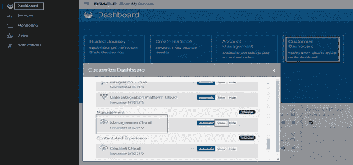
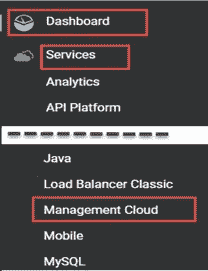
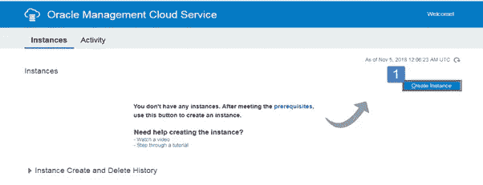
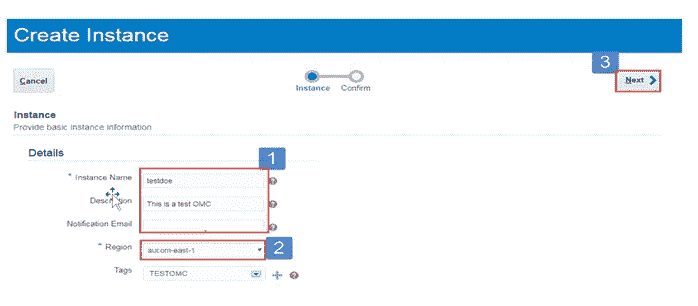
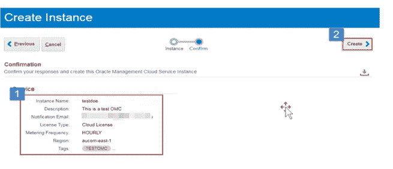
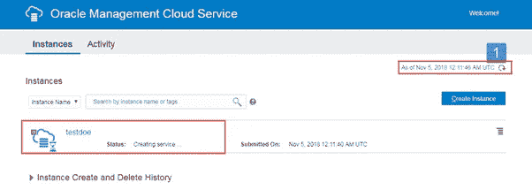
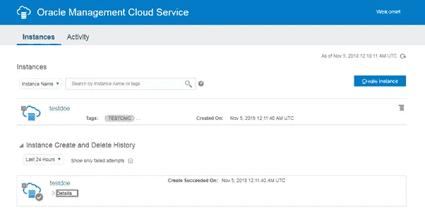
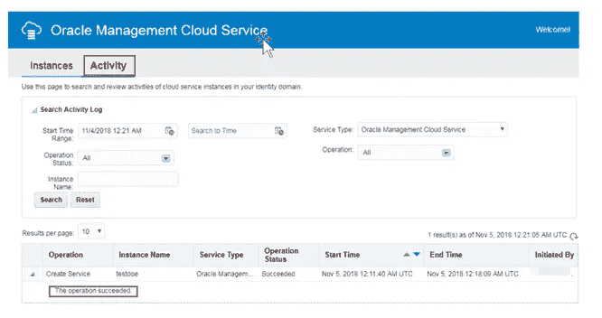
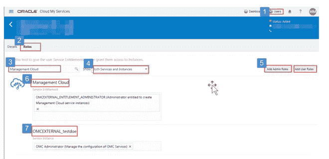

# Oracle 管理云实例第一印象

> 原文：<https://medium.com/oracledevs/oracle-management-cloud-instance-first-look-4f739de7ffc?source=collection_archive---------0----------------------->

## 作者:[莫诺瓦·穆库尔](https://medium.com/u/3757393c69bd?source=post_page-----4f739de7ffc--------------------------------) (OCM) & [纳西姆·巴沙](https://medium.com/u/ba3f0a72ff81?source=post_page-----4f739de7ffc--------------------------------)(甲骨文王牌总监，OCM)

## 一、**简介**

在本文中，我们将探讨如何通过简单的两个步骤创建 Oracle 管理云实例和配置，并按照分步说明分配所需的角色以高效访问。

## **甲骨文管理云(OMC)**

要创建 OMC 服务和实例供应，我们必须访问 Oracle Cloud Dashboard 门户控制台页面。

登录 Oracle 云门户仪表板:验证 Oracle 管理云(OMC)服务是否已激活。如果 OMC 服务处于非活动状态，则导航至“自定义控制面板”，并根据导航“控制面板→自定义控制面板→管理云”启用它，然后单击“显示”确保**管理云**服务面板显示在服务控制面板上。

Customizing Dashboard to enable OMC service

## **OMC 实例供应**

要访问 OMC 控制台，请单击“服务”部分下的“管理云”，如下所示。

Navigation to Management Cloud

它将重定向“Oracle 管理云服务”页面，在此页面中，我们可以创建服务，也可以管理已创建/现有的 OMC 实例。

The first look of OMC console to create or manage Instances.

## **创建 OMC 实例**

在本文中，我们的目标是创建 OMC 实例，因此单击“创建实例”按钮，并提供要预配的 OMC 实例的详细信息。

*   提供 OMC 实例的详细资料
*   选择所需区域，如 ***aucom-east-1*** 或其他可用区域。
*   然后点击下一步。

Create Instance Page in OMC Console.

完成以上与 OMC 实例相关的字段后，单击“下一步”,这将重定向到一个摘要页面，以确认要预配的 OMC 实例的详细信息是正确的。

*   复查 OMC 实例详细资料
*   然后点击创建按钮。

Summary of Instance

提交请求后，完成此过程可能需要 10 到 15 分钟。同时，我们可以查看 OMC 实例预配过程的状态[刷新页面有助于了解最新状态]。

完成后，查看状态以确认 OMC 实例预配成功完成。

OMC instance creation in progress

10 到 15 分钟后，实例就可以使用了。

Status of the OMC Instance

Review Activity of the OMC instance

顺便说一句，不要忘记检查你的电子邮件，而不是监控 OMC 的供应过程。一旦 OMC 实例创建，通知将被发送到注册的电子邮件地址

## **OMC 服务和实例授权**

调配 OMC 服务后，我们可以将实例授权分配给用户。

注意:当授予用户访问 OMC 服务或实例的权利时，用户将收到电子邮件通知。在用户管理页面中，转到要为其分配访问权限的用户:

1.  搜索管理云
2.  单击“添加管理员角色”以授予创建/修改 OMC 服务和实例的权限。
3.  单击“添加用户角色”以授予读取/复查 OMC 服务和实例的权限。
4.  验证管理服务权利
5.  验证 OMC 实例权利(例如，OMCEXTERNAL_testdoe)

OMC instance Entitlements

## **总结**

我们已经看到了如何通过简单的步骤创建和提供 OMC 实例，以及如何授予用户访问 OMC 实例的权限。

## **作者简介**

**Nassyam Basha** 是一名数据库管理员。他有大约十年的 Oracle 数据库管理员工作经验，目前是 eprosed KSA 公司的数据库专家。他拥有马德拉斯大学的计算机应用硕士学位。他是 Oracle 11g 认证大师和 Oracle ACE 总监。他以超级英雄的身份积极参与甲骨文相关论坛，如 OTN，甲骨文支持被授予“大师”称号，并担任 OTN 版主，与 OTN 一起撰写了大量关于 Toad World 的文章。他维护着一个与甲骨文技术相关的博客，[www.oracle-ckpt.com](http://www.oracle-ckpt.com/)，可以通过[https://www.linkedin.com/in/nassyambasha/](https://www.linkedin.com/in/nassyambasha/)找到他

**Monowar Mukul** 目前担任首席 Oracle 数据库专家。我是 Oracle 认证大师(Oracle 12c 认证大师管理、Oracle 12c 认证大师 MAA 和 Oracle 11g 认证大师管理)。他在 Oracle MAA 空间担任了 17 年的 Oracle 数据库管理员顾问，负责数据库云服务器和非数据库云服务器系统、Oracle 云空间和 SOA 中间件。他曾在澳大利亚的多个商业领域工作，包括高等教育、能源、政府、采矿和运输。作为一名首席 Oracle 数据库专家，他展示了高度发展的批判性思维和分析技能。你可以在[https://www.linkedin.com/in/monowarmukul/](https://www.linkedin.com/in/monowarmukul/)找到关于他和他的工作成就的更多细节