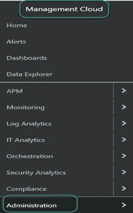

# Oracle 管理云—通知渠道和解释警报规则

> 原文：<https://medium.com/oracledevs/oracle-management-cloud-notification-channels-and-interpreting-the-alert-rules-f22772e94322?source=collection_archive---------1----------------------->

## 作者:[mono war Mukul](https://medium.com/u/3757393c69bd?source=post_page-----f22772e94322--------------------------------)(OCM)[NASS yam Basha](https://medium.com/u/ba3f0a72ff81?source=post_page-----f22772e94322--------------------------------)(甲骨文王牌总监，OCM)

## **简介**

在本文中，我们将设置警报规则来接收关于目标的任何失败或警告的通知。监控数据库系统或服务器是 IT 中的一个关键角色，以确保系统按照业务要求全天候运行。我们将重点讨论如何创建电子邮件和移动渠道来接收通知。接下来，我们将创建示例警报，我们将解释接收电子邮件和移动应用程序通知的目标，这将是本文非常有趣的部分。

## **OMC 通知频道**

在创建警报规则之前，最好设置所需的通知通道，以便在目标(数据库、服务器、监听程序、相关应用程序等)出现任何中断或警报时接收通知。).我们认为主要通知渠道是电子邮件，次要通知渠道是手机。适用于 IT 经理、IT 主管的移动通知渠道，以及 DBA、系统管理员、网络管理员等 IT 管理员首选的电子邮件通知渠道。

## **设置邮件通知通道**

电子邮件通知渠道被认为是主要渠道，因为在 24/7 服务交付操作中，一旦出现任何故障或中断，警报都应发送到分发列表，如 DBA 团队、网络团队、SA 团队等。)另外还有其他列表。

导航至“汉堡菜单→管理→通知渠道”，如下所示。

Navigation to Notification Channels

Notification Channels Console

从通知通道控制台，我们可以看到“创建通知通道”选项通知渠道允许我们配置各种类型的渠道，如电子邮件、手机和其他特定于供应商的票务/消息系统。在本节中，我们的目标是创建一个电子邮件通知渠道，并点击“电子邮件”并提供如下两个字段。

*   通道名称:该通知通道的直观名称。
*   电子邮件地址:以逗号分隔的收件人电子邮件地址列表。

Creating Email Channel

这非常简单，没有其他任务需要执行来配置电子邮件通知通道。

## **设置手机通知频道**

移动通知通道将通知推送到移动电话应用程序，并帮助管理人员跟踪来自基础设施的任何致命/关键警报。移动通知渠道极大地减少了 IT 部门的问题升级。现在，我们将了解如何从 OMC 创建一个移动频道，导航至“汉堡菜单à管理à通知频道”，如下所示。

> ***注意:要接收移动通知频道，我们应安装该应用程序，并且仅在“Apple Store”中可用要接收通知，用户应使用用户凭据登录应用程序。***

提供以下字段以完成渠道详细信息。

1.  频道名称
2.  OMC 用户名

Create a Mobile Channel

提交渠道之前，请在 App store 中检查 Oracle Management Cloud Mobile 应用程序，下载并安装该应用程序。安装后使用用户凭证登录。

OMC Application from App Store

提交请求后，我们可以从 Oracle Management Cloud console 查看到目前为止创建的通道列表。

Status of the Channel creation

## **创建预警规则**

我们已经完成了通知通道的创建，现在我们将创建示例警报规则。我们的目标是创建一个警报规则，当超过阈值限制时，用户应该会收到相关的通知。

以 Oracle Infrastructure Monitoring 管理员用户身份连接到 OMC，并按照导航“汉堡包菜单→管理→警报规则”进行操作

Navigation to Alert Rules

Select Monitoring under the Service

选择“监控”服务，然后创建警报规则。

Create Alert Rule

下图是预警规则的核心，在本例中，我们将为“Oracle Database”创建预警，其中一个预警将解释数据库可用性的预警规则。在数据库中断时，我们希望通过电子邮件和移动应用程序收到通知。

在下面的屏幕中，我们将输入以下字段。

1.  示例:下拉列表并选择“Oracle 数据库”
2.  输入规则名称
3.  新警报规则的规则描述(可选)。
4.  选择实体类型或单个实体选项。
5.  实体:Oracle 数据库
6.  指定警报条件。(例如:可用性、最大会话数)
7.  指定警报通知的收件人，并指示应发送警报的时间

Create Alert Rule Form

保存警报规则的详细信息，并确保该规则已启用，如下所示。

Alert Rule should be in Enabled Status

## **修改预警规则**

对于已经创建的警报规则，我们可以在任何时间点修改指标的阈值，例如将警告阈值从 75 修改为 80。为此，导航至“汉堡菜单→管理云→监控→警报”

在编辑预警规则控制台中，我们可以看到实体的所有指标列表，并单击特定指标的编辑按钮。

Editing Alert Rule

根据需求更改所需的值，并保存更改。

Editing Alert Rule Values

> ***在测试预警规则之前，请确保从实体配置中启用了日志收集，然后只有来自目标的代理可以定期将数据推送到 OMC。***

Log Collection In Enabled Status

## **解读预警规则**

我们将停止数据库“testdb ”,我们将看到警报是如何工作的，以及是否能够接收电子邮件和移动应用程序的通知。

假设数据库被终止或在没有任何通知 OMC 服务器的情况下关闭数据库，我们可以立即收到致命警报，因为数据库已关闭。

Email Notification from OMC

现在，我们将从目标重新启动数据库，然后我们收到了警报在数据库可用时被清除的确认。

Auto cleared the Alerts

同样，我们将同时收到针对 Oracle 管理云移动应用程序的通知，这些通知带有漂亮的图形和界面。

> 注意:在 OMC 应用程序中，我们使用了一个模拟账户。

Mobile Application — Alerts

要查看所有未处理的警报和目标的可用性，我们可以通过导航“Hamburger menu à Alerts”从下面的控制台查看它们

Status board for outstanding Alerts

## **总结**

我们已经看到了关于如何创建电子邮件和移动设备的 Oracle 管理云渠道的 360°概述，还讨论了本文需要讨论的一些其他主题。

*   添加警报规则
*   修改警报规则
*   解释预警/指标
*   查看目标的未处理预警/可用性。

## **作者简介**

***Nassyam Basha*** 是数据库管理员。他有大约十年的 Oracle 数据库管理员工作经验，目前是 eprosed KSA 公司的数据库专家。他拥有马德拉斯大学的计算机应用硕士学位。他是 Oracle 11g 认证大师和 Oracle ACE 总监。他以超级英雄的身份积极参与甲骨文相关论坛，如 OTN，甲骨文支持被授予“大师”称号，并担任 OTN 版主，与 OTN 一起撰写了大量关于 Toad World 的文章。他维护着一个与甲骨文技术相关的博客，[www.oracle-ckpt.com](http://www.oracle-ckpt.com/)，可以通过[https://www.linkedin.com/in/nassyambasha/](https://www.linkedin.com/in/nassyambasha/)找到他

***Monowar Mukul*** 目前担任首席 Oracle 数据库专家。我是 Oracle 认证大师(Oracle 12c 认证大师管理、Oracle 12c 认证大师 MAA 和 Oracle 11g 认证大师管理)。他在 Oracle MAA 空间担任了 17 年的 Oracle 数据库管理员顾问，负责数据库云服务器和非数据库云服务器系统、Oracle 云空间和 SOA 中间件。他曾在澳大利亚的多个商业领域工作，包括高等教育、能源、政府、采矿和运输。作为一名首席 Oracle 数据库专家，他展示了高度发展的批判性思维和分析技能。你可以在 https://www.linkedin.com/in/monowarmukul/[找到更多关于他和他的工作成就的细节](https://www.linkedin.com/in/monowarmukul/)

## 参考

[https://docs . Oracle . com/en/cloud/PAAs/management-cloud/moncs/set-alert-rules . html # GUID-db 28465 f-CBDA-4c 92-8e 80-9 c 072 a2 b 3243](https://docs.oracle.com/en/cloud/paas/management-cloud/moncs/set-alert-rules.html#GUID-DB28465F-CBDA-4C92-8E80-9C072A2B3243)