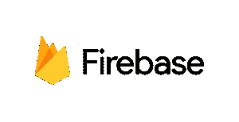

# Oracle 云上的移动应用集成选项

> 原文：<https://medium.com/oracledevs/oracle-mobile-cloud-service-mcs-overview-of-integration-options-cb714cdc1895?source=collection_archive---------1----------------------->

[移动云服务](http://cloud.oracle.com/mobile)(又名 *MCS* )有很多选项，允许它与其他服务和系统集成。由于它为自定义 API 实现运行 Node.js，因此非常灵活。

一些特性允许它扩展自己的功能，例如 Firebase 配置选项，以向移动设备发送通知，而连接器则允许向导驱动的与其他系统的集成。最新 Node.js 版本上运行的定制 API 功能将所有这些联系在一起。

> 在这篇博客文章中，我将提供 MCS 集成选项的快速概述和一些背景。

MCS 有很好的记录[这里](http://docs.oracle.com/en/cloud/paas/mobile-cloud/mcsua/)，有许多 YouTube 视频可以解释/演示各种 MCS 功能[这里](https://www.youtube.com/user/OracleMobilePlatform)。所以如果你想了解更多，我建议看看那些。

# 一些最近的功能

Oracle 正在努力改进和扩展 MCS 功能。有关服务的最新改进，请参见[下页](https://docs.oracle.com/en/cloud/paas/mobile-cloud/mcswn/index.html)。过去半年中我个人欣赏的一些亮点也将在本博客中引起一些关注:

*   零足迹单点登录(2017 年 6 月)
*   REST 连接器除了 RAML 之外的 Swagger 支持(2017 年 4 月)
*   Node.js 版本 6.10.0 支持(2017 年 4 月)
*   支持 Firebase (FCM)取代 GCM(2016 年 12 月)
*   支持第三方令牌(2016 年 12 月)

# 集成功能

一般来说，从 MCS 发送通知有两种选择。与 FCM 集成和与 Syniverse 集成。因为他们是第三方供应商，所以在选择他们之前，您应该比较这些选项(许可证、支持、性能、成本等)。

您还可以使用任何其他通知提供程序，如果它通过使用 REST 连接器提供了 REST 接口。不过，在通过 MCS 界面进行配置时，您不会得到太多帮助；这将是一个自定义的实现。

## Firebase 云消息和 Google 云消息

通知支持是通过与 Google 云消息产品集成实现的。在 MCS 中，[谷歌云消息(GCM)](https://developers.google.com/cloud-messaging/) 正在被 [Firebase 云消息(FCM)](https://firebase.google.com/docs/cloud-messaging/) 所取代。GCM 已经被 Google 弃用了一段时间，所以这是一个好的举措。不过你确实需要一个谷歌云账户，并且必须购买他们的服务才能使用这项功能。关于如何从 JET 混合应用中实现这一点，请参见[这里的](https://community.oracle.com/community/oracle-cloud/oracle-cloud-developer-solutions/blog/2016/08/16/your-first-push-notification-based-oracle-jet-hybrid-application)。

# Syniverse

点击阅读更多关于如何实现这个[的内容。您首先必须创建一个 Syniverse 帐户。接下来订阅 Syniverse 消息服务，注册应用程序并获取凭证。您可以在 MCS 的客户端管理中注册这些凭据。](https://docs.oracle.com/en/cloud/paas/mobile-cloud/mcsua/notifications.html#GUID-71FDB6E6-E9E3-4F49-8601-DC748FF44426)

# 信标支持

信标创建可以被移动设备在蓝牙上检测到的包。信标广播的包结构可以不同。iBeacon、altBeacon 和 Eddystone 都有可用的示例，但是如果您知道相应的包结构，还可以添加其他示例。参见[下面的介绍](https://www.slideshare.net/stevendavelaar/building-beaconenabled-apps-with-oracle-mcs)信标的一些背景知识以及它们如何集成到 MCS 中。对于一个安卓 app 如何实现这个可以看[这里](https://www.youtube.com/watch?v=BGNXwWGoR2o)。

# SDK 对客户端开发的支持

[MCS 附带了几个 SDK](http://www.oracle.com/technetwork/topics/cloud/downloads/mobile-cloud-service-3636470.html)，它们提供了客户端与 MCS APIs 的轻松集成。可用的客户端 SDK 有 iOS、Android、Windows、Web(纯 JavaScript)。这些 SDK 提供了使用原始 MCS REST APIs 的简单替代方法。它们为 API 提供了一个包装器，并以客户端使用的相应语言提供了方便的访问。

[下载 MCS SDK](http://www.oracle.com/technetwork/topics/cloud/downloads/mobile-cloud-service-3636470.html)

# 认证选项

## JWT·萨姆尔

提供对 SAML 和 JWT 的第三方令牌支持。令牌交换是 MCS 的一部分，MCS 基于专门定义的映射从第三方令牌创建 MCS 令牌。客户端可以在后续请求中使用这个 MCS 令牌。这确实需要在客户端做一些工作，但是 SDK 当然会对此有所帮助。

在文档中找到关于这个实现[的更多细节。](http://docs.oracle.com/en/cloud/paas/mobile-cloud/mcsua/authentication-mcs.html#GUID-4A02AD1E-B865-4A5C-9EFC-13DE2953535A)

## 脸书登录

在[的博客](https://community.oracle.com/community/oracle-cloud/oracle-cloud-developer-solutions/blog/2017/01/31/how-to-integrate-and-secure-custom-apis-using-facebook-login-in-hybrid-apps)中，有一个关于如何在混合 JET 应用中实现这一点的例子。它涵盖了使用脸书登录来集成和保护自定义 API 的分步实现。

阅读[的博客](https://community.oracle.com/community/oracle-cloud/oracle-cloud-developer-solutions/blog/2017/01/31/how-to-integrate-and-secure-custom-apis-using-facebook-login-in-hybrid-apps)。

## OAuth2 和基本身份验证支持

不支持第三方 OAuth 令牌。这并不奇怪，因为 OAuth 令牌不包含用户数据，MCS 需要一种方法来验证令牌。MCS 提供自己的 OAuth2 STS(安全令牌服务)来为 MCS 用户创建令牌。点击阅读更多[。](https://technology.amis.nl/2017/04/07/mcs-introduction-api-security-basic-authentication-oauth2/)

## 企业单点登录支持

不要将它与 Oracle 企业单点登录套件(ESSO)相混淆。这是允许访问 MCS 的 Oracle 云用户的[基于浏览器的身份验证](https://docs.oracle.com/en/cloud/paas/mobile-cloud/mcsua/authentication-mcs.html#GUID-55D86B3D-F8BF-457E-8A2A-D33928BCFFDF)。

这些提供了最常见的 web 身份验证方法。尤其是第三方 SAML 和 JWT 支持提供了许多与第三方身份验证提供商的集成选项。文档中以 OKTA 为例。

查看[文档](https://docs.oracle.com/en/cloud/paas/mobile-cloud/mcsua/authentication-mcs.html#GUID-55D86B3D-F8BF-457E-8A2A-D33928BCFFDF)了解更多信息。

# 应用程序集成:连接器

MCS 提供允许在 MCS 中进行向导驱动配置的连接器。连接器用于拨出电话。有一个可用的连接器 API，它使得从定制 JavaScript 代码与连接器进行交互变得容易。这些连接器支持使用 Oracle 凭据存储框架(CSF)密钥和证书。支持 TLS 1.2 的 TLS 版本。

当然，你会被警告说旧版本可能不安全。连接器的请求是通过 HTTP 进行的，因为目前没有其他技术得到直接支持。如果需要的话，您当然可以使用 REST APIs 和 ICS 作为包装器。

## 连接器安全设置

对于不同的连接器，使用了几种 Oracle Web Service 安全管理器(OWSM)策略。看这里。这些允许您配置几个安全设置，例如允许将 WS 安全和 SAML 令牌用于传出连接。可以使用安全策略属性来配置这些策略。此处见[。](https://docs.oracle.com/en/cloud/paas/mobile-cloud/mcsua/rest-connector-apis.html#GUID-B99D930D-122F-4445-9A53-1403BDAED057)

## 休息

建议使用 REST 连接器，而不是直接从您的自定义 API 代码进行调用，因为它们可以很好地与 MCS 集成，并提供安全性和监控优势。例如开箱即用的分析。

## 肥皂

SOAP 连接器可以在 SOAP 和 JSON 之间进行转换，使得在 JavaScript 代码中使用 XML 更加容易。然而，这有一些限制:

## 连接器范围

连接器 API 的[范围](https://docs.oracle.com/en/cloud/paas/mobile-cloud/mcsua/soap-connector-apis.html#GUID-4ACC6C6C-5FBB-471F-90DB-69C2BA9D1C32)也定义了一些通用限制:

*   仅支持 SOAP 版和 1.2 版。
*   仅支持 WS-Security 标准。不支持其他 WS-*标准，如 WS-RM 或 WS-AT。
*   仅支持文档样式和文字编码。
*   不支持附件。
*   在输入和输出消息操作的可能组合中，仅支持输入-输出操作和仅输入操作。这些操作在 Web 服务描述语言(WSDL)版本 1.2 规范中进行了描述。

## 转换限制

*   从 SOAP 到 XML 的转换有局限性
*   一个选择组，其子元素属于具有相同(本地)名称的不同名称空间。这是因为 JSON 没有任何名称空间信息。
*   子元素具有重复本地名称的序列组。比如 <parent><childa><childb>… <childa>…</childa></childb></childa></parent> 。这意味着一个对象有重复的属性名，这是无效的。
*   不支持 XML 架构实例(xsi)属性。

## 集成云服务的连接器

该连接器允许您调用 ICS 集成。您可以连接到 ICS 实例，并从下拉菜单中选择一个集成。对于在云架构中也使用 IC 的人来说，这可能是最常用的连接器。

在[文档](https://docs.oracle.com/en/cloud/paas/mobile-cloud/mcsua/ics-connector-apis.html#GUID-FC12D345-07F2-43BF-8C0C-4938DD37EAFB)中找到更多相关信息。

## 用于融合应用的连接器

这个流程看起来类似于 ICS 云适配器的流程(这里的[是](https://docs.oracle.com/en/cloud/paas/integration-cloud-service/find-adapters.html))。简而言之，您进行了身份验证，完成了资源发现，并且生成了包含连接器配置的本地工件。在运行时，此配置用于访问服务。连接器的向导驱动配置是一个很大的优势。MCS 不像 ICS 和 SOA CS 那样提供全系列的云适配器。

在[文档](https://docs.oracle.com/en/cloud/paas/mobile-cloud/mcsua/fusion-applications-connector-apis.html#GUID-AD851659-DAF1-43EF-81A9-84E013020D3A)中有更多关于 Fusion Apps Connector 的信息。

# 摘要

Oracle Mobile Cloud Service 允许您使用 JavaScript 代码定义自定义 API。版本 17 . 2 . 5–2017 05 10 13 47 已经运行 Node.js 版本 6.10.0 和 OpenSSL 版本 1.0.2k，这些都是相当新的！

因为支持新的 OpenSSL 版本，所以 TLS 1.2 密码也受支持，并可用于创建与其他系统的连接。这可以通过自定义 API 代码或通过在连接器配置中配置 OWSM 设置来完成。它运行在 Oracle Enterprise Linux 6 内核 2 . 6 . 39–400 . 109 . 6 . El 6 uek . x86 _ 64 上。大多数 JavaScript 包都可以在这个版本上运行，所以限制很少。

ICS 还提供了一个选项来定义[自定义 JavaScript 函数](https://oracle-integration.cloud/2017/05/22/custom-functions-ics-definitive-guide-2/)。虽然我没有看过 ICS 中使用的引擎，但我怀疑这将是一个成熟的 Node.js 实例，并怀疑(如果我错了，请纠正我)JVM JavaScript 引擎像在 SOA Suite / SOA CS 中一样使用。与 Node.js 实例相比，这提供了较少的功能和性能。

# 预期的增强和新功能

## 与其他 Oracle 云服务的集成

移动云服务仍有空间向其他 Oracle 云服务添加更多现成的集成选项。目前只有 4 个基于 HTTP 的连接器可用。因此，如果您想要与 Oracle 云数据库(与所提供的不同)集成，您必须使用外部数据库的 REST API(使用 REST 连接器或来自自定义 API 代码)或使用例如集成云服务连接器或应用程序容器云服务来包装数据库功能。这当然需要相应服务的许可证。

## 云适配器

MCS 中有一个融合应用连接器。此外，OWSM 策略也用于监控中心。因此，如果 MCS 在技术上能够运行 ICS 中存在的更多云适配器，这并不奇怪。这将大大增加主控站的集成选择。

## 复杂有效负载的映射选项

与上述相关，如果有效载荷变得大而复杂，映射字段也会变得更加困难。目前，ICS 在这方面比 MCS 做得更好。它有一个更好的映射界面，并提供映射建议。