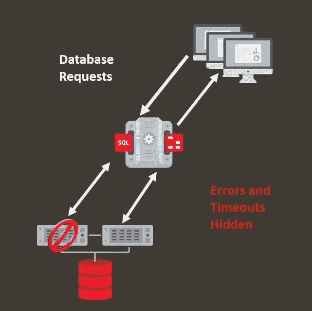

# 甲骨文。网络应用连续性—入门

> 原文：<https://medium.com/oracledevs/oracle-net-application-continuity-getting-started-34e7045e863?source=collection_archive---------4----------------------->

Oracle Transparent Application Continuity

我经常听到的一个请求是使用 Oracle 应用连续性(AC)的 ODP.NET 示例代码。它通常来自第一次尝试 ODP.NET 空调的顾客。我整理了一个运行中的[ODP.NET AC 代码样本](https://github.com/oracle/dotnet-db-samples/blob/master/samples/application-continuity/AppContinuity.cs)，供任何人在概念验证评估中试用。示例代码可以针对单个实例数据库运行，以简化设置。comments 部分包含成功测试 AC out 所需的所有客户端和数据库配置说明。

# Oracle 应用连续性简介

当然，如果您不熟悉 Oracle 应用程序连续性，您会想知道它是什么。让我介绍一下这个特性，以及为什么这么多 Oracle 数据库用户和。NET 开发人员想要采用它。

几年来，Oracle 一直在谈论连续可用性，而不仅仅是高可用性。连续数据库可用性是指对最终用户隐藏计划内和计划外停机。虽然软件和硬件中断仍然会发生，但是系统具有弹性，最终用户不会遇到错误，不会丢失工作，并且可以继续使用数据库应用程序。最终用户不需要知道发生了软件更新、机器停机或数据库层负载不平衡等事件。

在数据库方面，Oracle Real Application Clusters(RAC)和 Oracle Data Guard 长期以来一直致力于提供强大的数据库可用性解决方案。剩下的架构可用性挑战是确保当数据库层发生故障时，客户端应用程序仍然可用。可用性必须是端到端的，才能真正有效。同样重要的是，当应用程序或数据库业务逻辑发生变化时，维护可用性不应要求代码或配置发生变化。这就是交流电的用武之地。

AC 使数据库请求能够在数据库会话中断时以无中断和快速的方式自动重放事务性或非事务性操作，从而导致可恢复的错误。AC 通过屏蔽计划内和计划外停机错误来改善终端用户体验。开发应用程序时无需复杂的逻辑来处理异常，同时在出现可恢复的错误时自动重放数据库操作。

事实上，零应用程序代码更改是使用 AC 所必需的。默认情况下，非托管 ODP.NET 实际上通过连接字符串属性在客户端启用它:

`Application Continuity=true`

只要为 AC 配置了数据库服务器，任何现有的非托管 ODP.NET 应用程序都可以启用 AC。

没有 AC，几乎不可能以安全可靠的方式掩盖停机。数据库可能会丢失客户端尝试进行的状态更改。更糟糕的是，最终用户可能不知道事务是否已提交，因为提交消息不持久。

Oracle RAC、Oracle RAC One Node、Oracle Active Data Guard 以及专用和共享 Oracle 自治数据库都提供了 AC。

目前，只有非托管 ODP.NET 支持 AC。托管 ODP.NET 和 ODP.NET 核心支持将在未来版本中推出。

# 测试 ODP.NET 应用程序的连续性

如果你想亲自尝试 ODP.NET AC，请使用我在本文开头链接的示例代码。该代码使用众所周知的 Oracle HR 示例模式。该应用程序在本地事务中无限循环递增一个员工的工资。

当应用程序运行时，以管理员身份单独连接到数据库。间歇地执行以下命令(在添加数据库服务名之后):

**执行 DBMS _ service . disconnect _ session('您的服务名'，DBMS _ service . immediate)；**

该命令断开用户的会话，模拟可恢复的错误情况。启用 AC 后，最终用户不会看到任何错误消息，只有轻微的执行延迟。应用程序继续运行，不会明显中断最终用户的工作。AC 向最终用户掩盖了断电，并完成了交易。

# 设置 ODP.NET AC 示例应用程序

1.  将[非托管 ODP.NET 样本代码](https://github.com/oracle/dotnet-db-samples/blob/master/samples/application-continuity/AppContinuity.cs)下载到. NET 框架控制台项目中。
2.  根据需要修改以下连接字符串属性、用户 Id、密码和数据源。

确保使用支持 AC 的非托管 ODP.NET 12.2 或更高版本。我建议尽可能使用最高的 ODP.NET 版本，因为我们在不断提高交流能力和修复错误。

# 设置数据库

1.  以数据库管理员身份连接以设置 HR 模式(如果还没有)。某些 Oracle 数据库服务器安装在以下目录中包含创建脚本:% Oracle _ HOME % \ demo \ schema \ human _ resources \ HR _ main . SQL
2.  运行“将 DBMS_APP_CONT 上的执行权限授予 HR；”以便 ODP.NET 可以在可恢复的错误之后确定进行中的事务状态。

AC 最初是在 Oracle Database 12c 中引入的。我建议也使用可用的最高 Oracle 数据库版本。

# 结论

就是这样！你现在可以运行应用程序并测试 ODP.NET 空调了。

如前所述，不需要修改应用程序代码。数据库设置指令很简单。您可以通过在数据库服务器上启用 AC 来为现有应用程序打开 AC。