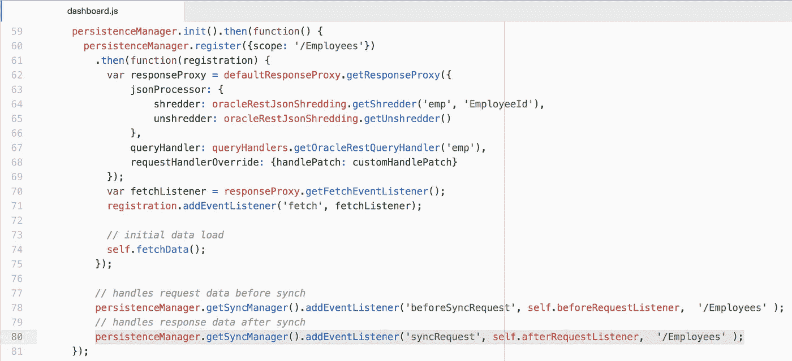
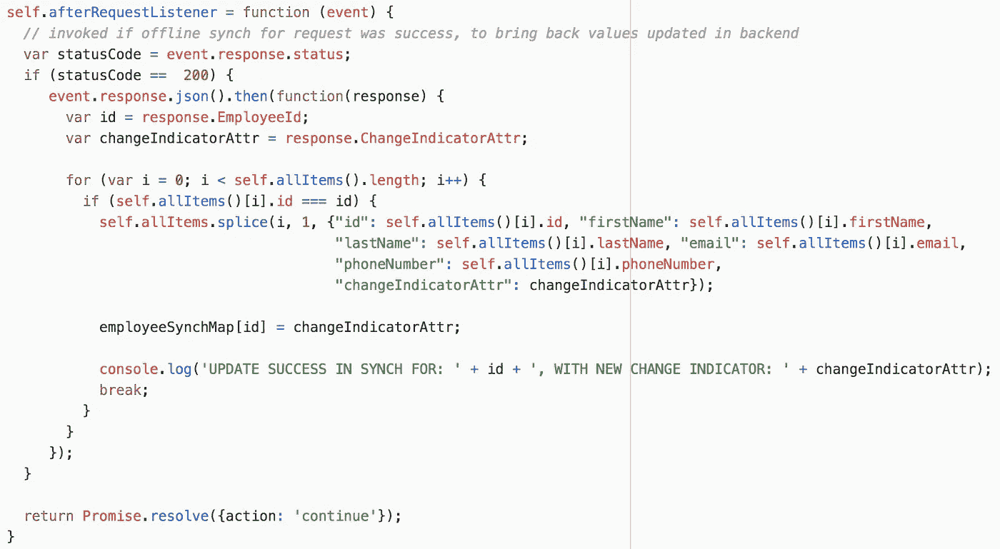
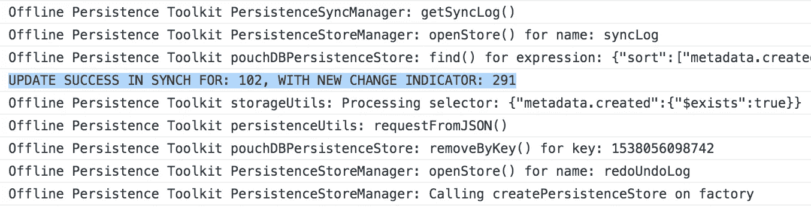
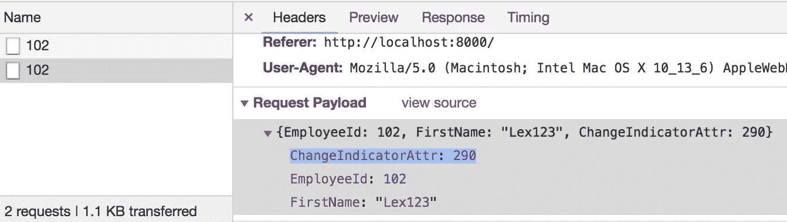
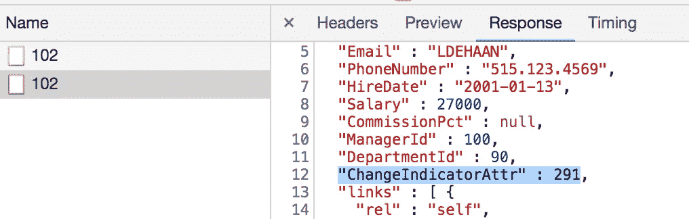

# Oracle 离线持久性工具包—请求后同步监听程序

> 原文：<https://medium.com/oracledevs/oracle-offline-persistence-toolkit-after-request-sync-listener-563c4a7349b8?source=collection_archive---------0----------------------->

在我之前的帖子中，我们学习了如何处理重放冲突— [Oracle 离线持久性工具包——对重放冲突做出反应](http://andrejusb.blogspot.com/2018/09/oracle-offline-persistence-toolkit.html)。其他需要知道的重要事情——如何处理同步过程中重放的请求响应(我们这里说的是补丁)。它不像在回调中处理来自直接 REST 调用的响应那样明显(后面同步的响应没有回调)。您可能会想，为什么在成功同步后，您需要处理响应。可能有多种原因——例如，您可能读取返回值并更新存储在客户端的值。

通过为给定端点添加类型为 *syncRequest* 的事件侦听器，在持久性管理器配置中注册侦听器:

这是监听器代码。我们正在获取响应，读取更改指示符值(它在后端被更新，新值作为响应返回)并将其本地存储在客户机上。此外，我们还维护了一个数组，将变更指示器值映射到更新后的行 ID(在我的下一篇文章中，我将解释为什么需要这样做)。请求后监听器必须返回承诺:

运行时—执行请求同步时，您应该会在打印的日志消息中看到，其中显示了新的更改指示器值:

仔细检查有效负载，以确保使用以前的值提交请求:

检查响应，您将看到更改指示符的新值(与请求后监听程序中的相同):

示例代码可以从 [GitHub](https://github.com/abaranovskis-redsamurai/persistencejetapp) 资源库下载。

*原载于 2018 年 9 月 28 日*[*andrejusb.blogspot.com*](https://andrejusb.blogspot.com/2018/09/oracle-offline-persistence-toolkit_28.html)*。*