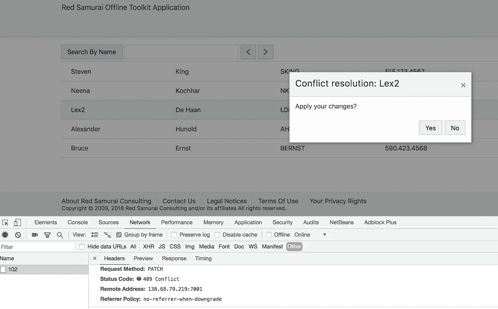
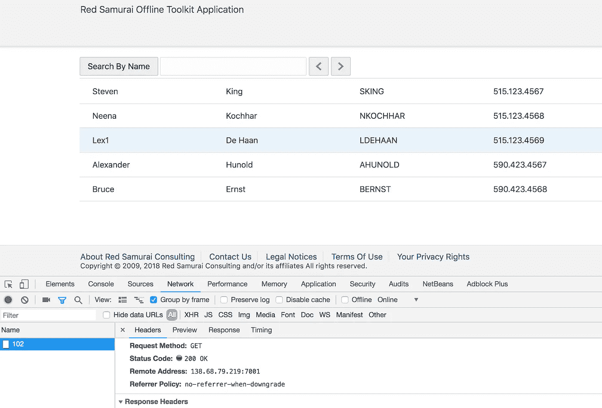
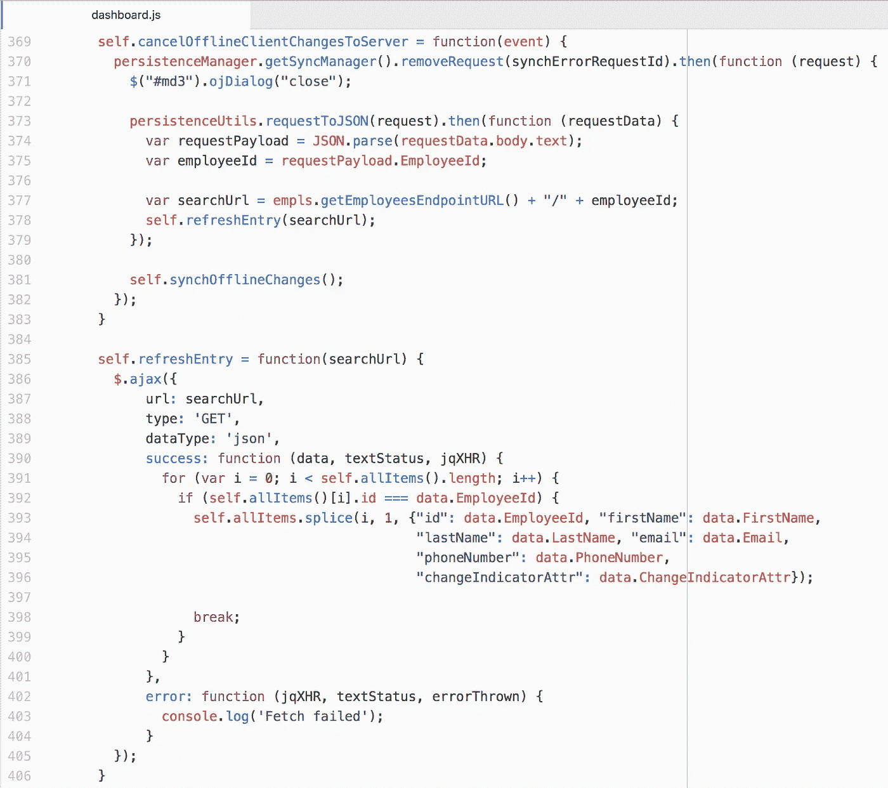

# Oracle 离线持久性工具包—应用服务器更改

> 原文：<https://medium.com/oracledevs/oracle-offline-persistence-toolkit-applying-server-changes-e113473318f4?source=collection_archive---------6----------------------->

这是我关于 Oracle 离线持久性工具包的最后一篇文章。我将展示一个简单的例子，它解释了如果出现数据冲突，如何应用服务器更改。阅读上一篇关于 Oracle 离线持久性工具包提交客户端更改的文章。

应用服务器更改比应用客户端更改更容易。您需要从同步队列中删除失败的请求，并通过键将服务器数据提取到客户端。

同步过程中的数据冲突示例:

用户决定取消他的更改并从服务器获取数据。执行 GET 以获取最新数据并将其推送到客户端:

在 JS 代码中，首先我们从同步队列中删除请求，在 promise 中我们读取请求键值，然后重新获取数据:

从 [GitHub](https://github.com/abaranovskis-redsamurai/persistencejetapp) 库下载示例代码。

*原载于 2018 年 10 月 10 日*[*andrejusb.blogspot.com*](https://andrejusb.blogspot.com/2018/10/oracle-offline-persistence-toolkit_10.html)*。*