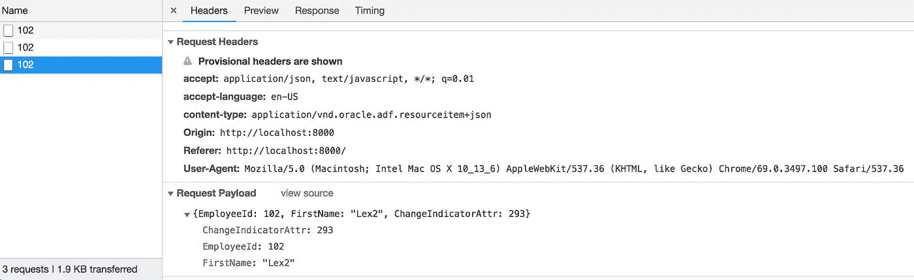

# Oracle 离线持久性工具包—请求前同步监听程序

> 原文：<https://medium.com/oracledevs/oracle-offline-persistence-toolkit-before-request-sync-listener-86d3ba015a2e?source=collection_archive---------7----------------------->

我写的另一篇文章是关于 Oracle 离线持久性工具包的。我已经描述了请求后监听程序如何在同步后读取响应数据 Oracle 离线持久性工具包—请求后同步监听程序。今天将解释 before request 监听器何时有用。与请求后监听程序相同，它是在持久性管理器注册期间定义的:

在请求之前，听者必须返回承诺。我们可以控制决心行动。例如如果没有需要更新的请求，我们只需返回*继续*。如果在同步期间同一行被多次更新，我们将需要更新请求。必须在请求有效负载中更新更改指示符值。我们从数组中读取最新变化指示器值，在请求后监听器中初始化。请求有效负载被转换成 JSON，值被更新，然后我们构造新的请求并用 *replay* 解决它。API 允许通过替换原始请求来提供新请求:

下面是使用案例。离线时—更新值:

保持脱机时，再次更新相同的值:

我们应该在联机时跟踪同步期间执行的请求。由第一变化发起的第一请求使用变化指示符值 292:

第二个请求使用更新的变化指示符值 293:

如果没有之前和之后的请求侦听器逻辑，第二个请求将以与第一个请求相同的更改指示符值执行。这将导致后端的数据冲突。

示例应用程序代码可在 [GitHub](https://github.com/abaranovskis-redsamurai/persistencejetapp) 上获得。

*原载于 2018 年 10 月 2 日*[*andrejusb.blogspot.com*](https://andrejusb.blogspot.com/2018/10/oracle-offline-persistence-toolkit.html)*。*