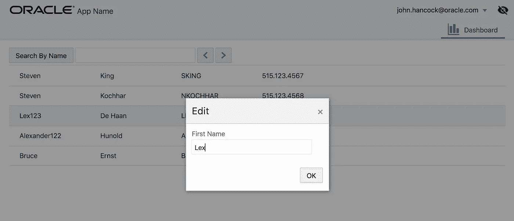
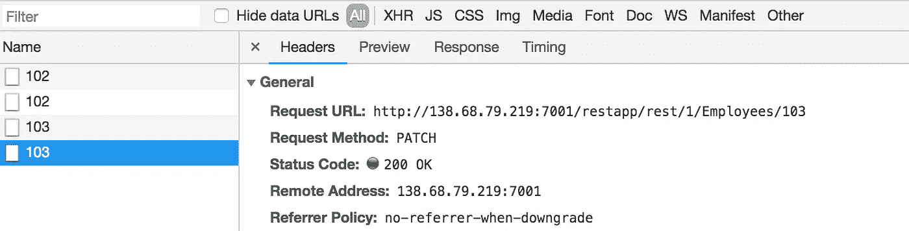
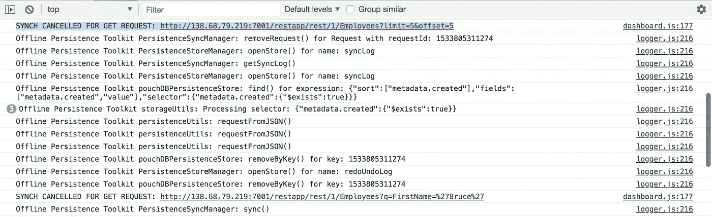
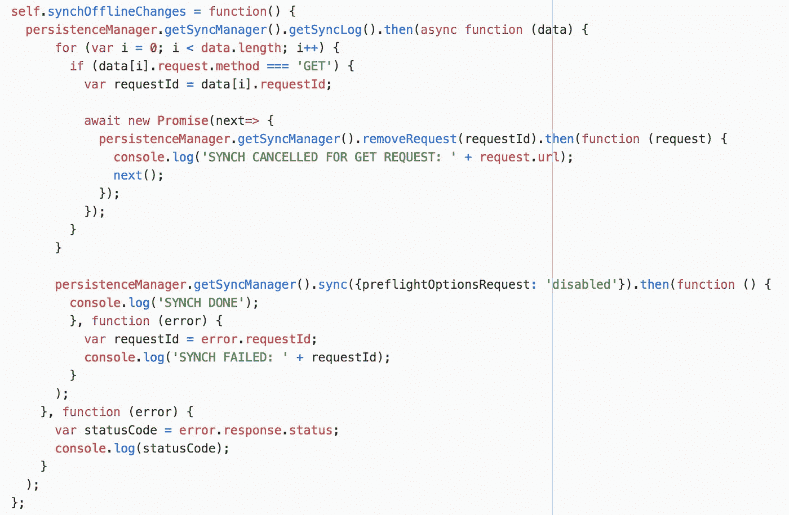

# Oracle 离线持久性工具包—控制在线重放

> 原文：<https://medium.com/oracledevs/oracle-offline-persistence-toolkit-controlling-online-replay-e7c4d1f5df54?source=collection_archive---------1----------------------->

几个月前，我发表了一篇关于 Oracle Offline Persistence Toolkit 的帖子，它与 Oracle JET(Oracle 的 JavaScript toolkit)集成得很好—[Oracle JET Offline Persistence Toolkit—离线更新处理](http://andrejusb.blogspot.com/2018/03/oracle-jet-offline-persistence-toolkit.html)。随着示例应用程序升级到 JET 5.1 和离线工具包升级到 1.1.5，我又回到了这个主题。在这篇文章中，我将描述如何通过过滤掉一些请求来控制在线重放。

源代码可以在 [GitHub](https://github.com/abaranovskis-redsamurai/persistencejetapp) 上获得。下面我描述最新提交中的变化和功能。

要测试在线重放，请离线并在示例应用程序中执行一些操作——更改一些记录并尝试按名字搜索，还尝试使用页面导航按钮。你可以在离线模式下保存更改，但如果这是你第一次加载应用程序，并且尚未从其他页面获取数据，则页面导航在离线模式下不会带来任何新结果(请确保在在线时加载更多记录，然后再离线):

在在线重放管理器中，我有意过滤掉 GET 请求。一旦上线，我只重放补丁请求。这样做主要是为了测试，学习如何控制重放过程。补丁程序请求在重放期间执行:

在日志中打印出从重放循环中删除的每个 GET 请求:

重放实现(我建议阅读[离线持久性工具包](https://github.com/oracle/offline-persistence-toolkit/blob/master/USAGE.md)使用文档以了解更多信息):

在转换到联机状态后，执行此代码。从同步管理器中调用 getSyncLog 方法—返回等待重放的请求列表。Promise 返回带有等待在线重放的请求数组的函数。我已经将函数标记为异步，这允许实现顺序循环，其中每个 GET 请求将按顺序一个接一个地删除。这是必要的，因为来自同步管理器的 removeRequest 是在 promise 中执行的，并且循环会完成得太晚——在我们通过执行重放阶段之后。阅读更多关于 JS 中顺序循环实现的内容，当 promise 被使用时——[JavaScript——调用顺序循环中后端逻辑的方法](http://javascript/%20-%20method%20to%20call%20backend%20logic%20in%20sequential%20loop/)。一旦所有 GET 请求被删除，我们执行 sync 方法，这将强制队列中所有剩余的请求被重放。

*原载于 2018 年 8 月 10 日*[*【andrejusb.blogspot.com】*](http://andrejusb.blogspot.com/2018/08/oracle-offline-persistence-toolkit.html)*。*