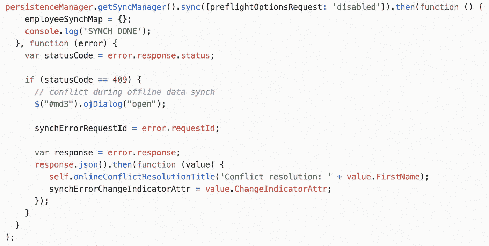

# Oracle 离线持久性工具包—对重放冲突做出反应

> 原文：<https://medium.com/oracledevs/oracle-offline-persistence-toolkit-reacting-to-replay-conflict-c7b0a7a67311?source=collection_archive---------1----------------------->

这是下一篇关于 Oracle 离线持久性工具包的文章。检查我以前写的同一主题的文章— [在 JET 离线工具包](http://andrejusb.blogspot.com/2018/09/implementing-handle-patch-method-for.html)中实现句柄补丁方法。在 [GitHub](https://github.com/oracle/offline-persistence-toolkit) repo 上阅读更多关于工具包的信息。

当应用程序上线时，我们称之为同步方法。如果至少有一个请求失败，那么同步就会停止，并调用错误回调，我们可以在那里处理失败。在错误回调中，我们检查失败是否与冲突有关——然后我们打开对话框，用户将在其中决定做什么(强制客户端更改或接受服务器更改)。从错误回调的响应中读取最新的更改指示符值(如果用户决定在下一个请求中强制客户端更改，则应用该值):

对话框很简单—它显示冲突值的动态文本，并为用户提供操作选择:

让我们看看它是如何工作的。

用户 A 编辑值 Lex 并将其保存到后端:

用户 B 离线，编辑相同的值 B 并将其保存在本地存储中:

我们可以在日志中检查它—更改值存储在本地存储中:

当联机时，脱机记录的挂起请求将被重新执行。显然，上述请求将失败，因为相同的值已被另一个用户更改。将报告冲突:

修补操作失败，冲突代码为 409:

将询问用户—如何继续。要在后端应用更改并覆盖更改，或者相反，从后端获取更改并将它们带到客户端:

我将在下一篇文章中解释如何实现这些操作。与此同时，您可以在 [GitHub](https://github.com/abaranovskis-redsamurai/persistencejetapp) repo 上研究完整的应用程序。

*原载于 2018 年 9 月 22 日*[*andrejusb.blogspot.com*](https://andrejusb.blogspot.com/2018/09/oracle-offline-persistence-toolkit.html)*。*