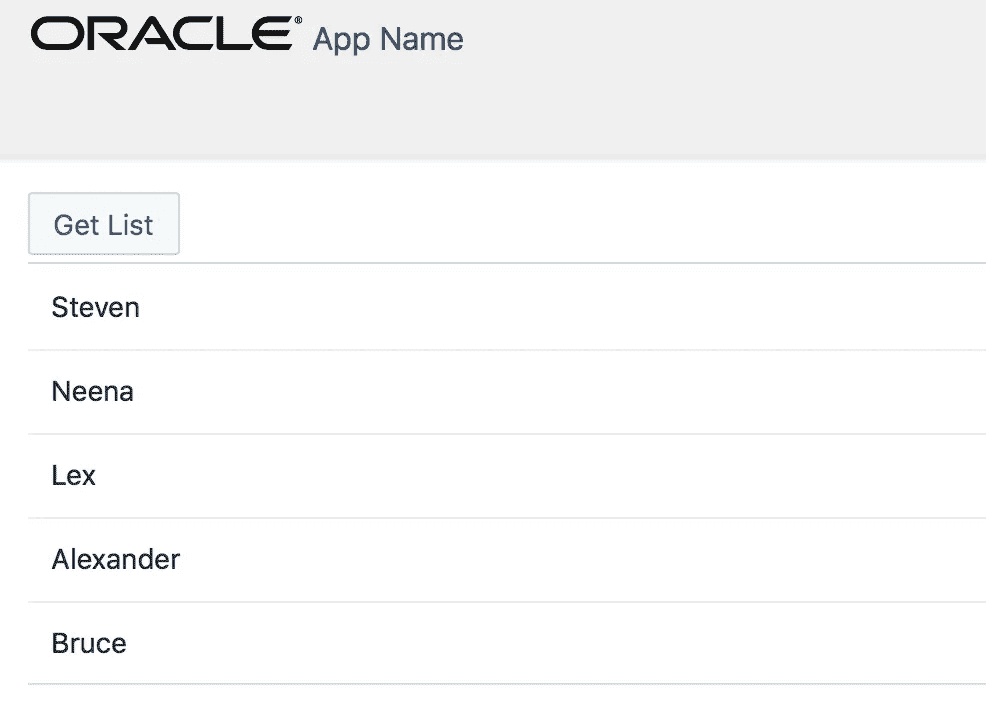

# Oracle 离线持久性工具包—使用 JET 的简单 GET 响应示例

> 原文：<https://medium.com/oracledevs/oracle-offline-persistence-toolkit-simple-get-response-example-with-jet-d98580783ac3?source=collection_archive---------0----------------------->

我们有来自 Oracle 的新工具，可以帮助简化 JS 应用程序的离线逻辑实现。在这篇文章中，我将介绍如何在 Oracle JET 中使用 Oracle 离线持久性工具包。然而离线持久性并不仅仅局限于 JET 的使用，这个工具包可以在 NPM 上获得，并且可以与其他 JS 解决方案集成。

我应该强调——离线工具包的主要作用是让移动混合应用能够离线工作。在我看来，工具包的使用不止于此。当互联网连接可用，但后端服务器关闭时，它可以使用户继续工作。从技术上讲，在这种情况下，用户将保持在线，但实际上应用程序将被中断——后端对 REST 调用没有响应。离线持久性工具包可以帮助解决这种情况——用户可以继续使用本地缓存，直到后端关闭。

如果你想了解 offline toolkit 如何工作以及如何使用其 API，请前往 [GitHub 页面](https://github.com/oracle/offline-persistence-toolkit) —查看 readme，将其添加到你的 JET 应用程序，并尝试运行/测试。实践是学习新事物的最好方式。

我将分享一些提示和样本应用程序。

根据 readme，首先您应该添加来自 NPM 的离线持久性工具包和 PouchDB 模块。在 JET 应用程序目录中运行以下命令:

1.  npm 安装@ Oracle/offline-persistence-toolkit

2.npm 安装 pouchdb pouchdb-查找

接下来，您应该遵循四个简单的配置步骤，并使 JET app 能够访问离线工具包 API。

**步骤 1** (标准，添加任何附加模块时)

在 **main.js** 中添加新添加模块的路径需要块:

**步骤 2** (标准，添加任何附加模块时)

在 **main-release-paths.js** 中添加新添加模块的路径:

**步骤 3** (标准，添加任何附加模块时)

添加的模块不会被自动复制到构建目录。我们需要在 **oraclejet-build.js** 中定义复制。模块应该转到构建目录。如果您需要从给定的文件夹和子文件夹中复制文件，请使用** for src:

构建内容位于 **web** 目录下。离线工具包和 PouchDB 模块应复制到构建目录:

**步骤 4** 初始化窗口。main.js 中的 PouchDB 变量:

配置已经完成，现在我们可以使用离线持久性工具包 API 了。添加持久性存储管理器和其他模块:

最简单的选择是依赖离线工具包中的默认获取监听器。我们需要注册存储工厂，并映射我们希望用持久性管理器缓存的端点。当后端可用时—调用将转到后端，响应将被缓存。下一次，后端不可用—将从缓存中提取数据。如果端点被配置为监听，则工具包会拦截 HTTP(-S)请求并存储响应:

我正在用 JET 的简单员工休息端点调用测试离线工具包。工具包允许成功执行这个调用，即使没有后端或连接(当然，如果相同的调用以前至少执行过一次):

UI 部分很简单——读取数据时显示列表:

数据已获取，我们在线:

如果 REST 响应不包括 Cache-Control 头，离线工具包将工作。确保在响应中没有设置缓存控制头:

ADF BC REST 默认设置缓存控制头，您可以在过滤器类中删除它(在 ADF BC REST 应用程序中定义):

现在，我将我的连接转为离线，单击 Get List 按钮— JS 调用 REST，没有出现网络错误，而是成功执行，并通过离线工具包功能从缓存中返回数据:

您应该打开网络呼叫的详细信息并检查发起方。您将看到所有映射到离线端点的调用都通过 persistenceManager.js:

让我们再核实一下——也许我们被骗了？删除代码中的离线工具包注册 API，然后重新运行应用程序:

如预期—收到网络错误，提取失败。这证明了—离线工具包有效:)

在 [GitHub](https://github.com/abaranovskis-redsamurai/persistencejetapp) 上可以获得带有离线工具包配置的示例 JET 应用程序(运行 *ojet 恢复*和 *ojet 服务*)。

*原载于 2018 年 1 月 28 日*[*andrejusb.blogspot.com*](https://andrejusb.blogspot.lt/2018/01/oracle-offline-persistence-toolkit.html)*。*