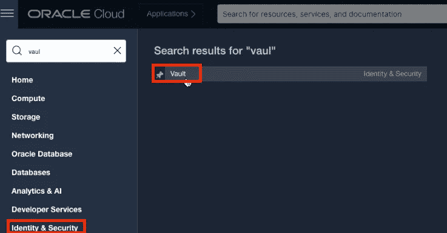
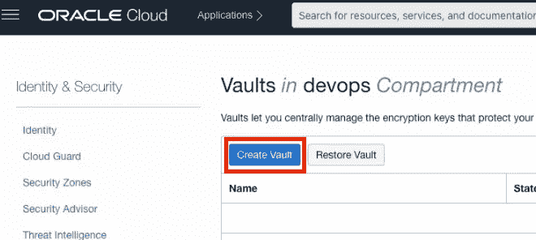
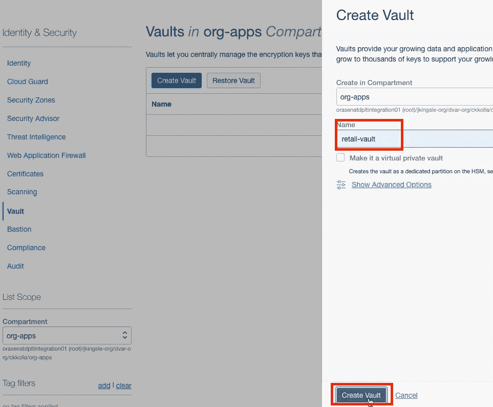
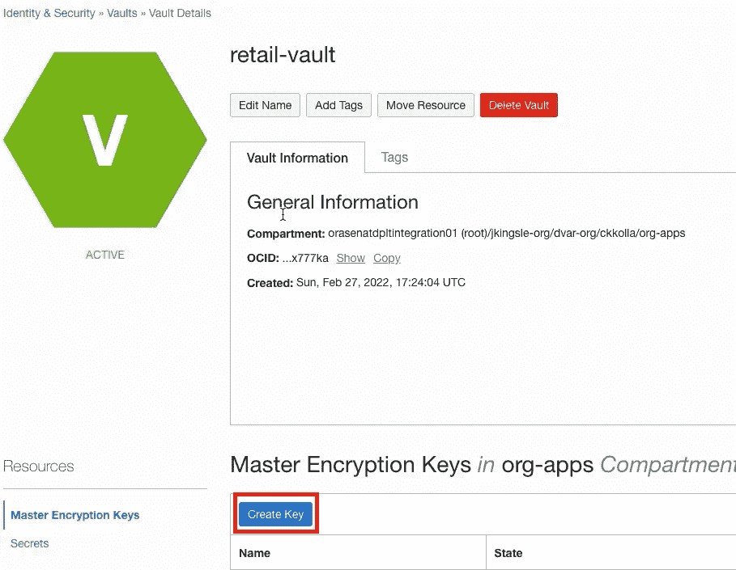
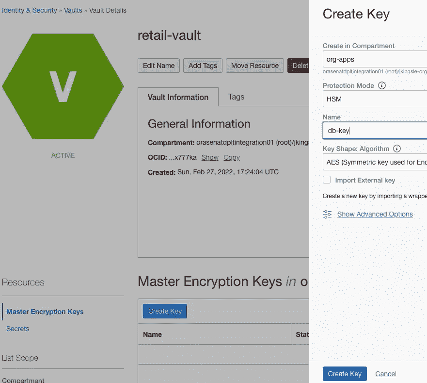
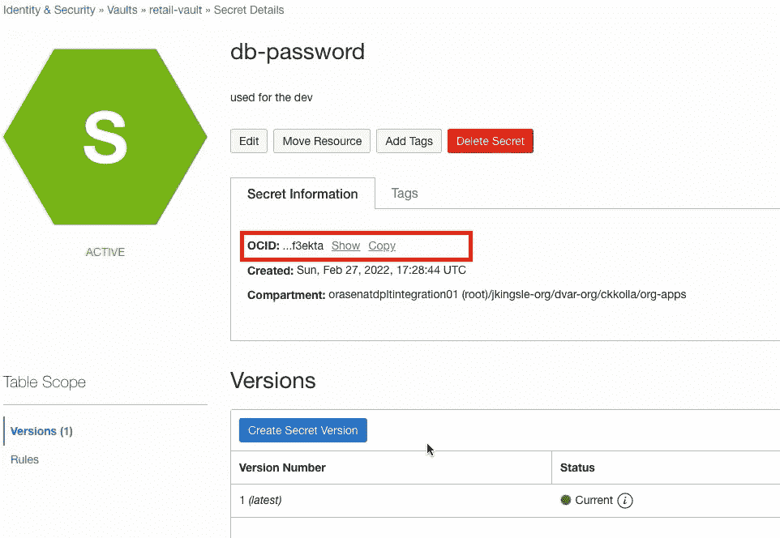

# 在 C#中使用 Oracle Vault。net、JavaScript、Java、PL/SQL、Ruby、TypeScript 等等

> 原文：<https://medium.com/oracledevs/oracle-vault-in-c-net-javascript-java-plsql-ruby-typescript-any-domain-818428b5f87b?source=collection_archive---------0----------------------->

加密失败对组织来说意味着巨大的成本。

最常见的加密故障主要分为三类:

*   硬编码密码
*   破损或有风险的加密算法
*   熵不足

Oracle 云中的保险库服务有助于解决这些加密问题。该 SDK 于 2005 年在 OCI 推出。net、Java、Python、TypeScript、Ruby、PL/SQL 等等。使用 Vault services，您可以对数据库和应用程序使用相同的密钥来加密和解密数据。

只需简单的点击就可以创建保险库、密钥和秘密。

顺便说一下，如果您想了解更多关于 vault services 和 Oracle 云基础设施的一般信息，您可能需要[注册一个免费的层帐户](https://signup.cloud.oracle.com/?language=en)。

1.  在“身份&安全”下选择**金库**



2.点击**创建金库**。



3.命名保险库。



Create a vault with name “retail-vault”

4.点击**创建键**并为其命名。



create a key with name as “db-key”

5.使用生成的 db-key 创建一个秘密。


create a secret by using the db-key generated.



db-passoword resource created with version number 1

复制秘密的 OCID，并使用 git-hub source [代码](https://github.com/kollachaitanyakrishna/oci-secrets)从 vault 中检索数据:

```
using (var client = new SecretsClient(provider, new ClientConfiguration()))
    {
        var response = await client.GetSecretBundle(getSecretBundleRequest);
        // Retrieve value from the response.
        Base64SecretBundleContentDetails secretIdValue = (Base64SecretBundleContentDetails)response.SecretBundle.SecretBundleContent;
        Console.WriteLine(JsonSerializer.Serialize(secretIdValue));
    }
```

## 加入对话！

如果你对甲骨文开发人员在他们的自然栖息地发生的事情感到好奇，来[加入我们的公共休闲频道](https://bit.ly/odevrel_slack)！我们不介意成为你的鱼缸🐠