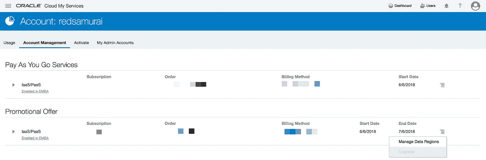
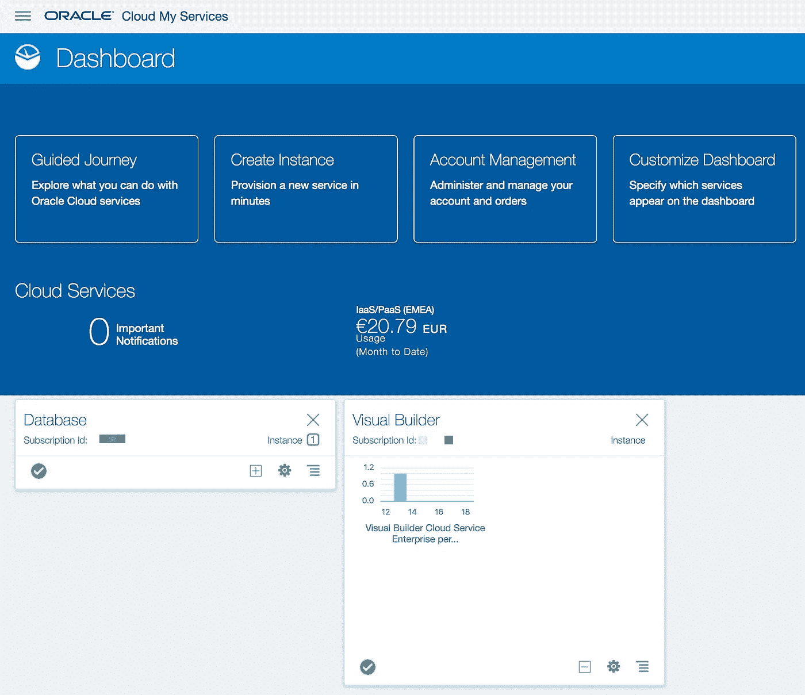
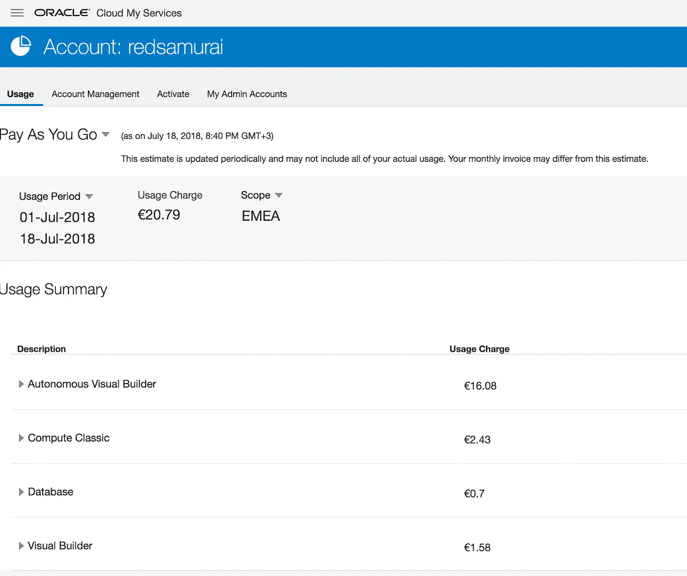
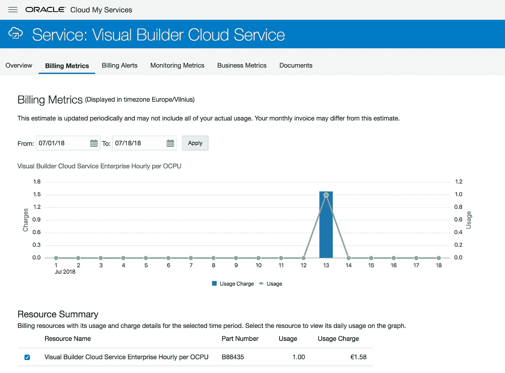
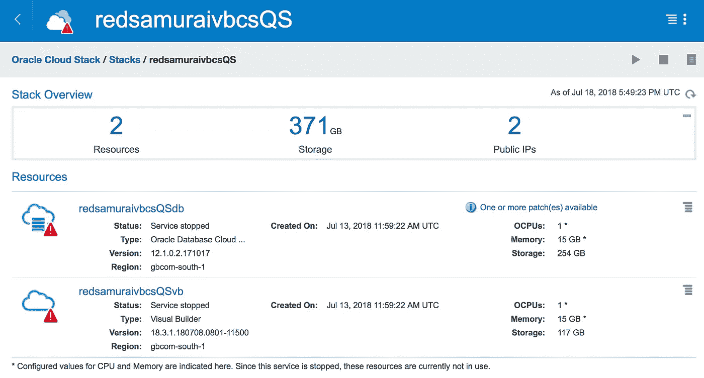

# 甲骨文 VBCS —按需付费云模式体验讲解

> 原文：<https://medium.com/oracledevs/oracle-vbcs-pay-as-you-go-cloud-model-experience-explained-6b7ed51b9129?source=collection_archive---------0----------------------->

如果你正在考虑开始使用甲骨文的 VBCS 云服务，这篇文章可能会有用。我将分享我使用*现收现付*模式的经验。

有两种支付模式可供选择:

1.**现收现付**——偶尔访问 VBCS 时很好。可以随时终止

2.**每月弹性** —需要 24/7 运行 VBCS 时很好。需要承诺，任何时候都不能终止

当您创建 Oracle 云帐户时，最初您将获得 30 天的免费试用期。在该期限结束时(或更早)，您可以升级到收费计划。要升级，请转到帐户管理并选择升级促销优惠，您可以选择使用现收现付或每月弹性支付:

一旦你升级到现收现付，你就会在仪表盘上看到每月的使用量。它还显示了 VBCS 实例的每小时使用量，您将为此付费:

点击每月使用量，您将看到每个服务账单的详细视图。当 VBCS 实例停止时(在“按需购买”的情况下)，您将仅需要支付硬件存储费用(计算经典版)，这是相对较小的一笔费用:

创建 VBCS 实例的方式有两种选择——自主 VBCS 或客户管理的 VBCS。为了能够停止/启动 VBCS 实例，并避免在不使用实例时计费(在现收现付的情况下)，请确保使用客户管理的 VBCS。在本例中，VBCS 实例仅使用了 1 个小时，然后就停止了，它可以随时再次启动:

要管理 VBCS 实例，您需要导航到 Oracle 云堆栈 UI。从这里，您可以一次启动停止数据库和 VBCS。停止 VBCS 是不够的，如果您不使用 DB，请确保也停止它:

*原载于 2018 年 7 月 19 日*[*andrejusb.blogspot.com*](https://andrejusb.blogspot.com/2018/07/oracle-vbcs-pay-as-you-go-cloud-model.html)*。*