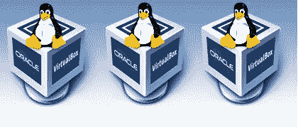
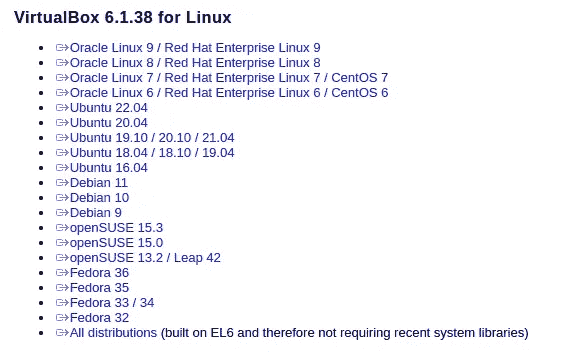
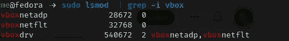
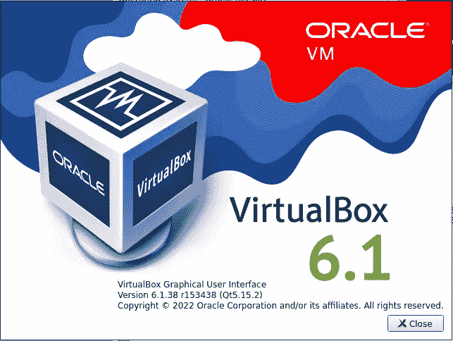
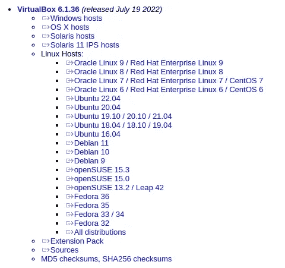
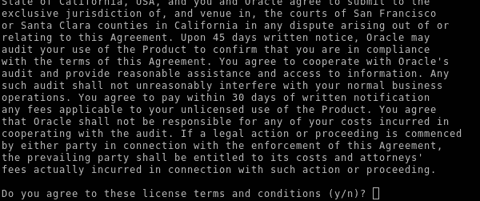
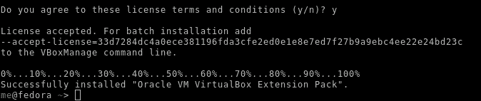
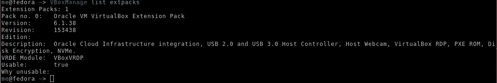

# 你最喜欢的 Linux 发行版上的 Oracle VirtualBox 怎么样？

> 原文：<https://medium.com/oracledevs/oracle-virtualbox-on-linux-b6d17327bae4?source=collection_archive---------0----------------------->



在 Windows 上安装 Oracle VirtualBox 非常容易，但是在 Linux 上呢？

每个 Linux 发行版都有自己的默认存储库，Oracle 为大多数主要的 Linux 发行版提供了 VirtualBox 包。以下链接列出了 Oracle 为 VirtualBox 提供的软件包:

[https://www.virtualbox.org/wiki/Linux_Downloads](https://www.virtualbox.org/wiki/Linux_Downloads)



下面的主要 Linux 发行版确实提供了 VirtualBox 的软件包:

**Debian**

【https://wiki.debian.org/VirtualBox 

**Ubunto**

[https://Ubuntu . com/tutorials/how-to-run-Ubuntu-desktop-on-a-virtualbox-using-1-overview](https://ubuntu.com/tutorials/how-to-run-ubuntu-desktop-on-a-virtual-machine-using-virtualbox#1-overview)

**拱门**

[https://wiki.archlinux.org/title/VirtualBox](https://wiki.archlinux.org/title/VirtualBox)

**软呢帽**

[https://rpmfusion.org/Howto/VirtualBox?highlight = % 28% 5Cb categoryhoot % 5Cb % 29](https://rpmfusion.org/Howto/VirtualBox?highlight=%28%5CbCategoryHowto%5Cb%29)

对于 Fedora，RPM Fusion repo 有一个针对 VirtualBox 的包。此外，Guest Additions 是单独打包的，并且仅适用于运行 Fedora Linux 的虚拟机。

通过反复试验，我发现获取 Fedora Linux 版 VirtualBox 最简单、最可靠的方法不是通过 RPM Fusion，而是通过 Oracle VirtualBox 网站。

要安装 VirtualBox for Fedora，我们将遵循以下步骤。

**是否已经安装了 VirtualBox？**

确定 Fedora 中当前是否安装了 VirtualBox:

```
dnf list --installed | grep -i virtual
```

如果需要，可以删除现有的 VirtualBox，如下所示:

```
sudo dnf autoremove VirtualBox-6.1# alternative
sudo dnf autoremove Virtualbox-server-6.1.28-1.fc35
```

现在从 Oracle 提供的 RPM 包中安装 VirtualBox(编写本文时的最新版本是 6.1.38 ):

```
# some dependencies come from RPM Fusion
sudo dnf install https://mirrors.rpmfusion.org/free/fedora/rpmfusion-free-release-$(rpm -E %fedora).noarch.rpm# install dependencies for Virtualbox
sudo dnf install kernel-devel-$(uname -r) akmod-VirtualBox akmods# install the Virtualbox package
sudo dnf install https://download.virtualbox.org/virtualbox/6.1.38/VirtualBox-6.1-6.1.38_153438_fedora35-1.x86_64.rpm --allowerasing
```

现在重新启动 VirtualBox 内核模块:

```
sudo systemctl restart vboxdrv
```

快速确认安装了核心模块:

```
sudo lsmod  | grep -i vbox
```



要使用 VirtualBox，需要将用户添加到 VirtualBox 组:

```
# usermod -a -G vboxusers <username>
```

通过以下方式确认您的小组成员资格:

```
$ groups
me wheel vboxusers
```



**安装扩展包**

扩展包为 VirtualBox 提供了以下新增功能:

—虚拟 USB 2.0 (EHCI)设备。

—虚拟 USB 3.0 (xHCI)设备。

— VirtualBox 远程桌面协议(VRDP)支持。

—主机网络摄像头直通。

—英特尔 PXE 启动 ROM。

—使用 AES 算法的磁盘映像加密。

—云集成功能。

扩展包可能是可取的，尤其是如果你有兴趣与 OCI 集成。

安装扩展包时，唯一的要求是它与您安装的 VirtualBox 版本相同。

Oracle 为每个 VirtualBox 版本提供了完整的扩展包列表，因此您可以选择与安装的 VirtualBox 版本相匹配的扩展包:

https://www.virtualbox.org/wiki/Download_Old_Builds_6_1



现在你有了网址，可以直接下载了:

```
wget https://download.virtualbox.org/virtualbox/6.1.38/Oracle_VM_VirtualBox_Extension_Pack-6.1.38.vbox-extpack
```

现在只需确认没有安装其他扩展包:

```
VBoxManage list extpacks# Note: extension packs can be uninstalled with:
sudo VBoxManage extpack uninstall "Oracle VM VirtualBox Extension Pack"
```

安装扩展包，包括:

```
sudo VBoxManage extpack install Oracle_VM_VirtualBox_Extension_Pack-6.1.38.vbox-extpack
```



系统会提示您接受许可条款和条件。



接受许可条款和条件后，您可以确认新的扩展包安装有:

```
VBoxManage list extpacks
```



## 安装游客附加物

扩展包用于主机。客户机操作系统有一个客户机附加功能。

提供 VirtualBox 软件包的发行版也将提供 Guest 插件的软件包。在运行 Fedora 的虚拟机上，Guest Additions 软件包通过以下方式安装:

```
sudo dnf install virtualbox-guest-additions
```

或者，您可以按照本文在虚拟机上手动安装:

[](https://paulguerin.medium.com/ux-for-oracle-virtualbox-the-undocumented-instructions-for-oel8-315686db85b) [## Oracle VirtualBox 的 OEL8 的未记录指令！

### 为什么我需要 Oracle VirtualBox 的来宾附件？

paulguerin.medium.com](https://paulguerin.medium.com/ux-for-oracle-virtualbox-the-undocumented-instructions-for-oel8-315686db85b) 

*Paul Guerin 出席了一些世界领先的甲骨文会议，包括甲骨文 2013 年世界开放大会。自 2015 年以来，他的工作一直是 IOUG 最佳实践技巧小册子以及 AUSOUG、Oracle Technology Network、Quest 和 Oracle Developers (Medium)出版物的主题。2019 年，他被授予 My Oracle 支持社区最有价值贡献者。他将继续参与 Oracle ACE 计划。*