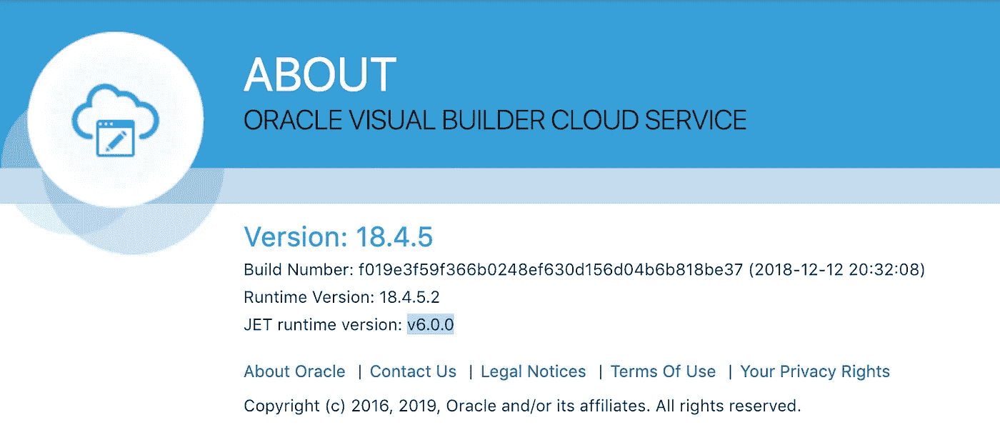

# Oracle Visual Builder 18.4.5 和 JET 6 支持

> 原文：<https://medium.com/oracledevs/oracle-visual-builder-18-4-5-and-jet-6-support-6184cfc5846b?source=collection_archive---------2----------------------->

Oracle Visual Builder 18.4.5 提供了非常简洁和完美的用户界面。它还带来了对 Oracle JET 6 的支持(最新的 JET 版本)。了解更多信息—[Oracle Visual Builder 12 月发布的新特性](https://blogs.oracle.com/vbcs/new-features-in-oracle-visual-builder-december-release)。我已经将我们的 VBCS 实例升级到 18.4.5:

我很好奇自动升级如何适用于以前版本中实现的 VBCS 应用程序(从我的 [GitHub](https://github.com/abaranovskis-redsamurai/vbcsmodularapp) repo 下载升级后应用程序的源代码)。尤其是现在 VBCS 也在使用更新的飞机。我必须说我对结果很满意——应用程序自动升级到 JET 6，无需手动干预:

我在运行时快速检查了一下源代码——事实上，我们升级后的 VBCS 应用程序使用的是 JET 6:

VBCS 团队的出色工作。

*原载于 2019 年 1 月 8 日*[*andrejusb.blogspot.com*](https://andrejusb.blogspot.com/2019/01/oracle-visual-builder-1845-and-jet-6.html)*。*