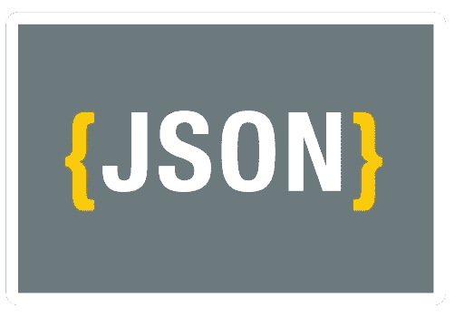
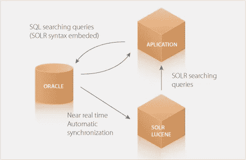

# Oracle 的原生 JSON 支持不仅用于存储

> 原文：<https://medium.com/oracledevs/oracles-native-json-support-not-only-for-storing-dcab8c047b52?source=collection_archive---------2----------------------->



当你想到数据库中的 ***JSON*** 时，你可能会考虑存储、查询和操作你的数据，有一篇由 [Chris Saxon](https://blogs.oracle.com/author/chris-saxon) 撰写的关于[如何在 Oracle 数据库](https://blogs.oracle.com/sql/how-to-store-query-and-create-json-documents-in-oracle-database)中存储、查询和创建 JSON 文档的博客文章，但是 JSON 支持打开一个窗口来与外部资源对话，如 [Apache Solr](https://lucene.apache.org/solr/) 或 [ElasticSearch](https://www.elastic.co/) ，它们也是 JSON 原生的。

为了说明我们将向[介绍开源的 Scotas Push 连接器](https://github.com/scotas/pc/wiki/Scotas-Push-Connector)，该连接器可从 [GitHub](https://github.com/scotas/pc) 获得。该产品的大图如下所示:



Push Connector Architecture

它使用 Oracle Index Extensible API([ODCI](https://docs.oracle.com/en/database/oracle/oracle-database/19/addci/introduction-to-data-cartridges.html#GUID-2B30E30F-D8A3-4B1D-A3FE-49DE7472A528))来提供一个新的域索引，该索引使用 Apache Solr 的外部实例来索引您的表。例如，如果您有一个表，如下所示:

```
CREATE TABLE OLS_TUTORIAL (
  ID VARCHAR2(30) PRIMARY KEY,
  NAME VARCHAR2(400),
  MANU VARCHAR2(4000),
  CAT  VARCHAR2(400),
  FEATURES CLOB,
  INCLUDES VARCHAR2(4000),
  WEIGHT   NUMBER,
  PRICE    NUMBER,
  POPULARITY NUMBER,
  INSTOCK    CHAR(5), -- true or false
  MANUFACTUREDATE_DT TIMESTAMP,
  PAYLOADS   VARCHAR2(4000),
  STORE   VARCHAR2(200));
```

有这样的行:

```
insert into ols_tutorial values (
  'SP2514N',
  'Samsung SpinPoint P120 SP2514N - hard drive - 250 GB - ATA-133',
  'Samsung Electronics Co. Ltd.',
  '["electronics", "hard-drive"]',
  '7200RPM, 8MB cache, IDE Ultra ATA-133 NoiseGuard, SilentSeek technology, Fluid Dynamic Bearing (FDB) motor',
  NULL,
  NULL,
  92,
  6,
  'true',
  TO_TIMESTAMP('2006-02-13T15:26:37Z','YYYY-MM-DD"T"HH24:MI:SS"Z"'),
  NULL,
  '35.0752,-97.032');
```

使用 Push Connector 和 Apache Solr 8 的索引如下所示:

```
CREATE INDEX TUTORIAL_PIDX ON ***OLS_TUTORIAL***(ID) INDEXTYPE IS PC.SOLR PARAMETERS('{NormalizeScore:true,
  LogLevel:"INFO",
  Updater:"solr@8983",
  Searcher:"solr@8983",
  SolrBase:"solr/tutorial",
  CommitOnSync:true,
  SyncMode:"OnLine",
  BatchCount:5,
  LockMasterTable:false,
  IncludeMasterColumn:false,
  HighlightColumn:"name,features",
  MltColumn:"name",
  DefaultColumn:"_text_",
  ExtraCols:"''id'' value id, ''cat'' value cat FORMAT JSON, ''name'' value name, ''features'' value features, ''manu'' value manu, ''includes'' value includes, ''price_f'' value price, ''popularity_i'' value popularity, ''inStock_b'' value trim(inStock) FORMAT JSON, ''manufacturedate_dt'' value manufacturedate_dt, ''store_p'' value store"}');
```

最后，使用这个新的域索引的查询很简单:

```
SELECT id,price FROM OLS_TUTORIAL WHERE ***SCONTAINS***(ID,'video AND price_f:[* TO 400]')>0
```

注意，不仅表的 ID 列被索引，cat、name、features 等也被索引。也被索引到 Apache Solr 中，然后在 ***中可用，包含*** 运算符，在***OLS _ 教程*** 表中的插入、更新、删除或截断操作被自动跟踪，并在外部 ***Solr*** 存储中执行，使用 HTTP/HTTPS 和 ***JSON*** 语法使用 Oracle 和 Solr。

这就是原生 ***JSON*** 支持的重要性，你可以轻松地构建和解析 ***JSON*** 文档来与外部源发送/接收。让我们更深入地研究一下 Push 连接器源代码，看看我的意思是什么。

这里有一部分[SolrPushConnector-bdy . SQL](https://github.com/scotas/pc/blob/master/db/SolrPushConnector-bdy.sql)代码，当删除一个索引时，一个 [delete by query](https://lucene.apache.org/solr/guide/7_7/uploading-data-with-index-handlers.html) 操作被发送到 Solr 服务器，发送这个消息的 PLSQL 代码是:

ODCIIndexDrop method

注意，我们用查询语法 delete 创建一个 JSON 对象，并使用过程 [PushConnectorAdm 发送它。CREATEREQUEST](https://github.com/scotas/pc/blob/ca30ce47352e49eedcfc3a7b3ceb293689d4e035/db/PushConnectorAdm-bdy.sql#L160) ，它基本上是用 JSON 对象作为 POST 方法体创建一个 HTTP 连接。在此调试信息。trc 文件:

```
POST [http://solr:8983/solr/tutorial/update/json?wt=json&ident=on](http://solr:8983/solr/tutorial/update/json?wt=json&ident=on)
{
  "delete":
    { "query":"solridx:SCOTT.TUTORIAL_PIDX"},
  "commit":
    {"softCommit":"false"}
}
```

稍微复杂一点的是索引过程(用 Solr 的话说就是批量索引)，这个过程是从创建索引或重建操作开始的，这段代码是:

重建过程首先从删除 Solr 服务器上现有索引的所有行开始，如上例所示，然后它以两种不同的模式工作，*，基本上是将表的所有 rowids 排队以插入到 AQ 队列([solrpushconnector . enqueue change(' ' | | prefix | | ' '，RIDS，“insert ' ')；](https://github.com/scotas/pc/blob/ca30ce47352e49eedcfc3a7b3ceb293689d4e035/db/SolrPushConnector-bdy.sql#L1262))或在主表中批量执行全扫描查询***batch count***rows 参数值，对上述索引创建语法执行的查询如下所示:*

```
*select json_object('rowid' value ''||L$MT.rowid ,
                   'solridx' value 'SCOTT.TUTORIAL_PIDX',
                   'id' value id,
                   'cat' value cat FORMAT JSON,
                   'name' value name,
                   'features' value features,
                   'manu' value manu,
                   'includes' value includes,
                   'price_f' value price,
                   'popularity_i' value popularity,
                   'inStock_b' value trim(inStock) FORMAT JSON,
                   'manufacturedate_dt' value manufacturedate_dt,
                   'store_p' value store 
                   ABSENT ON NULL returning CLOB) L$MT$R
    from SCOTT.OLS_TUTORIAL L$MT,SCOTT.TUTORIAL_PIDX$C C
    where L$MT.rowid=C.rid*
```

*我们正在查询索引的 ***rowid*** (文档 id 在 ***Solr*** 语法中)和由 ***ExtraCols*** 参数定义的其余列，所有这些都在 Oracle[***JSON _ object***](https://docs.oracle.com/en/database/oracle/oracle-database/19/adjsn/generation.html#GUID-1084A518-A44A-4654-A796-C1DD4D8EC2AA)函数的语法中，最后将该表与保存批量***rowid 的临时表连接起来上面的查询将返回一批准备发送给 ***Solr*** 的更新命令的 JSON 对象数据，例如:****

*每批 5 行使用 HTTP/HTTPS 发送到 Apache ***Solr*** 实例。*

*是的，听起来很复杂，但是它展示了数据库中的 JSON 如何打开了一个新的应用程序世界，它与*外部存储、web 服务等交互。即使您使用的是 PLSQL，也可以使用本指南"[Push Connector 2.0 for Oracle XE 18c](https://github.com/scotas/pc/wiki/Installing-on-Oracle-18c-XE)"随意下载这一新 Oracle 索引的完整代码或使用 Docker 试用它**