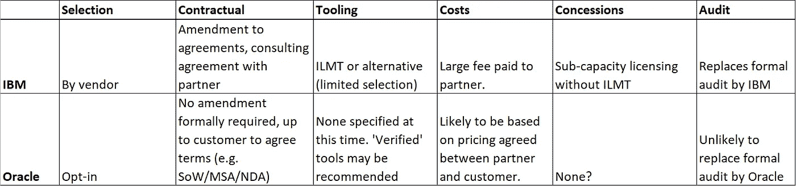

# 甲骨文的 SAM 认证合作伙伴计划—我们目前所知的

> 原文：<https://medium.com/version-1/oracles-sam-verified-partner-program-what-we-know-so-far-940ee23988b0?source=collection_archive---------3----------------------->

Photo by [Taylor R](https://unsplash.com/@usualmorals?utm_source=unsplash&utm_medium=referral&utm_content=creditCopyText) on [Unsplash](https://unsplash.com/s/photos/rubber-stamp?utm_source=unsplash&utm_medium=referral&utm_content=creditCopyText)

作为 CloudWorld 的一部分，Oracle 公布了他们新的 SAM 认证合作伙伴计划的一些细节。这不是一个带有相关新闻稿的“公开”声明。目前可获得的细节有限，因此以下的初步观察结果需要注意。该计划预计于 2022 年 11 月推出。

随着更多信息的出现，我们将进行更多的分析。以下是我们目前对 Oracle SAM 合作伙伴计划的了解，以及它与我们在其他此类计划(如 IBM 的授权 SAM 合作伙伴(IASP))方面的经验的对比。是的，我们还拥有 IBM 许可方面的专业知识！)

对于那些熟悉 JPE(联合合作伙伴参与)计划(在有限的地区开展)的人来说，Oracle 审计由某些 Oracle 合作伙伴免费/无偿开展，Oracle 的 SAM 认证合作伙伴计划略有不同:面向持续的许可证管理而不是审计，并且预计将更加广泛。

> 预计会有大量 SAM 认证合作伙伴“涌现”出来，帮助您管理许可证。

# **概述**

目前，该计划看起来不像 IBM 的 IASP 模型那样“正式”或大规模；Oracle 客户和合作伙伴可以选择是否加入该计划。

该计划似乎与现有的甲骨文合作伙伴网络(OPN)框架相吻合，因此合作伙伴几乎肯定需要满足某些认证标准。**值得记住的是，证书并不总是等于经验。**

该计划似乎将 Oracle 执行的一些现有许可工作(作为 GLAS 或软件投资咨询(SIA)的一部分)传递给选择加入的合作伙伴；这将使甲骨文 SIA 公司(在某种程度上还有 GLAS)扩大规模，并将更多客户置于某种“认可”的管理之下，这意味着客户将能够向合作伙伴提问以获得“官方”回答，最终这仍将需要甲骨文对重要问题的参与。

预计这背后的想法将使合作伙伴成为购买许可证和云服务的“自然”选择——当然，云很可能会成为任何此类合作伙伴提议的解决方案的一大部分。

目前尚不清楚该计划将如何影响甲骨文软件投资顾问(SIA)团队，该团队的职责是提供与审计无关的甲骨文许可支持。

# **JPE 式的？**

对于熟悉甲骨文合作伙伴联合参与(JPE)协议的人来说，SAM 认证计划在某些方面与甲骨文相似，但规模更大，更正式(通过 OPN)，并且可能是全球性的。Oracle 使用“经典”JPE 项目来分配某些合作伙伴代表 Oracle 工作(有一些限制),以审查和报告遗产的合规性(在 Oracle 的监督下),然后处理任何后续不足。

没有提到这些 SAM 认证的合作伙伴是否被允许代表 Oracle 正式审计客户，但是，我认为这不太可能；预计这将是一种基于积极主动的持续管理的伙伴关系。值得一提的是，甲骨文不希望将所有审计控制权拱手让给山姆合伙人，因此我预计这些将继续由甲骨文，或许还有 JPE 合伙人来管理。

与 JPE 合作伙伴不同，随着 OPN 的使用，预计甲骨文将为参与该计划的合作伙伴制定标准，这也可能意味着通过 SAM 认证的合作伙伴将可以在甲骨文的网站上“搜索”。

# **比较** **和 IBM 的 IASP 计划**

如上所述，与其他经批准的供应商计划有许多不同之处；在下表中，我比较了 IBM IASP 项目和我们目前所知的甲骨文项目。您会注意到，IBM 为使用这个程序的客户提供了奖励；据我们所知，甲骨文目前没有计划任何激励措施。

Table showing high-level comparison of IASP and Oracle’s programs

# **动机**

合作伙伴将被“奖励”介绍给选择加入的客户，以管理和建立关系；这意味着正在进行的交易和交易将通过该合作伙伴进行。据我们所知，客户必须与任何参与合作伙伴达成协议，为任何服务付费。

我们目前不认为合作伙伴需要与 Oracle 分享他们与客户讨论的信息。

这种类型的验证可能会导致许多以前没有许可经验的**合作伙伴作为 SAM 验证合作伙伴**进入“市场”。在考虑经过验证的合作伙伴时，应谨慎行事，并建议全面了解合作伙伴的经验、独立性和动机。请记住，经验不足的合作伙伴可能会给出不正确的建议，或者不得不代表您求助于甲骨文。

> 您不必将任何验证视为有关 Oracle 许可的“真实”体验的指标。对合作伙伴的知识和独立性进行尽职调查应该是你应该进行的额外检查

# **注意事项**

那么，作为授权厂商，您是否应该选择加入该计划？目前还不清楚。你应该问问你自己在这一点上对你有什么好处？你总是需要考虑与你合作的任何合作伙伴的动机:他们是在努力优化你的许可证还是卖给你更多？如何管理您的许可证和云服务的基本原则没有改变——您仍然负有责任，因此您应该确保您身边有一位值得信赖的独立顾问来完成这项工作；[我们团队的 Brian Lavelle](https://www.linkedin.com/in/brianlavelle/) 在第 1 版[上发表了关于 2019 年各种选择的博客](https://www.linkedin.com/pulse/why-tightrope-walker-makes-best-oracle-license-brian-lavelle/):即使引入了 SAM 验证计划，其中许多内容仍然非常相关；我强烈建议你去看看那个博客。

当我们对该计划了解更多时，我们将分享更多信息。一如既往，如果您对甲骨文授权有任何疑问，请访问我们的[网站](http://www.version1.com)或[直接联系](https://www.version1.com/contact/)我们。

# **关于作者**

[Paul Bullen](https://www.linkedin.com/in/paulbullen/) 是第 1 版的首席 Oracle 许可证顾问，自 2001 年以来一直帮助组织独立管理其 Oracle 许可证资产。