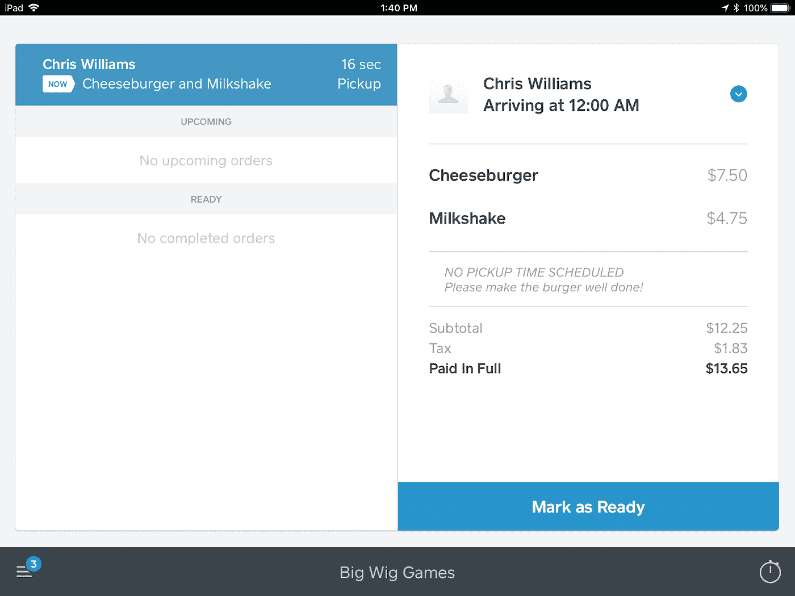
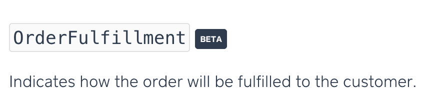

# 订单推贝塔

> 原文：<https://medium.com/square-corner-blog/orders-push-public-beta-25bda7c31521?source=collection_archive---------1----------------------->

## 创建提货订单，并在 Square 销售点进行管理

> 注意，我们已经行动了！如果您想继续了解 Square 的最新技术内容，请访问我们在 https://developer.squareup.com/blog[的新家](https://developer.squareup.com/blog)

买家无处不在。我真的是指任何地方。他们在网站、网络应用程序、原生移动应用程序，甚至是消息应用程序上购物。买家进行这些购买的地方出现了爆炸式增长，我们在这里通过为开发者提供 API 和 SDK 来将他们与我们的卖家联系起来。我们已经创建了一些工具，如我们的[应用内支付 SDK](https://squareup.com/us/en/developers/in-app-payments) ，用于将支付集成到原生移动应用中；我们的[阅读器 SDK](https://squareup.com/us/en/developers/reader-sdk) ，用于构建连接到 Square 硬件的定制 POS 应用，以便进行当面支付；我们的[在线支付 API](https://squareup.com/us/en/developers/online-payment-apis)，用于从任何网站进行支付。

今天，Square 很高兴地宣布推出订单推送测试版。Orders Push 是一个新的 API，使开发人员能够创建在 Square 销售点(仅限 iOS)或 Square 仪表板中显示的订单。

> 表面上看，将订单推送到销售点(POS) *听起来*很简单，但这使得*任何* POS 位置现在都可以成为履行订单的地方。

这个新 API 的独特之处在于，它使开发人员能够构建自己的由 Square Payments 支持的 order ahead 移动或 web 应用程序(或任何接受订单和支付的应用程序),并使用 Orders Push 将订单直接推送到 Square 商户 POS 中。打开了大量潜在卖家，以利用他们的解决方案，并使买家能够随时随地购买他们的商品。

A pickup order in the Square Point of Sale.

# 完成订单和广场订单

订单推送为订单引入了一个新概念— **履行** —它是订单如何交付给客户的有状态表示。我们可以通过简单地在订单上传递带有`”*PICKUP”*` 类型的`"fulfillment"`来实现这一点。然后，我们通过使用[交易 API](https://docs.connect.squareup.com/payments/transactions/overview) 授权付款来完成订单。

在 iPad 上运行 *Square 销售点的卖家将在他们的 POS 中收到新订单的提醒，他们可以选择打印订单，并可以管理他们的订单。我们提供履行状态(打开>就绪>完成),用于管理履行流程。虽然我们目前仅支持`“PICKUP”`履行类型，但我们期待在未来支持更多的履行工作流程。*

An example curl request for creating a pickup order.

# 公开测试版

在 Orders API [文档](https://docs.connect.squareup.com/api/connect/v2#navsection-orders)中，你会看到我们在相关的 Orders Push 字段中添加了一个“BETA”标签。测试端点和字段可能会发生变化，并不被认为是可靠的，因此在实施和维护过程中要记住这一点。我们很高兴听到您如何使用订单推送以及您的反馈或功能请求，所以请加入我们的 [Slack 社区](https://squ.re/slack)，我们将为此测试版建立一个特定的渠道。

如果您想了解我们的最新内容，请务必关注这个[博客](https://medium.com/square-corner-blog) &我们的 [Twitter](https://twitter.com/SquareDev) 账户，并注册我们的[开发者简讯](https://www.workwithsquare.com/developer-newsletter.html?channel=Online%20Social&sqmethod=Blog)！我们还有一个 Slack 社区，用于与其他实现 Square APIs 的开发者联系和交流。