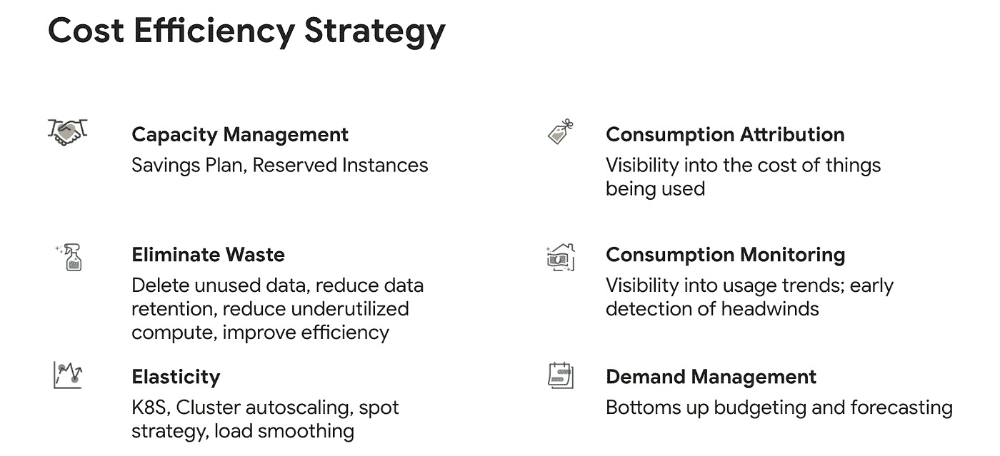
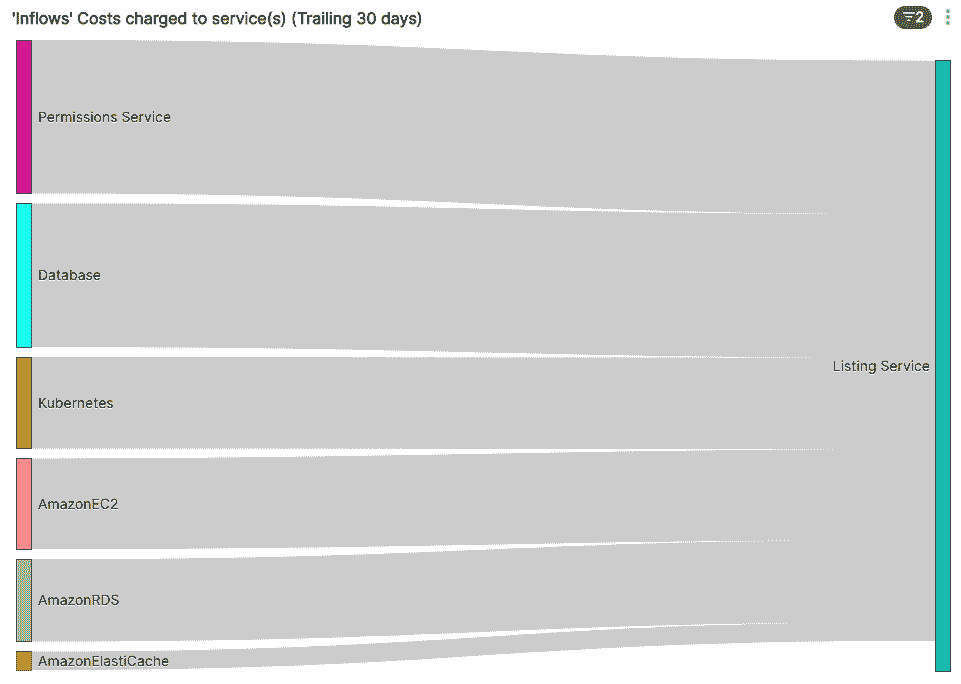

# 我们的云效率之旅

> 原文：<https://medium.com/airbnb-engineering/our-journey-towards-cloud-efficiency-9c02ba04ade8?source=collection_archive---------2----------------------->

珍·赖斯和安娜·玛特林

# 介绍

Airbnb 诞生在云端。2008 年，当许多公司都在运营数据中心时，在 AWS 控制台上点击几下就让 Airbnb 焕发了生机。从我们的第一个 Ruby on Rails 应用程序，到我们最近采用面向服务的架构，即时加速计算和存储的能力使我们的团队能够快速行动，满足我们不断增长的业务需求。然而，这种灵活性所带来的商业价值很快就会被云计算的成本所抵消，除非组织能够有效地利用这些资源。

# 背景

在 Airbnb 的早期，我们的主要目标是发展业务。技术团队专注于增长，而我们很少关注基础设施的运营成本。几年前，我们注意到 AWS 每月的成本增长超过了收入增长。我们遇到了一个问题，但是我们缺乏对团队如何使用 AWS 资源的深入理解，以及计划的架构和基础设施变化将如何影响我们未来的 AWS 成本。

认识到这一点后，我们的技术团队在几个工作领域达成了一致。

1.  **衡量&责任**:为所有 AWS 使用创建一个清晰的会计结构，主要目的是全面了解我们如何消费和利用 AWS 服务。
2.  **成本效率**:识别并消除浪费
3.  **流程&治理**:定义操作流程和护栏以通知决策，并提高我们预测未来需求的能力

通过与财务部门合作，我们的技术团队在实现运营效率目标方面取得了巨大进步，并继续为 Airbnb 业务打造令人惊叹的产品。

# 制定成本效益战略

认识到我们有问题是容易的部分。事实证明，决定做什么更具挑战性。你不能改进你没有衡量的东西，所以我们开始跟踪每月的“基础设施成本”。我们设定了保持基础设施“每晚预定成本”稳定的目标，并召集技术领导者定期审查数据。我们认为建立意识会解决我们的问题。几个季度过去了，我们看到我们的成本继续增长。显然需要更有针对性的努力来帮助我们确定可采取的行动步骤，以改变我们的轨迹。

在开始任何重大改变之前，了解你的文化是一个重要的考虑因素。Airbnb 的工程文化是“你建造它，你运营它”，我们为做出基于数据的决策而自豪。这明确了两件事。首先，为我们的工程师增加大量的摩擦会遇到很大的阻力，其次，我们需要在我们的 AWS 成本和归因数据上进行更多的投资，以开发可操作的见解。

# 建筑成本数据

钱去哪了？

开始时，我们依靠现有的系统来实现我们的计划。我们有一个内部员工名录，作为团队的事实来源。系统所有权是在内部工具 Scry 中定义的。我们使用 Apache [超集](/airbnb-engineering/superset-scaling-data-access-and-visual-insights-at-airbnb-3ce3e9b88a7f)，这是一个数据探索和可视化平台，旨在实现直观性和交互性。我们利用 [Terraform](https://www.terraform.io/) 作为我们的“按代码配置”解决方案，它通过确保 AWS 资源归属于一个项目来支持我们的大部分标记。我们的一些 AWS 资源不是通过 Terraform 创建的，为此，我们直接在代码库中创建了一个替代机制。

我们开始接收[成本和使用报告](https://docs.aws.amazon.com/cur/latest/userguide/what-is-cur.html) (CUR)，这是可用的最全面的 AWS 计费数据来源。基于 Airbnb 强大的数据仓库基础设施，该团队将成本和使用数据与团队数据和系统所有权数据相结合，开发了 Airbnb 成本足迹的演变图，我们将其称为“Airbnb CUR”。Airbnb CUR 支持一套超集仪表板和指标，支持成本效率计划的每个支柱，以及消费归属的下游世界。我们将在接下来的文章中分享我们构建这些数据的技术方法。

# 容量管理

在过去的 18 个月中，我们的财务和技术团队与 AWS 合作，建立了值得信赖的工作关系，确保我们购买我们需要的东西，并且使用我们购买的东西。这一点的重要性在新冠肺炎事件导致的旅游业崩溃中凸显出来，当时 AWS 是一个动荡时期的伟大合作伙伴。团队的集中性质也是有效采购的关键，因为单个团队通常没有更广泛的背景。通过查看我们的总体足迹，我们可以确定整体需求，即使我们的足迹在个别地区有所增减。在服务较少的小公司，正确的购买策略可能更容易，但在 Airbnb，我们有数百种服务。鸟瞰整个 Airbnb 生态系统的集中式成本效率团队可以观察到变化，并相应地做出集中采购决策。

AWS 在 2019 年末公布了他们的[节约计划](https://aws.amazon.com/about-aws/whats-new/2019/11/introducing-savings-plans/)。我们已经意识到它的好处，现在我们的大部分计算资源都在这种安排下。我们定期监控储蓄计划的使用情况，以最大限度地减少按需费用，最大限度地利用购买的储蓄计划。预测我们的计算需求是一项挑战，因此灵活性至关重要。今天，我们有一套准备好的应对措施，可以将某些工作负载移至节省计划之外，以保持正常的利用率。我们增强了持续集成环境利用 spot 实例的能力。通过一个小的配置更改，如果我们观察按需收费，我们可以很容易地使用 spot 实例。当我们没有充分利用我们的储蓄计划时，我们将数据仓库中的 EBS 转移到 EC2，以确保我们接近储蓄计划的最大利用率。

Airbnb 灵活的工程文化使工程师能够自主建立和改进服务，尤其是在 AWS 推出更多高级产品的时候。我们购买了 3 年期可转换储蓄计划，以便灵活地迁移到新的实例类型。对我们来说，这种灵活性抵消了购买特定于实例的储蓄计划所带来的潜在储蓄。除了计算能力的节约计划，我们还利用 RDS&elastic cache 的[保留实例](https://aws.amazon.com/rds/reserved-instances/#:~:text=1%20Log%20in%20to%20the%20AWS%20Management%20Console,,%E2%80%9CPurchase%20Reserved%20DB%20Instance%E2%80%9D%20button.%20More%20items...)。

购买适量的储蓄计划需要持续的沟通和评估。在组建成本效率团队之前，很少评估峰值增长是由于短期使用量增长还是永久性增长，我们应该将这一因素纳入我们的采购策略。因此，很容易做出不知情的购买。我们现在通过与几十个工程团队保持联系，在制定节约计划采购之前预测总体使用情况。提前知道主要服务是否会减少或增加有助于确保我们不会过度购买或购买不足。效率团队还与工程团队合作，错开需要临时计算的操作，以便总使用量不会产生很高的按需成本。持续的警惕对于容量规划的成功至关重要。

# 消除浪费

随着标记和属性的成熟，我们能够确定我们的最高支出领域。亚马逊 S3 存储成本一直是我们的主要支出领域之一，通过实施数据保留政策，利用更具成本效益的存储层，以及清理未使用的仓库存储，我们已经大大降低了每月的 S3 成本。

在选择最经济高效的存储层时，您需要考虑数据的访问模式以及文件大小和 S3 存储区中的对象数量，因为可能会产生意外成本。以冰川为例。对于存储在 Glacier 中的每个对象，S3 会在“标准”存储类中存储额外的 32KB 数据。因此，如果你在 Glacier 中存储一个 1 KB 大小的对象，S3 会在 Standard 中增加 32KB，两者都以相应的价格收费。因此，虽然 Glacier 的成本只有标准存储级别的 10%，但总成本可能比简单地将数据存储在标准存储中要高。

计算成本是我们每月账单中最大的单项，这方面的成本效率对我们的底线有很大影响。在努力控制我们的 AWS 成本的同时，我们也在为未来构建新的功能和改进我们的技术体系。作为现代化的一部分，我们正在向 Kubernetes 迁移。在我们努力消除浪费的过程中，我们发现许多大型服务没有使用 horizontal-pod-autoscaler (HPA ),也有使用 HPA 的服务，但使用的方式在很大程度上不是最佳的，因此它从未有效地扩展服务(高 minReplicas 或低 maxReplicas)。围绕服务调优的集中努力提高了我们的利用率，也最大化了集群自动伸缩工作的影响，这将在接下来讨论。

# 弹性

在我们迁移到 Kubernetes 之前，每项服务都是手动配置的，以提供必要的计算能力。团队通常会增加容量，以应对消耗不必要资源的外部流量或错误，但实际使用情况没有得到密切监控，容量很少被取消调配，即使不再需要也是如此。随着我们迁移到 Kubernetes，我们能够利用[集群自动缩放器](https://github.com/kubernetes/autoscaler/tree/master/cluster-autoscaler)，当集群中存在长期未充分利用的节点时，该工具会自动调整 Kubernetes 集群的大小。通过调整每个 pod 的资源请求，使其更接近实际使用情况，然后自动扩展集群，我们能够在计算成本方面实现阶跃函数改进。将此功能集成到我们的基础架构中花费了大约 6 个月的时间，但通过消除未使用的计算资源，节省了大量资金。

# 消费归因

我们拥有强大的数据仓库和成熟的数据可视化工具，因此，在我们简要考察第三方供应商时，我们选择在内部构建我们的属性和报告功能。计划的这一方面是一个巨大的工程，不应该被低估。我们的消费归因方法是为团队提供必要的信息，以便在成本和其他业务驱动因素之间做出适当的权衡，从而将他们的支出维持在一定的增长阈值内。通过了解成本驱动因素，我们激励工程师识别建筑设计变更以降低成本，并识别潜在的成本逆风。

我们从一个仪表板开始，它提供了 Airbnb 的整体 AWS 支出如何分布在不同服务中的视图。这使得我们能够对工作进行跟踪监控，这将在下面讨论。我们最初快速而粗略的归因旨在确定效率机会可能产生最大影响的高成本领域。这种方法在我们成本节约工作的前 9-12 个月是有效的。然而，很明显，从长远来看，我们需要一个一致的管道架构和可扩展的归属方法，以便所有服务都可以插入一个通用的归属框架。此外，第一个版本侧重于确定运行我们系统的直接成本。第二个版本关注的是如何跨系统消耗资源来运行我们的站点。这有助于打开关键的洞察力。例如，团队降低成本的最佳方式可能不是微优化他们的资源使用，而是与上游调用者合作，减少他们的呼叫频率。

# 消费监控

好的数据是无价的，但前提是你要看。具有寻求变化和跟进意外成本的运营严谨性是成功的云效率计划的最关键部分之一。有了坚实的成本数据基础，我们就有了一个拥有广泛专业知识的小组，他们每周开会审查整个成本足迹。让合适的人参与这一领域非常重要。由于这些人表现出的好奇心、深入挖掘根本原因的意愿和个人责任感，我们的监测工作取得了成功。

在成本效率团队的早期，消耗监控会议涉及大量消防工作。该数据将显示特定使用类型的异常成本峰值，监控小组将开始快速调查以了解根本原因，并联系其他团队以了解更多信息。随着时间的推移，该团队与 Airbnb 的其他团队建立了关系，并建立了一个成本管理常见陷阱的知识库。尽管峰值仍然存在，但规模较小，频率也比以前低。

随着我们计划的成熟，我们还将通过所有产品开发组织指定 AWS 成本冠军，在中央成本团队的支持下，在地方一级复制运营审查论坛和效率工作。

# 需求的监督和调节

在开发新产品功能时，我们希望确保我们的 AWS 支出仍在分配的预算范围内。我们准确预测新功能预期成本的能力是我们最不成熟的领域之一，我们需要共同努力在未来进行改进。迄今为止，我们的大部分成功都是围绕执行效率项目和减少成本事件的响应时间。然而，这是反动的，我们需要朝着更主动的成本管理前进。

# 成本意识文化

除了管理 AWS 成本的各种技术和组织努力，我们还看到了成本意识和管理方面的深刻文化变化。这种转变既是自上而下的，也是基层的。领导们在全体会议上提到了全公司的成本目标。财务团队设立了由首席财务官颁发的全公司范围的财务纪律奖，以表彰推动重要成本节约计划的员工。在斗志昂扬的 Airbnb 风格下，这家基础设施组织举办了一场成本节约黑客马拉松，催生了许多有影响力的效率项目。工程师们相互学习最佳实践，并在不景气的渠道中讨论新的节约机会。自发布以来，AWS 属性仪表板成为 Airbnb 上访问量最大的仪表板，并一直保持在榜首。看到这种文化变化，我们乐观地认为，Airbnb 最近实现的成本削减不是一次性的，而是一种新的力量，我们只会随着时间的推移而加强。

# 结论

在截至 9 月 30 日的九个月中，Airbnb 的托管成本同比下降了 6350 万美元，导致 Airbnb 的收入成本下降了 26%。这些变化源于更好的合同管理和对我们第三方云服务的利用。

在我们的规模中，云效率是一项跨职能和跨组织的大规模工作。它需要技术专家、数据科学家和财务专家进行协作，制定共同目标，并持续跟踪进展。我们组建了一个核心团队，致力于开发云效率的集中视图，从而最大限度地提高了我们的效率。然而，只有一个核心团队，这个项目是不会成功的。我们的持续成功取决于将成本效率的责任分配给最接近成本/收益权衡的各个团队。

# 承认

这项工作只有在我们整个组织的大力支持下才有可能完成。特别感谢我们的 AWS 成本冠军和核心成本团队——Anna Matlin、Ari Siegel、Bharat Rangan、陈坚、Jon Tai、Tang、Melanie Cebula、Stephen Zielinski、Swaroop Jagadish、Tamar Eterman 和 Xinrui Hua。

这项工作以及许多令人兴奋的事情总是在 Airbnb 发生。如果你想加入我们，请查看我们的 Airbnb 招聘页面。

________________________________________________________________

亚马逊网络服务、EC2、亚马逊 RDS、ElastiCache 和亚马逊 S3 是 Amazon.com 公司或其附属公司在美国和/或其他国家的商标。

“Ruby on Rails”是 David Heinemeier Hansson 的注册商标。

Apache Superset、Apache 和 Superset 是 Apache 软件基金会在美国和/或其他国家的注册商标或商标。

Terraform 是 HashiCorp 的商标。

Kubernetes 和 K8s 是 Linux 基金会在美国和/或其他国家的注册商标。

所有商标都是其各自所有者的财产。这些的任何使用仅用于识别目的，并不意味着赞助或认可。