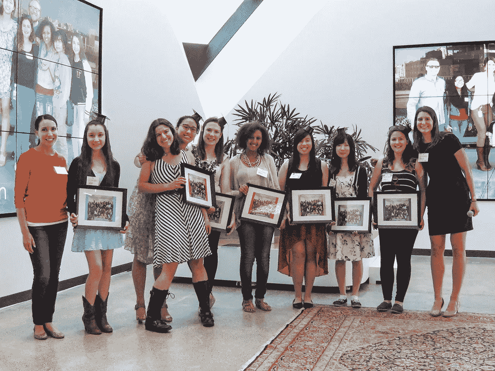

# 我们新的高中代码营

> 原文：<https://medium.com/square-corner-blog/our-new-high-school-code-camp-9d84fa1a8b6f?source=collection_archive---------2----------------------->

## 针对旧金山学生的内部沉浸式项目

*由* [*妮莎·斯拉维奇*](https://medium.com/u/23ca264543c0?source=post_page-----9d84fa1a8b6f--------------------------------) *撰写。*

> 注意，我们已经行动了！如果您想继续了解 Square 的最新技术内容，请访问我们的新家[https://developer.squareup.com/blog](https://developer.squareup.com/blog)

两年前，我们了解到只有 1%的高中女生认为编程是她们未来教育或职业的一部分。我们希望鼓励更多年轻女性追求 STEM，于是[发起了](https://squareup.com/news/square-announces-code-camp-for-women-engineering-students)高中代码营，这是一个为期八个月的课后计划，旨在帮助旧金山的年轻女性准备 AP 计算机科学考试。Square 的工程师建立了计算机科学课程，并在一学年中帮助年轻女性通过代码进行创作——同时打破了她们对编程的任何先入为主的观念。

> 在高中代码营之前，我从来没有想象过自己会在大学里追求计算机科学。我觉得我必须成为某种数学天才才能编码，我让这种感觉阻止了我学习。*——米歇尔·阮，加州大学圣克鲁斯分校计算机科学专业的大一新生*

从那时起，我们的许多工程师开始通过像“TEALS”和“Girls Who Code Clubs”这样的项目在教室里教授当地学生。因此，我们正在将我们的内部项目发展成一个为期一周的营地，专注于在技术领域的职业生涯中接触现实世界，并鼓励学生对工程领域保持好奇。

我们将向旧金山的年轻男女开放我们的第二个高中代码营，并将选择一个多元化的学生群体，代表技术的未来应该是什么样子。该营将于 3 月 30 日至 4 月 3 日举行，参与者将参加实践编码研讨会(由 Square 工程师讲授)、导师会议、职业小组和参观科技公司。他们还将会见 Square 鼓舞人心的高管，包括首席财务官萨拉·弗莱尔、工程主管艾丽莎·亨利和首席执行官杰克·多西。

高中生可以在网上提交短文，说明他们为什么想成为 squareup.com/code-camp/high-school-code-camp 项目的一部分，直到 2 月 20 日。将选出 20 名参与者。

 [## 凡妮莎·斯拉维奇-简介

### 多样性和铁人三项

medium.com](/@vslavich)  [## 平方码营地

### 女校友的故事和经历

medium.com](https://medium.com/square-code-camp)