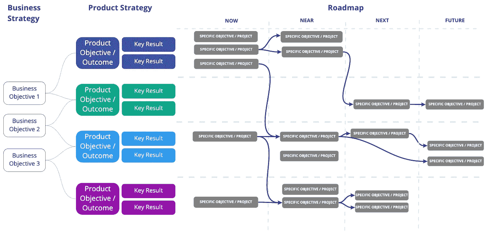

# 以结果为导向的路线图

> 原文：<https://medium.com/globant/outcome-driven-roadmaps-e004853037bb?source=collection_archive---------0----------------------->

## 基于结果或结果驱动的路线图已经成为一种越来越受欢迎的方式，以确保团队专注于产品的成功，而不仅仅是快速交付功能。

# 发现原因

多年来，作为一名产品经理，我创建了路线图来展示我们如何发展我们的产品和执行我们的战略。有一年，一位高级经理向我挑战，要我展示过去几年我们实际交付了多少路线图，因为他不相信我们正在实现我们的承诺。虽然我很容易就能证明我们已经交付了 90%以上的功能(虽然不一定都按时交付)，但是我忽略了挑战的要点。我们如此专注于交付路线图上的功能，我们已经忽略了改变客户行为的目标，因此我们没有帮助公司实现其最终目标。

直到多年以后，我才发现结果驱动路线图的概念。现在，当我支持我目前的客户时，这是客户第一次真正接受这种看待路线图的新方式。

# 受结果驱动

作为产品经理，我们专注于解决客户问题，减轻客户痛苦，实现客户收益。结果驱动意味着关注结果而不是输出(特征),并衡量我们的工作是否真正改变了客户行为并实现了目标。结果驱动的路线图侧重于客户行为的可测量变化，例如集成的使用增加了 20%，这应该导致最终目标，例如增加续订一整年的客户。

当我们关注结果时，我们倾向于更有效地实现公司/产品的直接目标，因为这种方法有助于:

*   保持对全局目标的关注。
*   通过将利益相关者的注意力集中在结果上，而不是具体的特征“承诺”上，来证明旋转的合理性并减少旋转的摩擦。
*   通过给他们问题去解决，而不是告诉他们要构建什么，来支持自主产品团队。
*   迫使团队跟踪成功，并在没有成功时做出反应。
*   让反馈和验证循环成为一种必须，而不是事后的想法。

# 入门指南

从以功能为中心的方法转变为以结果为导向的方法需要组织变革，因为管理层和团队都需要接受市场的不确定性，以及推动客户行为变化的因素。产品团队需要对公司和产品有一个清晰的愿景，以及清晰的战略，因为结果需要以符合战略主题的方式驱动业务目标。

虽然重大的组织变革极具挑战性，并且需要 C 套件的投资和承诺，但产品经理可以通过一些简单的变革开始向结果驱动的路线图迈进:

1.  定量衡量你的产品和新功能的影响和有效性。
2.  使用客户对话来了解您刚刚构建的功能对他们的得失的影响(定性衡量)。
3.  诚实地评估每项功能的有效性，并通过与客户的交谈定性地了解原因。
4.  将成果添加到您的路线图中，并将功能与它们关联起来。展示产品上市后的影响指标
5.  保持路线图发展的透明度，以推动利益相关方的对话。

# 几个音符

在过去的几年里，许多产品经理都谈到了这个话题。我多次提到的一篇文章是 Jason Doherty(与 Kelsey Stevenson 和 Thomas Vela 一起)发布的，名为 [*基于结果的路线图:释放共同愿景和目标的力量*](/swlh/outcome-based-roadmaps-unleash-the-power-of-a-shared-vision-and-purpose-851401c7aa54) *。*他为思考结果和有趣的演示文稿提供了一个很好的大纲。

祝你好运！