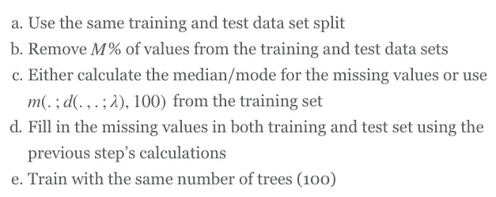

# 克服随机森林分类器中的缺失值

> 原文：<https://medium.com/airbnb-engineering/overcoming-missing-values-in-a-random-forest-classifier-7b1fc1fc03ba?source=collection_archive---------0----------------------->

作者:阿洛克·古普塔

## 没有陌生人

Airbnb 试图建立一个世界，在那里人们可以[属于任何地方](http://blog.airbnb.com/belong-anywhere/)，没有[没有陌生人](http://blog.airbnb.com/creating-onelessstranger-stories-belonging/)。这有助于主人敞开家门感到舒适，也有助于客人充满信心地环游世界，与他们从未谋面的人呆在一起。

虽然 Airbnb 社区的几乎所有成员都本着善意互动，但寻求利用该平台获利的不良行为者群体正在不断缩小。这个问题并不是 Airbnb 独有的:社交网络与试图向用户发送垃圾邮件或钓鱼来获取其详细信息的行为进行斗争；电子商务网站试图防止被盗信用卡的使用。Airbnb 的[信任和安全](https://www.airbnb.com/trust)团队不知疲倦地工作，从 Airbnb 社区中清除不良行为者，并帮助使该平台成为一个更安全和值得信赖的地方，以体验归属感。

## 随机林中缺少值

我们可以训练机器学习模型来识别新的不良因素(更多详细信息请参见之前的博客文章[为风险构建机器学习系统](http://nerds.airbnb.com/architecting-machine-learning-system-risk/))。我们使用的一个特殊的模型系列是随机森林分类器(RFC)。RFC 是一个树的集合，每个树都是使用带标签的完整输入训练数据独立生长的。通过完成，我们明确地表示没有缺失值，即空值或 NaN 值。但实际上，数据经常会有(许多)缺失值。特别是，预测性很强的要素并不总是有可用的值，因此必须在训练随机森林之前对其进行估算。

通常，随机森林方法/包鼓励两种处理缺失值的方式:a)丢弃缺失值的数据点(不推荐)；b)用中位数(对于数值)或众数(对于分类值)填充缺失值。虽然 a)没有通过删除数据点来使用所有可用的信息，但 b)有时会对具有许多间隙和重要结构的数据集刷得太宽。

有一些替代技术可以处理缺失值，但大多数技术的计算开销都很大，例如，重复迭代随机森林训练来计算邻近度。我们在本文中提出的是一种单步预计算方法，该方法对要素进行归一化处理，以构建一个距离度量，用于使用 k 个最近邻的中值来填充缺失值。

我们的欺诈预测模型中的所有特征分为两种类型:a)数字型和 b)分类型。布尔特征可以被认为是分类特征的一个特例。由于我们从事欺诈检测业务，我们的标签是二元的:如果数据点不是欺诈，则为 0，如果数据点是欺诈，则为 1。下面是一些我们希望比较的缺失值处理的特征转换。

## 转换

## 解释

缩放变换 Fn 和 Fc 的目的是双重的。首先要使转换可逆，这样就不会丢失任何信息。其次，*对于每个特征，在区间[0，1]内均匀分布*有欺诈的数据点。如果我们将数据视为 N 维空间中的点，其中 N 是特征的数量，那么两个数据点之间在每个维度中的距离变得可比较。所谓可比较，我们是指在第一维度中距离为 0.4 包含的欺诈数据点是第二维度中距离为 0.2 的两倍。这使得能够更好地构建距离度量来识别欺诈。

## 使用 K-最近邻的插补

## 实验

为了查看上述特征变换的效果，我们使用来自 [UCI 机器学习库](http://archive.ics.uci.edu/ml/)的成人数据集，并评估模型在不同特征变换和缺失值比例下的性能。数据集包含 32，561 行和 14 个特征，其中 8 个是分类的，其余 4 个是数字的。布尔标签对应于成年人的收入水平是高于还是低于每年$50k。我们以 4:1 的比例将数据集分别划分为训练集和测试集。

在第一个实验中，我们使用以下方法比较了不同的模型:

请注意，M 和λ是未指定的参数，我们将在实验过程中循环这些参数的不同值。将使用曲线下面积(AUC)分数来判断每个模型的性能，该分数测量受试者操作特征(ROC)图下的面积(这是真阳性率对假阳性率的图)。我们将测试以下九种型号:

# 结果

## 模型比较

首先，我们考虑对于在 RFC 训练过程中具有固定数量的树(100)和用于 NNMV 插补的固定数量的最近邻(100)的不同[latex]M[/latex]和[latex]\lambda[/latex]值，模型如何表现。

上图展示了一些有趣的模式，有些直观，有些令人惊讶:

# 鲁棒性检查

观察到模型 8)优于其他候选模型后，我们接下来检查模型 8)如何与基线进行比较，因为我们改变了 RFC 训练中的树的数量和 NNMV 插补中的最近邻居的数量。我们采用上面的第四种情况，其中 60%的值丢失，我们选择λ=0.5。

左边的图没有表明模型 8)的性能随着 NNMV 插补中使用的最近邻的数量而提高。然而，随着树的数量增加，性能的提高有一个一致的模式，在大约 100 棵树后达到稳定。右边的图显示了使用转换后的特征集训练 RFC 的速度有多快。这是意料之中的，因为我们没有在基线模型中将分类特征分解为许多二元特征，而是在模型 8)中保持固定的特征数量。

## 效率影响

考虑上述场景之一的 ROC 曲线，比如说，树的数量是 100，使用的最近邻居的数量是 100。

举例来说，ROC 曲线的改善表明，当保持回忆固定在 80%时，假阳性率从 26%下降到 24%。假设每天我们对 100 万个事件进行评分，其中 99%是非欺诈性的，每个标记的事件都需要人工审核，每个审核需要 10 秒钟。那么前面提到的误报率的降低可以节省复习 1，000，000 x 0.99 x 0.02 = 19，800 个事件或者 19，800 / (6 x 60) =每天 55 个小时的复习！这就是为什么即使一个 RFC 的 auc 分数提高了个位数或十进制数，也会对部门的效率产生巨大影响。

## 在 [airbnb.io](http://airbnb.io) 查看我们所有的开源项目，并在 Twitter 上关注我们:[@ Airbnb eng](https://twitter.com/AirbnbEng)+[@ Airbnb data](https://twitter.com/AirbnbData)

*原载于 2015 年 4 月 7 日 nerds.airbnb.com**[*。*](http://nerds.airbnb.com/large-scale-payments-systems-ruby-rails/)*