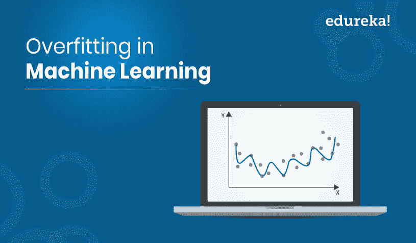
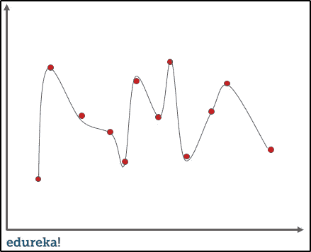
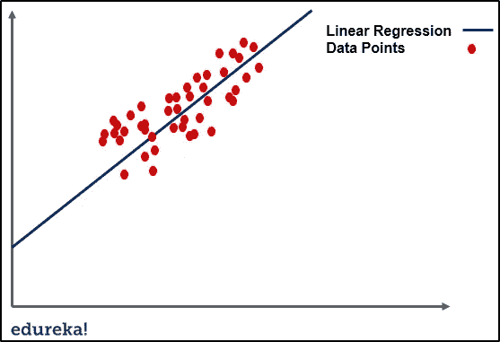
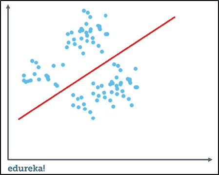
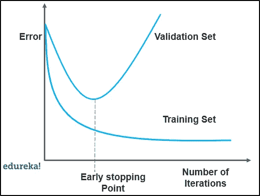
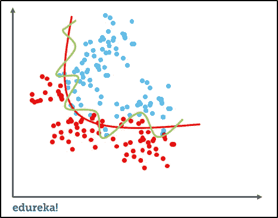
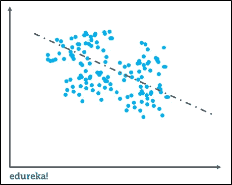
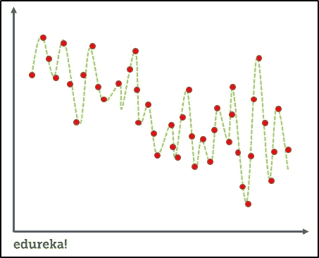

# 机器学习中什么是过拟合，如何避免？

> 原文：<https://medium.com/edureka/overfitting-in-machine-learning-6251a882db0?source=collection_archive---------1----------------------->

建立机器学习模型不仅仅是输入数据，还有很多缺陷会影响任何模型的准确性。机器学习中的过拟合是机器学习中的一个缺陷，它阻碍了模型的准确性和性能。本文涵盖了以下主题:

*   机器学习中什么是过拟合？
*   过度拟合的例子
*   信号与噪声
*   什么是不合身？
*   如何检测过度拟合？
*   机器学习中如何避免过拟合
*   什么是拟合优度？
*   偏差和方差之间的权衡

# 机器学习中什么是过拟合？

当我们向一个统计模型提供了大量不必要的数据时，我们就说这个模型过度拟合了。为了让它变得有关联，想象一下试着穿上超大号的衣服。

当一个模型适合的数据多于它实际需要的数据时，它就开始捕捉数据中有噪声的数据和不准确的值。结果，模型的效率和准确性降低。让我们看几个过度拟合的例子，以了解它实际上是如何发生的。

# 过度拟合的例子

**例 1**

如果我们以简单的线性回归为例，训练数据就是找出最佳拟合线和数据点之间的最小成本。它通过多次迭代来找出最优的最适合的，使成本最小化。这就是过度拟合出现的原因。

上图中的线条可以为新的数据点提供非常有效的结果。在过度拟合的情况下，当我们在数据集上运行训练算法时，我们允许成本随着每次迭代而降低。

运行该算法太长时间将意味着降低成本，但它也将拟合来自数据集的噪声数据。结果将如下图所示。

这看起来很有效率，但实际上不是。线性回归等算法的主要目标是找到主导趋势，并相应地拟合数据点。但是在这种情况下，直线适合所有数据点，这与模型在预测新进入数据点的最佳结果时的效率无关。

现在让我们在问题陈述的帮助下考虑一个更具描述性的例子。

**例二**

**问题陈述:**让我们考虑我们想要基于足球运动员在二级联赛中的当前表现来预测他/她是否会在一级足球俱乐部中获得一个位置。

现在想象一下，我们用 10，000 个有结果的玩家来训练和适应这个模型。当我们试图在原始数据集上预测结果时，假设我们获得了 99%的准确率。但是在不同的数据集上，准确率只有 50%左右。这意味着该模型不能从我们的训练数据和看不见的数据中很好地概括。

这就是过度拟合的样子。是机器学习乃至数据科学中非常常见的问题。现在让我们理解信号和噪声。

# 信号与噪声

在预测建模中，信号是指有助于模型学习数据的真实基础模式。另一方面，噪声是数据集中不相关的随机数据。为了理解噪声和信号的概念，让我们举一个现实生活中的例子。

让我们假设我们想要在成年人中建立年龄与文化水平的模型。如果我们从很大一部分人口中取样，我们会发现一个明确的关系。这是信号，而噪声会干扰信号。如果我们对当地人口也这样做，这种关系就会变得模糊不清。它会受到异常值和随机性的影响，例如，一个成年人很早就去上学，或者一些成年人负担不起教育费用，等等。

从机器学习的角度来说噪音和信号，一个好的机器学习算法会自动将信号从噪音中分离出来。如果算法太复杂或效率太低，它也可能学习噪音。因此，过度拟合模型。让我们也理解机器学习中的欠拟合。

# 什么是不合身？

为了避免过度适应，我们可以在早期停止训练。但这也可能导致模型无法从训练数据中学习到足够的知识，从而难以捕捉主导趋势。这就是所谓的欠拟合。结果是一样的过度拟合，预测结果的低效率。

既然我们已经理解了机器学习中的欠拟合和过拟合到底是什么，那么让我们试着理解我们如何检测机器学习中的过拟合。

# 如何检测过度拟合？

过度拟合的主要挑战是用新数据估计模型性能的准确性。在实际测试之前，我们无法估计其准确性。

为了解决这个问题，我们可以将初始数据集分成单独的训练数据集和测试数据集。使用这种技术，我们实际上可以估计我们的模型在新数据下的表现。

让我们通过一个例子来理解这一点，想象我们在训练集上获得了 90%以上的准确率，在测试集上获得了 50%的准确率。然后，它会自动成为模型的危险信号。

**另一种检测过度拟合的方法**是从一个将作为基准的简单模型开始。

使用这种方法，如果你尝试更复杂的算法，你将能够理解额外的复杂性对于模型是否值得。它也被称为*奥卡姆剃刀测试*，它基本上是在两个模型的性能相当的情况下选择最简单的模型。虽然检测过度拟合是一个很好的实践，但也有几种技术可以防止过度拟合。让我们来看看如何在机器学习中防止过度拟合。

# 机器学习中如何避免过拟合？

下面列出了几种避免机器学习中过度拟合的技术。

1.  交叉验证
2.  使用更多数据进行培训
3.  移除功能
4.  提前停止
5.  正规化
6.  组装

**1。交叉验证**

避免/防止过度拟合的最有力的特征之一是交叉验证。这背后的想法是使用初始训练数据来生成迷你训练测试分割，然后使用这些分割来调整您的模型。

在标准的 k 折叠验证中，数据被划分成 k 个子集，也称为折叠。此后，在 k-1 个折叠上迭代地训练算法，同时使用剩余的折叠作为测试集，也称为保持折叠。

**2。用更多数据训练**

正如我们在上面的例子中所讨论的那样，这种技术可能并不是每次都有效，在上面的例子中，对大量人群进行训练有助于模型的建立。它基本上有助于模型更好地识别信号。

但在某些情况下，增加的数据也意味着给模型添加了更多的噪声。当我们用更多的数据训练模型时，我们必须确保数据是干净的，没有随机性和不一致性。

**3。移除功能**

虽然有些算法有自动选择特征的功能。对于大量没有内置特征选择的用户，我们可以从输入特征中手动移除一些不相关的特征来提高泛化能力。

一种方法是得出一个关于特征如何适应模型的结论。这与逐行调试代码非常相似。

如果一个特征不能解释模型中的相关性，我们可以简单地识别这些特征。我们甚至可以使用一些特性选择试探法作为一个好的起点。

**4。提前停止**

当模型正在训练时，您实际上可以基于每次迭代来度量模型的表现。我们可以这样做，直到迭代提高了模型的性能。此后，随着每次迭代后泛化能力的减弱，模型会过度拟合训练数据。

所以基本上，早期停止意味着在模型超过模型开始过度拟合训练数据的点之前停止训练过程。这种技术多用于深度学习。

**5。正规化**

它基本上意味着，通过使用更广泛的技术，人为地迫使你的模型更简单。这完全取决于我们使用的学习者的类型。例如，我们可以修剪决策树，在神经网络上使用 dropout，或者在回归中向成本函数添加惩罚参数。

通常，正则化也是一个超参数。这意味着它也可以通过交叉验证进行调整。

**6。组装**

这项技术基本上结合了不同机器学习模型的预测。下面列出了两种最常用的组装方法:

*   Bagging 试图减少模型过度拟合的机会
*   Boosting 试图提高简单模型的预测灵活性

尽管它们都是集合方法，但是该方法完全从相反的方向开始。Bagging 使用复杂的基础模型并试图平滑它们的预测，而 boosting 使用简单的基础模型并试图提高其总体复杂性。

# 什么是拟合优度？

在统计建模中，拟合优度是指结果或预测值与观察值或真实值的匹配程度。已经学习了噪声而不是信号的模型是过度拟合的，因为它将适合训练数据集，但是对于新数据集将具有较差的效率。

# 偏差和方差之间的权衡

方差和偏差都是机器学习中预测误差的形式。高方差和高偏倚之间的权衡是统计学和机器学习中非常重要的概念。这是一个影响所有监督机器学习算法的概念。

偏差-方差权衡对于确定任何机器学习模型的复杂性、欠拟合和过拟合具有非常重要的影响。

**偏置**

它只不过是模型中预测值与实际值或真实值之间的差异。模型从相当复杂的信号中学习并不总是容易的。

让我们设想用非线性数据对模型进行线性回归拟合。无论模型学习观察值的效率有多高，它都不会有效地模拟曲线。这就是所谓的欠拟合。

**方差**

它是指模型对训练数据中特定集合的敏感度。高方差算法将产生一个与训练集完全不同的奇异模型。

想象一个适合无约束和超灵活模型的算法，它也将从训练集中导致过拟合的噪声中学习。

**偏差-方差权衡**

机器学习算法不能被视为训练模型的一次性方法，相反，它是一个重复的过程。

低方差-高偏差算法不太复杂，具有简单和严格的结构。

*   他们将训练一致但平均不准确的模型。
*   这些包括线性或参数算法，如回归，朴素贝叶斯等。

高方差-低偏差算法往往更复杂，具有灵活的结构。

*   他们会训练不一致但平均准确的模型。
*   这些算法包括非线性或非参数算法，如决策树、最近邻算法等。

这就把我们带到了本文的结尾，在这里我们学习了机器学习中的过度拟合以及避免过度拟合的各种技术。我希望你清楚本教程中与你分享的所有内容。

如果你想查看更多关于 Python、DevOps、Ethical Hacking 等市场最热门技术的文章，你可以参考 Edureka 的官方网站。

请留意本系列中解释数据科学各个方面的其他文章。

> *1。* [*数据科学教程*](/edureka/data-science-tutorial-484da1ff952b)
> 
> *2。* [*数据科学的数学与统计*](/edureka/math-and-statistics-for-data-science-1152e30cee73)
> 
> *3。*[*R 中的线性回归*](/edureka/linear-regression-in-r-da3e42f16dd3)
> 
> *4。* [*机器学习算法*](/edureka/machine-learning-algorithms-29eea8b69a54)
> 
> *5。*[*R 中的逻辑回归*](/edureka/logistic-regression-in-r-2d08ac51cd4f)
> 
> *6。* [*分类算法*](/edureka/classification-algorithms-ba27044f28f1)
> 
> *7。* [*随机森林中的 R*](/edureka/random-forest-classifier-92123fd2b5f9)
> 
> *8。* [*决策树中的 R*](/edureka/a-complete-guide-on-decision-tree-algorithm-3245e269ece)
> 
> *9。* [*机器学习入门*](/edureka/introduction-to-machine-learning-97973c43e776)
> 
> *10。* [*朴素贝叶斯在 R*](/edureka/naive-bayes-in-r-37ca73f3e85c)
> 
> *11。* [*统计与概率*](/edureka/statistics-and-probability-cf736d703703)
> 
> *12。* [*如何创建一个完美的决策树？*](/edureka/decision-trees-b00348e0ac89)
> 
> *13。* [*关于数据科学家角色的 10 大误区*](/edureka/data-scientists-myths-14acade1f6f7)
> 
> *14。* [*顶级数据科学项目*](/edureka/data-science-projects-b32f1328eed8)
> 
> *15。* [*数据分析师 vs 数据工程师 vs 数据科学家*](/edureka/data-analyst-vs-data-engineer-vs-data-scientist-27aacdcaffa5)
> 
> 16。 [*人工智能类型*](/edureka/types-of-artificial-intelligence-4c40a35f784)
> 
> 17。 [*R vs Python*](/edureka/r-vs-python-48eb86b7b40f)
> 
> 18。 [*人工智能 vs 机器学习 vs 深度学习*](/edureka/ai-vs-machine-learning-vs-deep-learning-1725e8b30b2e)
> 
> *19。* [*机器学习项目*](/edureka/machine-learning-projects-cb0130d0606f)
> 
> 20。 [*数据分析师面试问答*](/edureka/data-analyst-interview-questions-867756f37e3d)
> 
> *21。* [*面向非程序员的数据科学和机器学习工具*](/edureka/data-science-and-machine-learning-for-non-programmers-c9366f4ac3fb)
> 
> *二十二。* [*十大机器学习框架*](/edureka/top-10-machine-learning-frameworks-72459e902ebb)
> 
> *23。* [*用于机器学习的统计*](/edureka/statistics-for-machine-learning-c8bc158bb3c8)
> 
> *24。* [*随机森林中的 R*](/edureka/random-forest-classifier-92123fd2b5f9)
> 
> *25。* [*广度优先搜索算法*](/edureka/breadth-first-search-algorithm-17d2c72f0eaa)
> 
> *26。*[*R 中的线性判别分析*](/edureka/linear-discriminant-analysis-88fa8ad59d0f)
> 
> *27。* [*机器学习的先决条件*](/edureka/prerequisites-for-machine-learning-68430f467427)
> 
> *28。* [*互动 WebApps 使用 R 闪亮*](/edureka/r-shiny-tutorial-47b050927bd2)
> 
> *29。* [*机器学习十大书籍*](/edureka/top-10-machine-learning-books-541f011d824e)
> 
> 三十。 [*监督学习*](/edureka/supervised-learning-5a72987484d0)
> 
> *31。* [*10 本最好的数据科学书籍*](/edureka/10-best-books-data-science-9161f8e82aca)
> 
> *32。* [*机器学习使用 R*](/edureka/machine-learning-with-r-c7d3edf1f7b)

*原载于 2019 年 12 月 13 日*[*【https://www.edureka.co】*](https://www.edureka.co/blog/overfitting-in-machine-learning/)*。*