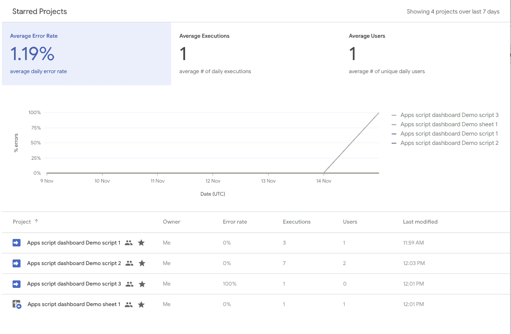
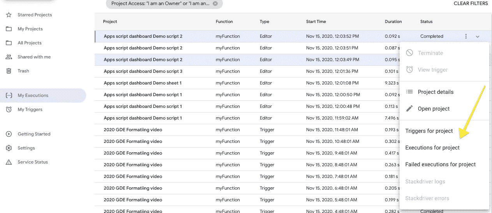
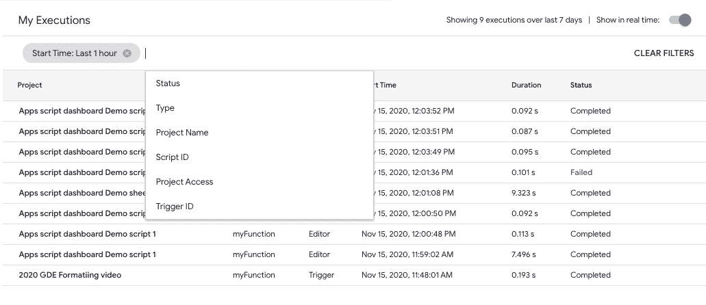
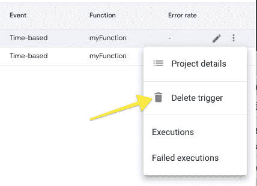

# 应用程序脚本仪表板概述

> 原文：<https://medium.com/google-developer-experts/overview-of-the-apps-script-dashboard-97915324e8d2?source=collection_archive---------4----------------------->

应用程序脚本控制面板可让您管理和监控应用程序脚本项目。这是关于应用程序脚本仪表板的文档中的第一句话。它描述了应用脚本仪表板的高级用途，但这在真实环境中意味着什么。在这篇文章中，我将描述我的应用脚本仪表板的一些用例。

Photo by [Mitchel Boot](https://unsplash.com/@valeon?utm_source=medium&utm_medium=referral) on [Unsplash](https://unsplash.com?utm_source=medium&utm_medium=referral)

每当我开始在新环境中工作时，打开应用程序脚本仪表板通常是我采取的第一步。我为多家公司工作，我有很多谷歌账户。很高兴在“所有项目”部分看到所有项目。这将立即让你知道你能接触到什么样的项目。这听起来可能很明显，但当我打开我最老的账户的仪表板，按最后修改日期排序时，我看到了一个最后修改于 2010 年 12 月 2 日的脚本。

# 项目概述

“我的项目”和“与我共享”是项目的很好的子集。我确实错过了一个更好的过滤器，对所有者排序也将是伟大的。如果您将鼠标悬停在某个项目上，可以通过单击信息图标来打开项目信息。如果是容器绑定脚本，信息页面将提供脚本和容器的概述。

主演项目对我来说是最有用的功能之一。将鼠标悬停在一个项目上，使用三个点打开菜单并启动该项目。在下面的截图中，我标记了五个项目。

This overview shows all the relevant information for the starred projects.

执行和触发器

“我的触发器”和“我的执行”部分显示您的执行和触发器。这可能会令人困惑，因为可能有其他执行和触发器。如果您想查看所有的执行和触发器，请打开项目本身。

您可以使用过滤器来限制概览中的行:

在“我的触发器”部分，您可以看到您的所有触发器。如果要编辑触发器，请将鼠标悬停在触发器上并使用铅笔图标。可以在带有三个点的菜单中删除触发器。

# 其余的选项

在“入门”中，您可以找到更多信息和一些入门项目。“设置”部分仅包含启用 Google Apps 脚本 API 的选项。最后，“服务状态”部分链接到指南中有用的部分。

# 包扎

在这篇文章中，我讨论了应用程序脚本仪表板的“怪癖和特性”。应用程序脚本仪表板提供了您拥有或有权访问的所有 Google 应用程序脚本的鸟瞰图。它还使您能够直接进入项目信息。

对我来说，当我开始一个新项目或者当我想熟悉一个帐户可用的 Google Apps 脚本脚本时，我首先看到的就是应用程序脚本仪表板。