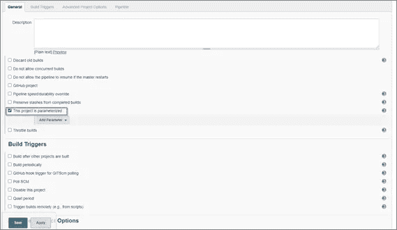
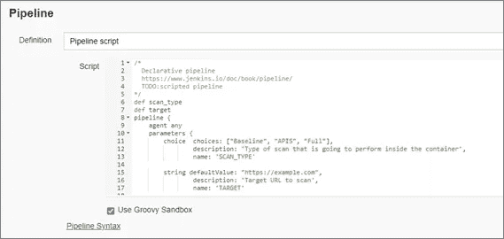
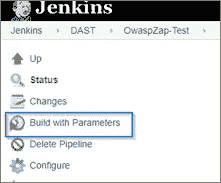
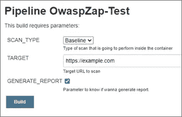
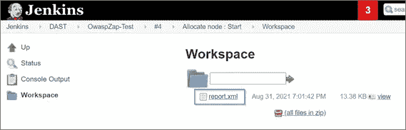

# OWASP ZAP 与 Jenkins 的集成

> 原文：<https://medium.com/globant/owasp-zap-integration-with-jenkins-795d65991404?source=collection_archive---------0----------------------->


# 介绍

对于开发应用程序，今天我们有不同的工具可以帮助我们实现构建一个安全的应用程序。它们可以根据功能进行分类，如 SS(秘密搜索)、DAST(动态应用安全测试)、SAST(静态应用安全测试)、SCA(软件组合分析)等。

这些工具可以单独用于测试应用程序，但我们也可以将它们集成到编排工具中，这些工具现在用于编译、测试和部署我们的软件，自动化并促进我们应用程序的持续集成和持续交付/部署。

本文将重点描述如何将这些安全工具之一集成到编排管道中。我们说的是 OWASP ZAP (Zed 攻击代理)和 Jenkins。

OWASP ZAP 是我们作为 DAST(动态应用程序安全测试)安全技术的一部分拥有的选项之一。它是一个免费的开源扫描器，在运行时对 web 应用程序/服务执行渗透测试，以检测漏洞。

虽然 OWASP ZAP 是一个可以手动和准时用于测试特定 web 应用程序的工具，但我们可以在一个持续集成管道中集成和自动化它，并利用这样做的优势。随着每个构建阶段的持续测试，它将允许我们更早地检测到漏洞。

另一方面，我们有 Jenkins，它是一个持续集成服务器，免费、开源，是当今非常流行的工具。

在本文中，我们将讨论以下几点:
**1-需求:**应该运行的测试本文的软件
**2-OWASP ZAP 的集成**:将启用集成的基线脚本
**3-Jenkins 中的管道:**您应该执行的配置
**4-结论:**本文的结果！
**5-参考资料:**如果你想了解更多这方面的信息

# 要求

1.  你需要安装詹金斯。
2.  Docker 应该安装在 Jenkins 机器上

# OWASP ZAP 的集成

## 创建脚本

在 Jenkins 中创建管道时，我们将使用下面的脚本。

```
def scan_type
 def target
 pipeline {
     agent any
     parameters {
         choice  choices: ["Baseline", "APIS", "Full"],
                 description: 'Type of scan that is going to perform inside the container',
                 name: 'SCAN_TYPE'

         string defaultValue: "https://example.com",
                 description: 'Target URL to scan',
                 name: 'TARGET'

         booleanParam defaultValue: true,
                 description: 'Parameter to know if wanna generate report.',
                 name: 'GENERATE_REPORT'
     }
     stages {
         stage('Pipeline Info') {
                 steps {
                     script {
                         echo "<--Parameter Initialization-->"
                         echo """
                         The current parameters are:
                             Scan Type: ${params.SCAN_TYPE}
                             Target: ${params.TARGET}
                             Generate report: ${params.GENERATE_REPORT}
                         """
                     }
                 }
         }

         stage('Setting up OWASP ZAP docker container') {
             steps {
                 script {
                         echo "Pulling up last OWASP ZAP container --> Start"
                         sh 'docker pull owasp/zap2docker-stable'
                         echo "Pulling up last VMS container --> End"
                         echo "Starting container --> Start"
                         sh """
                         docker run -dt --name owasp \
                         owasp/zap2docker-stable \
                         /bin/bash
                         """
                 }
             }
         }

         stage('Prepare wrk directory') {
             when {
                         environment name : 'GENERATE_REPORT', value: 'true'
             }
             steps {
                 script {
                         sh """
                             docker exec owasp \
                             mkdir /zap/wrk
                         """
                     }
                 }
         }

         stage('Scanning target on owasp container') {
             steps {
                 script {
                     scan_type = "${params.SCAN_TYPE}"
                     echo "----> scan_type: $scan_type"
                     target = "${params.TARGET}"
                     if(scan_type == "Baseline"){
                         sh """
                             docker exec owasp \
                             zap-baseline.py \
                             -t $target \
                             -x report.xml \
                             -I
                         """
                     }
                     else if(scan_type == "APIS"){
                         sh """
                             docker exec owasp \
                             zap-api-scan.py \
                             -t $target \
                             -x report.xml \
                             -I
                         """
                     }
                     else if(scan_type == "Full"){
                         sh """
                             docker exec owasp \
                             zap-full-scan.py \
                             -t $target \
                             //-x report.xml
                             -I
                         """
                         //-x report-$(date +%d-%b-%Y).xml
                     }
                     else{
                         echo "Something went wrong..."
                     }
                 }
             }
         }
         stage('Copy Report to Workspace'){
             steps {
                 script {
                     sh '''
                         docker cp owasp:/zap/wrk/report.xml ${WORKSPACE}/report.xml
                     '''
                 }
             }
         }
     }
     post {
             always {
                 echo "Removing container"
                 sh '''
                     docker stop owasp
                     docker rm owasp
                 '''
             }
         }
 }
```

## 脚本内容

这个脚本有两个重要的部分，为了更好地理解它，我们将对其进行简要的描述。

**参数**

参数将是我们每次想要执行流水线时必须完成的数据。我们有三种类型:

*SCAN_TYPE:* 将要执行的扫描类型。

OWASP ZAP 提供三种不同的扫描类型。我们必须在每种情况下选择我们需要的:基线扫描、完全扫描或 API 扫描。

 [## 活力

### 预装 OWASP Zed 攻击代理的 Docker 映像。稳定版:docker pull owasp/zap 2 docker-stable For…

www.zaproxy.org](https://www.zaproxy.org/docs/docker/about/) 

*目标:*我们要分析的网页或者 API 的 URL。

*GENERATE _ REPORT:***该选项选择我们是否要在执行结束时获取报告。**

**阶段**

下面是我们将纳入 Jenkins 管道的阶段:

*管道信息:* 参数数据。

*设置 OWASP ZAP docker 容器:*从 OWASP ZAP DOCKER 映像中提取。

有不同类型的 docker 图像:稳定发布、最新每周发布、实时发布、裸发布。我们必须选择最适合我们需要的一个。这些图片可以在 Docker Hub 上找到:

 [## 码头枢纽

### 编辑描述

hub.docker.com](https://hub.docker.com/u/owasp) 

*准备 WRK 目录:*该阶段将创建一个名为“wrk”的文件夹，当选择生成报告的选项时，该文件夹将保存结果。我们这样做是因为 OWASP ZAP docker 映像没有文件夹。

*OWASP 容器上的扫描目标:* 是根据我们选择的扫描类型执行扫描。

*将报告复制到工作区:* 如果我们选择生成报告的选项，此阶段会将报告复制到我们在 Jenkins 中的存储库中。

# 詹金斯的管道

现在，我们必须完成以下步骤，在 Jenkins 中创建一个管道:

1.  创建新管道

让我们勾选选项*“这个项目是参数化的”。*



2.我们添加开头提到的脚本(复制并粘贴脚本)



3.我们通过选择“立即构建”来保存和执行。一旦“用参数构建”选项出现，我们就取消它。



4.选择“使用参数构建”，添加扫描选项并执行构建，直到完成。



5.如果我们先前选择了生成报告的选项，那么在执行管道时，将会在工作区文件夹中找到该报告。



# 结论

执行 OWASP ZAP 与 Jenkins 的集成既简单又免费。你可以从你的项目一开始就开始使用它，没有成本，并获得巨大的利益。您将更早地发现漏洞，并为您的客户提供更安全的应用程序。

请注意，您还可以用其他漏洞扫描来补充此工具。

# 参考

1.  [https://www.zaproxy.org/docs/](https://www.zaproxy.org/docs/)
2.  [https://www.zaproxy.org/docs/docker/about/](https://www.zaproxy.org/docs/docker/about/)
3.  [https://www.jenkins.io/](https://www.jenkins.io/)
4.  [https://www.globant.com/studio/cybersecurity](https://www.globant.com/studio/cybersecurity)