# 数据复制:Oracle SaaS 融合到数据仓库

> 原文：<https://medium.com/oracledevs/paas4saas-replicating-oracle-saas-fusion-to-the-autonomous-data-warehouse-62746660366f?source=collection_archive---------1----------------------->

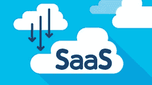

对于 SaaS(软件即服务)，我们如何利用 PaaS(平台即服务)？在本教程中，我们将使用 Oracle 分析云(OAC)数据复制工具将数据从我们的 SaaS 应用程序复制到 Oracle 自治数据仓库(ADW)。这使得业务分析师、数据科学家、机器学习工程师能够使用您的 SaaS 应用数据构建预测模型，并更深入地了解您的业务。

# 大纲:

1.  先决条件
2.  对象存储配置
3.  SaaS 外部存储配置
4.  连接到 OAC 的 ADW 实例。
5.  OAC 数据复制器连接
6.  供应链管理 SaaS 复制到 ADW
7.  验证 ADW 的 SaaS 数据
8.  结论

## 先决条件

*   OAC 的数据复制工具仅适用于某些 Oracle SaaS 融合管理软件。在这里检查支持的数据源[。在撰写本文时，支持 11.1.1.9+或 Fusion Applications Release 8 及更高版本。更多细节，请点击](https://docs.oracle.com/en/cloud/paas/analytics-cloud/acabi/overview-data-replication.html#GUID-6A459991-5424-4779-B8C3-A26E42EF313D)查看[。](https://docs.oracle.com/en/cloud/paas/analytics-cloud/acubi/supported-data-sources.html)
*   在将 SaaS 应用程序数据传输到 ADW 之前，需要将对象存储作为中转区。
*   访问数据复制工具需要 Oracle 分析云企业版
*   需要一个 ADW 实例(或 Oracle 云数据库)作为数据复制的目标。请查看[我之前的文章](/@arshyasharifian/real-time-bitcoin-price-streaming-using-oracle-cloud-services-2f3fcb3adfb2)(步骤 4)以提供 ADW 实例。确保保存“钱包凭证”文件，因为它将在本教程的几个不同部分中使用。
*   安装 SqlDeveloper 或 Toad 以建立到 ADW 的连接。我们将用它来验证我们的 SCM SaaS 数据是否正确地复制到了 ADW。
*   访问 SaaS 外部存储需要正确的角色和权限。首先检查您是否可以访问您的 Fusion SaaS 应用程序主机 url，后跟“/biacm”。如果您无权访问此网页，请通过访问“工具”>“安全控制台”来检查您的用户的角色和职责。最好为您的用户提供 ORA _ ASM _ APPLICATION _ IMPLEMENTATION _ ADMIN _ ABSTRACT、ASM _ APPLICATION _ IMPLEMENTATION _ CONSULTANT _ JOB 或 ORA _ ASM _ APPLICATION _ IMPLEMENTATION _ CONSULTANT _ JOB 角色或某个更高权限的角色。访问 Oracle 商业智能云连接器控制台(BICC)的示例 URL:
*   确保提取所需的对象可通过 BICC 获得。有一些对象和相应的表当前不可用于提取。Oracle 正在积极努力使更多的对象可用于提取。

> [https://gaf1-zkbg-fb-ext.oracledemos.com/biacm](https://ucf1-zkbt-fa-ext.oracledemos.com/biacm)

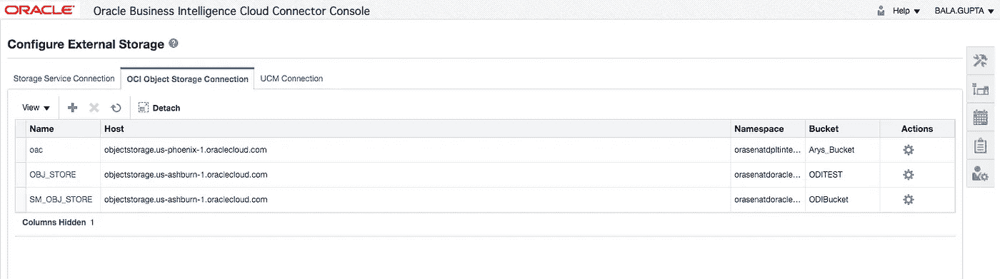

SaaS BICC Page

## 对象存储配置

接下来，我们希望在将数据复制到 ADW 之前，创建一个 Oracle 对象存储区作为 SaaS 数据的中转区。

请按照 Oracle A-Team 的 Jay Pearson 的文章[中的步骤 1 和步骤 2 创建一个 OCI 对象存储桶，并收集 OCI OCID 租户信息，以便在下一步配置 SaaS 外部存储。](https://www.ateam-oracle.com/set-up-oracle-fusion-saas-business-intelligence-cloud-connector-bicc-to-use-oracle-cloud-infrastructure-oci-object-storage)

> 注:如果在访问带有 404 错误的时段时出现授权错误，请检查您的 OCI 用户策略。可能需要允许用户管理隔离专区内的对象的新策略:
> 
> 允许群组<group name="">管理隔离专区<compartment name="">中的对象系列</compartment></group>

## SaaS 外部存储配置

接下来，请按照上面文章中 Jay Pearson 的步骤 3–5(从 d 部分开始，登录到 Oracle Business Intelligence Cloud Connector 控制台)来配置 SaaS 外部存储。

> 注意:第一次测试连接时，可能会失败。请稍等片刻，然后再次尝试测试连接。

## 连接到 OAC 的 ADW 实例

由于 ADW 是 SaaS 应用程序数据的目标，我们需要将 OAC 连接到 ADW。建立此连接后，OAC 数据复制程序可以选择此 ADW 实例作为目标。这里有一个链接，展示了如何在你的 OAC 实例中连接到 ADW。以下是我在 OAC 的 ADW 关系:

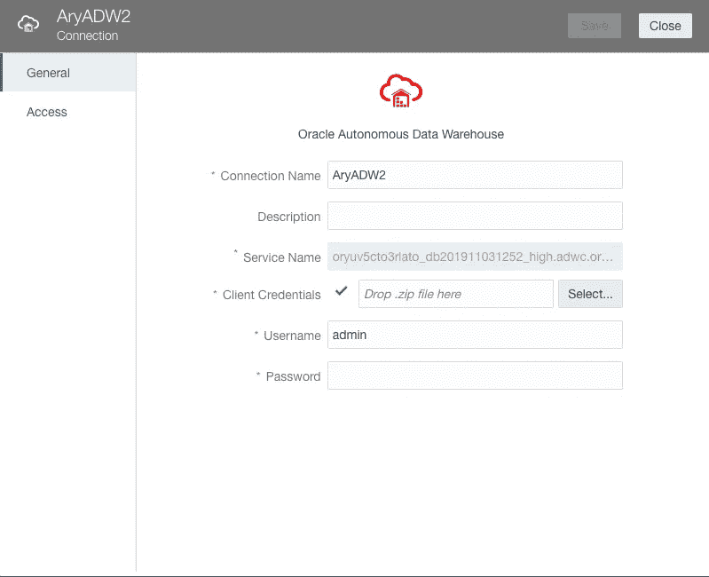

> 注意:您只需将压缩的钱包凭证文件拖到“客户机凭证”字段中，它就会自动填充“服务名”字段。

## OAC 数据复制器连接

OAC 数据复制器将使用对象存储作为中转区，使用 BICC 建立连接，将 SaaS 应用程序数据推入 ADW。在 OAC 的登录页面，点击“创建”:

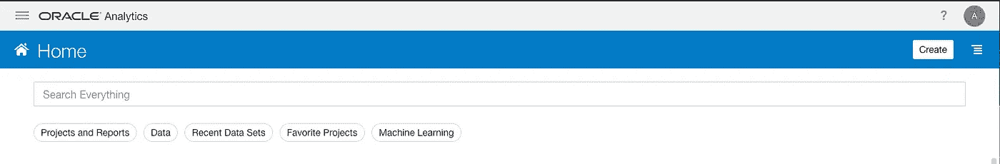

然后选择“复制连接”:

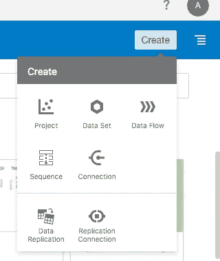

然后，我们可以选择以下来源:

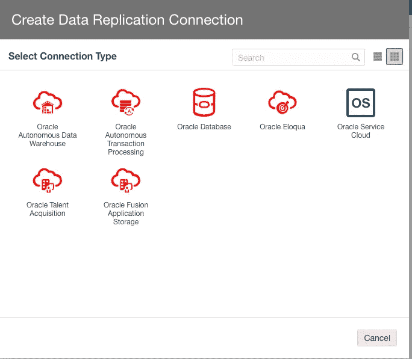

就我而言，由于我使用的是 Oracle 供应链管理，我将选择 Oracle 融合应用存储。以下是用于建立连接的字段。我们将使用之前配置的相同 Oracle 对象存储来提取 SaaS 应用程序数据。[这里有一些关于数据复制器字段和预期输入的文档。](https://docs.oracle.com/en/cloud/paas/analytics-cloud/acabi/replicate-data.html#GUID-5FDDF00E-4774-44E7-AE56-572D003C2062)

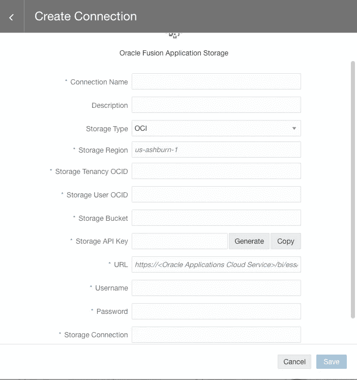

> 注意:“存储连接”字段需要前面输入的 BICC 连接的“名称”字段。在杰伊·皮尔森的文章《T2》中，名字是“OAC”。
> 
> N 注意:存储租户 OCID 和存储用户 OCID 与之前完成的 BICC SaaS 外部存储配置相同。
> 
> 注意:url 是主机名，后跟“/bi/ess/esswebservice”。例子是:
> 
> https://ga f1-zkbg-f b-ext . Oracle demos . com/bi/ess/essweb service

在使用 OAC 数据复制程序之前，我们必须复制“存储 API 密钥”并将此密钥添加给我们的用户。要做到这一点，你可以按照 [Jay Pearson 的文章，步骤 4:再一次将公钥添加到 OCI](https://www.ateam-oracle.com/set-up-oracle-fusion-saas-business-intelligence-cloud-connector-bicc-to-use-oracle-cloud-infrastructure-oci-object-storage) 。

我们输入所有字段后，您可以点击“保存”。要验证连接是否已建立，您可以选择汉堡菜单，选择“数据”，然后选择“数据复制”并查看复制连接。

## 供应链管理 SaaS 复制到 ADW

现在，我们已经在 OAC 创建了一个 SaaS 数据复制连接，我们可以将数据从 SaaS 复制到 ADW。首先，在 OAC 汉堡菜单中选择“数据”下的连接选项卡:

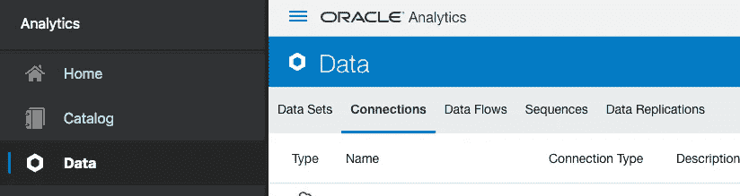

接下来，只需单击刚刚创建的数据复制连接。在这里，您可以查看要复制的 SaaS 对象:

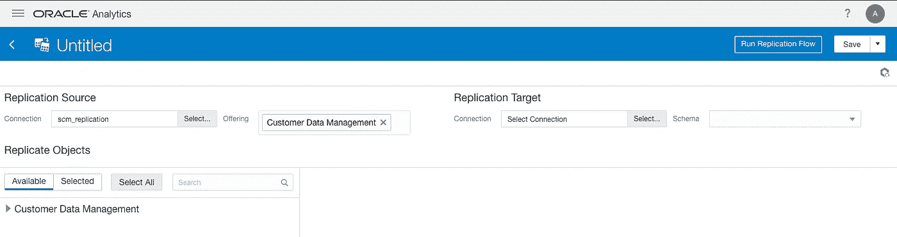

接下来，我们可以在 SaaS 对象中选择一个表:

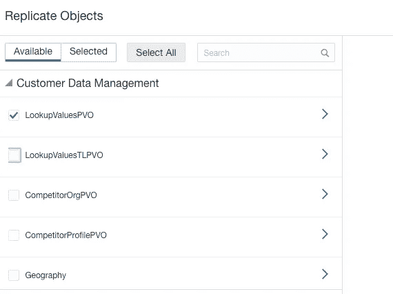

然后，让我们选择目标，我们的 ADW 实例和我们之前连接的默认方案(Admin):

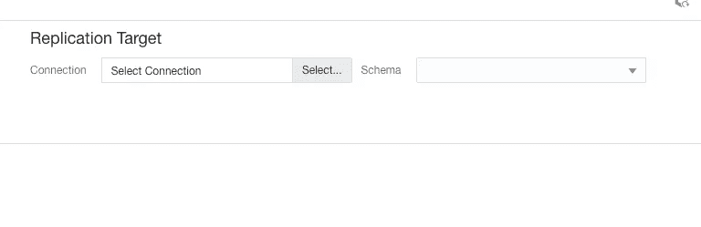

最后，我们可以保存并运行复制流:

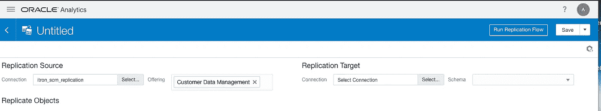

> 注意:影响复制速度的因素很多，网络连接、OAC OCPU、ADW OCPU、并发等。因此，复制过程可能需要一些时间。

## 验证 ADW 的 SaaS 数据

我们现在可以使用 SQL Developer 或 Toad 连接到我们的 ADW 实例，并验证数据复制工作正常。因为我在客户数据管理对象中选择了“LookupValuesPVO ”,所以我在我的 ADW 实例中看到了相应的表。请[查看此链接，它展示了如何使用钱包凭证将 SQL Developer 连接到您的 ADW 实例。](https://www.oracle.com/webfolder/technetwork/tutorials/obe/cloud/atp/OBE_Connecting%20SQL%20Developer%20to%20Autonomous%20Transaction%20Processing/connecting_sql_developer_to_autonomous_transaction_processing.html)

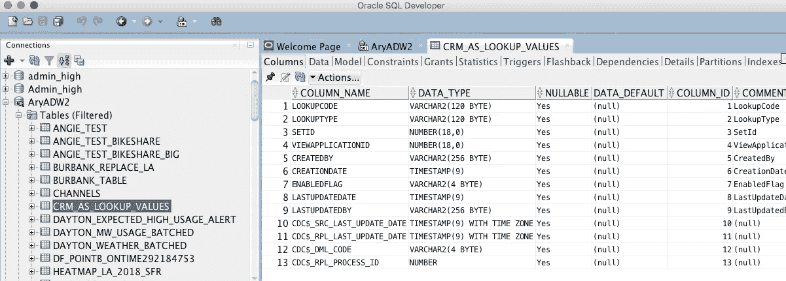

## 结论

OAC 数据复制器是一个强大的工具，允许组织利用 ADW 作为单一来源的事实和数据仓库。这种单一来源事实可以被利用来允许数据科学家利用 SaaS 应用程序数据来构建关于您的业务的几乎每个方面的预测模型。您的 ETL 和集成工程师可以利用 ADW 数据来更新其他 SaaS 应用程序，这些应用程序可能需要来自您的 SCM 应用程序或其他应用程序的数据。下一步将是利用 OAC 开箱即用的机器学习来建立 SaaS 应用数据的模型。您还可以启用您的 ADW 实例，并简单地使用 GET 请求来访问 Jupyter Notebook 或其他开源工具中的相关数据。

