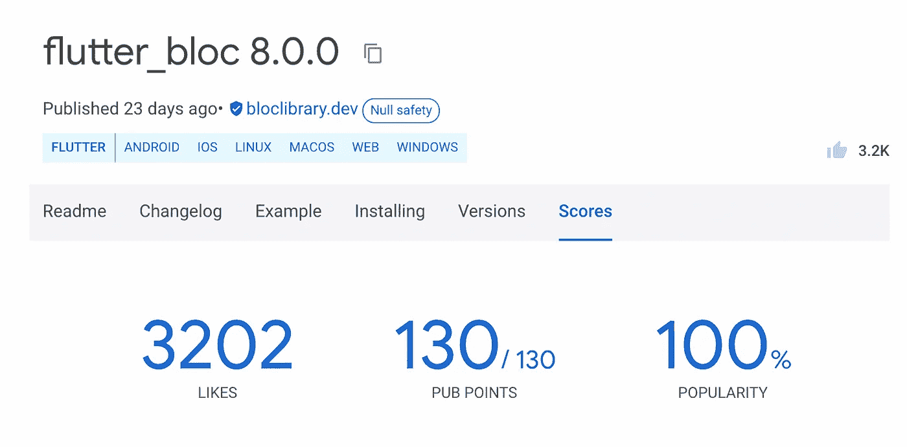

# 不应错过的 15 大包装——Flutter💙

> 原文：<https://medium.com/google-developer-experts/packages-flutter-650ec2ca29c2?source=collection_archive---------0----------------------->

## 我们钟爱的网站 [pub.dev](https://pub.dev) 上有很多可用的软件包。但总有一些包，一个人应该检查出来，不能错过！

**最近开始学旋舞了？**你应该尝试一下 Flutter 中提供的大量软件包。这篇文章列出了 10 大软件包，将有助于你的颤振之旅。

## 1. [http](https://pub.dev/packages/http)

http 是一个包，您几乎会在所有的项目中使用它。它有助于创建 HTTP 请求(get、post、put 等)和处理数据。这个包主要用于 API 调用，并且是用于该任务的最常见和最简单的包。

## 2.[迪奥](https://pub.dev/packages/dio)

Dio 是另一个广泛用于 API 调用的包。它是在 http 包之上创建的。它提供了 http 包的功能和一些额外的功能，如下载、拦截器、cookie 管理器、处理错误等。

## 3.[供应商](https://pub.dev/packages/provider)

Provider 是 Flutter 团队推荐的使用最广泛、最简单的状态管理技术之一。一旦您熟悉了 Provider，还有许多其他的状态管理包可供您使用。

## 5.[颤振 _ 阻塞](https://pub.dev/packages/flutter_bloc)

继 Provider 之后，bloc 是另一种广泛使用的状态管理技术，也用于生产级应用程序。它是在提供者之上创建的，基于事件和状态的概念。

## 6. [riverpod](https://pub.dev/packages/riverpod)

Riverpod 也是广泛使用的状态管理包之一，它在编译时而不是运行时捕捉编程错误，删除监听/组合对象的嵌套，并确保代码是可测试的。

## 7.[设备 _ 预览](https://pub.dev/packages/device_preview)

device_preview 提供了丰富的功能，可以在各种设备上检查您的应用程序，并了解您的应用程序在不同屏幕尺寸上的外观！

## 8.[颤动 _ 颤动](https://pub.dev/packages/flutter_lints)

不管你在哪里申请，规则总是很重要的！在发展中同样重要。flutter_lints 包允许你定义规则，这样你或者你的团队可以有一个更好的编码标准。

## 9.[谷歌 _ 字体](https://pub.dev/packages/google_fonts)

这个软件包帮助你为你的文本提供不同的字体系列和样式。另一种方法是下载字体系列文件，将其添加到 assets，然后将其添加到 pubspec.yaml。另一方面，google_fonts 将帮助您在任何需要的地方更改文本的字体，而无需任何额外的工作！

## 12.[缓存 _ 网络 _ 图像](https://pub.dev/packages/cached_network_image)

您总是会遇到需要显示来自任何 URL 的图像的情况。这个包可以帮助你缓存从 URL 获取的图片，这样下次你就可以显示图片的相同实例，而不用花太多时间来加载。

## 11.[路径 _ 提供者](https://pub.dev/packages/path_provider)

path_provider 也是使用最广泛的包之一，它允许您获取文件系统上最常用的位置。

## 12.[共享 _ 偏好](https://pub.dev/packages/shared_preferences)

这个包允许您将少量数据(非关键数据)存储到平台的持久存储中。

## 13. [sqflite](https://pub.dev/packages/sqflite)

SQFLite 是一个包，它允许您将数据存储在本地系统中您想要的任何路径。它提供了基于 SQL 的查询和函数来完成任务。

## 14. [url_launcher](https://pub.dev/packages/url_launcher)

url_launcher 是一个包，允许你通过你的 Flutter 应用程序启动不同的 url。你也可以用这个把用户转移到短信、WhatsApp、电话、邮件等。服务！

## 15. [webview_flutter](https://pub.dev/packages/webview_flutter)

这个包允许你打开一个应用内浏览器，并在浏览器中加载一个网页。

希望你喜欢这篇文章🎉！

**还有很多你可能会觉得有用的包。请随意回复文章中的链接！**

# 🤝不要忘记通过以下方式与我联系:

*   [**Instagram**](https://www.instagram.com/abhishekdoshi26/)
*   [**推特**](https://twitter.com/AbhishekDoshi26)
*   [**领英**](https://www.linkedin.com/in/AbhishekDoshi26)
*   [**GitHub**](https://github.com/AbhishekDoshi26)

> 不要停止，直到你呼吸！💙
> -阿布舍克·多希