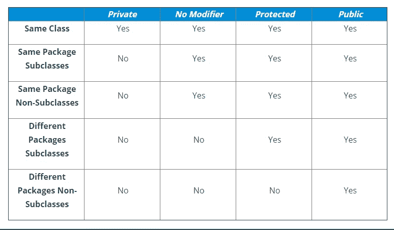

# Java 中的包:如何在 Java 中创建和使用包？

> 原文：<https://medium.com/edureka/packages-in-java-edureka-7afdd58f9f33?source=collection_archive---------2----------------------->


Java 中最具创新性的包之一是封装一组类、接口、枚举、注释和子包的方法。从概念上讲，您可以将 java 包想象成类似于您计算机上的不同文件夹。在本教程中，我们将在 Java 的特性中介绍包的基本概念。Java。

下面列出了本文涉及的主题:

1.  Java 中的 Package 是什么？

2.内置软件包

3.用户定义的包

*   用 Java 创建包
*   在 Java 包中包含一个类
*   导入另一个包时在包内创建类
*   导入类时使用完全限定名

4.Java 中的静态导入

5.Java 包中的访问保护

6.要记住的要点

# Java 中的 Package 是什么？

Java 包是一种基于功能将相似类型的类、接口和子类组合在一起的机制。当软件用 Java 编程语言编写时，它可以由数百个甚至数千个单独的类组成。通过将相关的类和接口放入包中来组织事物是有意义的。

编码时使用包有很多好处，比如:

*   可重用性:包含在另一个程序的包中的类可以很容易地被重用
*   帮助我们唯一地标识一个类，例如，我们可以有**名称冲突:**包*公司.销售.雇员*和*公司.营销.雇员*类
*   **受控访问:**提供访问保护，如保护类、默认类和私有类
*   数据封装:它们提供了一种隐藏类的方法，防止其他程序访问仅供内部使用的类
*   **维护:**有了包，您可以更好地组织您的项目，并轻松定位相关的类

用 Java 编码时使用包是一个好习惯。作为一名程序员，您可以很容易地找出相关的类、接口、枚举和注释。在 java 中我们有两种类型的包。

# Java 中的包类型

根据包是否由用户定义，包分为两类:

1.  内置软件包
2.  用户定义的包

# 内置软件包

内置包或预定义包是那些作为 JDK (Java 开发工具包)的一部分来简化 Java 程序员任务的包。它们由大量预定义的类和接口组成，是 Java API 的一部分。常用的内置包有 java.lang、java.io、java.util、java.applet 等。下面是一个使用内置包的简单程序。

```
**package** Edureka;**import** java.util.ArrayList;**class** BuiltInPackage {
**public** **static** **void** main(String[] args) {
ArrayList<Integer> myList = **new** ArrayList<>(3);myList.add(3);
myList.add(2);
myList.add(1);System.out.println("The elements of list are: " + myList);
}
}
```

**输出:**

```
The elements of list are: [3, 2, 1]
```

ArrayList 类属于 java.util 包。要使用它，我们必须使用 import 语句导入包。第一行代码*import java.util . ArrayList*导入 Java . util 包并使用子包 util 中的 ArrayList 类。

# 用户定义的包

用户定义的包是由用户开发的包，目的是将相关的类、接口和子程序包组合在一起。在一个示例程序的帮助下，让我们看看如何创建包，在包内编译 Java 程序，并执行它们。

## 用 Java 创建包

用 Java 创建一个包是一件非常容易的事情。为包选择一个名称，并在 Java 源文件中包含一个*包*命令作为第一条语句。java 源文件可以包含您想要包含在包中的类、接口、枚举和注释类型。例如，下面的语句创建一个名为 ***MyPackage 的包。***

```
package MyPackage;
```

package 语句只是指定定义的类属于哪个包。

***注意:*** *如果省略 package 语句，类名放入缺省包中，缺省包没有名字。尽管缺省包对于短程序来说很好，但是对于实际的应用程序来说是不够的。*

## 在 Java 包中包含一个类

要在包内创建一个类，应该将包名声明为程序的第一条语句。然后将该类作为包的一部分包含进来。但是，请记住，一个类只能有一个包声明。这里有一个简单的程序来理解这个概念。

```
**package** MyPackage;**public** **class** Compare {
**int** num1, num2;Compare(**int** n, **int** m) {
num1 = n;
num2 = m;
}**public** **void** getmax(){
**if** ( num1 > num2 ) {
System.out.println("Maximum value of two numbers is " + num1);
}**else** {
System.out.println("Maximum value of two numbers is " + num2);
}
}**public** **static** **void** main(String args[]) {
Compare current[] = **new** Compare[3];
current[1] = **new** Compare(5, 10);
current[2] = **new** Compare(123, 120);
**for**(**int** i=1; i < 3 ; i++)
{
current[i].getmax();
}
}
}**Output:**Maximum value of two numbers is 10 Maximum value of two numbers is 123
```

如您所见，我已经声明了一个名为 MyPackage 的包，并在该包中创建了一个类 Compare。Java 使用文件系统目录来存储包。因此，这个程序将保存在一个名为的文件中，并将存储在名为 MyPackage 的目录中。当文件被编译后，Java 会创建一个*Compare.java*和**。类**文件并将其存储在同一个目录中。请记住，包的名称必须与保存该文件的目录相同。

您可能想知道如何从另一个包的类中使用这个比较类？

## 导入另一个包时在包内创建类

嗯，很简单。你只需要导入它。导入后，您可以通过它的名称来访问它。这里有一个演示这个概念的示例程序。

```
**package** Edureka;
**import** MyPackage.Compare;**public** **class** Demo{
**public** **static** **void** main(String args[]) {
**int** n=10, m=10;
Compare current = **new** Compare(n, m);
**if**(n != m) {
current.getmax();
}
**else** {
System.out.println("Both the values are same");
}
}
}
```

**输出:**

```
Both the values are same
```

我首先声明了包 *Edureka* ，然后从包 MyPackage 中导入了类 *Compare* 。因此，当我们在一个包中创建一个类，同时导入另一个包时，

*   包装声明
*   包导入

如果您不想使用 import 语句，还有另一种方法可以从另一个包中访问这个包的类文件。在导入一个[类](https://www.edureka.co/blog/java-tutorial/#obj)时，你可以只使用完全限定名。

## 导入类时使用完全限定名

这里有一个例子来理解这个概念。我将使用我之前在博客中声明的同一个包，*我的包*。

```
**package** Edureka;
**public** **class** Demo{
**public** **static** **void** main(String args[]) {
**int** n=10, m=11;
//Using fully qualified name instead of import
MyPackage.Compare current = **new** MyPackage.Compare(n, m);
**if**(n != m) {
current.getmax();
}
**else** {
System.out.println("Both the values are same");
}
}
}
```

**输出:**

```
Maximum value of two numbers is 11
```

在演示类中，我没有导入包，而是使用了一个完全限定名，比如 *MyPackage。比较*来创建它的对象。既然我们在讨论导入包，那么你也可以看看 Java 中静态导入的概念。

# Java 中的静态导入

静态导入特性是从版本 5 开始在 [Java](https://www.edureka.co/blog/what-is-java/) 中引入的。它方便了 Java 程序员直接访问类的任何静态成员，而无需使用完全限定名。

```
**package** MyPackage;**import** **static** java.lang.Math.*; //static import**import** **static** java.lang.System.*;// static import**public** **class** StaticImportDemo {**public** **static** **void** main(String args[]) {**double** val = 64.0;**double** sqroot = sqrt(val); // Access sqrt() method directlyout.println("Sq. root of " + val + " is " + sqroot);//We don't need to use 'System.out}}**Output:**Sq. root of 64.0 is 8.0
```

尽管使用静态导入涉及较少的编码，过度使用它可能会使程序不可读和不可维护。现在让我们进入下一个主题，包中的访问控制。

# Java 包中的访问保护

您可能知道 Java 的访问控制机制及其访问说明符的各个方面。Java 中的包为访问控制增加了另一个维度。类和包都是[数据封装](https://www.edureka.co/blog/encapsulation-in-java/)的手段。包充当类和其他从属包的容器，而类充当数据和代码的容器。由于包和类之间的这种相互作用，Java 包解决了类成员可见性的四个类别:

*   同一包中的子类
*   同一包中的非子类
*   不同包中的子类
*   既不在同一个包中也不在子类中的类

下表给出了在 Java 中使用包时，哪种类型的访问是可能的，哪种类型的访问是不可能的真实情况:



我们可以将上表中的数据简化如下:

1.  任何公开的东西都可以从任何地方访问
2.  任何声明为私有的东西只能在那个类中看到
3.  如果没有提到访问说明符，那么一个元素对于子类和同一个包中的其他类都是可见的
4.  最后，任何声明的 protected 元素都可以在当前包之外看到，但是只能在直接继承你的类的类中看到

这样，Java 包提供了对类的访问控制。好了，这总结了 Java 中的包的概念。这里有一些你在使用 [Java](https://www.edureka.co/blog/java-tutorial/) 中的包时应该记住的要点。

# 要记住的要点

*   每个类都是某个包的一部分。如果省略 package 语句，类名将放入缺省包中
*   一个类只能有一个 package 语句，但可以有多个 import package 语句
*   包的名称必须与保存文件的目录相同
*   当导入另一个包时，包声明必须是第一个语句，然后是包导入

好了，这就把我们带到了这篇“Java 中的包”文章的结尾。我们学习了什么是软件包以及为什么我们应该使用它们。毫无疑问，对于高效的 java 程序员来说，Java 包是最重要的部分之一。它不仅升级了程序员的编码风格，还减少了许多额外的工作。如果你想查看更多关于人工智能、DevOps、道德黑客等市场最热门技术的文章，你可以参考 Edureka 的官方网站。

请留意本系列中的其他文章，它们将解释 Java 的各个方面。

> *1。* [*面向对象编程*](/edureka/object-oriented-programming-b29cfd50eca0)
> 
> *2。*[*Java 中的继承*](/edureka/inheritance-in-java-f638d3ed559e)
> 
> *3。*[*Java 中的多态性*](/edureka/polymorphism-in-java-9559e3641b9b)
> 
> *4。*[*Java 中的抽象*](/edureka/java-abstraction-d2d790c09037)
> 
> *5。* [*Java 字符串*](/edureka/java-string-68e5d0ca331f)
> 
> *6。* [*Java 数组*](/edureka/java-array-tutorial-50299ef85e5)
> 
> *7。* [*Java 收藏*](/edureka/java-collections-6d50b013aef8)
> 
> *8。* [*Java 线程*](/edureka/java-thread-bfb08e4eb691)
> 
> *9。*[*Java servlet 简介*](/edureka/java-servlets-62f583d69c7e)
> 
> *10。* [*Servlet 和 JSP 教程*](/edureka/servlet-and-jsp-tutorial-ef2e2ab9ee2a)
> 
> *11。*[*Java 中的异常处理*](/edureka/java-exception-handling-7bd07435508c)
> 
> *12。* [*Java 教程*](/edureka/java-tutorial-bbdd28a2acd7)
> 
> 13。 [*Java 面试题*](/edureka/java-interview-questions-1d59b9c53973)
> 
> 14。 [*Java 程序*](/edureka/java-programs-1e3220df2e76)
> 
> *15。*[*kot Lin vs Java*](/edureka/kotlin-vs-java-4f8653f38c04)
> 
> *16。* [*依赖注入使用*](/edureka/what-is-dependency-injection-5006b53af782)
> 
> 17。 [*堪比 Java 中的*](/edureka/comparable-in-java-e9cfa7be7ff7)
> 
> 18。 [*十大 Java 框架*](/edureka/java-frameworks-5d52f3211f39)
> 
> 19。 [*Java 反射 API*](/edureka/java-reflection-api-d38f3f5513fc)
> 
> *20。*[*Java 中的前 30 个模式*](/edureka/pattern-programs-in-java-f33186c711c8)
> 
> *21。* [*核心 Java 备忘单*](/edureka/java-cheat-sheet-3ad4d174012c)
> 
> *22。*[*Java 中的套接字编程*](/edureka/socket-programming-in-java-f09b82facd0)
> 
> *23。* [*Java OOP 备忘单*](/edureka/java-oop-cheat-sheet-9c6ebb5e1175)
> 
> *24。*[*Java 中的注释*](/edureka/annotations-in-java-9847d531d2bb)
> 
> *25。*[*Java 中的库管理系统项目*](/edureka/library-management-system-project-in-java-b003acba7f17)
> 
> *26。*[*Java 中的树木*](/edureka/java-binary-tree-caede8dfada5)
> 
> *27。*[*Java 中的机器学习*](/edureka/machine-learning-in-java-db872998f368)
> 
> *28。* [*顶级数据结构&Java 中的算法*](/edureka/data-structures-algorithms-in-java-d27e915db1c5)
> 
> *29。* [*Java 开发者技能*](/edureka/java-developer-skills-83983e3d3b92)
> 
> *三十。* [*前 55 名 Servlet 面试问题*](/edureka/servlet-interview-questions-266b8fbb4b2d)
> 
> 31。 [](/edureka/java-exception-handling-7bd07435508c)[*顶级 Java 项目*](/edureka/java-projects-db51097281e3)
> 
> *32。* [*Java 字符串备忘单*](/edureka/java-string-cheat-sheet-9a91a6b46540)
> 
> *33。*[*Java 中的嵌套类*](/edureka/nested-classes-java-f1987805e7e3)
> 
> 34。 [*Java 集合面试问答*](/edureka/java-collections-interview-questions-162c5d7ef078)
> 
> 35。[*Java 中如何处理死锁？*](/edureka/deadlock-in-java-5d1e4f0338d5)
> 
> 36。 [*你需要知道的 50 个 Java 合集面试问题*](/edureka/java-collections-interview-questions-6d20f552773e)
> 
> *37。*[*Java 中的字符串池是什么概念？*](/edureka/java-string-pool-5b5b3b327bdf)
> 
> *38。*[*C、C++和 Java 有什么区别？*](/edureka/difference-between-c-cpp-and-java-625c4e91fb95)
> 
> 39。[*Java 中的回文——如何检查一个数字或字符串？*](/edureka/palindrome-in-java-5d116eb8755a)
> 
> 40。 [*你需要知道的顶级 MVC 面试问答*](/edureka/mvc-interview-questions-cd568f6d7c2e)
> 
> *41。*[*Java 编程语言的十大应用*](/edureka/applications-of-java-11e64f9588b0)
> 
> *42。*[*Java 中的死锁*](/edureka/deadlock-in-java-5d1e4f0338d5)
> 
> *43。*[*Java 中的平方和平方根*](/edureka/java-sqrt-method-59354a700571)
> 
> *44。*[*Java 中的类型转换*](/edureka/type-casting-in-java-ac4cd7e0bbe1)
> 
> *45。*[*Java 中的运算符及其类型*](/edureka/operators-in-java-fd05a7445c0a)
> 
> *46。*[*Java 中的析构函数*](/edureka/destructor-in-java-21cc46ed48fc)
> 
> *47。*[*Java 中的二分搜索法*](/edureka/binary-search-in-java-cf40e927a8d3)
> 
> *48。*[*Java 中的 MVC 架构*](/edureka/mvc-architecture-in-java-a85952ae2684)
> 
> 49。 [*冬眠面试问答*](/edureka/hibernate-interview-questions-78b45ec5cce8)

*原载于 2019 年 6 月 24 日*[*https://www.edureka.co*](https://www.edureka.co/blog/packages-in-java/)*。*