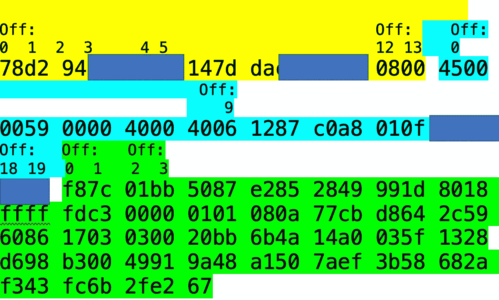
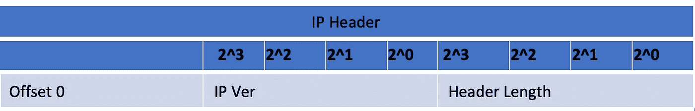

# 数据包分析

> 原文：<https://medium.com/walmartglobaltech/packet-analysis-c5ea5e101048?source=collection_archive---------3----------------------->

阅读十六进制，使用 BPF 和更多

Photo credit: Pixabay/Gerd Altmann

阅读和筛选数据包捕获的能力是一项基本技能，有助于快速有效地排除故障和隔离问题。这篇文章快速浏览了一下以太网、TCP 和 IP 报头，介绍了 BPF，最后通过将我们所学的知识与 Unix/Linux 附带的一些 CLI 工具结合起来，尝试解决一个问题陈述。

在我们开始讨论标题之前，我们需要了解一些术语:

1 个十六进制字符= 4 位

半字节= 4 位

字节= 8 位

字= 16 位

双字= 32 位= 4 字节

# 头球

标题字段使用它们的偏移量来引用。偏移编号总是从 0 开始，每个数字代表 1 个字节。例如，以太网报头的长度为 14 个字节，偏移量从 0 到 13，6 个字节的目的 MAC 地址占用偏移量 0 到 5。

# 以太网报头

以太网报头长 14 字节，包含目的 MAC、源 MAC 和以太网类型字段。

以太类型字段标识遵循以太网的封装协议。一些常见的以太网类型值包括 IPv4 的“0x0800”、VLAN 的“0x8100”和 ARP 的“0x0806”。

*   以太网报头之后是有效载荷(最大 1500 字节)和用于检测帧损坏的 4 字节 CRC。这使得以太网帧的总长度为 1518 字节。

# IPv4 标头

IP 负责在互联网上传送数据包。这是一种不可靠的协议，它不努力保证数据包的传送。可靠传输是传输层(或应用程序本身)的工作，检测并重新传输丢失的数据包。IP 报头字段包括:

IP 版本:识别 IP 版本的 4 位字段。

报头长度:用双字表示 IP 报头的长度。例如，如果这里的数字是 5，它意味着 5 个双字，也就是 5×4 字节，总标题长度为 20 字节。事实上，IP 报头至少有 20 个字节长，如果使用选项，可以达到 60 个字节。为什么是 60 字节？因为，头长 4 位，二进制最大值是 1111，十进制是 15。所以，15*4 = 60 字节。

DSCP 和 ECN: 6 位差异化服务代码点(DSCP)允许对流量类型进行分类，并为特定类型的流量(如语音)提供网络优先级。2 位显式拥塞通知(ECN)允许路由器检测和管理网络上的拥塞情况。ECN 位与 TCP 报头中的拥塞窗口缩减(CWR)和 ECN 标志一起工作。

总长度:该字段表示 IP 数据包的总长度，即 IP 报头、传输报头和有效载荷。

IP ID:这是分配给每个新数据包的随机数。IP ID 字段通常只在我们处理碎片化的 IP 数据包时才成为焦点。

碎片位:3 个高位表示保留(X)，不碎片化(D)和更多碎片跟随(M)。13 个低阶位表示分段在分段 IP 数据包中的位置。

生存时间:TTL 确保数据包不会漫无目的地存在于网络中。数据包每经过一跳，TTL 就会减少 1。当数据包的 TTL 为 0 时，它将被丢弃。traceroute 是使用最广泛的故障排除工具之一，它使用 TTL 来确定网络路径上的路由器/跳数。

协议:该域标识嵌入式协议，其中最常见的值是 0x06 (TCP)、0x01 (ICMP)和 0x11 (UDP)。

校验和:帮助识别传输中损坏的数据包。接收主机应该默默地丢弃校验和无效的数据包。

源地址和目的地址:这是 32 位字段，分别位于偏移量 12–15 和 16–19。

选项:IP 选项最初旨在帮助排除故障，如果使用，会将 IP 报头大小扩展到 20 字节以上。一些 IP 选项包括严格源路由(SSR)和宽松源路由(LSR)。

# TCP 报头

TCP 负责提供可靠和有保证的数据包传输，这是 IP 所不能做到的。让我们快速看一下 TCP 报头。

源端口和目的端口:16 位字段，占据 TCP 报头的 0-3 个偏移量。源端口通常大于 1024，目的端口是指服务器正在等待连接的服务/应用程序，例如 SSL 的 443 或 HTTP 的 80。

序列号:序列号允许单个 TCP 流中的多个数据段在目的地正确排序。它的值随着有效载荷中字节数的增加而增加，因此另一种思考方式是，它允许计算在连接中流动的数据量。

确认号:目的地通过向发送方发送响应来确认接收到的数据，响应中设置了 ACK 标志和一个数字，该数字的值为接收数据段中的数据量+序列号。那就是:

确认号=(接收的数据量)+序列号。

序列号和确认号共同作用，使 TCP 成为可靠的协议，知道有多少数据已到达目的地，哪些数据丢失，需要重新传输。

报头长度:这用双字表示 TCP 报头长度。因为双字是 4 个字节，所以将该字段中的数字乘以 4 可以得到 TCP 报头的字节数。

标志:占用 offset13，TCP 可以打开或关闭标志位来表示各种信号。一个快速记住旗帜的方法是记忆法“U(rg)ns killed A(CK)ttackers P(ush)ester R(ST)eal S(yn)security F(in)olk”。以下是按照记忆顺序对这些标志的快速解释。

紧急:URG 标志表示紧急指针字段有效。

确认:ACK 表示确认字段中的值有效。在正常的通信流中，在初始 SYN 之后，ACK 标志总是被设置。

推送:PSH 标志指示接收主机立即将其 TCP 缓冲区中的数据刷新到接收进程/应用程序。

Reset: Rst 标志用于突然结束连接，例如，当主机在非监听端口上收到连接请求时，接收主机不做任何处理，而是将 Reset 标志发送回请求主机。

同步:当主机想要建立新的连接时，使用 SYN 标志。发起主机和目的主机都使用各自独立的 SYN 来建立相互连接。SYN 标志计为一个字节。

完成:当连接正常终止时，使用 FIN 标志。像 SYN 一样，连接的两端都发送单独的 FIN，并且像 SYN 一样，FIN 也算作一个字节。

显式拥塞通知回应(ECE):该位打开，通知发送主机降低数据发送速率。

拥塞窗口减少(CWR):当发送主机从接收方接收到设置了 ECE 位的数据段时，发送主机将其发送缓冲区减少一半，并设置 CWR 标志以指示已采取纠正措施。

IP 报头的 ECN 位和 TCP 报头的 ECE 和 CWR 位一起使用，以指示拥塞通知的存在(在 3 次 TCP 握手期间)和以后的支持。

窗口大小:接收主机用来向发送主机通知其缓冲区大小的动态流量控制机制。当接收主机的 TPC 缓冲区开始变满时，窗口大小变小。

校验和:TCP 使用由源 IP 地址和目的 IP 地址组成的伪报头，作为额外的检查，以确保主机没有收到发往不同主机的数据包。TCP 校验和仅由通信端点/主机验证。

紧急指针:与 URG 标志一起使用，表示当前序列号与该字段中的值之间的数据应在主机缓冲区中的任何其他数据之前立即处理。即紧急指针指示紧急数据结束的字节偏移。

选项:与 IP 选项不同，TCP 选项被广泛使用。使用的一些常见选项包括:最大数据段大小(MSS ),用于指示主机可以发送的最大有效负载大小；选择性确认(SACK ),用于确认非连续字节的数据；窗口比例，用于允许主机增加其接收缓冲区。

# 读取十六进制

Photo credit: Pixabay/Christoph Schutz

这是一个十六进制包的例子。让我们利用所提供的标题/偏移信息确定一些参数，并尝试一些十六进制到十进制的转换。

黄色突出显示的部分代表以太网报头。

*   数据包的前 6 个字节代表目的 MAC 地址，后面是源 MAC 地址。
*   以太网帧“0x0800”的最后 2 个字节(即偏移量 12，13)表示封装的协议是 IP

接下来是以蓝色突出显示的 IP 报头。

*   偏移量 0 表示 IP 版本和报头长度。在这个数据包中，IP 版本是 v4，报头长度是 20 字节(5*4 双字)。因此，该数据包中不使用 IP 选项。
*   偏移量 9 处的 IP 协议字段的值‘0x 06’表示 TCP。

在 20 字节的 IP 报头之后，TCP 报头以绿色突出显示。

*   偏移量 2 和 3 包含十六进制的目的端口号‘0x 01 bb’。十六进制是以 16 为基数的计数系统。为了将其转换为十进制，我们将 16 提升到每个十六进制字符的位置，并乘以相应的十六进制字符。然后求和得到十进制的结果。
*   这看起来如下:

> (16 x 0) + (16 x 1 ) + (16 x b) + (16⁰ x b)
> 
> = 0 + 256 + (16x11) + (1x11)
> 
> = 443

让我们使用来自 Wireshark 的同一个数据包的屏幕截图来证实我们的数据包演练:

# 伯克利分组过滤器(BPF)

BPF 是一种架构和机制，旨在允许在网络数据包到达应用程序的途中对其进行过滤，并尽早丢弃不需要的数据包[1]。Tcpdump 是一个使用 BPF 来实现过滤功能的工具的例子[2]。BPF 现在引入了额外的功能来扩展内核功能，允许跨网络、安全、分析和监控创建新的应用程序[3]。与此相关的是，为了更详细地了解扩展 BPF (eBPF)的令人兴奋的应用，请看沃尔玛的 L3AF 项目[这里](/walmartglobaltech/introducing-walmarts-l3af-project-how-do-we-use-ebpf-to-provide-network-visibility-in-a-8b9ae4d26200)。

通过对 BPF 的快速介绍，让我们看看如何将表达式放在一起，以帮助更好地分析数据包捕获。

# BPF 格式

我们可能已经熟悉的格式，使用表达式根据关键字(如协议、端口、网络以及它们的组合)来过滤流量。例如，' icmp '，' udp 端口 53 '，' net x.x.x.0/24 '。

> 语法:tcpdump<keyword></keyword>
> 
> tcpdump -r demo.pcap -ntc1 'dst 端口 443 '
> 
> IP 192 . 168 . 1 . 1 . 52255 > 40 . 103 . 10 . 38 . 443:标志[。]，序列号 2667572664:2667574014，ack 3107627624，win 4096，长度 1350

如果我们想更深入地挖掘，例如，只找到设置了 SYN 标志的 TCP 包，该怎么办？从协议报头中，我们可以使用偏移值来查找所需的字段。考虑下面的例子——这里我们要求 tcpdump 查找 TCP 的第 13 个偏移量(即标志字段)中的值，其中值为“2”。

> 语法:tcpdump<protocol><length is="" optional=""><relation><value></value></relation></length></protocol>
> 
> TCP dump-r demo . pcap-NTC 1 ' TCP[13]= 0x 02 '
> 
> IP 192 . 168 . 1 . 1 . 52262 > 13 . 107 . 139 . 11 . 443:Flags[S]，seq 2517098632，win 65535，options [mss 1350，nop，wscale 6，nop，nop，TS val 35399207 ecr 0，sackOK，eol]，长度 0

我们怎么知道标志值需要是‘2’呢？

让我们仔细看看 TCP flags 字段—这是一个 1 字节的字段，用十六进制表示为 2 个字符。每个十六进制字符为 4 位长(即 1 个半字节)。每个字段的值以二进制表示为 2，自乘到标志位置的幂。2(即 2)，因此指示我们的过滤器查找设置了“Syn”标志的数据包。

# 比特屏蔽

检查正好 1 字节长的字段很简单。如果您希望查找 4 位值(例如，IP 版本)或查找特定字段而不考虑其他值，例如，查找“Syn”和“Ack”数据包而不考虑是否设置了“ECN”标志，该怎么办？

我们使用称为位屏蔽的东西，它使用逻辑 AND 运算来消除不需要的位。让我们看一个例子。

假设您想要搜索使用选项的 IP 数据包，即 IP 报头大小大于标准的 20 字节。IP 报头值位于 IP 报头偏移量 0 的低位半字节:

因为“报头长度”表示双字的数量，所以该字段中的值 5 表示 20 字节的 IP 报头(即，5 * 4 双字)。由于 IP 版本和报头长度共同占据一个偏移字段(即 1 字节)，我们必须在表达式中包含这两个字段。例如，ip[0] > 0x45 会过滤数据包大小大于 20 字节的 IPv4 数据包。ip[0] > 0x75 怎么样？这将不起作用，因为值 7(不正确的 IP 版本号)将排除所有 IPv4 数据包。

因此，解决方案是以某种方式消除 IP 版本值。输入位屏蔽。

考虑典型 IPv4 数据包中的 IP 版本和报头长度字段。

接下来，考虑我们想要的版本和头长度值。

接下来，我们必须选择一个合适的位屏蔽，当它与 offset 0 中的值进行逻辑“与”运算时，会产生我们想要的输出。当两个值都为真时，逻辑 AND 返回真(即 1)，否则返回假(即 0)。换句话说，在掩码位中使用 0 来消除值，使用 1 来保留值。

十六进制的掩码值 0000 1111–0x0f 怎么样？

让我们将该掩码值与典型 IPv4 数据包的偏移量 0 中的值进行 AND 运算。我们发现我们得到了所需的值 0000 0110，即十六进制的 0x05。

最后，我们的 BPF 表达式仅过滤使用 IP 选项的数据包(即，报头大小大于 20 字节)，是“ip[0] & 0x0f > 0x05”。

类似地，用于过滤具有‘Syn’和‘Ack’字段的分组的掩码，不管其他标志并且没有‘ECN’，将是‘0011 1111(十六进制的 0x3f)’,并且对应的 BPF 表达式将是‘TCP[13]& 0x3f = 0x 12’。

# 把所有的放在一起

假设您拥有一个大型数据包捕获，您想要找到所有接受连接的 IP 和监听端口。如何识别服务器是否接受连接？寻找以“Syn-Ack”回应的 IP 是一个很好的起点。

首先，我们可以使用“Editcap”将分析范围缩小到特定的时间范围。例如:

> edit cap-A " 2021–12–27 15:05:11 "-B " 2021–12–27 15:05:12 " demo . pcap demo-extract . pcap

Capinfos 是一个帮助显示关于捕获文件元数据的工具。使用此工具验证文件大小，我们观察到原始文件为 12MB，提取的文件大小为 973kB。

> capinfos demo.pcap | grep 大小
> 
> 文件大小:12MB
> 
> capiinfos demo-extract . pcap | grep size
> 
> 文件大小:973kB

现在让我们使用 tcpdump 和我们之前构建的 BPF 表达式来过滤设置了“Syn”和“Ack”的数据包。(注意，tcpdump 中的‘Ack’表示为一个句点。)

> TCP dump-r demo . pcap-nt ' TCP[13]& 0x3f = 0x 12 '

我们得到了我们的输出，尽管格式冗长而笨拙。更别说还有接近 200+的线。让我们看看是否可以调整这个输出。

在基于 Unix/Linux 的系统中，我们可以通过管道将一个工具的输出作为另一个工具的输入——您从“|”左边的工具获取输出，并将其作为输入传递给右边的工具。这里，我们将 tcpdump 的输出作为 Cut 的输入。

使用剪切工具，我们可以将输出视为列，在这种情况下，我们将'>'视为分隔符，只提取第一列。

> TCP dump-r demo . pcap-nt ' TCP[13]& 0x3f = 0x 12 ' | cut-d ' > '-f1

让我们也从输出中删除字母“IP”。现在，我们使用一个空格“”作为分隔符，并匹配第 2 列。

> TCP dump-r demo . pcap-nt ' TCP[13]& 0x3f = 0x 12 ' | cut-d ' > '-f1 | cut-d ' '-F2

这是一个更清晰的输出，但是我们仍然有 200 多行要处理。我们通过 sort 和 uniq 传递输出，得到只有 11 行的输出。

> TCP dump-r demo . pcap-nt ' TCP[13]& 0x3f = 0x 12 ' | cut-d ' > '-f1 | cut-d ' '-F2 | sort-V | uniq

最终输出是可管理的唯一 IP 和端口列表，这些 IP 和端口正在主动侦听和接受连接。您的环境中有这么多 web 服务器吗？运行在临时端口 59456 上的服务是有意的吗？您的组织知道吗？

# 结论

我们快速浏览了一些重要的协议报头，介绍了 BPF，并演示了如何使用内置的 CLI 工具将冗长的输出变成清晰、易于管理的输出。本文只是触及了 TCP/IP 报头和包分析的皮毛。

对于已经了解所讨论主题的人来说，希望这是一个很好的复习。对于其他人，希望你学到了一些新东西，可以在工作中用于分析/故障排除任务。请让我知道你对内容的想法。

# 参考

1.[https://www.tcpdump.org/papers/bpf-usenix93.pdf](https://www.tcpdump.org/papers/bpf-usenix93.pdf)

2.https://lwn.net/Articles/437981/

3.[https://www . brendang regg . com/bpf-performance-tools-book . html](https://www.brendangregg.com/bpf-performance-tools-book.html)

4.SANS SEC503 — GCIA

5.TCP/IP 指南— Charles M. Kozierok

6.https://www.wireshark.org/docs/man-pages/editcap.html

7.首都信息—【https://www.wireshark.org/docs/man-pages/capinfos.html 