# Panduan Menulis yang Baik Layaknya Professional di Medium

> 原文：<https://medium.easyread.co/panduan-menulis-yang-baik-layaknya-professional-di-medium-ad5aa22c6ddc?source=collection_archive---------0----------------------->

## Beberapa life hack sederhana yang akan membantu kamu saat menulis di Medium


Photo by [Kaitlyn Baker](https://unsplash.com/photos/vZJdYl5JVXY?utm_source=unsplash&utm_medium=referral&utm_content=creditCopyText) on [Unsplash](https://unsplash.com/search/photos/writing?utm_source=unsplash&utm_medium=referral&utm_content=creditCopyText)

Ketika kita menulis sebuah artikel tentu saja tujuan yang ingin kita capai adalah bagaimana menyampaikan pemikiran dan informasi yang kita ketahui melalui tulisan ke banyak orang secara tepat. Kita tentu tidak ingin orang lain merasa kesulitan saat membaca artikel yang kita tulis atau menghentikan mereka untuk membaca artikel tersebut.

*Nah* kali ini, *Easyread* akan membagikan beberapa tips sederhana yang mungkin dapat membantu kamu menulis artikel. Tips ini sendiri digunakan oleh editor *Easyread* sebagai pacuan saat me- *review* tulisan yang akan di *publish.* Selain itu meskipun tips ini mengacu kepada Medium, namun kamu juga dapat menerapkan beberapa tips disini saat menulis di media selain Medium.

## Memilih Topik

Sebelum menulis kita tentu akan memikirkan terlebih dahulu topik apa yang hendak kita sampaikan. Topik inilah yang nanti kita kembangkan menjadi tulisan kita. Tetapi seringkali kita malah kesulitan memilih topik yang akan kita sampaikan. Terkadang kita berpikir topik yang kita sampaikan terlalu umum, terlalu biasa, atau kita malah berpikir *“ah, kalau tulisanku seperti ini, siapa yang akan baca, kan sudah banyak orang yang tahu topik ini”* . Sebuah tulisan yang menarik memang biasanya membawa topik yang baru, masih hangat, dan belum banyak dibahas. Hal ini pastinya membuat kamu tertantang untuk membuat tulisan mengenai topik tersebut sehingga pembaca tulisan kamu akan berdatangan. Tetapi alasan kita menulis tidak hanya sekadar menyampaikan informasi kepada orang lain, tetapi juga dapat bermanfaat kepada diri kita sendiri. Semakin banyak kita menulis, maka semakin mahir juga kita dalam menyampaikan kata-kata.

Kita boleh menulis apapun yang kita suka. Diawali dari hal-hal kecil, baru, atau apa yang kita pelajari hari ini. Jangan khawatir siapa yang akan membaca tulisanmu.

## Memakai Judul yang Ringkas

Setelah menemukan topik yang akan kamu tulis, langkah selanjutnya tentu memberi judul pada tulisanmu. Terkadang judul juga dapat diberikan setelah kamu selesai menulis tulisan kamu untuk mendapatkan gambaran yang lebih jelas mengenai tulisan tersebut. *Nah* , untuk itu, pergunakanlah judul yang ringkas dan tidak bertele-tele, serta menarik perhatian orang lain untuk dibaca. Jika judul yang kamu beri memang mengharuskan panjang, pastikan bukan karena kalimat yang bertele-tele. Judul yang ringkas dan menarik tentu akan membuat orang-orang penasaran dengan tulisan yang kamu buat.

## Menggunakan Tagline/Subtitle

Setelah membuat judul, akan lebih baik jika kamu menambahkan *tagline* atau *subtitle* pada tulisan kamu. *Tagline* atau *subtitle* yang kamu tambahkan biasanya berupa kalimat yang menggambarkan secara jelas isi tulisan kamu. Penambahan *tagline* dapat membantu calon pembaca artikelmu untuk mendapatkan gambaran dari isi tulisan kamu. *Tagline* juga berguna untuk melanjutkan judul kamu yang ringkas tadi. Penjelasan judul lebih baik jika ditambahkan pada *tagline* .

Contoh pembuatan subtitle/tagline yang elegan pada medium

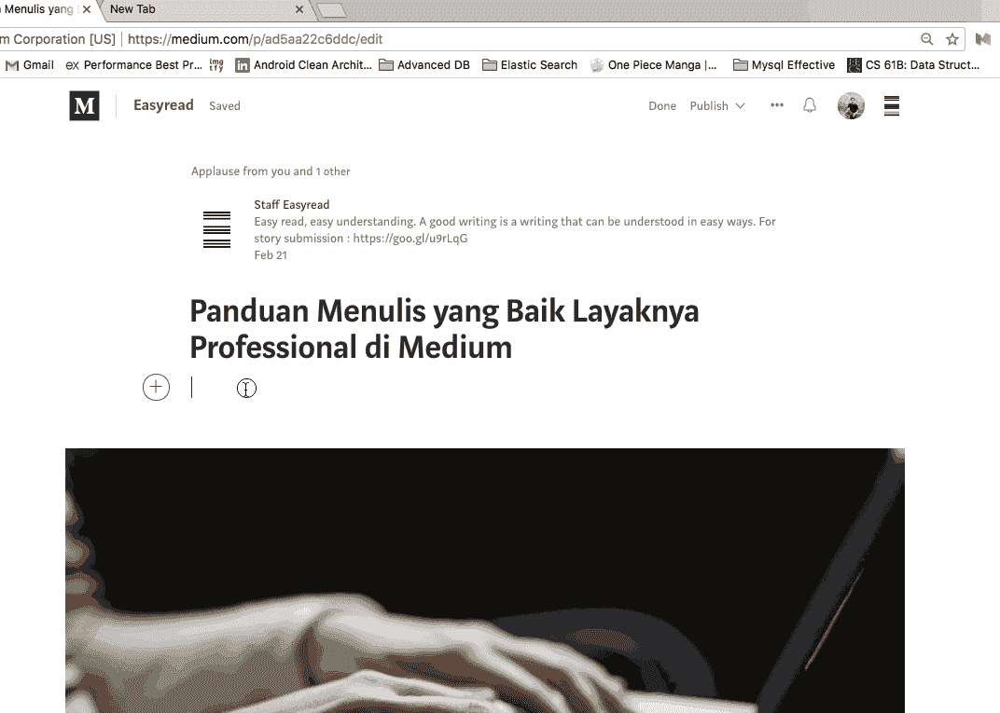

menambahkan tagline

## Menyertakan Gambar pada Tulisan

Agar tulisanmu lebih menarik dan tidak monoton, kamu boleh menyertakan gambar atau ilustrasi pada tulisanmu. Tentu saja gambar yang disertakan harus sesuai dengan tulisan. Gambar boleh berupa ilustrasi, diagram, ataupun gambar biasa.

Setelah menyertakan gambar pada tulisan, kamu harus menyertakan sumber gambar yang kamu pakai ditulisanmu. Misalnya, ketika kamu menyertakan gambar dari [*Google Image*](https://images.google.com) atau [*Unsplash*](https://unsplash.com) kamu perlu menambahkan caption pada gambar kamu tersebut. Seperti “ *Image taken from Google Images* ” atau “ *Photo by xxx on Unsplash* ”. Begitu juga dengan sumber foto lainnya.

Atau ketika kamu ingin menyampaikan ilustrasi terkait tulisanmu tetapi tidak menemukan gambar yang sesuai, kamu boleh membuat sendiri ilustrasi dan sertakan di tulisanmu. Untuk *chart* dan grafik, kamu bisa memakai [*draw.io*](https://www.draw.io) . Lakukan penempatan gambar yang sesuai agar lebih menarik.

## Menyertakan Kutipan pada Tulisan

Selain gambar, kita juga boleh menyertakan kutipan-kutipan menarik pada tulisan kita. *Nah* , untuk menyertakan kutipan pada tulisan, kamu dapat membuatnya dalam beberapa format. Misalnya dalam format *italic* atau dengan menggunakan *medium* *style* .

Untuk menggunakan *medium style* yang tentu saja dipakai saat menulis di Medium, kamu dapat mengikuti langkah-langkah berikut.
1\. Blok tulisan yang ingin di buat sebagai kutipan
2\. Pilih icon tanda kutip **(“)** pada pop-up yang muncul. Klik sekali untuk format pertama, klik dua kali untuk format kedua.

> Contoh pertama dengan satu kutip

> Contoh kedua dengan dua kutip

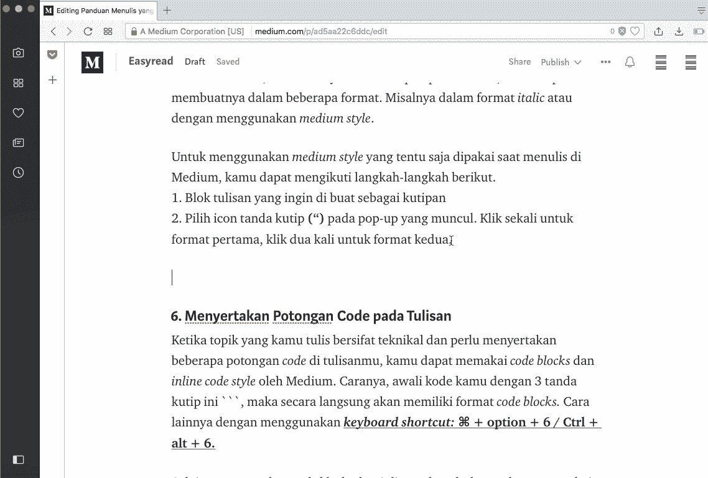

## Menyertakan Potongan Code pada Tulisan

Ketika topik yang kamu tulis bersifat teknikal dan perlu menyertakan beberapa potongan *code* di tulisanmu, kamu dapat memakai *code blocks* dan *inline code* *style* oleh Medium. Caranya, awali kode kamu dengan 3 tanda kutip ini ```, maka secara langsung akan memiliki format *code blocks.* Cara lainnya dengan menggunakan [***keyboard* *shortcut:* ⌘ + option + 6 / Ctrl + alt + 6\.**](https://help.medium.com/hc/en-us/articles/224550008-Code-blocks-inline-code)

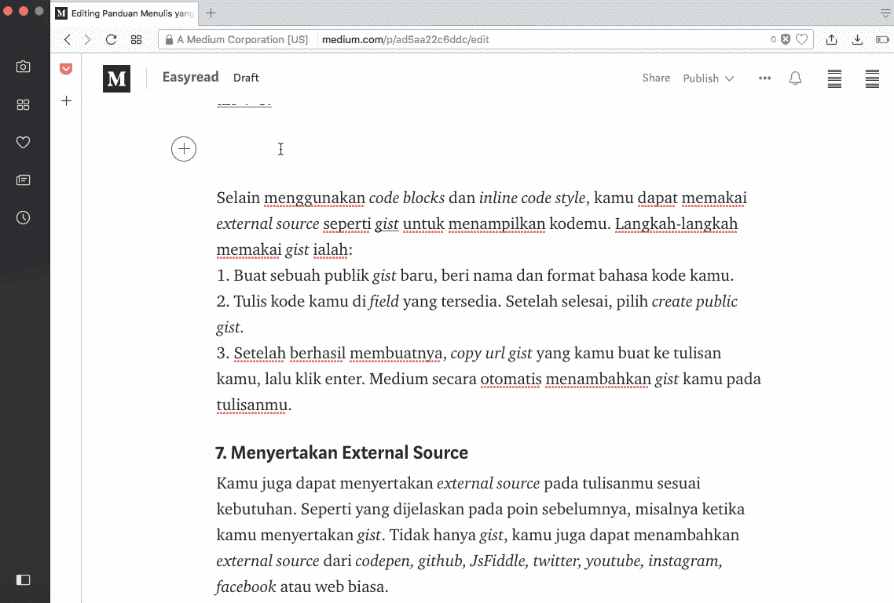

Selain menggunakan *code blocks* dan *inline code* *style* , kamu dapat memakai *external source* seperti [*gist*](https://gist.github.com) untuk menampilkan kodemu. Langkah-langkah memakai *gist* ialah:

1.  Buat sebuah publik *gist* baru, beri nama dan format bahasa kode kamu.
2.  Tulis kode kamu di *field* yang tersedia. Setelah selesai, pilih *create public gist.*
3.  Setelah berhasil membuatnya, *copy url gist* yang kamu buat ke tulisan kamu, lalu klik enter. Medium secara otomatis menambahkan *gist* kamu pada tulisanmu.

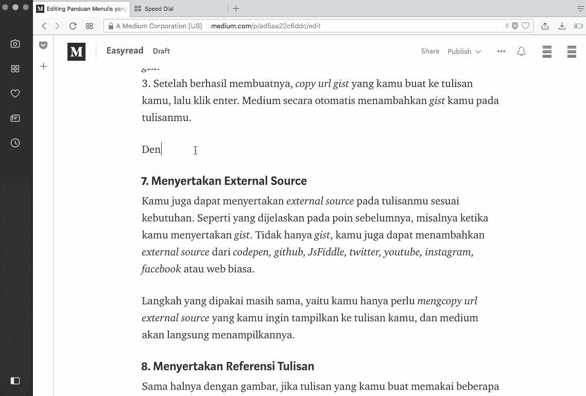

**Contoh menggunakan gist:**

gcd code

**Selain gist, kamu juga bisa menggunakan JsFiddle**

Hello world jsfiddle by afabbro

**Atau bisa juga menggunakan codepen:**

## **Menyertakan External Source**

Kamu juga dapat menyertakan *external source* pada tulisanmu sesuai kebutuhan. Seperti yang dijelaskan pada poin sebelumnya, misalnya ketika kamu menyertakan *gist* . Tidak hanya *code* kamu juga dapat menambahkan *external source* yang bukan *code* dari *twitter, youtube, instagram, facebook* atau web biasa.

Langkah yang dipakai masih sama, yaitu kamu hanya perlu *mengcopy url* *external source* yang kamu ingin tampilkan ke tulisan kamu, dan medium akan langsung menampilkannya.

**Twitter** Cara menyertakan konten dari twitter

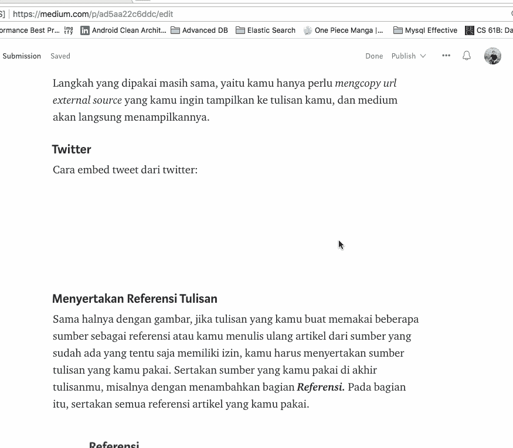

Cara Menyertakan Konten dari Twitter

Example of Tweet in Medium

**Instagram** Cara menyertakan konten dari Instagram

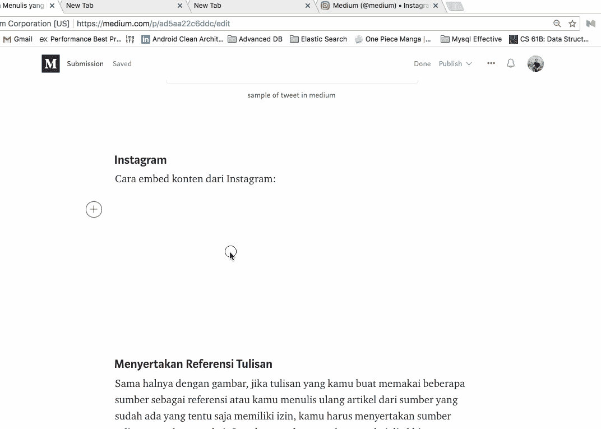

Cara Menyertakan Konten dari Instagram

Instagram Post by Medium

**Facebook** Cara menyertakan konten dari Facebook yang bersifat publik:

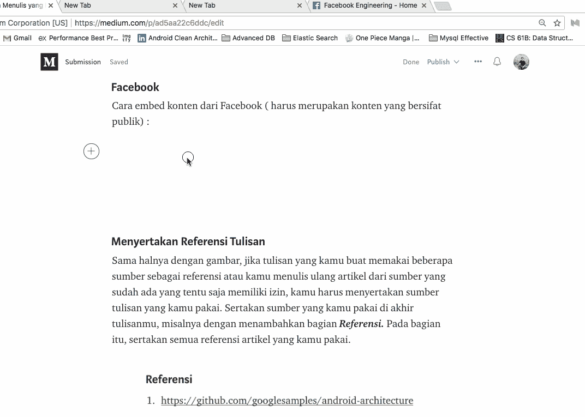

Cara Menyertakan Konten dari Facebook

Post by Facebook Engineering Page

**Youtube** Cara menyertakan video dari Youtube:

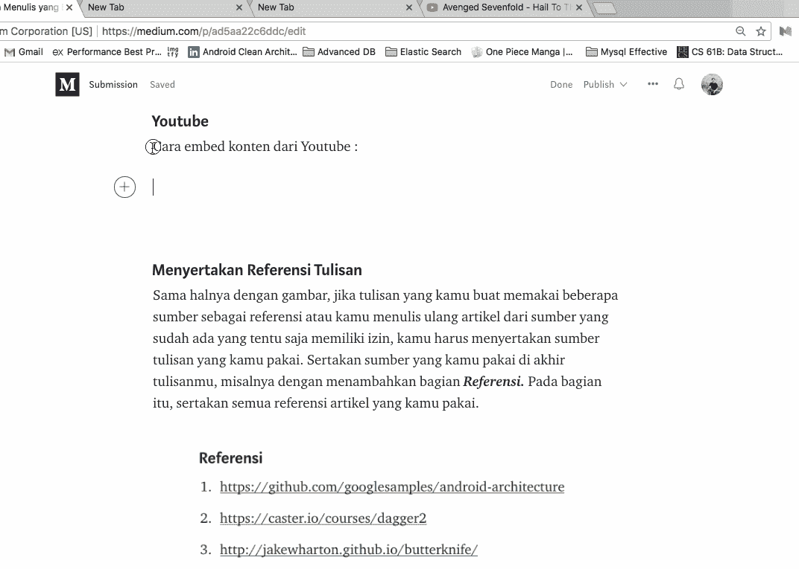

Cara Menyertakan Video dari Youtube

Youtube content by Avenged Sevenfold

## Menyertakan Tabel pada Tulisan

*Nah* , misalnya tulisan yang kamu buat sedikit banyak berhubungan dengan data dan hasil analisis yang biasanya berupa tabel, kamu tentu saja juga dapat menyertakannya dalam tulisan kamu, meskipun secara khusus Medium tidak mendukung tipe ***basic HTML tables*** ataupun tidak juga mendukung ***iframe embed*** , berikut ada beberapa cara yang dapat kamu gunakan untuk mengatasinya. Misalnya contoh data yang ingin kamu sertakan ialah.

```
Jam, Mata Kuliah, Dosen
08.00-10.00, Aljabar, Mr. A
10.00-12.00, Inggris, Ms. B
13.00-15.00, Database, Mr. Y
```

Data diatas dapat kamu buat dalam bentuk tabel menggunakan.
**Bulleted List**

*   08.00–10.00, Aljabar, Mr. A
*   10.00–12.00, Inggris, Ms. B
*   13.00–15.00, Database, Mr. Y

**Menggunakan Screenshot Gambar**

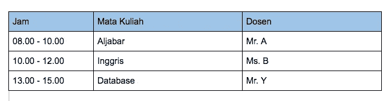

Contoh Screenshot Tabel

**Menggunakan Gist** Cara membuat dan menyertakan file *gist* masih sama seperti yang dijelaskan sebelumnya. Format yang digunakan ada dua :

**Format csv:**

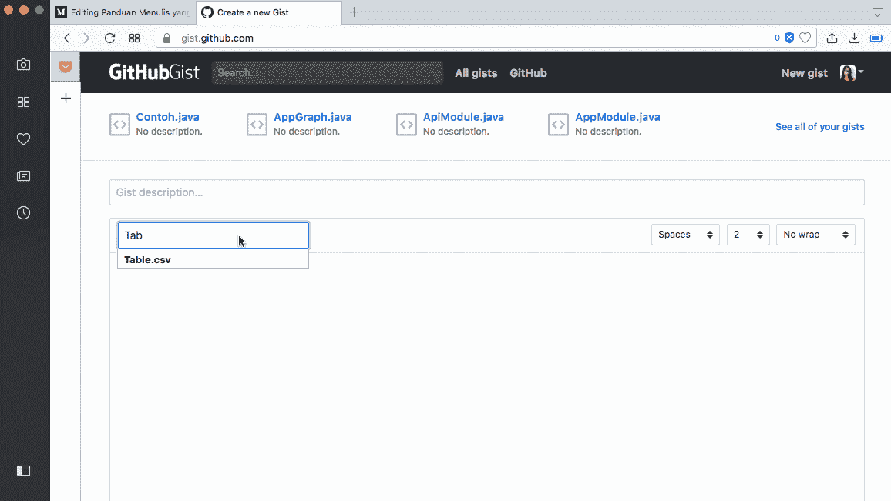

Contoh dengan format csv

**Format Markdown:**

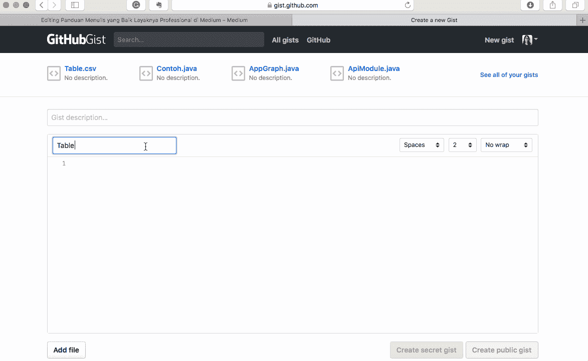

Contoh dengan format markdown

Begitulah beberapa cara menambahkan tabel pada tulisan kita.

## Menyertakan Chart pada Tulisan

Selain data dalam bentuk tabel, kamu dapat menambah *chart* pada tulisan kamu. Untuk menambahkan *chart* , kamu dapat menggunakan [***Infogram***](https://infogram.com/app/#/library) , sebuah *tools* yang dapat membantu kamu dalam membuat *chart* . Kamu perlu mengolah data yang ingin kamu tampilkan pada histogram, setelah itu pada tulisan kamu di Medium, mulailah dengan sebuah paragraf baru salin *external source* berupa *url* link yang kamu buat, klik tombol/tanda + pada paragraf baru, lalu salin *url* yang tadi ke dalam *field* < > ini, dan medium akan langsung menampilkannya. Kamu juga dapat membuat berbagai *chart* pada Infogram.

Cara menyertakan:

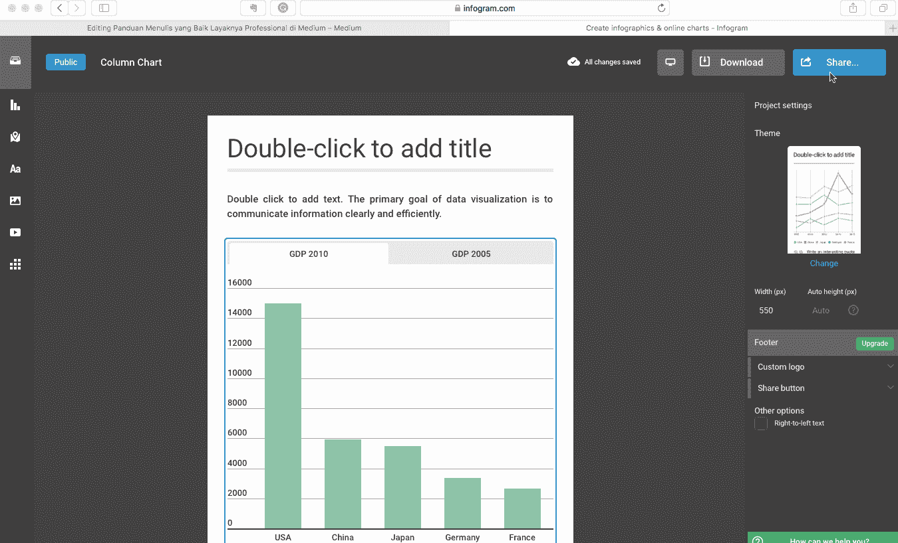

Contoh menambahkan chart

Contoh *chart*

## Menyertakan Referensi Tulisan

Sama halnya dengan gambar, jika tulisan yang kamu buat memakai beberapa sumber sebagai referensi atau kamu menulis ulang artikel dari sumber yang sudah ada yang tentu saja memiliki izin, kamu harus menyertakan sumber tulisan yang kamu pakai. Sertakan sumber yang kamu pakai di akhir tulisanmu, misalnya dengan menambahkan bagian ***Referensi.*** Pada bagian itu, sertakan semua referensi artikel yang kamu pakai. Misalnya

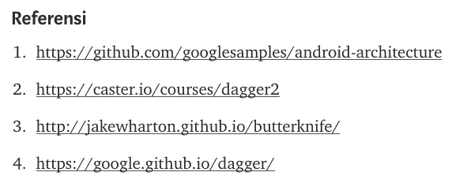

Contoh Referensi

## Baca Ulang Tulisan

Yang terakhir dan yang paling penting ialah kamu harus membaca kembali tulisan yang kamu buat sebelum kamu *publish.* Posisikan dirimu sebagai pembaca artikel yang bisa saja merupakan seorang *profesional* ataupun awam, *technology* atau *non-technology* , dan lain sebagainya *.* Pastikan tulisan yang kamu buat dapat dimengerti dengan mudah oleh berbagai golongan dan tentu saja memberikan pengalaman baru bagi si pembaca.

*Nah* , demikian beberapa tips sederhana yang dapat kamu gunakan ketika menulis. Semoga dengan adanya tips diatas, semakin meningkatkan niat kamu untuk berbagi informasi melalui tulisan. Selamat mencoba!! 😃