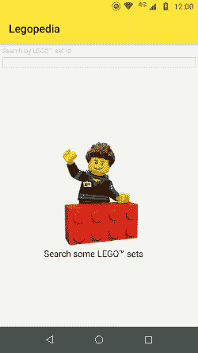

# 声明式用户界面的范式转变

> 原文：<https://medium.com/google-developer-experts/paradigm-shifts-with-declarative-ui-62c609ecccf9?source=collection_archive---------2----------------------->

Picture by [Alexas Fotos](https://www.pexels.com/it-it/@alexasfotos?utm_content=attributionCopyText&utm_medium=referral&utm_source=pexels) on [Pexels](https://www.pexels.com/it-it/foto/arte-bokeh-business-colorato-2277784/?utm_content=attributionCopyText&utm_medium=referral&utm_source=pexels)

声明式 UI 在开发世界中并不是一个新概念，但是它最近在 mobile native SDK 上获得了发展势头，可能是在一些其他跨平台框架开始探索这些方法之后。学习如何使用它们意味着改变过去几年我们想象布局和整个图形用户界面的方式。

随着 SwiftUI 在 iOS 上的到来，Jetpack Compose 正在为 Android 生态系统开放构建。

> 在撰写本文时， [Jetpack Compose](https://developer.android.com/jetpack/compose) 仍在大量开发中，许多事情每天都在变化。

我想尝试一下 Compose，用它来创建一个小应用程序，给定 Lego 套件编号，它将检索这样一个套件的基本信息:图片、标题和指向说明的链接。

## 功能概述

作为一名开发人员，很容易突出前面提到的例子中的要点:

*   **需要一个网络请求**来从网络上获取数据
*   后端很可能会返回一个图片链接，以便稍后可以**下载**
*   **数据应显示在列表上**

## 舒适区内

由于熟悉 Android 生态系统，我将自己指向了使用一大堆知名库来帮助我完成工作的方向，这些库包括 [RecyclerView](https://developer.android.com/guide/topics/ui/layout/recyclerview) 、[改型](https://square.github.io/retrofit/)、 [KotlinX 系列](https://github.com/Kotlin/kotlinx.serialization)、 [Picasso](https://square.github.io/picasso/) 和 [Dagger](https://dagger.dev/) 。

对于这样一个小应用程序来说，使用像 Dagger 这样的依赖注入框架似乎有些大材小用，但是在一个真实的项目中，它应该是构建对象的首选。在这种情况下，使用这样一个涉及使用 *kapt* 的 articulate 框架可能会导致与 Compose 所需的 Kotlin 插件发生冲突，所以我决定将两者混合使用，看看会发生什么。

重要的一点是 Picasso(或任何其他图像下载工具)的使用:我们通常会将它称为尽可能接近视图层，因为这些库中的每一个都在引用图像将被下载到的`View`时工作得最好。

# 新的方式(？)

到目前为止，还没有简单的方法可以用 Compose 异步提供图像。它肯定正在被开发中(我们可以通过[理解代码](https://cs.android.com/androidx/platform/frameworks/support/+/androidx-master-dev:ui/ui-framework/src/main/java/androidx/ui/res/ImageResources.kt;l=36?q=ImageResources.kt)中留下的注释，至少是关于从资源中加载的内容)，但是它还没有出现在 SDK 中:

A screenshot showing the comment in the documentation

在理想的情况下，我会告诉一个`Image`从哪里获取它的内容，它会自动显示给我看，但是现在还不是这样。直到现在，当然现在也不是这样。

所以，我决定尝试一些不同的，可以很容易复制的东西。我没有传递 URL，而是将 Picasso 调用封装在一个协程中，并在将模型发送到 UI 之前下载图像，就在 API 调用之后:

## 好的，坏的，丑陋的

虽然这种解决方案是可行的(好的)，但是只有当我们知道我们正在下载的图像数量是相当有限的(坏的)时，它才是一个可行的过程，并且它总体上是一个坏的实践(难看的):我们不想获取比我们的用户将看到的数量更多的数据，并且我们当然更喜欢在一个单独的链中下载图像。

## 还有一件事…

另一件让我震惊的事情(的确是以积极的方式！)的事实是，`Composable`组件不管理状态:到目前为止，状态的每一个变化都应该由一个特定的对象来管理，这个对象应该与`Composable`绑定在一起。让我们看一个例子:

重要的部分与第 6 行相关:如果我们将`onValueChange`参数作为一个整体移除，我们将无法看到文本字段中输入的内容。在我看来，这是一个巨大的飞跃:使用当前的方法，永远不清楚在何时何地保存和更新`Widget`的状态。管理一个`View`的状态不是一件容易的事情，但是从长远来看，由声明式 UI 框架绘制的路径将使开发图形界面变得更容易，更少混乱。

## 结论

对于我所面临的问题，这是一个简单的解决方案(肯定有其他方法来执行相同的任务),它让我意识到声明式 ui，如 Compose，正在改变我们塑造代码的方式，这是需要记住的。

此外，与我们现在所做的相比，使用这种方法，我们肯定更接近真正的`ViewModel`概念，但我确信这只是新一波 UI 框架带来的数百万个小变化中的一个。

*感谢* [*丹尼尔·博纳尔多*](https://twitter.com/danybony_)*[*法比奥·科里尼*](https://twitter.com/fabioCollini)*[*弗洛里纳·芒特内斯库*](https://twitter.com/FMuntenescu) *对本帖进行校对。***