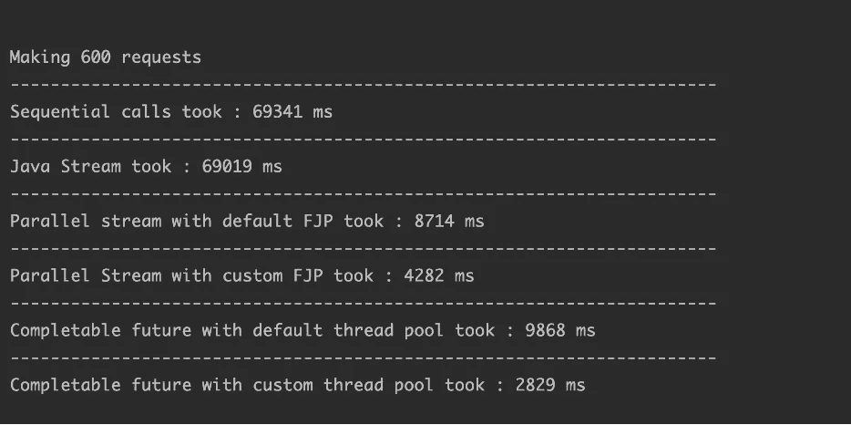

# Java 中的并行处理

> 原文：<https://medium.com/walmartglobaltech/parallel-processing-in-java-4a6c19e79570?source=collection_archive---------1----------------------->

Photo Credit: [SerenaWong](https://pixabay.com/illustrations/man-office-businessman-business-1633667/)

按需执行计算，同时在不到一秒的时间内从多个其他系统获取和聚合数据是我们一直想要做的事情。为了解决这个问题，我们求助于 Java。

在我们寻找用 Java 同时执行许多任务的最佳方式的过程中，我们评估和比较了各种选择。我们通过执行概念验证(POC)来进行我们的研究，使用每种类型进行大约 600 次 HTTP 调用。

在我们深入观察之前，让我们先检查一下我们探索的产品。

# **顺序处理 Java 并行流**

顺序处理是执行任务最直接的方式，其中一个调用接一个调用。这种方法花费的时间最多。

# **Java 并行流**

Java 并行流 Java 8 中引入的并行流可以同时处理大型数据集上的任务。当使用并行流时，Java runtime 将一个任务分成多个子任务流，并在每个子任务流上并行执行。并行流使用 ForkJoinPool，它合并了来自 commonPool()的线程。默认情况下，线程池的大小等于逻辑 CPU 核心数减一。但是，也可以使用特定的系统属性进行自定义设置。

**并行流使用**

在以下情况下，考虑使用并行流:

*   这项任务比数据分割和线程管理的开销更昂贵
*   有足够的数据可以处理
*   每个数据点所需的计算量足够大(NQ 模型)

**平行流副作用**

并行流不能保证处理的顺序，所以只有当处理不需要按照一定的顺序执行时才应该使用并行流。当并行流用于执行阻塞或长时间运行的操作时，公共 ForkJoin 池的所有线程都将被占用，这将影响需要公共池的其他任务。

# **可完成的未来**

CompletableFuture 是 Java Future 的扩展，可用于异步执行任务。使用 CompletableFuture 允许用户在一个单独的线程上执行一个任务，然后该线程将通知主线程发生的变化和任务的新状态。其思想是 CompletableFuture 被设计成允许用户执行一个长时间运行的任务(T1 ),而其他任务在主线程上并行执行。因此，该系统是有益的，因为它消除了其他同时运行的任务被主任务阻塞的问题，这将减少总的执行时间。

如果你想执行一个任务并且不需要返回任何东西，使用 runAsync() API，它返回一个 CompletableFuture <void>。但是，如果您需要返回一些东西，请使用 supplyAsync()，它接受 Supplier <t>并在调用 get()方法时返回 T。</t></void>

默认情况下，CompletableFuture 使用相同的 ForkJoinPool 和 commonPool()作为并行流，但是可以向 runAsync()/supplyAsync()方法提供自定义线程池。

Completable Future 还支持回调，一旦控制在将来完成时返回到主线程，就可以使用回调来执行某些操作。

# **比较** **祭品**

我们使用每种技术创建了 600 个 HTTP GET 请求，以比较完成任务的性能、开销和时间。这是我们的发现。

与顺序处理相比，我们发现使用 commonPool()的并行流可以减少 89%的时间。此外，使用 25 个线程的自定义线程池将时间减少到 customPool 所需时间的一半。

我们在对同一任务使用 Completable Future 时看到了类似的趋势，使用定制线程池()时时间减少了 96%，使用 commonPool()时时间减少了 86%。

**参考文献**

1.  [https://docs . Oracle . com/javase/8/docs/API/Java/util/concurrent/completablefuture . html](https://docs.oracle.com/javase/8/docs/api/java/util/concurrent/CompletableFuture.html)
2.  [https://docs . Oracle . com/javase/tutorial/collections/streams/parallelism . html](https://docs.oracle.com/javase/tutorial/collections/streams/parallelism.html)
3.  [https://xperti.io/blogs/java-parallel-stream-when-to-use/](https://xperti.io/blogs/java-parallel-stream-when-to-use/)