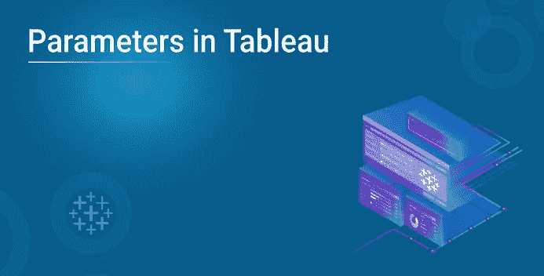
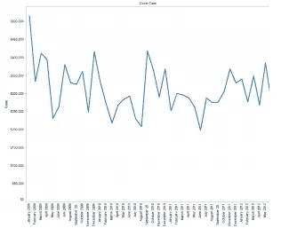
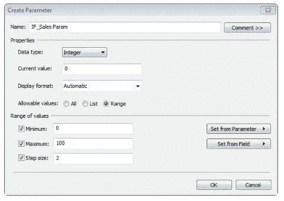
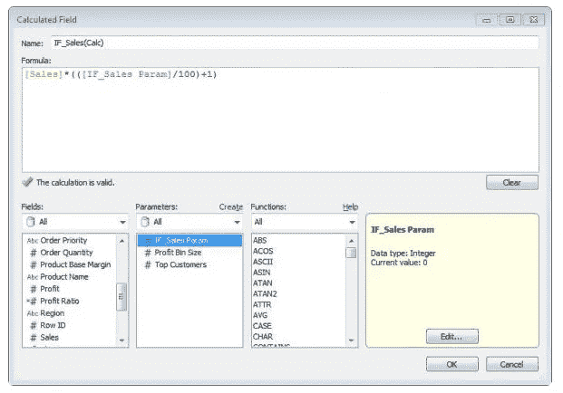
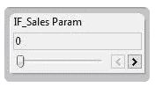
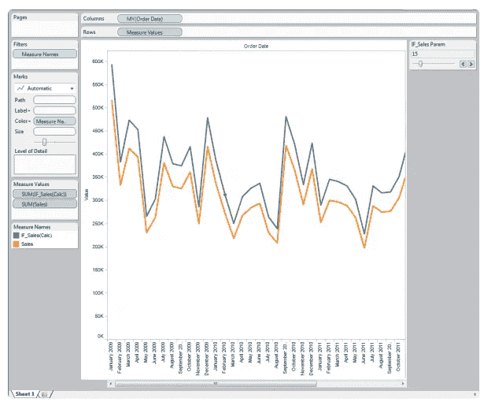

# 如何在 Tableau 中创建和使用参数？

> 原文：<https://medium.com/edureka/parameters-in-tableau-ac552e6b0cde-ac552e6b0cde?source=collection_archive---------0----------------------->

请这样想，如果您需要一个不在数据集中的可视化组件，该怎么办？Tableau 中的*参数将允许你提供那个值来传入。*

*本文涵盖以下主题:*

*   *Tableau 中的参数是什么？*
*   *入门指南*
*   *在 Tableau 中创建参数*
*   *在计算中使用 Tableau 参数*
*   *参数控制*
*   *在可视化中使用 Tableau 参数*

# *Tableau 中的参数是什么？*

*Tableau 中的参数允许您使用数据中没有的聚合值，并将这些值合并到您的 ***仪表板报告*** 中。创建后，最终用户可以控制输入来查看参数效果的结果。*

*那么，Tableau 中的参数到底是什么？*

****为了特定目的定制程序而传递给程序的任何值称为参数*** *。*它可以是任何东西:一个文本串、一个数值范围或一个数量，等等。*

*参数帮助您试验一些*假设*场景。假设您不确定要在视图中包含哪些字段，或者哪种布局最适合您的查看者。您可以将参数合并到视图中，让查看者选择他们希望如何查看数据。*

*当您使用参数时，您需要以某种方式将它们与视图联系起来:*

*   *视图中使用的计算和计算字段中。*
*   *在视图中显示参数控件，供用户选择参数。*
*   *引用参数操作中的参数。*

*仅仅从理论上了解这个概念对你没有任何好处。因此，在接下来的几个部分中，我将指导您完成在 Tableau 中创建和使用参数的过程。*

## *第一步:开始*

*您可以从打开 Tableau 并连接到 ***超市样本数据集开始。****

*1.将 ***订单日期*** 拖到列货架，将 ***销售*** 拖到行货架。*

*2.右键单击列架上的 ***年份*** 药丸。*

*4.当 ***自定义日期*** 对话框出现时，点击下拉菜单中的 ***月/年*** 选项。*

*您将得到一个如下所示的图表:*

**

## *步骤 2:在 Tableau 中创建参数*

*因此，我试图创建的场景是一个 ***假设*** 场景。比如说。 ***如果销售额多 3%***会怎么样。*

*要创建参数，请执行以下操作:*

1.  *进入 ***分析*** 菜单，选择 ***创建计算字段*** 。或者，您也可以在 ***Measures*** 窗格中右键单击，并从那里选择 ***创建计算字段*** 。*
2.  *现在，在创建将使用我们的参数的计算字段之前，我们必须创建参数。所以在窗口的下半部分，有一个标题为 ***参数*** 的区域，旁边还有一个链接写着 ***创建*** 。点击 ***创建*** 。*
3.  *完全按照所示填写字段。*
4.  *点击 ***确定*** 。您的参数现在显示在参数框中。*

**

## *步骤 3:在计算中使用 Tableau 参数*

*现在，对于这个场景，我们现在想使用我们的参数和一些参数来创建一个计算字段添加到我们的图形中，以查看 ***对我们的数据*** 的影响。仍在“计算字段”对话框中，创建计算字段:*

*1.将计算字段命名为***IF _ Sales(Calc)****

*2.公式: ***【销售】*((([IF _ Sales Param]/100)+1)****

*3.点击 ***确定*** 。*

**

*♠ *请注意，在计算中，我们创建的参数将与销售指标进行交互。**

## *步骤 4:参数控制*

*返回 Tableau 主视图，您将在“度量”窗格中看到计算字段，并在数据窗口的“参数”窗格中看到参数。
1。点击 ***参数 IF_Sales Param****

*2.选择 ***显示参数控制****

*3.在你的视图的右上方，你的 ***参数控制过滤器*** 将被显示。*

**

## *步骤 5:在可视化中使用 Tableau 参数*

*1.将 ***计算字段 IF_Sales(Calc)*** 拖放到 ***Sales*** 轴上。当你悬停在它上面时，你会注意到一个透明的等号。*

*2.放下后，您会注意到 ***测量名称*** 现在已经添加到您的 ***颜色货架*** 中，并且一个 ***颜色图例*** 同时显示 ***销售*** 和***IF _ 销售*** 。*

*3.因为您的参数控制在 0，所以您的线在彼此之上。*

*4.点击你的参数控件，你会看到两行出现。*

**

*这些线同时代表了您的数据集和您的 ***计算销售*** 的 ***销售*** 的运行值。并且您已经成功地将您的参数合并到可视化中！*

*参数是动态的、有用的元素，可以为报表增加交互性和灵活性。这是一个多功能的工具，同样适用于计算和设置！*

*如果您想查看更多关于市场上最流行的技术的文章，比如人工智能、DevOps、伦理黑客，您可以参考 [Edureka 的官方网站。](https://www.edureka.co/blog/?utm_source=medium&utm_medium=content-link&utm_campaign=parameters-in-tableau)*

*一定要注意本系列的其他文章，这些文章将解释 Tableau 的其他方面。*

> *1. [Tableau 教程](/edureka/tableau-tutorial-37d2d6a9684b)*
> 
> *2.[什么是 Tableau？](/edureka/what-is-tableau-1d9f4c641601)*
> 
> *3.[表格功能](/edureka/tableau-functions-ce794b10e588)*
> 
> *4. [Tableau 仪表盘](/edureka/tableau-dashboards-3e19dd713bc7)*
> 
> *5. [LOD 在 Tableau 中的表达](/edureka/tableau-lod-2f650ca1503d)*
> 
> *6.[桌面小窍门](/edureka/tableau-tips-and-tricks-a18bf8991afc)*
> 
> *7.[分步指南学习表公开](/edureka/tableau-public-942228327953)*
> 
> *8. [Tableau 桌面对比 Tableau 公共对比 Tableau 阅读器](/edureka/tableau-desktop-vs-tableau-public-vs-tableau-reader-fbb2a3aa0bac)*
> 
> *9.[表格图表](/edureka/tableau-charts-111758e2ea97)*
> 
> *10.[表中的集合是什么以及如何创建它们](/edureka/sets-in-tableau-39befe9b7fa1)*
> 
> *11.[数据融合](/edureka/tableau-lod-2f650ca1503d)*
> 
> *12 .[表格中的圆环图](/edureka/donut-chart-in-tableau-a2e6fadf6534)*
> 
> *13.[2020 年必须准备的 50 个顶级面试问题](/edureka/tableau-interview-questions-and-answers-4f80523527d)*
> 
> *14.[如何及何时使用不同的表格图表](/edureka/tableau-charts-111758e2ea97)*

**原为 2019 年 5 月 30 日发布于*[*https://www.edureka.co*](https://www.edureka.co/blog/parameters-in-tableau/)*。**