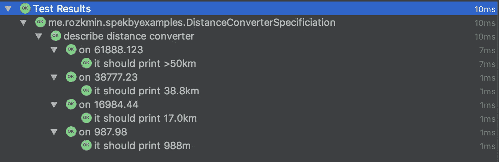

# 用 Spek 进行参数化测试

> 原文：<https://blog.kotlin-academy.com/parametrized-tests-with-spek-e0e02d5766a?source=collection_archive---------0----------------------->

每个人都知道我们必须检查系统的各种输入的情况。一个很好的例子是在前端和后端执行的登录/密码验证。有许多方法可以创建一个覆盖所有必要情况的测试代码，我们可以只是复制粘贴方法(不推荐)，在一个测试方法中做许多断言(我们可能会丢失一些有价值的错误信息)，或者使用捆绑在我们使用的测试框架中的参数化测试功能。请记住，有更多的选项可用。

如果您想在 jUnit4 中有几个测试用例，您必须使用参数化的 runner 并添加一些带有专用注释的方法，并实现返回参数列表和预期输出的方法:

很丑，是吧？完整的 Java 示例可以在这里找到:[https://github . com/JUnit-team/JUnit 4/wiki/Parameterized-tests](https://github.com/junit-team/junit4/wiki/Parameterized-tests)

# 我们可以做得更好

想象一下，如果我们能像写代码一样写测试。清晰的输出，没有注释驱动的开发，没有不必要的静态方法。那是斯皮克来帮忙的时候。

> *如果你不熟悉在单元测试中使用 Spek，可以查看我的文章*[*https://medium . com/@ rozkminiacz/testing-with-Spek-MVP-d 94 FD 924 af 86*](https://medium.com/@rozkminiacz/testing-with-spek-mvp-d94fd924af86)*或者其他博文。*

考虑简单的距离转换器——我们将给定的距离(以米为单位)解析为所需的单位。

这是一个简单的例子——实现很简单。只需一个`switch`或`when`和一个函数就能以期望的精度舍入数字来解决这种情况。

尽管实现很简单，我们还是应该准备单元测试。使用 Spek，我们还可以编写 BDD 风格的测试，并为一种方法准备一个规范。

运行此代码片段并检查结果？我们已经测试了两个案例，但是，我们仍然在重复自己。它像`@Parametrized` jUnit 测试一样又长又丑，或者只是用许多方法测试。

> *Spek DSL 是一个巨大的 lambda 表达式，所以我们可以使用任何 Kotlin 语言特性。*

让我们从使用`Map<Double, String>`定义我们的测试用例和预期结果开始:

现在我们可以使用`forEach{}`来生成想要的测试用例:

最后，我们可以做一些断言。完整的示例如下所示:

# 结论

当创建单元测试时，我们必须确保覆盖所有(合理的)案例。在提供的示例(距离转换器)中，我们使用`Map<Double, String>`和`forEach{k,v -> }`来参数化我们的测试，并在流中创建`on()`动作体和`it()`测试体。我们已经对每个值进行了检查，断言了预期的结果，并在我们的 IDE 中很好地显示了测试结果。我们没有丢失任何有价值的信息，我们可以用清晰的 Kotlin 语法添加另一个测试用例。

使用 Spek 可以让您获得 Kotlin 的全部功能——您可以像编写代码一样编写测试，并利用语言特性。

我希望这篇文章对你有用，它将帮助你以不同的方式看待参数化测试。

了解卡帕头最新的重大新闻。学院，[订阅时事通讯](https://kotlin-academy.us17.list-manage.com/subscribe?u=5d3a48e1893758cb5be5c2919&id=d2ba84960a)，[观察 Twitter](https://twitter.com/ktdotacademy) 并在 medium 上关注我们。

喜欢的话记得**拍**。请注意，如果您按住鼓掌按钮，您可以留下更多的掌声。