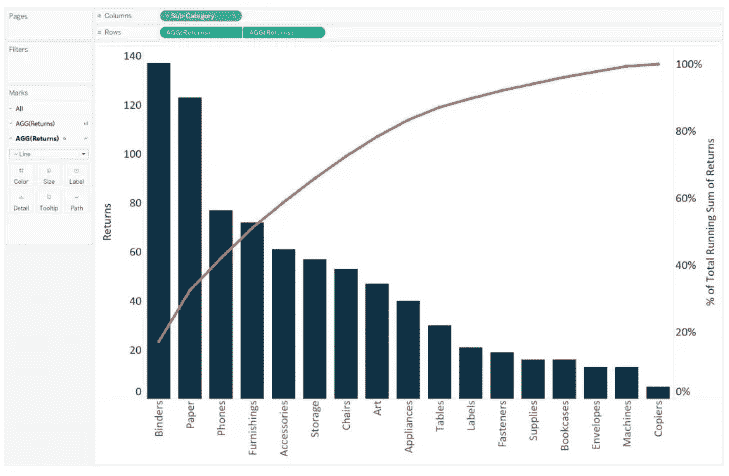

# 表格中的帕累托图

> 原文：<https://medium.com/edureka/pareto-chart-in-tableau-3930f7a72610?source=collection_archive---------6----------------------->

一个 ***Paret* o 图**是一个双轴组合图。它是 Tableau 中的一个图表，用于突出显示对所讨论的度量有最大影响的维成员。它是以维尔弗雷多·帕累托命名的。

那么，让我带你通过步骤来建立一个 ***的帕累托图中的*** 。

我们开始吧。

*   什么是帕累托图？
*   将退货表与订单表左连接
*   创建一个计算字段来计算退货次数
*   构建帕累托图

# 什么是帕累托图？

帕累托图是 Tableau 中的双轴组合图。在其主轴上，条形用于显示每个维度的基本原始数量，通常按降序排序，在副轴上，线形图用于以百分比格式显示累计总量。现在，虽然这种图表类型有多种用途，但它最广为人知的是作为质量控制的七种基本工具的一部分。因此，它传统上用于确定最大的改进机会。

我将坚持质量控制方案。本文将使用已经在 Tableau 桌面上可用的示例超市 。我们将使用这个数据集来查看哪些产品子类别提供了最多的返回项目。最终的图表将如下图所示；

首先，本教程需要采取两个额外的步骤来准备数据。

# 1.将退货表与订单表左连接

在这一步中，您需要右键单击示例超级商店数据连接并选择*编辑数据源*。一个新的界面将会出现。

现在您可以将*退货*表拖动到*订单*表旁边，并在*订单 ID* 上设置一个左连接。

# 2.创建一个计算字段来计算退货次数

用于计算的公式如下:

*计数([Returns] =“是”)*

现在，我们已经准备好绘制帕累托图了。

# 3.构建帕累托图

*   首先，您必须创建一个条形图，查看每个*产品子类*的退货数量，并按降序排列。您将在屏幕上看到以下结果。

*   其次，通过从*测量架*向右轴拖动*返回*测量，创建双轴组合图。将主轴上的标记类型改回条形，将副轴改回线条。在这一点上，viz 将看起来像下面这样；

*   制作帕累托图的步骤是。向此*添加一个表计算和一个二级表计算将返回*药丸。这将显示跨产品子类别的累计退货百分比。
*   要添加第一个表格计算，单击第二个退货药丸，将鼠标悬停在*快速表格计算*上，并选择*累计*。使用运行总计的表计算，您可以在结果上添加第二个表计算。这就是我们如何计算每个产品子类别的原始运行总数，然后添加第二个计算来确定总数的累积百分比。

*   如果要添加二次表计算，再次点击第二个*返回*小球，选择*编辑表计算*选项，勾选界面下方的*添加二次计算*复选框。将辅助计算类型更改为*合计百分比。*这将显示总数的累计百分比。

在改变轴刻度线以获得更清晰的外观后，您将看到以下内容:

Tableau 中的这个 Pareto 图现在可用于绘制洞察力，例如，*“业务的三个退货率最高的产品子类别产生了大约 40%的总退货率。*帕累托图通常是一种有效的方法，可以快速突出改进的潜力，并为企业提供一个衡量质量控制问题处理紧急程度的尺度。

希望你喜欢这篇文章。干杯！

现在，我希望大家对这个博客中的 Tableau 中的**数据混合有一个公平的想法。如果你想查看更多关于人工智能、DevOps、道德黑客等市场最热门技术的文章，那么你可以参考 [Edureka 的官方网站。](https://www.edureka.co/blog/?utm_source=medium&utm_medium=content-link&utm_campaign=pareto-charts-tableau)**

请留意这个系列中的其他文章和视频，它们会帮助你理解 Tableau 的各种概念。

> *1。* [*画面教程*](/edureka/tableau-tutorial-37d2d6a9684b)
> 
> *2。* [*什么是 Tableau？*](/edureka/what-is-tableau-1d9f4c641601)
> 
> *3。* [*Tableau 功能*](/edureka/tableau-functions-ce794b10e588)
> 
> *4。* [*画面仪表盘*](/edureka/tableau-dashboards-3e19dd713bc7)
> 
> *5。* [*表中的 LOD 表达式*](/edureka/tableau-lod-2f650ca1503d)
> 
> *6。* [*画面技巧*](/edureka/tableau-tips-and-tricks-a18bf8991afc)
> 
> *7。* [*循序渐进指导学习 Tableau 公共*](/edureka/tableau-public-942228327953)
> 
> *8。* [*Tableau 桌面 vs Tableau 公众 vs Tableau 读者*](/edureka/tableau-desktop-vs-tableau-public-vs-tableau-reader-fbb2a3aa0bac)
> 
> *9。* [*如何在 Tableau 中创建和使用参数？*](/edureka/parameters-in-tableau-ac552e6b0cde-ac552e6b0cde)
> 
> *10。* [*Tableau 图表*](/edureka/tableau-charts-111758e2ea97)
> 
> *11。* [*数据融合*](/edureka/tableau-lod-2f650ca1503d)
> 
> 12。 [*圆环图中的 Tableau*](/edureka/donut-chart-in-tableau-a2e6fadf6534)
> 
> *13。*[*2020 年你必须准备的 50 大 Tableau 面试题*](/edureka/tableau-interview-questions-and-answers-4f80523527d)
> 
> *14。* [*如何以及何时使用不同的 Tableau 图表*](/edureka/tableau-charts-111758e2ea97)

*原载于 2019 年 9 月 19 日 https://www.edureka.co***。**