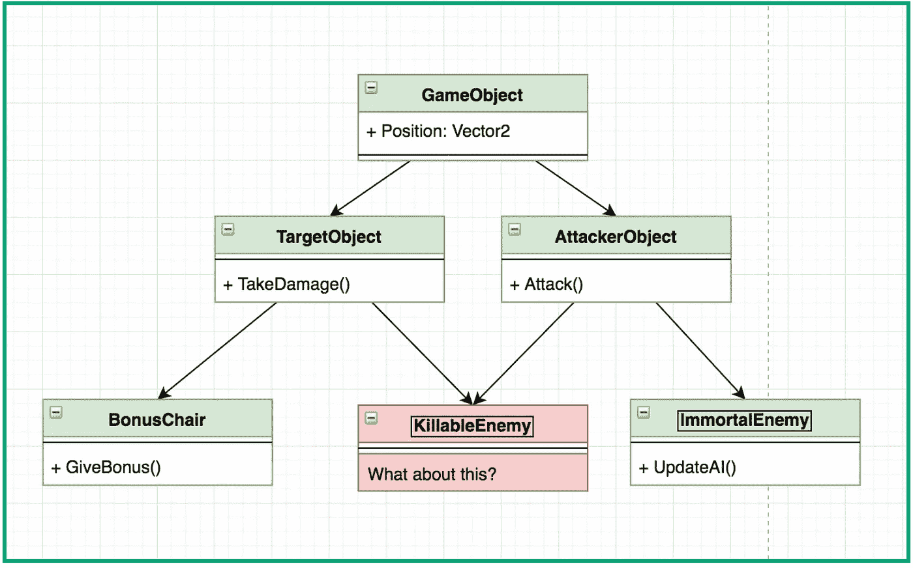

# Part 1 : Entity Component System (ECS)

> 原文：<https://medium.easyread.co/part-1-entity-component-system-ecs-18f9a2d68bf9?source=collection_archive---------1----------------------->

Entity-Component-System Series

# OOP Inheritance Problem

Paradigma yang pada umumnya digunakan dalam pemrograman adalah paradigma *Object Oriented Programming* (OOP). Paradigma ini memodelkan code seperti dunia nyata yaitu **“Memandang sesuatu code sebagai object yang memiliki data (property) dan dapat melakukan sesuatu (method)”** . Paradigma OOP memiliki konsep ***Inheritance*** (sub-typing) untuk menyajikan *reuseable code* atau *code sharing* .

Dalam OOP Inheritance, kita tidak boleh meng- *inherit* dari 2 *object* . Walapun meng-inherit dari 2 objek ini dapat dilakukan di bahasa C++, tapi tidak diperbolehkan dalam konsep OOP. Nah hal ini menjadi masalah pada kasus tertentu dalam pengembangan game pada khususnya, seperti contoh berikut:

Contoh Skema dengan OOP Inheritance

Mungkin teman-teman akan berkata “Pemodelan yang saya lakukan di atas tidak tepat, seharusnya **TargetObject** dan **AttackerObject** tidak menjadi parent”. Jika teman-teman berpendapat seperti itu, coba teman-teman modelkan sesuai pendapat teman-teman dan perhatikan ketika menambah objek baru yang memiliki 2 kemampuan di atasnya, maka akan terjadi masalah yang sama.

Isu di atas kerap menjadi masalah besar pada pengembangan game pada khususnya, game memiliki sifat selalu di update seperti dengan menambah karakter baru ( *new hero* ) atau kemampuan khusus yang baru ( *new ability* ). Dengan konsep inheritance, ketika struktur sudah didefinisikan, maka akan dibutuhkan refactoring yang cukup banyak untuk menambah fitur baru. Yah kita tau, refactoring beresiko besar, terlebih ketika produk sudah rilis, maka Game Developer harus berhati-hati dengan masalah ini.

# Entity Component System As The Solution

Menyadari masalah pada OOP Inheritance ini, Scott Bilas, di Game Developer Conferences (GDC) 2002 mengusulkan arsitektur Entity Component System (ECS) ( [Slide](http://gamedevs.org/uploads/data-driven-game-object-system.pdf) ), dengan mengantikan **Inheritance** dengan **Composition** . Entity Component System memiliki 3 konsep utama, yaitu:

## **Component**

Component adalah peng-groupan data sesuai kebutuhan atau fitur tertentu. Component tidak mengandung logic, hanya data. Contoh dari component adalah:
- PositionComponent (x,y,z)
- VelocityComponent (x, y, z)
- HealthComponent (current, max)
- AttackComponent (range, speed, damage)
- BonusComponent (gold)
- AIComponent (state, actionState, etc)

## Entity

Entity adalah representasi objek pada OOP sebelumnya. Namun implementasinya Entity hanya sebuah angka untuk identifikasi. Entity memiliki banyak component. Contoh dari Entity:

1.  **BonusChair
    -** PositionComponent
    - HealthComponent
    - BonusComponent
2.  **KillableEnemy**
    - PositionComponent
    - VelocityComponent
    - HealthComponent
    - AttackComponent
    - AIComponent
3.  **ImmortalEnemy
    -** PositionComponent
    - AttackComponent
    - AIComponent

## **System**

System adalah implementasi dari logic. System meng-iterasi seluruh entity berdasarkan component yang dimilikinya. Contoh dari system:

1.  **AttackSystem,** melakukan logic attack untuk seluruh entity yang memiliki component: PositionComponent, HealthComponent, dan AttackComponent.
2.  **AISystem** , melakukan logic AI untuk seluruh entity yang memiliki component: AIComponent
3.  **BonusSystem,** melakukan logic pemberian bonus untuk seluruh entity yang memiliki component: HealthComponent dan BonusComponent
4.  **MovementSystem** , melakukan logic movement untuk seluruh entity yang memiliki component: PositionComponent dan VelocityComponent

Contoh Skema dengan Entity Component System

Jika perhatikan skema di atas, jika kita menambahkan karakter baru “ **KillableBonusEnemy** ”, maka kita tinggal menghubungkan dengan komponent **PositionComponent, VelocityComponent, HealthComponent, AttackComponent, AIComponent,** dan **BonusComponent,** maka selanjutnya System akan otomatis mendeteksi berdasarkan componentnya.

# Closing

Nah, dari di atas kita mendapat gambaran bagaimana composition model pada ECS menyelesaikan permasalahan Inheritance pada OOP. Nah, selanjutnya kita akan membahas lebih dalam lagi contoh implementasinya dengan menyajikan code. Next article ya :)

*Artikel ini di tulis oleh* [*Leo Pripos Marbun*](https://medium.com/u/ea9a874c360d?source=post_page-----18f9a2d68bf9--------------------------------) *, beliau adalah Co-Founder dan CEO dari* [*Ned Studio*](http://nedstudio.net/) *sebuah Startup Game Development di Yogyakarta.*

*Jika anda merasa artikel ini menarik dan bermanfaat, bagikan ke lingkaran pertemanan anda, agar mereka dapat membaca artikel ini.*