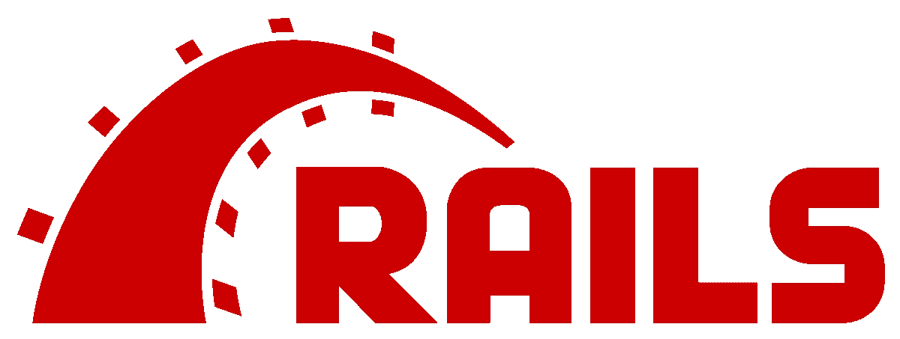

# [Part 1] — Salam Kenal, Saya Laravel 8

> 原文：<https://medium.easyread.co/part-1-salam-kenal-saya-laravel-8-6e9d75099939?source=collection_archive---------4----------------------->

Source: [https://laravel.com/](https://laravel.com/)

Halo teman-teman, selamat datang di blog saya. Untuk pembahasan kali ini saya akan membahas tentang framework PHP, namanya **Laravel** .

Namanya **perkenalan** , mari saya ajak untuk mengenal si Laravel ini dengan pembagian pembahasan yang telah saya susun dibawah ini:

# Pengertian **Framework (Web Framework)**

K alau kita ngomongin framework, berarti kita ngomongin struktur di dalamnya, konsep, pattern, fungsi-fungsinya, dan semuanya yang tertata rapi. Yap, framework di era sekarang sudah menjadi hal yang diharuskan ada. Framework bukan jadi topik pada para Software Engineer aja, tapi dikalangan mahasiswa-mahasiswa ilmu komputer pun juga. Jadi kamu pun kalau bisa jangan sampe ketinggalan ya.

Cuma Ilustrasi

> **Framework: Kerangka Kerja**

Lebih panjangnya gini sih penjelasannya, framework merupakan kerangka yang telah dibuat oleh suatu komunitas tertentu bisa itu open source atau pun non open source — (tambahan) perorangan pun bisa buat framework. Framework ini disusun bisa sefleksibel mungkin namun tetap rapi atau serumit/sekompleks mungkin namun tetap rapi. Isi dari framework itu seperti yang disebutkan di paragraf sebelumnya, ada **fungsi-fungsi** , **patternnya** , **plugin** , dan semacamnya.

**Alasannya apa sih mereka rajin banget buat-buat macam tuuu?**

Dalam develop project banyak yang harus dipertimbangkan seperti security, standarisasi pattern jika bekerja dengan tim, waktu selesainya atau lamanya develop project, dan sebagainya. Maka untuk meminimalisir kesalahan-kesalahan tersebut, Software Engineer baik perorangan atau bahkan tim lebih memilih menggunakan framework dibanding harus buat best practicenya dari awal atau secara native (tanpa framework).

Setelah tau alasannya, sekarang **apa saja plus minus menggunakan framework?**

a. Keuntungan

*   Kebanyakan framework yang sudah terkenal di era sekarang adalah **open-source** , adanya group dukungan atau forum online komunitas besar tempat kamu dapat memperoleh response cepat.
*   Dalam beberapa kejadian, framework memiliki dokumentasi yang baik. Walaupun tidak semua, rata-rata dokumentasi yang mereka buat bisa dimengerti.
*   Tingkat keamanan yang lebih terjamin dibanding harus build up dari awal.
*   Pekerjaan yang biasanya membutuhkan waktu berjam-jam dan ratusan baris kode untuk kamu buat, kini dapat diselesaikan dalam beberapa menit dengan fungsi yang telah dibuat sebelumnya. Pengembangan jauh lebih mudah, jadi jika lebih mudah lebih cepat, dan selanjutnya efektif.
*   Banyak library-library yang di support oleh developer lain agar dapat lebih memudahkan developer utama untuk mengembangkannya.
*   Dan masih banyak lagi, kamu bisa baca-baca diberbagai sumber lainnya agar semakin paham tentang framework tersebut.
*   Untuk kerja tim jadi lebih mudah, karena standarnya, tim kamu belajar hal yang sama.

b. Kelemahan atau kekurangan

*   Karena kamu belajar framework, maka banyaknya kamu pasti belajarnya frameworknya bukannya bahasa pemrogramannya. Jadi belajar bahasa pemrograman juga bagian yang terpenting sebelum kamu belajar framework yang ingin dipelajari.
*   Terdapat batasan, kamu harus mengerjakan pekerjaan dengan mengikuti aturan yang telah ditentukan dari framework tersebut, karena beberapa penggunaannya ada batasannya dan tidak dapat dimodifikasi.
*   Kodenya bersifat publik, jadi semua pihak dapat mempelajari cara kerja frameworknya untuk mencari kelemahan lalu menyerang sistem kamu.

# Pilih **Framework atau Native**

Kalau diminta pilih belajar framework langsung tanpa memahami yang native atau dasar dari bahasa pemrograman, saya harus meminta kamu untuk belajar dasar/native dari bahasa pemrogramannya dulu, kenapa ? Karena framework itu dibuat tujuannya untuk mempermudah dan membuat pekerjaan yang kamu kerjakan menjadi efisien. Ketika kamu belajar langsung ke frameworknya, fondasinya tidak kokoh, dan ketika ada improve dari framework yang kamu pakai, kamu akan terlihat bingung harus diimprove bagaimana. Jadi sempatkan belajar nativenya dulu sampai paham, baru nanti perdalam frameworknya.

# **Modal awal yang harus dipelajari** sebelum pakai framework

Sebelum kamu belajar tentang cara kerja framework yang tujuan akhirnya akan diimplementasikan ke dalam pekerjaan kamu, maka ini yang harus kamu pelajari sebelum menggunakannya :

*   Belajar konsep **OOP** (Opsional bagi yang merujuk terhadap functional programming)
*   Belajar konsep **MVC**
*   Belajar tentang membuat **web service / API** (Opsional)
*   Belajar tentang **Terminal/CLI**
*   Belajar **Package Manager** dari framework yang akan digunakan
*   Belajar **CRUD** (Create, Read, Update, Delete)

Dari semua list di atas, kamu bisa belajar dimana saja, bisa berbasis video, suara, atau pun bacaan-bacaan / tulisan. Dan tentunya kamu bisa belajar kapan saja.

# Macam-macam framework

Sangat banyak framework untuk website di luar sana, belum lagi ada framework untuk Front End, Back End, dan sebagainya. Khusus pada topik ini pastinya saya akan membahas tentang framework dari Back End dan sedikit Front End. Diantaranya adalah :

## Express

[https://expressjs.com/](https://expressjs.com/)

Dikutip dari website resminya yaitu [expressjs.com](https://expressjs.com/) , Express adalah kerangka yang cepat, unopinionated, dan minimalis untuk Node.js. Framework ini cukup memberikan keleluasan kepada penggunanya, karena memang pertama kali di download, hanya ada beberapa direktori yang muncul. Kamu bisa membuatnya dengan leluasa terserah kamu. Framework ini dikhususkan untuk membuat API atau web service, walaupun sangat mungkin untuk memiliki interface di dalamnya. Express sampai tulisan ini ditulis dan dipublish berada di bawah naungan project OpenJS Foundation. Bintangnya aja sudah [52.1k](https://github.com/expressjs) . Express merupakan framework khusus untuk pengguna Node.js.

*   Bahasa Pemrograman: Javascript, Typescript
*   Latest Version: Express 4.17.1
*   Link Resmi: [https://expressjs.com/](https://expressjs.com/)
*   Github: [https://github.com/expressjs/express](https://github.com/expressjs/express)

## Django

[https://www.djangoproject.com/](https://www.djangoproject.com/)

Django merupakan framework untuk backend seperti Express, fungsinya untuk membantu dalam membangun aplikasi web berkualitas. Django adalah web framework Python yang bersifat high-level yang memungkinkan development cepat dari web yang aman dan dapat dipelihara. Django itu free dan open-source, punya komunitas yang terus meningkat dan aktif, dokumentasi yang baik, dan banyak pilihan untuk dukungan gratis dan berbayar juga ternyata.

*   Bahasa Pemrograman: Python
*   Latest Version: Django 3.1.7
*   Link Resmi: [https://www.djangoproject.com/](https://www.djangoproject.com/)
*   Github: [https://github.com/django](https://github.com/django)

## Rails

[https://rubyonrails.org/](https://rubyonrails.org/)

Ruby on Rails [RoR] adalah framework pengembangan web gratis dan open-source yang ditulis dalam bahasa pemrograman Ruby. Setelah debutnya, Rails dengan cepat menjadi salah satu alat paling populer untuk membangun aplikasi web dinamis. Rails digunakan oleh berbagai perusahaan seperti Airbnb, SoundCloud, Disney, Hulu, GitHub, dan Shopify serta oleh banyak freelance, toko pengembangan independent dan startup.

Meskipun ada banyak pilihan dalam pengembangan web, Rails menonjol karena keanggunan, kekuatan, dan pendekatan terintegrasi ke aplikasi web. Dengan menggunakan Rails, bahkan pengembang pemula dapat membangun aplikasi web lengkap tanpa harus meninggalkan kerangka kerja — keuntungan besar bagi orang yang mempelajari pengembangan web untuk pertama kalinya. Rails juga memberi Anda fleksibilitas untuk maju — misalnya, berfungsi sebagai back end yang bagus jika Anda ingin membuat aplikasi satu halaman atau aplikasi seluler suatu saat nanti.

Satu keuntungan besar adalah bahwa Rails tidak rentan terhadap masalah “new hotness” yang mengganggu beberapa komunitas pengembangan (terutama JavaScript / Node.js), di mana sekumpulan teknologi rumit yang memusingkan tampaknya berubah setiap enam bulan.

*   Bahasa Pemrograman: Ruby
*   Latest Version: Rails 6.1.3
*   Link Resmi: [https://rubyonrails.org/](https://rubyonrails.org/)
*   Github: [https://github.com/rails](https://github.com/rails)

## Spring

[https://spring.io/](https://spring.io/)

Mengutip dari laman resminya, **Kenapa Spring?**

> Spring membuat programming Java lebih cepat, lebih mudah dan lebih aman untu semuanya. Sprinf berfokus pada kecepatan, kesederhanaan, dan produktifitas menjadikannya framework Java paling populer di dunia.

Spring juga open-source, bahasa pemrogramannya pastinya Java.

*   Bahasa Pemrograman: Java
*   Latest Version: Spring 2.4.3
*   Link Resmi: [https://spring.io](https://spring.io)
*   Github: [https://github.com/spring-projects/spring-boot](https://github.com/spring-projects/spring-boot)

# Framework **Laravel**

[https://laravel.com/](https://laravel.com/)

Seperti yang dikutip dari website resminya, Laravel adalah kerangka aplikasi web dengan sintaks yang ekspresif dan elegan. Kami telah meletakkan fondasinya — membebaskan Anda untuk berkreasi tanpa membuat repot hal-hal kecil. Laravel merupakan framework untuk sisi server (server side) / backend. Laravel ini berbasis PHP yang open-source, menggunakan konsep MVC (Model-View-Controller). Laravel berada dibawah lisensi MIT. Laravel sudah memiliki [64k](https://github.com/laravel) bintang dan sekarang versinya sudah di angka 8.sekian.

*   Bahasa Pemrograman: PHP
*   Latest Version: Laravel 8.x
*   Link Resmi: [https://laravel.com](https://laravel.com)
*   Github: [https://github.com/laravel](https://github.com/laravel)

# Bedanya Laravel dengan framework lainnya

Mengapa harus menggunakan framework Laravel? Berikut saya jelaskan kenapa kamu harus cobain menggunakan Laravel.

1.  Template Layout yang lebih ringan.
2.  Adanya tool **Artisan** kamu dapat dibantu olehnya dalam membangun sebuat website atau aplikasi web.
3.  Without Repetitive Work, ada satu fitur di Laravel, namanya ***blade*** dan berkat blade ini kita akan terhindar dari yang namanya repetitive work. Saya akan bahas ditulisan yang berbeda mengenai blade ini.

# Konklusi

Ada banyak framework di luar sana, dan berita baiknya kamu tidak harus mempelajari semuanya. Terima kasih sudah membaca tulisan ini, selamat belajar dan semoga bermanfaat!

Series : Laravel

*   [【第一部分】—萨拉姆·肯纳尔，赛亚裙·拉勒维尔 8](https://pandhuwibowo.medium.com/part-1-salam-kenal-saya-laravel-8-6e9d75099939) **【塞卡兰·迪斯尼】**
*   [【第二部分】—孟安装拉腊维尔(拉腊维尔 8)](https://pandhuwibowo.medium.com/part-2-menginstall-laravel-laravel-8-72e27fa98fcd)
*   [第三部分]—Konfigurasi and Mengenal structur Folder Laravel 8

# 参考 I

 [## 框架的优点和缺点

### 框架的优点和缺点:一个好的 PHP 框架应该增强安全性，使网站更容易…

www.vizteams.com](https://www.vizteams.com/blog/advantages-and-disadvantages-of-frameworks/)  [## web 应用程序开发的 5 个软件框架优势

### 今天，web 应用程序开发可以通过多种方式完成。关于 web 应用程序不再有任何问题…

syndicode.com](https://syndicode.com/blog/5-open-frameworks-advantages-for-web-app-development/)  [## Mendalami PHP 原生 Dulu Atau Lanjut 框架？Sekolah Koding 论坛

### 赛亚裙在 PHP 开发上取得了成功，但也在 PHP 本地实现了 CRUD。丹·赛亚裙…

sekolahkoding.com](https://sekolahkoding.com/forum/mendalami-php-native-dulu-atau-lanjut-framework-1544161012)  [## 这是一个更有效的政策。

### 越来越多的社区需要大量的劳动力。纳蒙，塞马金…

codepolitan.com](https://codepolitan.com/tujuh-tips-belajar-laravel-dengan-lebih-efektif-5882dfdd4b3a2)  [## 2021 年使用的 10 个最佳 Web 开发框架[更新]

### 框架已经成为 web 开发的一个重要部分，因为 web 应用程序的标准一直在提高，所以…

hackr.io](https://hackr.io/blog/web-development-frameworks)  [## Express - Node.js web 应用程序框架

### Express 是一个最小且灵活的 Node.js web 应用程序框架，它为 web 和…

expressjs.com](https://expressjs.com/)  [## 姜戈

### Django 是一个高级 Python Web 框架，它鼓励快速开发和干净、实用的设计。建造者…

www.djangoproject.com](https://www.djangoproject.com/)  [## Ruby on Rails

### 学习构建一个现代的 web 应用程序是令人畏惧的。Ruby on Rails 让这变得更加容易和有趣。它包括…

rubyonrails.org](https://rubyonrails.org/)  [## laravel——Web 工匠的 PHP 框架

### Laravel 是一个 web 应用程序框架，具有丰富、优雅的语法。我们相信发展必须是令人愉快的…

laravel.com](https://laravel.com/)  [## Spring 让 Java 变得简单。

### 提高您的 Java 代码水平，探索 Spring 能为您做什么。

spring.io](https://spring.io/)  [## 有角的

### Angular 是一个构建移动和桌面 web 应用程序的平台。加入数百万开发者的社区…

angular.io](https://angular.io)  [## React (JavaScript 库)

### (也称为 React.js 或 ReactJS)是一个开源的前端 JavaScript 库，用于构建用户界面或 UI…

en.wikipedia.org](https://en.wikipedia.org/wiki/React_%28JavaScript_library%29)  [## vue . j

### Sudah paham tentang HTML，CSS，dan JavaScript？Baca petunjuk 和 mulai 在新的一年里取得了成功！塞布亚…

docs.vuejs.id](https://docs.vuejs.id/)  [## 姜戈简介

### 恭喜你，你已经完成了 Django 旅程的第一步！你现在应该明白姜戈的主要…

developer.mozilla.org](https://developer.mozilla.org/en-US/docs/Learn/Server-side/Django/Introduction)  [## Spring 框架-概述

### Spring 是企业 Java 最流行的应用程序开发框架。全球数百万开发人员…

www.tutorialspoint.com](https://www.tutorialspoint.com/spring/spring_overview.htm)  [## 这是什么意思？Fitur 和 Kelebihan 是第一个框架。

### Salah Satu framework yang paling terkenal adalah Laravel, Apa itu Laravel? Sebelum membahas lebih dalam tentang…

www.jagoanhosting.com](https://www.jagoanhosting.com/blog/framework-laravel/)  [## 10 Alasan Memilih Laravel Dibandingkan Framework Lain - Jago Laravel

### Apakah sobat tertarik dengan Laravel ? tetapi tidak tahu harus mulai dari mana ? Ayo sobat, kita sama-sama belajar…

jagolaravel.blogspot.com](https://jagolaravel.blogspot.com/2017/04/10-alasan-memilih-laravel-dibandingkan-framework-lain.html) 

**[Call Friends]**

Halo teman teman, untuk mendukung agar saya tetap bisa membuat tulisan-tulisan menarik lainnya. Kamu bisa support saya dengan membeli produk-produk asli produksi sendiri, homemade, dan yang pastinya brand lokal hanya di [@beneteen](https://www.instagram.com/beneteen/) atau ke [beneteen.com](https://beneteen.com/)