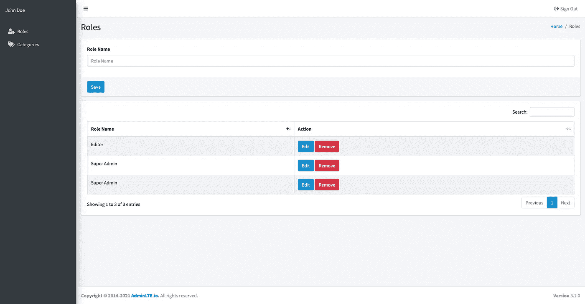

# [Part 10] — Membuat Modul Role / Level | Laravel 8

> 原文：<https://medium.easyread.co/part-10-membuat-modul-role-level-laravel-8-d478786ab6cd?source=collection_archive---------1----------------------->

Photo by [Martin Sanchez](https://unsplash.com/@martinsanchez?utm_source=medium&utm_medium=referral) on [Unsplash](https://unsplash.com?utm_source=medium&utm_medium=referral)

Halo selamat datang di blog saya, kali ini kamu sedang berada dalam materi membuat modul role / level dengan Laravel 8.

Modul Role merupakan modul dimana nantinya user atau pengguna tersebut dapat berinteraksi seberapa besar. Artinya setiap pengguna akan mempunyai menu yang berbeda-beda, karena memang nanti level akunnya berbeda-beda. Jadi setiap pengguna akan memiliki keterbatasan yang berbeda-beda pula. Langsung aja kamu akan membuat CRUD functionnya. Jadi pada modul kali ini modul Role ini dapat melakukan membuat role baru, mengubah role, melihat list role dan juga dapat menghapus role. Langsung saja mari kita buat.

Untuk Dashboardnya, saya menggunakan template dari AdminLTE. Linknya saya simpan di bawah ya teman-teman.

And, I have model of Role such as the following below.

Kamu bisa samakan ini.

## #Create New Role

*   Membuat direktori bernama `dashboard` dan di dalamnya beri nama `roles`
*   Lalu buat file bernama `index.blade.php`
*   Setelah itu copy paste program pada file di bawah ini.

Keterangan Penting :

Ada beberapa potongan kode program yang perlu diperhatikan. Coba liat

→ Line `14` , token yang wajib ada karena syarat dari Laravel, demi security data yang dikirim ke backend.

→ Line `110–122` , pada line tersebut, berguna untuk menampilkan form yang berisi kolom atau field role name dan berupa button save. Berikan identitas untuk mereka dengan `id` dimana `id` tersebut berguna untuk dipanggil pada fungsi jquery di baris dibawahnya atau line `167-211` .

→ Line `167-211` , pada line ini kamu akan mendapatkan data role name, lalu di validasi apakah tipe datanya adalah `string` atau bukan, dan valuenya kosong atau tidak. Setelah itu dibaris bawahnya merupakan `ajax` yang nantinya akan berinteraksi ke backend. Ajax tersebut dapat mengirim data yang dari form tersebut lalu di kembalikan lagi responsenya ke ajax tersebut.

*   Lalu buat route POST tersebut untuk di kirim ke controller. Potongan programnya seperti di bawah ini. Copy paste pada file `web.php`

*   Buat function bernama `create` di `RoleController.php` . Potongan functionnya seperti kode di bawah ini.

Sekarang kamu tes di browser kamu. Apakah berjalan sesuai yang diinginkan atau tidak?

Tampilannya seperti di atas. Beritahu saya jika function `create` kamu tidak berhasil melalui komentar di blog ini ya.

## #Show Lists Role

Pada bagian ini kamu akan menampilkan daftar role yang akan di tata dalam suatu table. Dimana kolom tersebut hanya ada role name. Berikut praktiknya.

*   Masih di dalam file yang sama, yaitu `index.blade.php` yang terdapat di dalam direktori atau folder `dashboard/roles` .
*   Lalu update kode program yang diatas menjadi seperti di bawah ini untuk dapat menampilkan data role ke dalam table.

Point pentingnya adalah terdapat pada Line `130-152` . Dimana kode program tersebut untuk menampilkan list role nya.

*   Lalu update function `index` yang berada di controller `RoleController` . Berikut potongan kode programnya.

Dan di atas merupakan tampilan update dari file `index.blade.php` .

## #Update Role Existing

Setelah kamu berhasil membuat fitur dari create dan show list dari modul role, langkah selanjutnya kamu akan membuat fitur update role. Untuk fitur kali ini dalam menampilkan form data yang telah di pilih, kamu akan menempatkan datanya ke dalam modal. Berikut tahapannya sampai dengan bisa terupdate.

*   For the first in this step, silahkan buka file `web.php` , dan tambahkan route untuk update yang mengarah ke `RoleController` . Berikut update potongan kodenya.

*   Setelah itu masuk ke `RoleController` dan buat function update.

Untuk halaman `index.blade.php` akan saya gabungkan bersama ketika membuat delete / remove role.

## #Remove Role

Okay untuk fitur yang terakhir yaitu dapat menghapus role. Kamu udah berada pada tahap akhir. Mari kita percepat.

*   Sekarang kamu buka kembali file `web.php` , dan update kodenya jadi seperti ini.

*   Lalu kamu buka `RoleController` , dan buat function `delete` nya.

For the last step but its not least, sekarang buka file `index.blade.php` copy paste kode di bawah ini. Ini sudah include yang update dan remove role.

## Konklusi

Yap, sekarang kamu sudah membuat satu modul Role. Untuk tulisan berikutnya kamu akan mencoba membuat modul Kategori dari sebuah Blog. Tunggu tulisan saya berikutnya. Semoga bermanfaat.

## Referensi

 [## Free Bootstrap Admin Template | AdminLTE.IO

### Best open source admin dashboard & control panel theme. Built on top of Bootstrap, AdminLTE provides a range of…

adminlte.io](https://adminlte.io/) 

[Call Friends]

Halo teman teman, untuk mendukung agar saya tetap bisa membuat tulisan-tulisan menarik lainnya. Kamu bisa support saya dengan membeli produk-produk asli produksi sendiri, homemade, dan yang pastinya brand lokal hanya di [@beneteen](https://www.instagram.com/beneteen/) atau ke [beneteen.com](https://beneteen.com/)