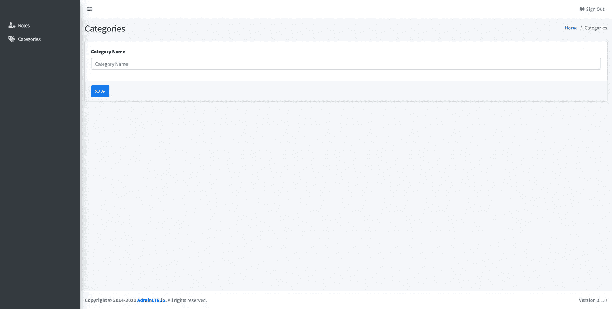
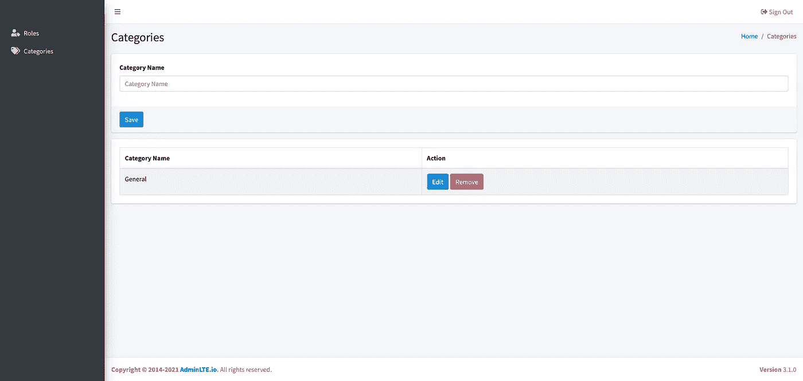

# [Part 11] — Membuat Modul Kategori | Laravel 8

> 原文：<https://medium.easyread.co/part-11-membuat-modul-kategori-laravel-8-aa4d774d587?source=collection_archive---------2----------------------->

Photo by [Charisse Kenion](https://unsplash.com/@charissek?utm_source=medium&utm_medium=referral) on [Unsplash](https://unsplash.com?utm_source=medium&utm_medium=referral)

Halo semua, selamat datang di blog saya. Pada tulisan ini kamu akan coba membuat modul kategori blog.

Ya, pada tulisan sebelumnya kamu sudah membuat modul role. Jika kamu yang baru datang ke tempat ini, kamu bisa baca tulisan saya sebelum-sebelumnya. Dan untuk kamu yang setia untuk mampir kemari, thank you appreciate it.

Pada blog, kamu pasti tau dan mungkin paham sekali jika setiap blog yang ditulis ada kategorinya. Fungsi kategori merupakan filter untuk mempermudah pembaca untuk menemukan kembali bacaan yang mungkin menarik perhatiannya atau bisa jadi pembaca tersebut sangat segmented sekali sehingga dia hanya membuka salah satu atau beberapa kategori yang telah tersedia.

Nah, untuk itu kategori merupakan bagian terpenting dan mungkin tidak terpisahkan pada setiap blog yang ditulis. Sekarang mari kita buat modul kategori tersebut.

Dan informasi awal, saya mempunyai model seperti ini.

## #Create New Category

*   Sebenarnya konsep yang diterapkan sama persis ketika kamu membuat modul role.
*   Kamu harus membuat folder `categories` di dalam direktori atau folder `dashboard` .
*   Lalu buatlah file bernama `index.blade.php` . Dan isilah file tersebut menjadi kode di bawah ini.

Tampilan awalnya akan menjadi seperti ini.

Tampilan diatas hanya berupa tampilan, ketika kamu ingin menambahkan kategori baru, kamu belum bisa menambahkannya. Untuk itu mari kamu tambahkan agar fungsi button save itu berjalan dengan baik.

*   Update kode diatas menjadi di bawah ini.

*   And then, you should create route such as me looks like. Buka file `web.php` dan isi routenya seperti ini.

*   Setelah itu buat function bernama `create` . Copy paste code ini ke text editor kamu.

Kamu sudah berhasil membuat fitur create kategori. Selanjutnya kamu harus menampilkan data yang kamu buat tadi ke dalam table dan list. Lanjutkan sampai ke baris berikutnya di bawah ini.

## #Show Lists Category

*   Mari kita tampilkan datanya dengan mengubah potongan kode programnya menjadi seperti ini. Buka file `index.blade.php`

*   Lalu ubah function `index` di `CategoryController` seperti kode di bawah ini.

Nah tampilannya akan seperti ini. Mari kamu buka browsernya.

## #Update Category

*   Selanjutnya kamu harus membuat fitur update kategori. Sekarang buka file `web.php` . Dan tambahkan satu baris kode seperti ini. Tapi coba kamu bandingkan dengan kode kamu sebelumnya, jika sudah ada tidak perlu di tambahkan lagi.

*   Sekarang buat function `update` di `CategoryController` .

*   Lalu kamu buka kembali file `index.blade.php` dan update kodenya menjadi seperti ini.

Nah, untuk update, create, dan show list kategori sudah kamu buat. Sekarang fitur terakhir dalam modul kategori, yaitu remove kategori. Mari kita percepat.

## #Remove Category

*   Buka kembali file `web.php` , dan tambahkan baris baru untuk route removenya.

*   Buka `CategoryController` , dan buat function baru namanya `delete` .

*   Dan yang terakhir modifikasi file `index.blade.php` menjadi seperti ini.

## Konklusi

Akhirnya, kamu sudah membuat satu modul lagi untuk kategori blog. Next tulisan saya, kamu akan membuat modul user. Tunggu di tulisan saya berikutnya. Semoga bermanfaat.

# Alert!

If you guys come from **Indonesia** and want to support me to writing more and more, hopefully you can give a little bit from your wallet. You can share your gift to some ways,

## Saweria

[https://saweria.co/pandhuwibowo](https://saweria.co/pandhuwibowo)

## Trakteer

[https://trakteer.id/goodpeopletogivemoney](https://trakteer.id/goodpeopletogivemoney)

## Referensi

 [## Free Bootstrap Admin Template | AdminLTE.IO

### Best open source admin dashboard & control panel theme. Built on top of Bootstrap, AdminLTE provides a range of…

adminlte.io](https://adminlte.io/) 

[Call Friends]

Halo teman teman, untuk mendukung agar saya tetap bisa membuat tulisan-tulisan menarik lainnya. Kamu bisa support saya dengan membeli produk-produk asli produksi sendiri, homemade, dan yang pastinya brand lokal hanya di [@beneteen](https://www.instagram.com/beneteen/) atau ke [beneteen.com](https://beneteen.com/)