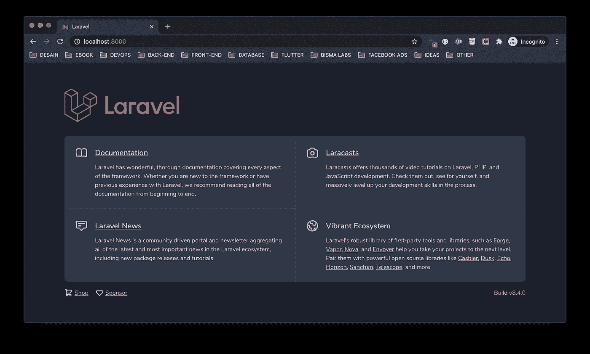

# [Part 2] — Menginstall Laravel (Laravel 8)

> 原文：<https://medium.easyread.co/part-2-menginstall-laravel-laravel-8-72e27fa98fcd?source=collection_archive---------1----------------------->

Halo teman-teman, kali ini akan melakukan instalasi Laravel di PC kamu masing-masing. Syaratnya di PC kamu sudah harus terinstall **Composer dan PHP 7.3.0** sebagai syarat minimal, saran saya versinya ga harus baru (Composernya bukan PHPnya), sebelum yang terbaru juga gapapa, yang penting stable. Kamu bisa mendapatkan **Composer** di [link ini](https://getcomposer.org/) . Untuk Composer sendiri nanti akan ada pembahasannya yang terpisah di luar seri Laravel ya.

Ada 2 cara dalam menginstall Laravel 8,

1.  Instalasi melalui Composer
2.  Installer Laravel

# **Instalasi melalui Composer**

Pertama, ketikkan command dibawah ini.

```
$ composer create-project laravel/laravel example-app
```

**example-app** merupakan nama dari project kamu yang akan dibuat.

Kedua, masuk ke direktori dari project Laravel-nya yang sudah kamu buat.

```
$ cd example-app
```

Ketiga, kamu sudah bisa menjalankan projectnya dengan mengetikkan perintah atau command di bawah ini.

```
$ php artisan serve
```

Tampilan pertamanya seperti ini.



[https://santrikoding.com/tutorial-laravel-8-installasi](https://santrikoding.com/tutorial-laravel-8-installasi)

# Installer Laravel

Cara yang kedua, kamu bisa menggunakan installer dari laravelnya langsung.

Step 1 : Install installer laravel secara global di PC kamu. Perintahnya seperti ini.

```
$ composer global require laravel/installer
```

Step 2 : Kamu sudah bisa langsung menginstall project laravelnya dengan menggunakan command dari installer laravel seperti ini.

```
$ laravel new example-app
```

Step 3 : Masuk ke direktori dari project Laravel-nya yang sudah kamu buat.

```
$ cd example-app
```

Step 4 : Kamu sudah bisa menjalankan projectnya dengan mengetikkan perintah atau command di bawah ini.

```
$ php artisan serve
```

Tampilan pertamanya sama seperti digambar dengan cara sebelumnya yang telah dilakukan kok :D

**Link dokumentasinya bisa di klik tulisan** [**ini**](https://laravel.com/docs/8.x/installation) **.**

**Konklusi :**

Langsung praktekkan dan pastikan spesifikasi minimal untuk install laravel 8 nya terpenuhi. Terima kasih sudah membaca tulisan ini, selamat belajar dan semoga bermanfaat!

Series : Laravel

*   [[Part 1] — Salam Kenal, Saya Laravel 8](https://pandhuwibowo.medium.com/part-1-salam-kenal-saya-laravel-8-6e9d75099939)
*   [[Part 2] — Menginstall Laravel (Laravel 8) **[Sekarang disini]**](https://pandhuwibowo.medium.com/part-2-menginstall-laravel-laravel-8-72e27fa98fcd)
*   [Part 3] — Konfigurasi dan Mengenal Struktur Folder Laravel 8

**Referensi :**

 [## Installation

### Laravel is a web application framework with expressive, elegant syntax. A web framework provides a structure and…

laravel.com](https://laravel.com/docs/8.x/installation#initial-configuration) 

[Call Friends]

Halo teman teman, untuk mendukung agar saya tetap bisa membuat tulisan-tulisan menarik lainnya. Kamu bisa support saya dengan membeli produk-produk asli produksi sendiri, homemade, dan yang pastinya brand lokal hanya di [@beneteen](https://www.instagram.com/beneteen/) atau ke [beneteen.com](https://beneteen.com/)