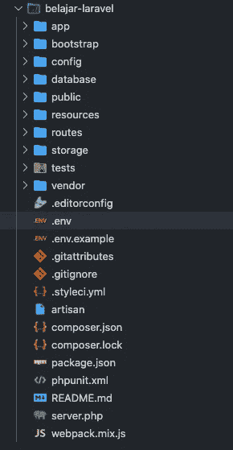

# [Part 3] — Konfigurasi dan Mengenal Struktur Folder Laravel 8

> 原文：<https://medium.easyread.co/part-3-konfigurasi-dan-mengenal-struktur-folder-laravel-8-450089601c42?source=collection_archive---------0----------------------->


Photo by [Waldemar Brandt](https://unsplash.com/@waldemarbrandt67w?utm_source=medium&utm_medium=referral) on [Unsplash](https://unsplash.com?utm_source=medium&utm_medium=referral)

Halo teman-teman, selamat datang di blog saya. Untuk yang baru tau, perkenalkan nama saya Pandhu, dan kamu sekarang berada dalam pembahasan mengenai **Konfigurasi dan Mengenal Struktur Laravel 8** .

# Konfigurasi Awal (Opsional)

Untuk konfigurasi, Laravel 8 telah menyediakan semuanya di direktori **config** . Banyak sekali yang dapat kamu set up, beberapa diantaranya set up untuk environment project kamu, menghubungkan project kamu dengan database, terhubung dengan konfigurasi email, mengaktifkan log, terhubung dengan redis, aktifkan debugger, set up timezone, enkripsi, dan lain-lain

Jika kamu install Laravel via Composer atau jika kamu melihat dari variable **APP_KEY** -nya kosong, maka kamu harus melakukan generate application key menjadi random string.

Perintahnya seperti ini.

```
$ php artisan key:generate
```

Opsi ini menjadi opsional jika kamu menginstall selain dari Composer.

Kode ini akan mengenerate string sepanjang 32 karakter yang terdapat di dalam file `.env` . Hasil generate tadi ada di variable **APP_KEY** .

Isi file .env bisa dilihat dibawah ini :

Dari variable-variable diatas kamu bisa melakukan apapun di dalamnya.

# Struktur Folder Laravel 8



Karena banyak, maka kita wajib tau apa saja kegunaan folder-folder diatas. Kita mulai dari folder `app`

## app

Direktori `app` berisi kode inti aplikasi kamu. Kita akan segera mencari direktori ini secara lebih rinci. Namun, hampir semua kelas dalam aplikasi kamu ada di direktori ini.

## bootstrap

Direktori `bootstrap` berisi file app.php yang mem-bootstrap framework. Direktori ini juga menampung direktori cache yang berisi file yang dihasilkan kerangka kerja untuk pengoptimalan kinerja seperti file cache rute dan layanan. Biasanya kamu tidak perlu mengubah file apa pun dalam direktori ini.

## config

Direktori `config` , seperti namanya, berisi semua file konfigurasi aplikasi kamu. Merupakan ide bagus untuk membaca semua file ini dan membiasakan diri dengan semua opsi yang tersedia untuk kamu.

## database

Direktori `database` berisi migrasi database kamu, model factory, dan seed. Jika mau, Kamu juga bisa menggunakan ini dengan SQLite.

## public

Direktori `public` berisi file index.php, yang merupakan titik masuk untuk semua permintaan yang memasuki aplikasi kamu dan mengkonfigurasi pemuatan otomatis. Direktori ini juga menampung aset kamu seperti gambar, JavaScript, dan CSS.

## recources

Direktori `resources` berisi tampilan kamu serta aset mentah yang belum dikompilasi seperti CSS atau JavaScript. Direktori ini juga menampung semua file bahasa kamu.

## routes

Direktori `routes` berisi semua definisi rute untuk aplikasi kamu. Secara default, beberapa file rute disertakan dengan Laravel: web.php, api.php, console.php, dan channels.php.

File web.php berisi route yang ditempatkan RouteServiceProvider di grup middleware web, yang menyediakan status sesi, perlindungan CSRF, dan enkripsi cookie. Jika aplikasi kamu tidak menawarkan stateless, RESTful API maka kemungkinan besar semua route kamu kemungkinan besar akan ditentukan di file web.php.

File api.php berisi route yang ditempatkan RouteServiceProvider di grup middleware api. Route ini dimaksudkan untuk menjadi tanpa kewarganegaraan, jadi permintaan yang memasuki aplikasi melalui route ini dimaksudkan untuk diautentikasi melalui token dan tidak akan memiliki akses ke status sesi.

File console.php adalah tempat kamu dapat menentukan semua perintah konsol berbasis penutupan kamu. Setiap penutupan terikat ke contoh perintah yang memungkinkan pendekatan sederhana untuk berinteraksi dengan setiap metode IO perintah. Meskipun file ini tidak menentukan route HTTP, file ini mendefinisikan titik masuk (route) berbasis konsol ke dalam aplikasi kamu.

File channels.php adalah tempat kamu dapat mendaftarkan semua saluran penyiaran acara yang didukung aplikasi kamu.

## storage

Direktori `storage` berisi log kamu, templat Blade yang dikompilasi, sesi berbasis file, cache file, dan file lain yang dihasilkan oleh kerangka kerja. Direktori ini dipisahkan menjadi direktori app, framework, dan logs. Direktori aplikasi dapat digunakan untuk menyimpan file apa pun yang dibuat oleh aplikasi kamu. Direktori framework digunakan untuk menyimpan file dan cache yang dibuat oleh framework. Terakhir, direktori logs berisi file log aplikasi kamu.

Direktori penyimpanan / app / publik dapat digunakan untuk menyimpan file yang dibuat pengguna, seperti avatar profil, yang harus dapat diakses publik. kamu harus membuat tautan simbolis di publik / penyimpanan yang mengarah ke direktori ini. kamu dapat membuat tautan menggunakan perintah php artisan storage: link Artisan.

## tests

Direktori `tests` berisi tes otomatis kamu. Contoh pengujian unit PHPUnit dan pengujian fitur disediakan di luar kotak. Setiap kelas tes harus diakhiri dengan kata Tes. Kmau dapat menjalankan pengujian kamu menggunakan perintah phpunit atau php vendor / bin / phpunit. Atau, jika kamu ingin representasi yang lebih detail dan indah dari hasil pengujian kamu, kamu dapat menjalankan pengujian kamu menggunakan perintah php artisan test kamu.

## vendor

Direktori `vendor` berisi dependensi Composer kamu.

Mereka adalah folder-folder dari root atau direktori utama/paling awal.

# Konklusi

Cari tau tentang folder-folder tersebut lebih dalam lagi, masih banyak lagi yang belum saya berikan dalam tulisan ini. Jadi jangan patah semangat, terus belajar, semoga tulisan ini bisa sedikit membantu kamu dalam proses mengerti Laravel 8\. Terima kasih sudah membaca tulisan ini dan semoga bermanfaat.

# Referensi

 [## Directory Structure

### Edit description

laravel.com](https://laravel.com/docs/8.x/structure#the-root-app-directory) 

Series : Laravel

*   [[Part 1] — Salam Kenal, Saya Laravel 8](https://pandhuwibowo.medium.com/part-1-salam-kenal-saya-laravel-8-6e9d75099939)
*   [[Part 2] — Menginstall Laravel (Laravel 8)](https://pandhuwibowo.medium.com/part-2-menginstall-laravel-laravel-8-72e27fa98fcd)
*   [Part 3] — Konfigurasi dan Mengenal Struktur Folder Laravel 8 [[Sekarang disini]](https://pandhuwibowo.medium.com/part-2-menginstall-laravel-laravel-8-72e27fa98fcd)

[Call Friends]

Halo teman teman, untuk mendukung agar saya tetap bisa membuat tulisan-tulisan menarik lainnya. Kamu bisa support saya dengan membeli produk-produk asli produksi sendiri, homemade, dan yang pastinya brand lokal hanya di [@beneteen](https://www.instagram.com/beneteen/) atau ke [beneteen.com](https://beneteen.com/)