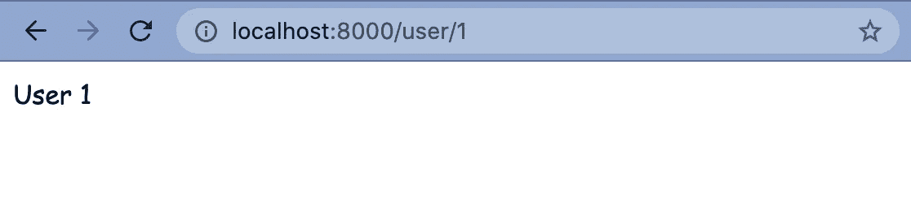
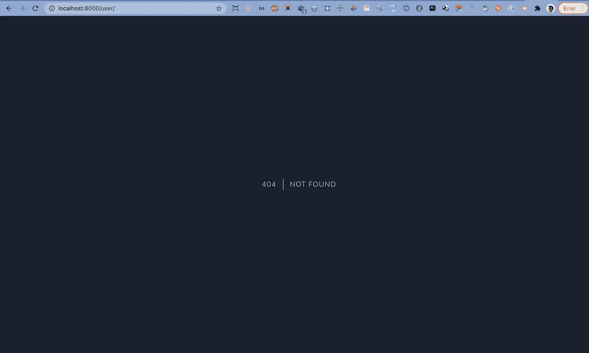

# [Part 4] — Mengenal Routing Laravel 8 | Part 1

> 原文：<https://medium.easyread.co/part-4-mengenal-routing-laravel-8-94a41daaa90f?source=collection_archive---------0----------------------->


Photo by [Jaromír Kavan](https://unsplash.com/@jerrykavan?utm_source=medium&utm_medium=referral) on [Unsplash](https://unsplash.com?utm_source=medium&utm_medium=referral)

Rute adalah cara membuat URL permintaan aplikasi kamu. URL ini tidak harus memetakan ke file tertentu di situs web. Hal terbaik tentang URL ini adalah keduanya dapat dibaca manusia dan ramah SEO.


[https://puteka85.blogspot.com/2012/03/bingung-dengan-alamat-jalan-minta.html](https://puteka85.blogspot.com/2012/03/bingung-dengan-alamat-jalan-minta.html)

Sama seperti kamu ingin menemukan alamat suatu tempat, routing juga mencari suatu alamat tertentu, bisa halaman atau fungsi-fungsi web service. Bayangkan tidak ada routenya? Segala semua jenis yang ingin kamu dapatkan bisa kemana-mana, bisa dibilang **salah alamat** . Misalnya kamu ingin membuka halaman Facebook, tapi karena tidak ada aturan yang mengatur alamatnya, maka bisa saja kamu pergi ke servernya Twitter. Kira-kira gitu konsep sederhananya.

Nah, kalau Laravel memberikan aturan tentang routing terdapat di direktori `routes` . Dimana di dalam direktori tersebut terdapat ada 4 file yang punya fungsinya masing-masing. Berikut tentang ke 4 file tersebut, diantaranya:

*   File `web.php` berisi route yang ditempatkan RouteServiceProvider di grup middleware web, yang menyediakan status sesi, perlindungan CSRF, dan enkripsi cookie. Jika aplikasi kamu tidak menawarkan stateless, RESTful API maka kemungkinan besar semua route kamu kemungkinan besar akan ditentukan di file web.php.
*   File `api.php` berisi route yang ditempatkan RouteServiceProvider di grup middleware api. Route ini dimaksudkan untuk menjadi tanpa kewarganegaraan, jadi permintaan yang memasuki aplikasi melalui route ini dimaksudkan untuk diautentikasi melalui token dan tidak akan memiliki akses ke status sesi.
*   File `console.php` adalah tempat kamu dapat menentukan semua perintah konsol berbasis penutupan kamu. Setiap penutupan terikat ke contoh perintah yang memungkinkan pendekatan sederhana untuk berinteraksi dengan setiap metode IO perintah. Meskipun file ini tidak menentukan route HTTP, file ini mendefinisikan titik masuk (route) berbasis konsol ke dalam aplikasi kamu.
*   File `channels.php` adalah tempat kamu dapat mendaftarkan semua saluran penyiaran acara yang didukung aplikasi kamu.

Sebelum mengenal **routing** , saya akan ajak kamu info singkat terkait **http method** , namun detilnya saya bisa jelaskan ditulisan yang berbeda. Saya akan memberikan method-method yang familiar atau yang biasa digunakan, yaitu:

*   `GET`

Metode `GET` meminta representasi sumber daya yang ditentukan. Permintaan menggunakan `GET` seharusnya hanya mengambil data.

*   `POST`

Metode `POST` digunakan untuk mengirimkan entitas ke sumber daya yang ditentukan, sering menyebabkan perubahan pada keadaan atau efek samping pada server.

*   `PUT`

Metode `PUT` menggantikan semua representasi terkini dari sumber target dengan muatan permintaan.

*   `PATCH`

Metode `PATCH` digunakan untuk menerapkan modifikasi sebagian pada sumber daya.

*   `DELETE`

Metode `DELETE` akan menghapus sumber daya yang ditentukan.

# Basic Routing

Router paling dasar di Laravel menerima URL dan kemudian mengembalikan nilai. Nilainya bisa berupa string, view atau controller. Semua rute disimpan di `routes/web.php` :

```
Route::get('/greeting', function () {
    return 'Hello World';
});
```

Detail :

*   `get` merupakan HTTP method yang sudah dijelaskan diatas. Method ini berguna untuk menampilkan data.
*   `/greetings` merupakan URI atau alamat yang akan diakses.
*   `return ‘Hello world’` merupakan kembalian yang ingin dikeluarkan dalam suatu route tersebut.


Nah, gimana kalau ada parameter yang dikirim? Kita bisa tambah di bagian setelah funtion menjadi seperti ini, misalnya untuk melihat halaman detail pada setiap satu user yang tersimpan dalam database. Perhatikan baik-baik di bawah ini ya.

# Required Parameter

Berikut contoh jika dalam suatu route membutuhkan sebuah data dinamis atau yang dapat berubah atau bisa disebut sebagai parameter.

```
Route::get('/user/{id}', function ($id) {
    return 'User '.$id;
});
```

Detail :

*   `/user/{id}` merupakan URI yang `id` sebagai parameternya
*   `function ($id)` merupakan fungsi yang menangkap nilai dari suatu parameternya, yang dimana parameter pada contoh ini adalah `id`
*   `return 'User '.$id` merupakan output dari function callbacknya



Jika nilai parameter tidak dimasukkan, maka akan hasilnya akan menjadi seperti ini,



Parameter `route` selalu terbungkus dalam {} tanda kurung dan harus terdiri dari karakter alfabet. Garis bawah (_) juga dapat diterima dalam nama parameter rute. Parameter rute dimasukkan ke dalam callback / pengontrol `route` berdasarkan urutannya — nama argumen callback / pengontrol `route` tidak menjadi masalah.

## [Parameters & Dependency Injection](https://laravel.com/docs/8.x/routing#parameters-and-dependency-injection)

Jika route Anda memiliki dependensi yang kamu ingin agar service container Laravel secara otomatis dimasukkan ke dalam callback route kamu, kamu harus mencantumkan parameter route setelah dependensi kamu:

```
<?phpuse Illuminate\Support\Facades\Route;**use Illuminate\Http\Request;** Route::get('/greetings', function () { *// return view('welcome');* return 'User ' .$id; *// return 'Hello World';*});Route::get('/user/{id}', function (**Request $request**, $id) { return 'User '.$id;});
```

# Optional Parameters

Terkadang kamu mungkin perlu menentukan parameter `route` yang mungkin tidak selalu ada di URI. Kamu dapat melakukannya dengan menempatkan `?` tandai setelah nama parameter. Pastikan untuk memberikan nilai default pada variabel rute yang sesuai:

```
Route::get('/user/{name?}', function ($name = null) {
    return $name;
});

Route::get('/user/{name?}', function ($name = 'John') {
    return $name;
});
```

**Mengingat tentang routing ini masih banyak yang harus saya tulis, maka akan saya lanjutkan pada tulisan berikutnya ya.**

# Konklusi

Routing menjadi hal yang sangat mendasar dan penting yang harus dikuasai sebelum ingin lanjut belajar membuat controller, model, middleware, view, atau pun service-service yang lainnya.

Terima kasih sudah membaca tulisan ini dan semoga bermanfaat.

# Referensi

 [## Routing

### The most basic Laravel routes accept a URI and a closure, providing a very simple and expressive method of defining…

laravel.com](https://laravel.com/docs/8.x/routing)  [## HTTP request methods

### HTTP mendefinisikan seperangkat metode permintaan untuk menunjukkan tindakan yang diinginkan yang akan dilakukan untuk…

developer.mozilla.org](https://developer.mozilla.org/id/docs/Web/HTTP/Methods) 

Series : Laravel

*   [[Part 1] — Salam Kenal, Saya Laravel 8](https://pandhuwibowo.medium.com/part-1-salam-kenal-saya-laravel-8-6e9d75099939)
*   [[Part 2] — Menginstall Laravel (Laravel 8)](https://pandhuwibowo.medium.com/part-2-menginstall-laravel-laravel-8-72e27fa98fcd)
*   [[Part 3] — Konfigurasi dan Mengenal Struktur Folder Laravel 8](https://pandhuwibowo.medium.com/part-3-konfigurasi-dan-mengenal-struktur-folder-laravel-8-450089601c42)
*   [Part 4] — Mengenal Routing Laravel 8 [Sekarang disini]

[Call Friends]

Halo teman teman, untuk mendukung agar saya tetap bisa membuat tulisan-tulisan menarik lainnya. Kamu bisa support saya dengan membeli produk-produk asli produksi sendiri, homemade, dan yang pastinya brand lokal hanya di [@beneteen](https://www.instagram.com/beneteen/) atau ke [beneteen.com](https://beneteen.com/)