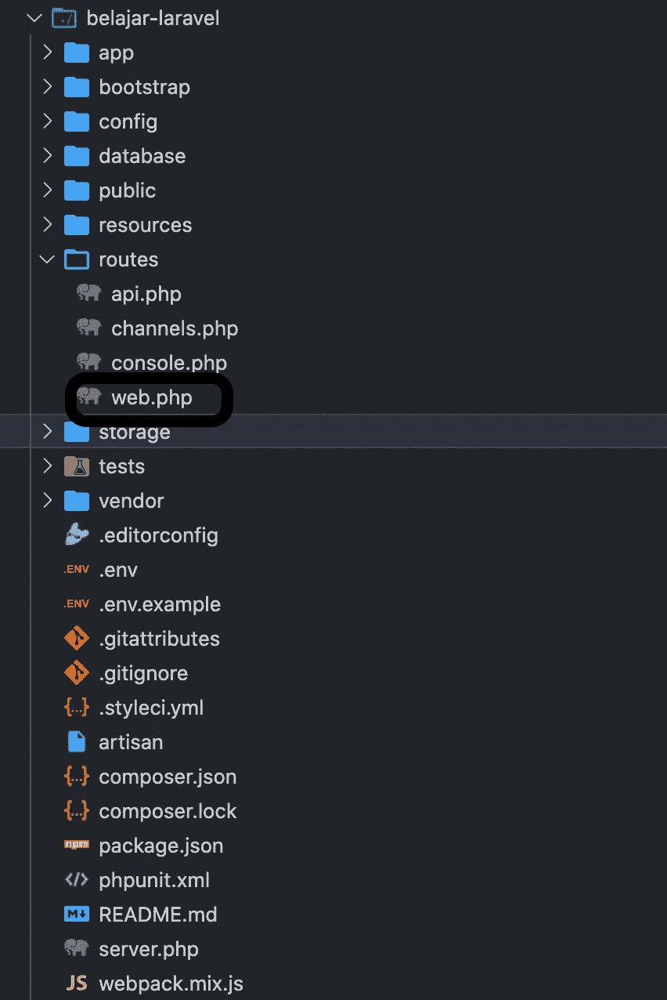
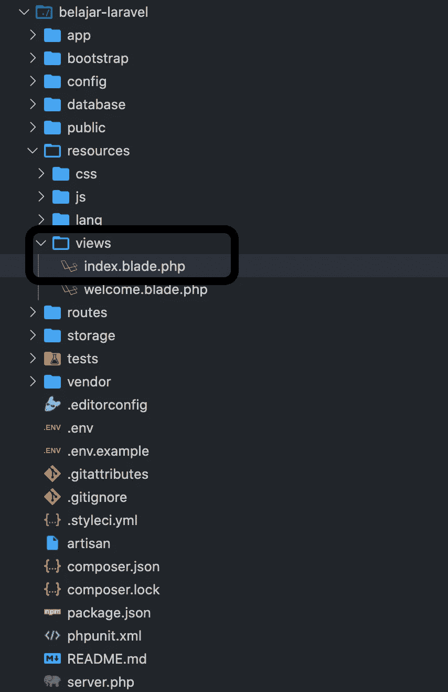
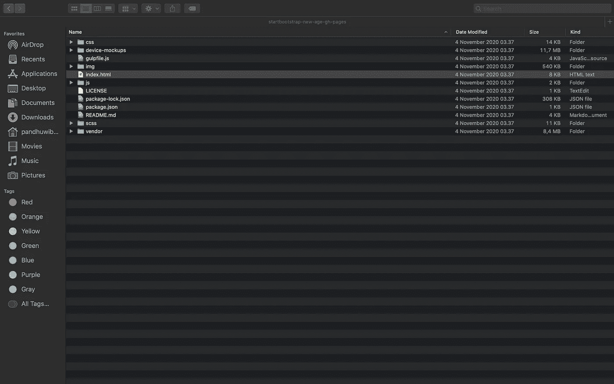
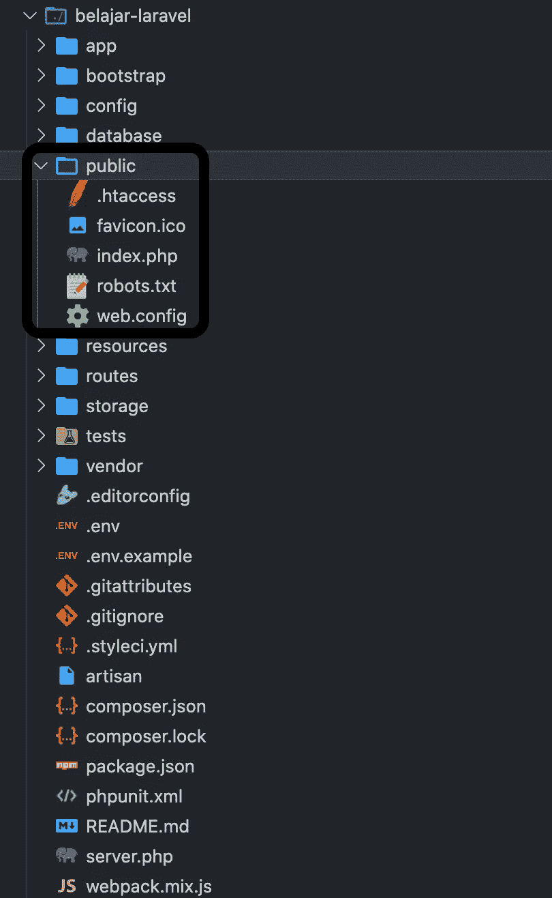
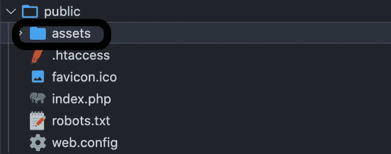
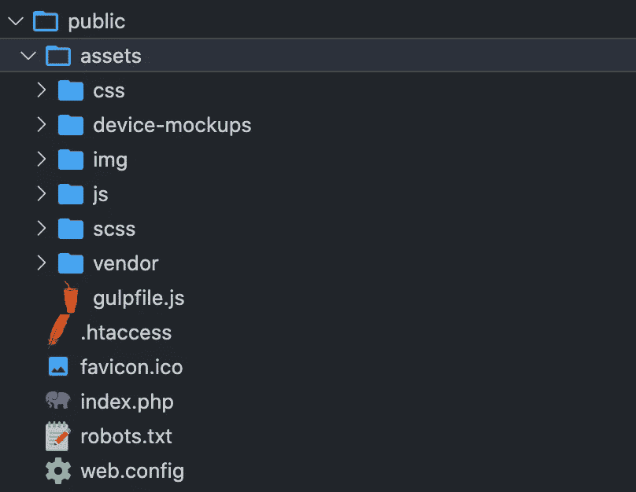
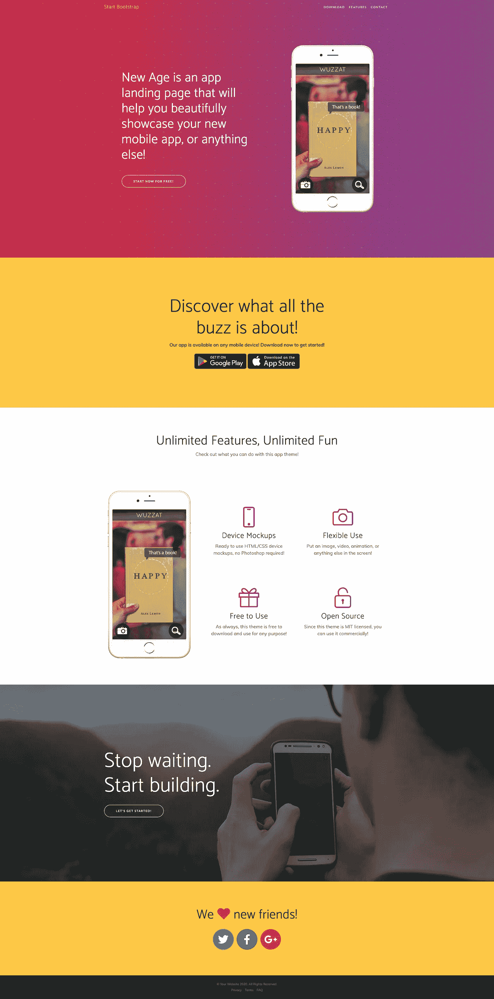

# [Part 5] — Ambil Template dan Pakai untuk Project Laravel 8 Kamu!

> 原文：<https://medium.easyread.co/part-5-ambil-template-dan-pakai-untuk-project-laravel-8-kamu-a9c006fb7b34?source=collection_archive---------0----------------------->


Photo by [Greg Rakozy](https://unsplash.com/@grakozy?utm_source=medium&utm_medium=referral) on [Unsplash](https://unsplash.com?utm_source=medium&utm_medium=referral)

Halo teman-teman, kembali lagi dalam seri Laravel 8\. Kamu akan saya ajak untuk mencoba fitur dari Laravel, yaitu **Asset dan Blade dengan implementasi dengan template** .

Laravel memiliki caranya tersendiri untuk menempatkan atau memasukkan sebuah interface agar bisa terhubung dengan routingnya dan bisa terlihat oleh penggunanya. Kali ini saya akan mempraktekkannya dengan menempatkan template ke dalam fitur Laravel tersebut. Anyway, fitur ini sudah ada juga ya di versi 7 dan sebelumnya. Jadi jangan berpikir ini cuma ada di versi Laravel 8 saja ya.

# Asset

Asset merupakan fungsi yang tersedia pada Laravel yang berguna untuk mengimport file, file tersebut bisa berupa .css, .js, ekstensi dari gambar, dan sebagainya.

# Blade

Kalau Blade, merupakan templating yang disediakan pada Laravel yang sederhana namu powerful. Tidak seperti beberapa templating PHP, Blade tidak memberikan batasan kamu untuk menggunakan kode PHP biasa di template kamu. Fakta dari Blade yaitu, semua template Blade dikompilasi ke dalam kode PHP biasa dan di-cache hingga dimodifikasi, yang berarti Blade pada dasarnya tidak menambahkan overhead ke aplikasi kamu. File template Blade menggunakan ekstensii file `.blade.php` dan biasanya disimpan dalam direktori `resources/views` .

# Praktek

Kamu akan mencoba membuat sebuah halaman landing page di dalam Laravel kamu.

*   Step 1 : Download Template, kamu download template gratis yang saya berikan pada link berikut : [https://startbootstrap.com/previews/new-age](https://startbootstrap.com/previews/new-age)
*   Step 2 : Siapkan routing landing page-nya. Copy paste kode di bawah ini di halaman `routes/web.php`



*   Step 3 : Buat file `index.blade.php` di dalam directory `resources/views`



*   Step 4 : Copy paste kode dari templatenya

Struktur templatenya seperti ini :



Buka file `index.html` , dan copy paste kode di dalamnya ke dalam `index.blade.php`

Coba kamu jalankan command start Laravel-nya dulu untuk melihat progressnya seperti apa.

```
$ php artisan serve
```


Kalau hasilnya seperti ini, yang kamu lakukan sudah benar sejauh ini.

*   Step 5 : Sekarang kamu import asset yang dibutuhkan untuk memperbagus tampilannya. Silakan cek direktori `public` kamu.



Sekarang kita buat file baru namanya `assets` . Jadi seperti ini.



Step 6 : Sekarang kamu import file pendukung tampilannya ke dalam direktori `assets` hingga bertambah jadi seperti ini.



Step 7 : Sekarang kamu kembali ke file `index.blade.php` yang berada di direktori `resources/views` tadi. Lalu copy paste kodenya ke dalam file kamu.

Step 8 : Lihat hasilnya deh di bawah ini.



# Konklusi :

Kamu sudah mengetahui fitur dari blade & asset dengan implementasi menggunakan template free yang bisa kamu terapkan dengan template-template yang sesuai yang sedang kamu kerjakan. Selamat mencoba dan semoga bermanfaat.

[Call Friends]

Halo teman teman, untuk mendukung agar saya tetap bisa membuat tulisan-tulisan menarik lainnya. Kamu bisa support saya dengan membeli produk-produk asli produksi sendiri, homemade, dan yang pastinya brand lokal hanya di [@beneteen](https://www.instagram.com/beneteen/) atau ke [beneteen.com](https://beneteen.com/)