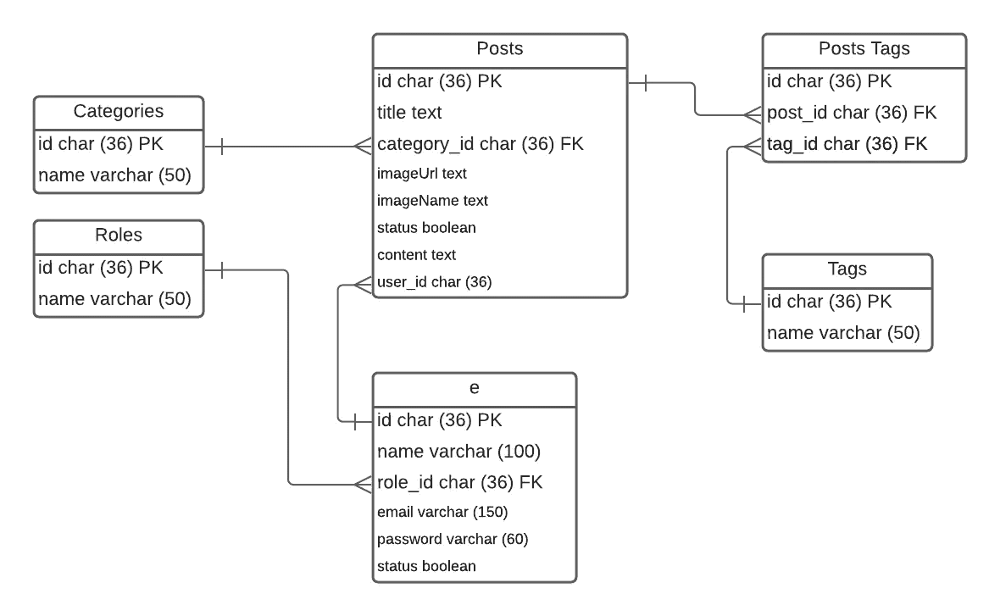
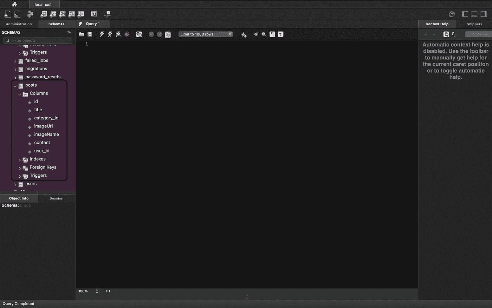

# [Part 6] — Laravel Migrations

> 原文：<https://medium.easyread.co/part-6-laravel-migrations-2b6acf7e4b53?source=collection_archive---------4----------------------->


Photo by [Krzysztof Hepner](https://unsplash.com/@nsx_2000?utm_source=medium&utm_medium=referral) on [Unsplash](https://unsplash.com?utm_source=medium&utm_medium=referral)

Halo teman-teman, selamat datang di blog saya. Kamu sedang berada dalam kelas untuk membahas **Laravel Migrations** .

# Definisi Migrations

Migration ? Sederhananya itu adalah cara generate yang dimungkinkan untuk membuat table di dalam database kamu tanpa harus membuatnya langsung di database manager.

# Alasan Pakai Migrations

Kenapa sih kita harus pakai migration? Konsern utamanya adalah soal kolaborasi atau kerja bareng tim. Sebagai contoh, ada kolom baru dalam suatu tabel ingin ditambahkan, bagaimana kamu melakukannya? Langsung tambahkan kolomnya dari database manager? Ok, sekarang kamu ada 5 orang dalam satu tim dan ternyata beberapa dari teman kamu lupa untuk menambahkannya atau kurang brief dari kamu, akibatnya apa? yap, akibatnya akan error. Response dari laravel akan cut proses dan menampilkan errornya. Nah dengan migration diharapkan kejadian itu tidak terjadi lagi. Intinya mudah untuk kolaborasi.

Migration bisa menambahkan atau menghapus field table ke/dari database kamu tanpa merusak isinya.

# Praktek

Setelah tau sekilas, kamu bisa praktekan dengan mengkuti penjelasan dibawah ini.

— Step 1 : Pastikan database kamu berjalan dengan baik atau sudah running

— Step 2 : Mari kita design databasenya dengan nama `blog` dan salah satu tablenya namanya `categories` . Notes: Usahakan nama tablenya dibuat plural atau jamak dan kalau bisa pakai bahasa inggris. Walaupun itu cuma suggestion saja. Tidak diikutin juga ga masalah.

— Step 3 : Silahkan lihat Entity Relational Database di bawah ini. Dan silahkan buat migration-nya sesuai dengan diagram di bawah ini.



— Step 4 : Sekarang buat nama database-nya dengan nama `blogs`


Editor: MySQLWorkbench

— Step 5 : ( **Optional Step** )Kalau belum buat projectnya, silahkan buat project-nya dulu dengan nama `blog` . Atau ikuti perintah di bawah ini.

```
composer create-project laravel/laravel blog
```

Kalau sudah silakan di-enter dan tunggu sampai process pembuatan project selesai.

— Step 6 : Set up `.env` di dalam project Laravelnya.


Silahkan sertakan password jika memang ada.


Secara default Laravel telah menyediakan susunannya seperti gambar di atas. Kamu biarkan saja, tidak perlu di hapus.

— Step 7 : Untuk testing set up nya berjalan dengan baik atau tidak silahkan ketikkan perintah di bawah ini.

```
php artisan migrate:install
```

Jika gagal membuat migrationnya pertama kali, perhatikan kalau koneksi MySQL kamu terkoneksi dengan baik. Atau mungkin jika muncul seperti ini :

*   **SQLSTATE[HY000] [2054] The server requested authentication method unknown to the client (SQL: create table `migrations` (`id` int unsigned not null auto_increment primary key, `migration` varchar(255) not null, `batch` int not null) default character set utf8mb4 collate ‘utf8mb4_unicode_ci’)**
*   **SQLSTATE[HY000] [2054] The server requested authentication method unknown to the client (SQL: select * from information_schema.tables where table_schema = blogs and table_name = migrations and table_type = ‘BASE TABLE’)**

Jika muncul error seperti di atas saat menjalankan command artisan di atas, coba ikuti syntax SQL di bawah ini.

```
CREATE USER 'user_kamu'@'localhost' IDENTIFIED WITH mysql_native_password BY 'password_mysql_kamu';GRANT ALL PRIVILEGES ON database_kamu.* TO 'user_kamu'@'localhost';ALTER USER 'user_kamu'@'localhost' IDENTIFIED WITH mysql_native_password BY 'password_mysql_kamu';
```

Keterangan :

*   Ganti `user_kamu` dengan username MySQL kamu.
*   Ganti `database_kamu` dengan nama database kamu.
*   Ganti `password_mysql_kamu` dengan password MySQL kamu.

Nah, kalau sudah coba run lagi command di atas.

```
php artisan migrate:install
```

atau

```
php artisan migrate
```

Tampilannya akan menjadi seperti ini di database manager kamu jika berhasil.


— Step 8 : Jika pada tahap tersebut sudah selesai, maka mari kita lakukan sesuai dengan yang ada di ERD di atas ya. Namun, mungkin saya tidak akan melakukan semuanya, saya hanya melakukan 1 atau 2 table pada ERD tersebut.

Saya akan melakukan ini pada table `categories` dengan `posts` . Dengan diawali membuat migrasi untuk table `categories` . Ketik perintah di bawah ini.

```
php artisan make:migration create_categories_table
```

Kalau berhasil akan mengembalikan message berikut ini.


Dan muncul file baru seperti ini.


Dan di dalamnya akan berisi seperti ini by default.

— Step 9 : Ubah kode di dalam file tersebut menjadi seperti ini.

— Step 10 : Dan jalankan perintah seperti perintah / command yang pertama.

```
php artisan migrate
```


Nah, akan muncul di database manager kamu table baru bernama `categories` .

— Step 11 : Lakukan seperti `step 8` dengan mengganti bagian akhirnya menjadi

```
php artisan make:migration create_posts_table
```

File baru akan bertambah di dalam direktor `database/migrations/` . Dan buka file yang tadi sudah kita buat. Dan ubah sesuai dengan field pada diagram di atas.

— Step 12 : Run command seperti `step 10` . Dan hasil di database manager seperti ini.



# Konklusi

Barusan itu adalah merupakan cara kita untuk membuat table ke database menggunakan migrasi. Sekian dari saya, selamat mencoba dan semoga berhasil. Salam.

[Call Friends]

Halo teman teman, untuk mendukung agar saya tetap bisa membuat tulisan-tulisan menarik lainnya. Kamu bisa support saya dengan membeli produk-produk asli produksi sendiri, homemade, dan yang pastinya brand lokal hanya di [@beneteen](https://www.instagram.com/beneteen/) atau ke [beneteen.com](https://beneteen.com/)