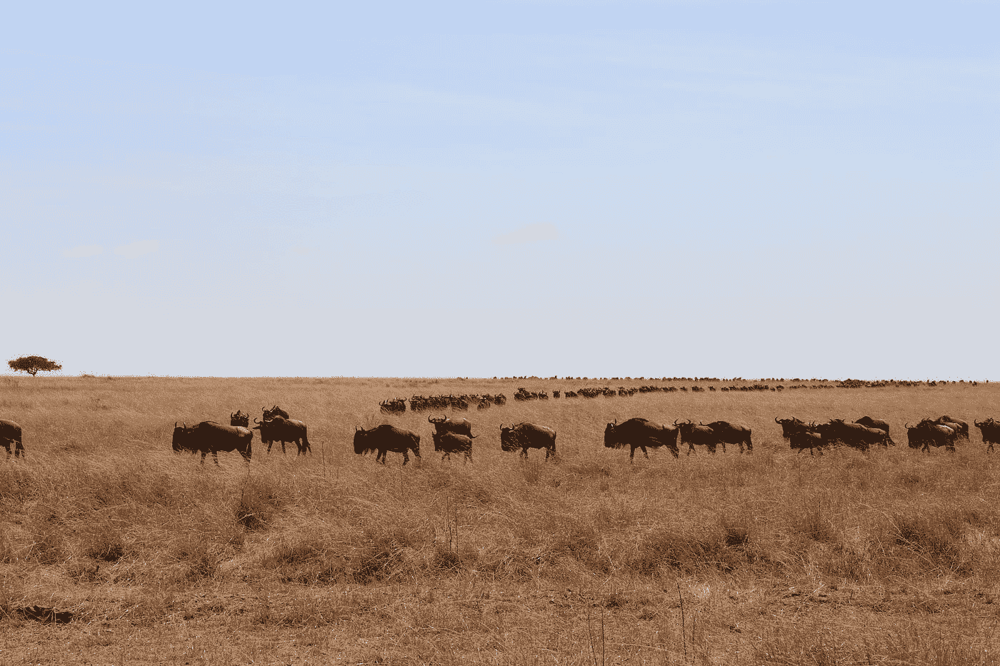
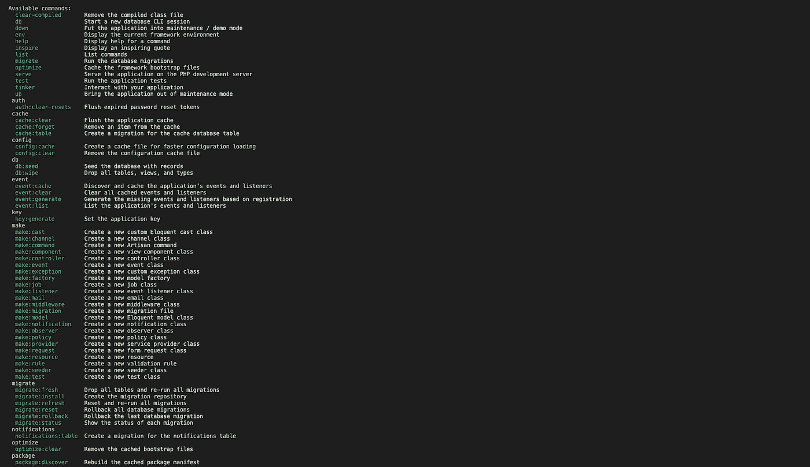
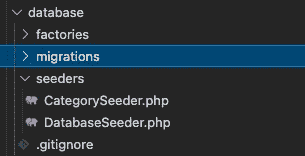

# [Part 7] — Laravel Migrations (Lanjutan) & Seeding

> 原文：<https://medium.easyread.co/part-7-laravel-migrations-lanjutan-seeding-556120a825aa?source=collection_archive---------5----------------------->



Photo by [Younghyun Kim](https://unsplash.com/@walkytalky?utm_source=medium&utm_medium=referral) on [Unsplash](https://unsplash.com?utm_source=medium&utm_medium=referral)

Halo teman-teman, selamat datang di blog saya. Kali ini kamu ada dalam pembahasan mengenai lanjutan Laravel Migrations [part sebelumnya](https://pandhuwibowo.medium.com/part-6-laravel-migrations-2b6acf7e4b53) dan akan ada tambahan mengenai Seeding pada Laravel.

# Laravel Migrations (Lanjutan)

Jika kita print perintah `artisan` di command line atau terminal kamu. Maka akan muncul baris command artisan seperti ini.



Nah dari gambar tersebut mungkin bisa fokus ke beberapa command yang pada migrate.

```
migrate
  migrate:fresh        Drop all tables and re-run all migrations
  migrate:install      Create the migration repository
  migrate:refresh      Reset and re-run all migrations
  migrate:reset        Rollback all database migrations
  migrate:rollback     Rollback the last database migration
  migrate:status       Show the status of each migration
```

Kamu bisa coba satu-satu mulai dari `migrate:fresh` .

## migrate:fresh

Perintah ini akan drop semua tabel di database. Perlu diingat itu tidak menggunakan metode down () dari migrasi kamu.

```
$ php artisan migrate:freshDropped all tables successfully.
Migration table created successfully.
Migrating: 2014_10_12_000000_create_users_table
Migrated:  2014_10_12_000000_create_users_table (15.67ms)
Migrating: 2014_10_12_100000_create_password_resets_table
Migrated:  2014_10_12_100000_create_password_resets_table (10.73ms)
Migrating: 2019_08_19_000000_create_failed_jobs_table
Migrated:  2019_08_19_000000_create_failed_jobs_table (10.16ms)
Migrating: 2021_04_03_015003_create_roles_table
Migrated:  2021_04_03_015003_create_roles_table (12.25ms)
Migrating: 2021_04_03_020022_create_categories_table
Migrated:  2021_04_03_020022_create_categories_table (4.10ms)
```

Keterangan : Table yang saya buat yaitu, `users` , `password_resets` , `failed_jobs` , `roles` , `categories` .

## migrate:refresh

Perintah ini hanya akan mengembalikan migrasi sebenarnya dengan benar-benar menjalankan metode down () pada semua migrasi kamu, dan kemudian menjalankan migrasi dari awal.

```
$ php artisan migrate:refreshRolling back: 2021_04_03_020022_create_categories_table
Rolled back:  2021_04_03_020022_create_categories_table (11.13ms)
Rolling back: 2021_04_03_015003_create_roles_table
Rolled back:  2021_04_03_015003_create_roles_table (2.91ms)
Rolling back: 2019_08_19_000000_create_failed_jobs_table
Rolled back:  2019_08_19_000000_create_failed_jobs_table (3.72ms)
Rolling back: 2014_10_12_100000_create_password_resets_table
Rolled back:  2014_10_12_100000_create_password_resets_table (3.22ms)
Rolling back: 2014_10_12_000000_create_users_table
Rolled back:  2014_10_12_000000_create_users_table (3.87ms)
Migrating: 2014_10_12_000000_create_users_table
Migrated:  2014_10_12_000000_create_users_table (14.49ms)
Migrating: 2014_10_12_100000_create_password_resets_table
Migrated:  2014_10_12_100000_create_password_resets_table (8.62ms)
Migrating: 2019_08_19_000000_create_failed_jobs_table
Migrated:  2019_08_19_000000_create_failed_jobs_table (11.11ms)
Migrating: 2021_04_03_015003_create_roles_table
Migrated:  2021_04_03_015003_create_roles_table (12.07ms)
Migrating: 2021_04_03_020022_create_categories_table
Migrated:  2021_04_03_020022_create_categories_table (6.09ms)
```

## migrate:rollback

Perintah ini akan menjalankan pengembalian migrasi terakhir yang telah dibuat. Migrasi terakhir akan dihapus dari database migration. Namun file pada project Laravel-nya akan tetap ada. Perintah ini tidak mengeksekusi semua table-nya melainkan hanya 1 atau beberapa juga bisa dilakukan.

```
$ php artisan migrate:rollbackRolling back: 2021_04_03_020022_create_categories_table
Rolled back:  2021_04_03_020022_create_categories_table (11.99ms)
Rolling back: 2021_04_03_015003_create_roles_table
Rolled back:  2021_04_03_015003_create_roles_table (3.06ms)
Rolling back: 2019_08_19_000000_create_failed_jobs_table
Rolled back:  2019_08_19_000000_create_failed_jobs_table (3.50ms)
Rolling back: 2014_10_12_100000_create_password_resets_table
Rolled back:  2014_10_12_100000_create_password_resets_table (2.93ms)
Rolling back: 2014_10_12_000000_create_users_table
Rolled back:  2014_10_12_000000_create_users_table (2.85ms)
```

## migrate:reset

Perintah ini akan menghapus **semua** table yang ada di database migration.

```
$ php artisan migrate:resetRolling back: 2021_04_03_020022_create_categories_table
Rolled back:  2021_04_03_020022_create_categories_table (4.54ms)
Rolling back: 2021_04_03_015003_create_roles_table
Rolled back:  2021_04_03_015003_create_roles_table (4.10ms)
Rolling back: 2019_08_19_000000_create_failed_jobs_table
Rolled back:  2019_08_19_000000_create_failed_jobs_table (3.04ms)
Rolling back: 2014_10_12_100000_create_password_resets_table
Rolled back:  2014_10_12_100000_create_password_resets_table (2.75ms)
Rolling back: 2014_10_12_000000_create_users_table
Rolled back:  2014_10_12_000000_create_users_table (3.39ms)
```

## migrate:status

Perintah ini akan menampilkan status dari setiap migration yang sudah dibuat atau dijalankan.

```
$ php artisan migrate:status+------+------------------------------------------------+-------+
| Ran? | Migration                                      | Batch |
+------+------------------------------------------------+-------+
| Yes  | 2014_10_12_000000_create_users_table           | 1     |
| Yes  | 2014_10_12_100000_create_password_resets_table | 1     |
| Yes  | 2019_08_19_000000_create_failed_jobs_table     | 1     |
| Yes  | 2021_04_03_015003_create_roles_table           | 1     |
| Yes  | 2021_04_03_020022_create_categories_table      | 1     |
+------+------------------------------------------------+-------+
```

**Perintah-perintah diatas sangat beresiko jika kamu menggunakannya di production** .

Itu mengenai Laravel Migrations, saya tidak akan menulis semuanya. Kalian bisa main-main dalam dokumentasinya langsung ke website resminya.

# Seeding

Laravel menyertakan kemampuan untuk memasukkan database kamu dengan data test menggunakan seed classes. Semua seed classes disimpan dalam direktori `database/seeders` . Secara default, kelas `DatabaseSeeder` ditentukan untuk kamu. Dari kelas ini, kamu dapat menggunakan metode `call` untuk menjalankan seed class lain, memungkinkan kamu untuk mengontrol urutan seeding.

Untuk generate seeder-nya, jalankan perintah `make:seeder` .

Sekarang coba salah satu tablenya untuk diisi. Saya akan mengisi data table untuk table `categories` . Untuk buat seeder-nya silakan ketikan perintah di bawah ini.

```
$ php artisan make:seeder CategorySeeder
```



Maka akan terbuat filenya seperti gambar di atas. Dan di dalam filenya akan berisi seperti ini.

Di dalam kelas `CategorySeeder` berisi method `run()` which is itu akan di execute kalau kamu run command `php artisan db:seed` bersamaan dengan dipanggilnya method call di file `DatabaseSeeder.php` . Di dalam method `run()` kamu bisa mengisi data untuk table `categories` tersebut, bisa menggunakan **query builder** atau **eloquent** .

Saya akan tambahkan ke dalam method `run()` tersebut.

Dan buka file `DatabaseSeeder.php` . Lalu tambahkan code seperti ini.

Lalu jalankan command berikut ini.

```
$ php artisan db:seed
```

Hasil responsenya akan seperti ini.

```
Seeding: Database\Seeders\CategorySeeder
Seeded:  Database\Seeders\CategorySeeder (21.70ms)
Database seeding completed successfully.
```

Yap, kamu sudah berhasil menambahkan data melalui Seeding Laravel.

Seeding dilakukan misalnya untuk menambahkan data user pertama kali / user pertama.

# Konklusi

Kamu sudah mengetahui tentang Seeding dan Migration. Sekarang giliran kamu mempraktekkannya sendiri. Untuk lebih detailnya lagi kamu bisa berkunjung ke website resminya. Selamat mencoba dan semoga bermanfaat.

# Referensi

 [## Database: Migrations

### Migrations are like version control for your database, allowing your team to define and share the application's…

laravel.com](https://laravel.com/docs/8.x/migrations)  [## Database: Seeding

### Laravel includes the ability to seed your database with test data using seed classes. All seed classes are stored in…

laravel.com](https://laravel.com/docs/8.x/seeding) 

[Call Friends]

Halo teman teman, untuk mendukung agar saya tetap bisa membuat tulisan-tulisan menarik lainnya. Kamu bisa support saya dengan membeli produk-produk asli produksi sendiri, homemade, dan yang pastinya brand lokal hanya di [@beneteen](https://www.instagram.com/beneteen/) atau ke [beneteen.com](https://beneteen.com/)