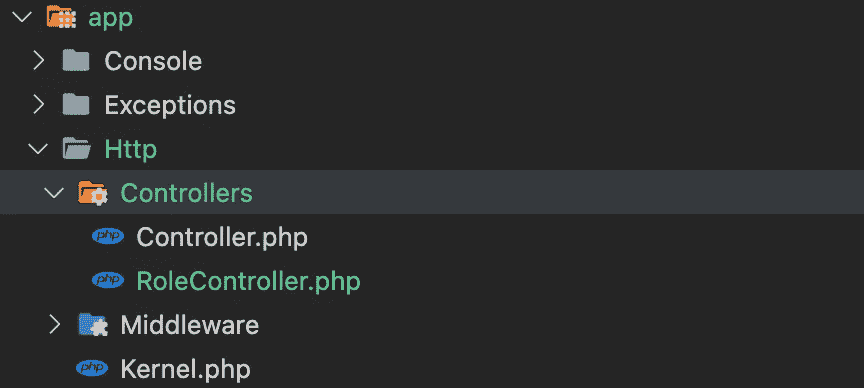
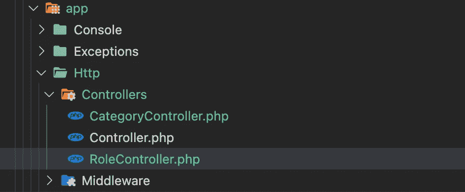
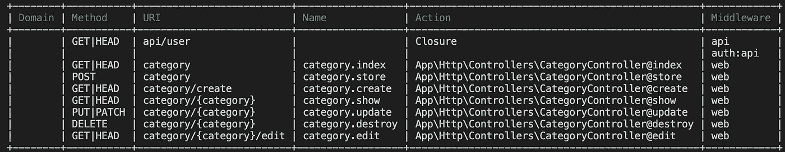
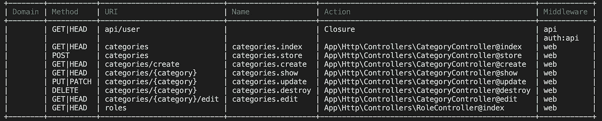
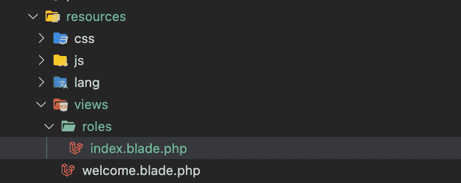
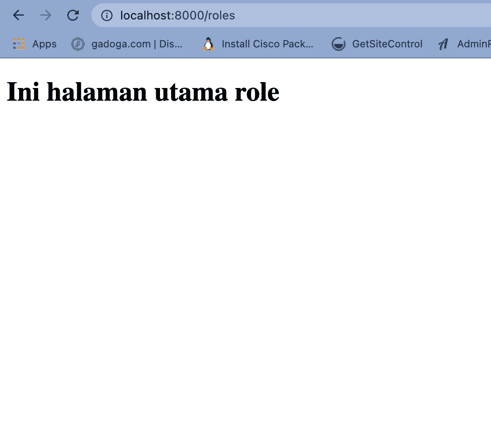

# [Part 8] — Basic dari Controller | Laravel 8

> 原文：<https://medium.easyread.co/part-8-basic-dari-controller-laravel-8-c8c9e8391816?source=collection_archive---------1----------------------->


Photo by [Glenn Carstens-Peters](https://unsplash.com/@glenncarstenspeters?utm_source=medium&utm_medium=referral) on [Unsplash](https://unsplash.com?utm_source=medium&utm_medium=referral)

Halo teman-teman, selamat datang di blog saya. Dan kali ini kamu akan mengetahui apa itu controller, apa kegunaannya, dan bagaimana segalanya tentang doi.

## Controller?

Controller termasuk bagian dari **MVC(ontroller)** . Kamu bisa baca mengenai hal tersebut di luar sana. Banyak sekali referensi yang bisa kamu pelajari. Jadi controller itu merupakan pengendali semua logika terhadap suatu module. Misalkan ingin membuat module `User` . Jadi segala yang masuk berkaitan tentang User akan dikendalikan semua logicnya melalui controller tersebut.

Flownya, pastinya melewati routing terlebih dahulu (kamu bisa baca di tulisan saya sebelumnya), setelah itu akan melewati controller. Dari controller nanti bisa ke model atau view yang nanti akan kita bahas.

## Praktek

Perlu diketahui Laravel membuat keberadaan file controller tersebut berada pada `App\Http\Controllers` . Ya disitu pusat semua controller berada ditempatkan.

Nah perlu diketahui juga kamu bisa membuat file controller menggunakan `migration` yang telah di sediakan oleh Laravel. Berikut caranya.

```
php artisan make:controller [NamaController]
```

Contoh :

```
php artisan make:controller RoleController
```

Nanti file tersebut akan berada pada direktori yang sudah saya sebutkan diatas. Contoh isi filenya seperti ini.



Itu kalau misalkan filenya hanya template sederhana saja. Tapi di Laravel juga ada yang template isi file controllernya sudah tersedia banyak function untuk CRUD. Ini contohnya.

```
php artisan make:controller [NamaController] --resource
```

Contoh realnya kamu harus membuat controller dari category.

```
php artisan make:controller CategoryController --resource
```



Perintah yang terakhir dijalankan kalau memang dari kamu sangat-sangat menggunakan fitur dari Laravel, hanya ingin pakai function bawaan dari Laravelnya saja, tidak usah kasih nama function sendiri.

Dengan menggunakan perintah yang terakhir ini, kamu juga dimudahkan untuk membuat suatu routing untuk controller tersebut. Cukup dengan satu baris kamu sudah handle semua function di dalamnya.

```
use App\Http\Controllers\CategoryController;

Route::resource('photos', CategoryController::class);
```

Keterangan :

*   Baris pertama itu cara kamu mengimport controller Categorynya ke file route.
*   Baris kedua, route yang handle CategoryController tersebut.

Gimana kamu bisa liat list dari route yang tersedia? Begini perintahnya.

```
php artisan route:list+--------+-----------+--------------------------+------------------+-------------------------------------------------+------------+
| Domain | Method    | URI                      | Name             | Action                                          | Middleware |
+--------+-----------+--------------------------+------------------+-------------------------------------------------+------------+
|        | GET|HEAD  | api/user                 |                  | Closure                                         | api        |
|        |           |                          |                  |                                                 | auth:api   |
|        | GET|HEAD  | category                 | category.index   | App\Http\Controllers\CategoryController@index   | web        |
|        | POST      | category                 | category.store   | App\Http\Controllers\CategoryController@store   | web        |
|        | GET|HEAD  | category/create          | category.create  | App\Http\Controllers\CategoryController@create  | web        |
|        | GET|HEAD  | category/{category}      | category.show    | App\Http\Controllers\CategoryController@show    | web        |
|        | PUT|PATCH | category/{category}      | category.update  | App\Http\Controllers\CategoryController@update  | web        |
|        | DELETE    | category/{category}      | category.destroy | App\Http\Controllers\CategoryController@destroy | web        |
|        | GET|HEAD  | category/{category}/edit | category.edit    | App\Http\Controllers\CategoryController@edit    | web        |
+--------+-----------+--------------------------+------------------+-------------------------------------------------+------------+
```



Kamu sudah disediakan methodnya, urinya, namenya, actionnya, dan juga middlewarenya. Mudah dan simple bukan?

Coba kamu lakuin sesuatu di salah satu method tersebut. Misalkan di method indexnya kamu mencetak sesuatu di dalamnya. Kita akan membuat sesuatu di dalam Class Controller Role ya. Beri nama method tersebut menjadi `index` .

File routenya menjadi seperti ini.

Dan hasilnya adalah sebagai berikut.



Setelah kita tambahkan untuk routenya, otomatis jika kita list routenya maka juga akan bertambah. Kalau kamu liat routenya ada di paling bawah.

## **Bagaimana jika ingin menampilkan halaman dari bladenya ?**

Oke kembali ke `RoleController` tambahkan code seperti di bawah ini.

Buat struktur direktori dan juga file seperti di bawah ini.



Lalu buat kodenya seperti ini.

Coba run lagi servernya dan lihat bagaimana hasilnya.



# Konklusi

Selamat kamu sudah berhasil mengikuti bacaan ini sampe akhir. Silakan dicoba-coba dan semoga bermanfaat. Happy weekend!

# Referensi

 [## Controllers

### Instead of defining all of your request handling logic as closures in your route files, you may wish to organize this…

laravel.com](https://laravel.com/docs/8.x/controllers) 

[Call Friends]

Halo teman teman, untuk mendukung agar saya tetap bisa membuat tulisan-tulisan menarik lainnya. Kamu bisa support saya dengan membeli produk-produk asli produksi sendiri, homemade, dan yang pastinya brand lokal hanya di [@beneteen](https://www.instagram.com/beneteen/) atau ke [beneteen.com](https://beneteen.com/)