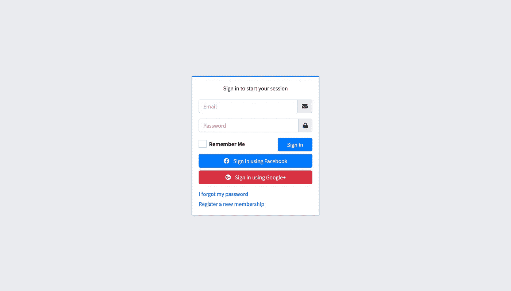

# [Part 9] — Buat Login dari Model Bernama Eloquent | Laravel 8

> 原文：<https://medium.easyread.co/part-9-buat-login-dari-model-bernama-eloquent-laravel-8-2201bdbdc999?source=collection_archive---------3----------------------->


Photo by [Micah Williams](https://unsplash.com/@mr_williams_photography?utm_source=medium&utm_medium=referral) on [Unsplash](https://unsplash.com?utm_source=medium&utm_medium=referral)

Halo teman-teman, selamat datang. Kamu sedang membaca mengenai Model dan di sesi terakhir nanti kita akan membuat suatu login customisasi. Walaupun sebenernya Laravel sudah menyiapkan fitur loginnya, tapi nanti kita akan buat versi sendiri.

# Model

Model secara sederhana merupakan penghubung antara database dan aplikasi. Pada Laravel tersedia Query Builder dan juga Eloquent alias ORM. ORM kepanjangan dari Object Relational Mapping. Dan pada tulisan ini saya akan menulis secara singkat mengenai ORM pada Laravel atau Eloquent.

Dan berikut ini merupakan Model dari Module Login yang akan kita buat nanti.

Kamu hanya perlu memberi tahu Modelnya seperti ini sudah bisa membuat sebuah CRUD. Model diatas akan kamu gunakan untuk mengerjakan case membuat fitur login. Let’s make it real.

# Case : Membuat fitur Login

Pada case kali ini, kamu akan membuat Login secara customize, alias kita tidak akan menggunakan fitur bawaan yang ada di Laravel. Berikut pengerjaannya. Simak baik-baik ya.

*   Step 1 : Jangan rubah model yang sudah dibuat dari Laravelnya ya.
*   Step 2 : Buat route seperti di bawah ini.

*   Step 3 : Buat halaman view Loginnya. Simpan di dalam direktori `front-layout` dan beri nama `signin.blade.php` . Copy codenya seperti ini.

NB : Saya menggunakan template Login dari AdminLTE. Silahkan ke website resminya untuk mendownload dan mengimplementasikannya di project Laravel kamu. Hasil tampilannya nanti seperti ini ya.



*   Step 4 : Buat Controller Sign In nya dengan nama sesuai mapping routenya. `SignInController.php`

NB : Untuk halaman dashboard kamu abaikan dulu saja. Bisa dengan memberikan komentar pada bagian tersebut atau dihapus dulu. Saya akan gunakan nanti pada sesi berikutnya.

Terus kalau kamu lihat dibagian routenya itu kan ada middlewarenya ya, nah sekarang kamu akan membuat itu. Mari kita buat.

*   Step 5 : Ketik perintah dibawah ini.

```
php artisan make:middleware AuthCheck
```

Terus enter. Lalu di isi filenya dengan isi sebagai berikut.

*   Step 6 : Lalu buka `Kernel.php` . Dan tambahkan baris ini di bagian

*   Step 7 : Ubah file `signin.blade.php` menjadi seperti ini.

# Konklusi

Kamu sudah mempraktekkan cara membuat Login tanpa menggunakan fitur Auth dari Laravelnya tersebut. Selamat, share jika bermanfaat ya. Terima kasih sudah berkunjung dan membaca sampai akhir.

[Call Friends]

Halo teman teman, untuk mendukung agar saya tetap bisa membuat tulisan-tulisan menarik lainnya. Kamu bisa support saya dengan membeli produk-produk asli produksi sendiri, homemade, dan yang pastinya brand lokal hanya di [@beneteen](https://www.instagram.com/beneteen/) atau ke [beneteen.com](https://beneteen.com/)