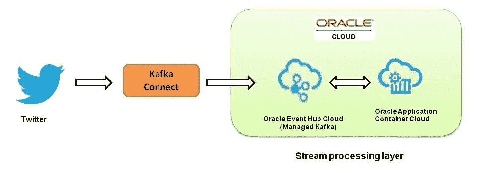
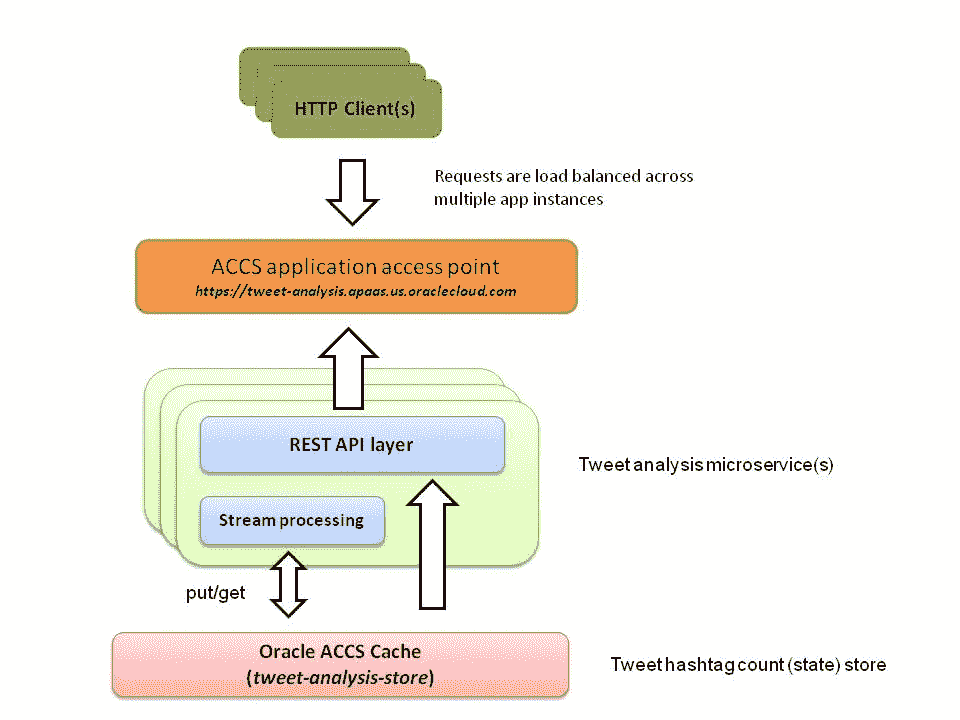

# 第 1 部分:在 Oracle Cloud 上使用 Apache Kafka 流开发流处理应用程序

> 原文：<https://medium.com/oracledevs/part-i-develop-stream-processing-apps-using-kafka-streams-on-oracle-cloud-6c840bc95a16?source=collection_archive---------0----------------------->

本博客展示了如何使用 Kafka Streams 库和 Oracle 云服务来开发和部署有状态流处理微服务— [Oracle Event Hub cloud](https://cloud.oracle.com/en_US/event-hub) 、[Oracle Application Container Cloud](https://cloud.oracle.com/en_US/application-container-cloud)、&、 [Oracle Developer Cloud](https://cloud.oracle.com/en_US/developer-service)

> 它分为两部分——第一部分(这部分)涵盖了核心概念和开发方面，接下来是第二部分处理设置、部署& CI/CD 部分

## Oracle 活动中心云

简而言之，Oracle Event Hub Cloud 由 Kafka(即服务)管理，其支持的 Kafka 版本[已升级至 0.10.2](http://docs.oracle.com/en/cloud/paas/event-hub-cloud/whats-new/index.html#EHCWN-GUID-B527C303-EDD7-4320-B4A4-3DC187F6E7A9) (从 0.9.0)。卡夫卡迷可能知道这意味着什么——卡夫卡流**支持！博客中的示例应用程序将利用这一点**

## Oracle 应用容器云

它是一个应用平台即服务( *aPaaS* )，支持多语言运行时(Java SE、Node.js、PHP、Ruby、Python 等)。)

在本博客所展示的用例环境中，它扮演了两个主要角色

*   作为我们的*有状态*流处理(微)服务的可水平扩展的平台
*   它的[缓存功能](http://docs.oracle.com/en/cloud/paas/app-container-cloud/cache/index.html)使它成为我们的流处理应用程序的(中间)状态的分布式存储的最佳选择——细节如下

## Oracle 开发人员云

充当 CI/CD 和敏捷开发平台

让我们从示例应用程序概述、核心概念开始，然后看一些代码

# 应用:高级概述

该应用程序及其目标很简单——给定一个连续的 tweets 流，跟踪一组选定的关键字(如 java、paas、kafka 等)的出现次数。).这类似于标准的*字数统计*问题，希望足够简单来演示所需的概念

这里有三个主要的组成部分——下面是它们是什么以及它们如何相互作用的简要概述

## 卡夫卡连接

Kafka connect twitter (source)连接器接收 tweet 流，并将它们推送到 Kafka 主题。点击查看[这个很酷的项目](https://github.com/Eneco/kafka-connect-twitter)

> 报道 Kafka Connect 超出了本博客的范围——在 [Kafka 文档](https://kafka.apache.org/documentation/#connect)中阅读更多相关内容

## 托管 Kafka broker (Oracle 事件中心云)

Oracle Event Hub Cloud 托管 Kafka 集群和主题(详见**设置&部署**部分),并充当流数据平台

## 推特分析应用

Oracle Application Container Cloud 托管(基于 Kafka 流的) *tweet analysis* 应用以及*状态存储*(缓存)——更多信息请参见**设置&部署**部分

这是这个系统在高层次上的样子

High level overview

# 概念

本节涵盖了与本博客上下文相关的一些基本概念，包括 **Kafka Streams** 以及 **Oracle 应用程序容器云**

> 关于详细信息，我建议深入阅读 Kafka Streams 和 Oracle 应用容器云的文档

## 卡夫卡流概述

简而言之， [Kafka Streams](https://kafka.apache.org/documentation/streams/) 是一个库，您可以将它包含在基于 Java 的应用程序中，以便在 Apache Kafka 的基础上构建流处理应用程序。其他分布式计算平台如 [Apache Spark](http://spark.apache.org/) 、 [Apache Storm](http://storm.apache.org/) 等。在大数据流处理世界中被广泛使用，但是 Kafka Streams 在这方面带来了一些独特的主张

*   建立在 Kafka 之上:利用其可伸缩和容错能力。如果您在您的生态系统中使用 Kafka，那么利用 Kafka Streams 在 Kafka 主题之间产生流数据是非常合理的
*   **灵活部署&弹性本质**:您不受特定部署模型的限制(例如基于集群)。该应用程序可以灵活地打包和部署，并且可以轻松地扩展和缩减
*   **对于快速数据(也是如此)**:利用 Kafka 流的力量在实时系统中处理大量数据——不需要达到大数据规模
*   **其他**:支持有状态、容错、一次一条记录和窗口操作

## Kafka 流 API

Kafka Streams 有两种类型的 API 用于编写流处理应用程序

*   DSL API :它是一个高级的、流畅的 API，使得表达流处理拓扑变得容易
*   `**Processor**` **API:** 这是一个低级 API，可以在你需要更多控制、灵活性和定制的时候使用

## 卡夫卡溪流国营商店

Kafka Streams 提供了一个*状态存储*特性，应用程序可以使用该特性存储其本地处理结果(状态)。 [RocksDB](http://rocksdb.org/) 用作默认状态存储，可用于*持久或内存*模式。就这些而言，有几个选择——你可以

*   使用现成的状态实现，例如 RocksDB、内存中或，
*   编写一个[自定义状态存储实现](https://kafka.apache.org/0110/documentation/streams/developer-guide#streams_developer-guide_interactive-queries_custom-stores)，即实现/扩展 Kafka Streams 接口/类，或者，
*   使用底层的`Processor` API 来插入您自己的状态存储——这是我们示例的实现选择(在下一小节中会有更多的介绍)

> 请注意，到目前为止(Kafka Streams 0.11.0.0 ),自定义实现(上面的选项#2 和#3)只能与低级处理器 API 一起使用

## Oracle 应用程序容器云*缓存*作为状态存储

在我们的示例应用程序中，我们关心的状态是我们选择跟随的关键字出现的*计数——它是如何实现的？*

Oracle 应用容器云提供对[可扩展内存缓存](http://docs.oracle.com/en/cloud/paas/app-container-cloud/cache/caches-oracle-application-container-cloud-service.html)的访问，并在我们的用例中使用*自定义状态存储*

*   单词及其计数存储为键值对
*   高速缓存专用逻辑被插入基于低级处理器 API 的实现中
*   使用 Oracle 应用程序容器云 [Java 缓存 SDK](https://github.com/oracle/accs-caching-java-sdk)

更多细节将在接下来的**代码**部分介绍

> 你可以在[官方文档](http://docs.oracle.com/en/cloud/paas/app-container-cloud/cache/index.html)中阅读更多关于**缓存**特性的信息

以下是一些好处

*   最重要的一点是，对本地状态(在缓存中)的访问既快速又容易实现(与 Kafka Streams 提供的原生 API `StreamsMetadata`)有关详细信息，请参考[文档](https://kafka.apache.org/0110/documentation/streams/developer-guide#streams_developer-guide_interactive-queries_discovery)
*   Oracle Application Container cloud cache 本质上是分布式的(所有应用实例都可以访问同一个缓存)，具有高可用性、可伸缩性，并通过 *Java SDK* 以及 [*REST API*](http://docs.oracle.com/en/cloud/paas/app-container-cloud/rest.html) 提供访问
*   如果需要，其他应用程序/微服务(部署在 Oracle 应用程序容器云中)也可以访问缓存内容(即本例中的流处理状态)

## 可量测性

我们的流处理服务可以双向扩展(详情见[文档](http://docs.oracle.com/en/cloud/paas/app-container-cloud/csjse/exploring-application-overview-page.html)),即弹性扩展

*   向上和向下—增加/减少内存(RAM)
*   进出—减少/增加应用程序的实例数量

> 在**横向扩展**的情况下，Kafka Streams 在所有应用程序实例之间分配(流)处理负载——这由主题中的分区数量决定，例如，如果您有 10 个分区和 5 个应用程序实例，那么每个实例将处理来自两个分区的数据

下面是 Oracle 应用容器云上的流处理服务的一个更细粒度的视图

Implementation details

# 密码

## 成分

*   **卡夫卡溪流**图书馆
*   **泽**(基于 JDK)HTTP 容器
*   **面向 Oracle 应用容器云缓存的 Java 客户端 SDK**

让我们来看一些代码片段——这个项目可以在这里找到

KafkaStreamsAppBootstrap.java 启动球衣 HTTP 容器和 Kafka Streams 应用程序

**KafkaStreamsTweetAnalysisJob.java**设置 Kafka Streams 应用程序和处理器拓扑

**TweetStreamProcessor.java**扩展`org.apache.kafka.streams.processor.Processor`封装主处理逻辑

**TweetAnalysisStateStore.java**在甲骨文 ACCS Java 缓存客户端 SDK 上充当包装器，并公开`put` 和`get` 操作

**TweetStateResource.java**是暴露状态的 REST 端点，即我们正在跟踪的关键词的当前计数。它查询 Oracle ACCS 缓存以获得结果

## 其他人

*   **TweetCountSerializer.java**—用于缓存内容的定制串行化(&解串行化)逻辑(扩展`com.oracle.cloud.cache.basic.io.Serializer`)(转换 b/w `Long` 和`byte[]`)
*   **Stat.java**—表示状态(计数)的 JAXB 注释类

这一部分到此为止——接下来继续第二部分

*   Oracle 云组件的配置和部署
*   如何运行/测试应用程序

# 不要忘记…

*   查看 Oracle 应用容器云的教程[——每个运行时都有一些内容！](https://docs.oracle.com/en/cloud/paas/app-container-cloud/create-first-applications.html)
*   [应用容器云上的其他博客](http://bit.ly/2gR3nrV)

> *本文表达的观点是我个人的观点，不一定代表甲骨文的观点。*