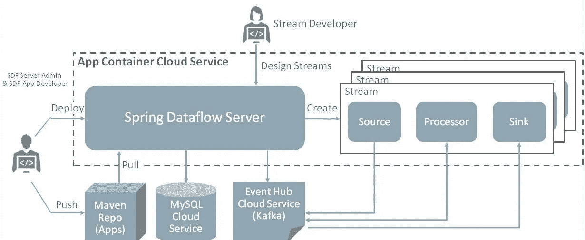
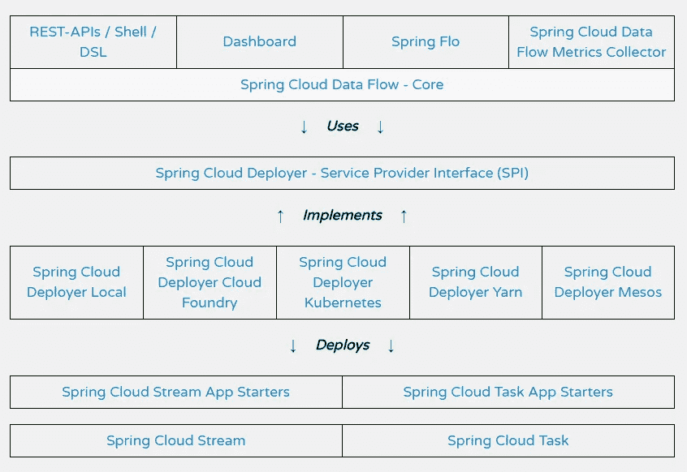
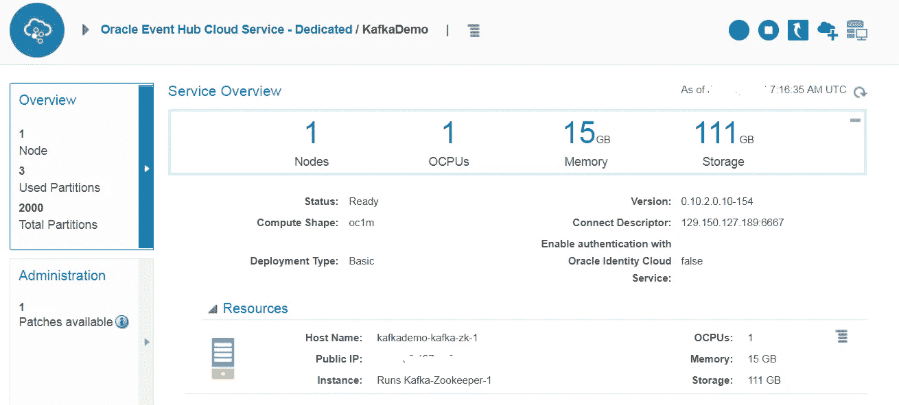
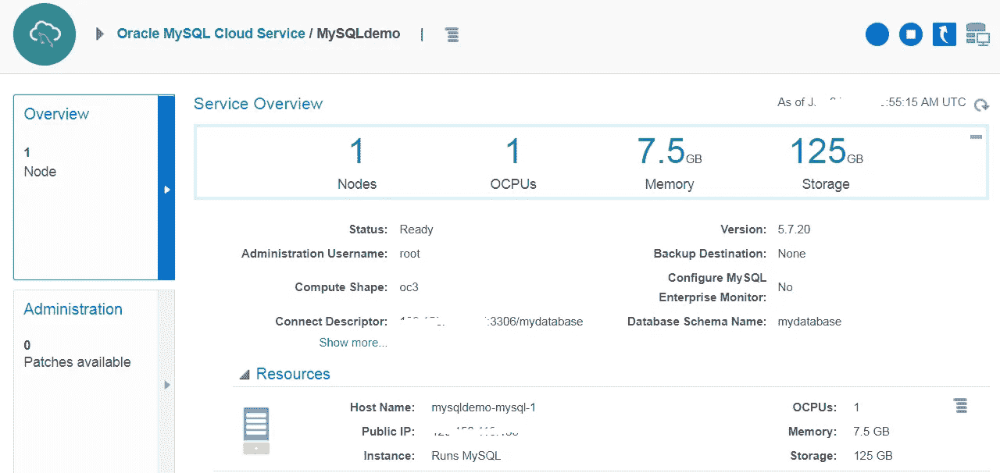
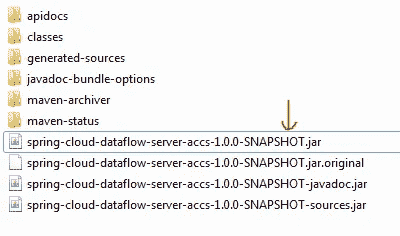
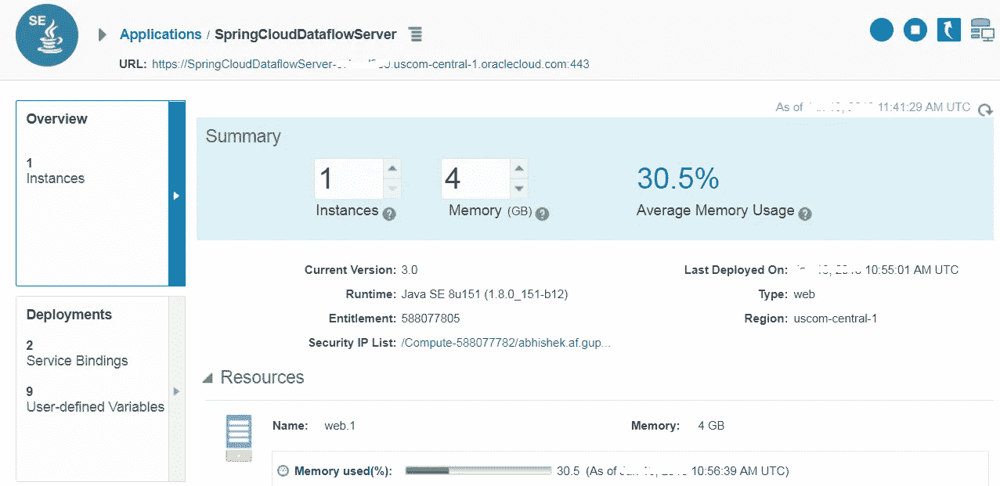
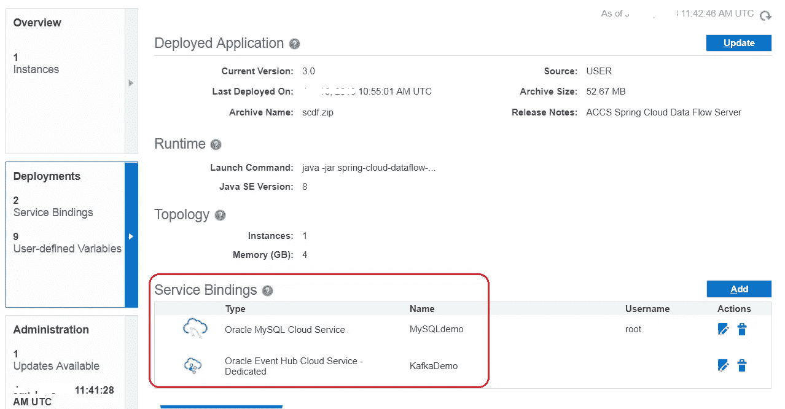
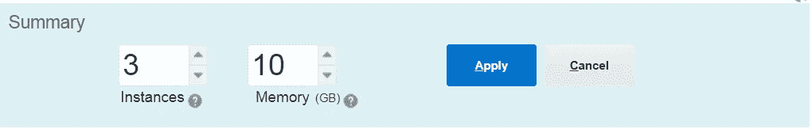

# 第一部分:Oracle Cloud 上 Spring Cloud 数据流的数据处理管道

> 原文：<https://medium.com/oracledevs/part-i-spring-cloud-dataflow-on-oracle-application-container-cloud-cb8d59747dd9?source=collection_archive---------0----------------------->

> 有关微服务主题的博客帖子的主目录，请参考—[https://medium . com/Oracle devs/bunch-of-microservice-related-blogs-57 b5 f1f 062 e 5](/oracledevs/bunch-of-microservices-related-blogs-57b5f1f062e5)

异步通信/消息传递是在云中构建松散耦合和可伸缩的应用程序(包括微服务)的一个关键模式——该模式解决的一个主要问题是实时数据处理

如果您有一个专门为此构建的平台/框架会怎么样？更好的是，如果您可以在云上部署和操作它，会怎么样？

这是两部分博客系列的第一部分，讨论在 T4 甲骨文云上的春天云数据流

*   **第 1 部分**将向您介绍并演示如何在 [Oracle 应用程序容器云](https://cloud.oracle.com/application-container-cloud)上部署 Spring Cloud 数据流服务器，包括其他组件
*   **第 2 部分**将展示如何使用第 1 部分中设置的基础来构建流处理管道

具体来说，第 1 部分将涵盖

*   温柔**介绍**春云数据流
*   **秘笈**—Oracle 应用容器云上的 Spring Cloud 数据流
*   **基础设施设置**—[Oracle Event Hub Cloud](https://cloud.oracle.com/event-hub)(Kafka)用作消息中间件， [Oracle MySQL Cloud](https://cloud.oracle.com/mysql) 用作 Spring Cloud 数据流设置的持久数据存储

# 你好“春云数据流”

这里有一个简单介绍——详情请参考[文档](https://docs.spring.io/spring-cloud-dataflow/docs/current/reference/htmlsingle/)

TL；DR——它是一个用于构建数据处理管道的框架/工具包

*   **应用类型** —长期流处理、数据集成和短期任务
*   **管道**不过是利用*春云流*或*春云任务*的 *Spring Boot* 应用

> 顺便说一句，这是一篇关于如何将基于消息的微服务与 vanilla Spring Cloud Stream & Kafka on Oracle Cloud 结合使用的博客

 [## 基于 Oracle Cloud 的 Spring Cloud Stream 和 Apache Kafka 微服务

### 这篇博客展示了如何在 Oracle Cloud 上运行 Spring 云流应用程序

medium.com](/oracledevs/spring-cloud-stream-and-kafka-based-microservices-on-oracle-cloud-9889732149a) 

*   **事件总线/中间件** —支持 Kafka 和 Rabbit MQ(我们将通过 Oracle Event Hub Cloud 使用 Kafka)
*   **基础设施** —管道本身可以部署到各种运行时(Kubernetes、Mesos 等)。)的实现是可插拔的

> 下一节将介绍 Oracle 应用程序容器云的一个定制实现

*   **接口** —您可以使用仪表板(图形编辑器)、REST API 或 CLI 来处理 Spring Cloud 数据流

让我们试着理解这个解决方案及其组件

# Oracle 应用容器云上的 Spring Cloud 数据流

这是一个涉及所有组件的高级解决方案架构。当你继续读下去的时候，你会遇到每一个问题…

Solution architecture

在这种情况下，Oracle 应用容器云扮演着双重角色

*   它充当运行 Spring Cloud 数据流服务器本身的平台
*   它还可以作为使用 Spring Cloud 数据流构建的管道的运行时(**—*,这是有趣的部分！***

## **Spring 云数据流服务器**

**服务器模块是一个带有嵌入式 servlet 容器的 Spring 应用程序(例如 Tomcat)。正如您将在接下来的章节中看到的那样— *这可以简单地作为一个胖罐子运行在 Oracle 应用程序容器云中的 Java SE 运行时支持之上***

## **Spring 云数据流管道**

**(如上所述)使用 Spring Cloud 数据流创建的数据处理管道只是需要在某个地方运行的 Spring Boot 应用程序。这个运行时部分抽象为一个 [Spring Cloud Deployer SPI](https://github.com/spring-cloud/spring-cloud-deployer/) 的形式，它封装了一个特定运行时的实现，例如(数据流服务器的)本地 JVM、Kubernetes、Apache Mesos 等。**

**下面是 Spring Cloud 数据流文档中的一个片段，它阐释了这个概念**

****

**Spring Cloud Deployer abstraction for various runtimes**

****还有一个专门针对 Oracle 应用容器云的 Spring Cloud Deployer 实现****

** [## ankitbansal/spring-cloud-DFS-accs

### 在 GitHub 上创建一个帐户，为 spring-cloud-dfs-accs 的开发做出贡献。

github.com](https://github.com/ankitbansal/spring-cloud-dfs-accs) 

> 虽然这是一项正在进行和发展的工作，但在目前的状态下，它可以用于操作 Spring Cloud 数据流管道——您将在本博客的第 2 部分看到它的实际应用

## 消息代理:Oracle 事件中心云

各个管道需要一个底层消息传递层来进行异步通信——Spring Cloud 数据流支持 [Apache Kafka](https://kafka.apache.org) 和 [Rabbit MQ](http://rabbitmq.com)

在这种情况下，我们将使用 **Oracle 事件中心云**(托管 Kafka)

## 持久性存储:Oracle MySQL 云

默认情况下，Spring Cloud 数据流将所有信息存储在内存数据库中，但它也支持其他 RDBMSes

我们将利用 **Oracle MySQL Cloud** 作为 Spring Cloud 数据流服务器的持久数据存储

## Maven 知识库

虽然你会在博客的**第 2 部分**中看到这一点，但现在，它足以理解 Spring Cloud 数据流使用 Maven 作为其应用程序的来源之一，这些应用程序需要作为你构建的管道的一部分进行部署——更多详细信息[在此](https://docs.spring.io/spring-cloud-dataflow/docs/current/reference/htmlsingle/#arch-intro)和[在此](https://docs.spring.io/spring-cloud-dataflow/docs/current/reference/htmlsingle/#getting-started-maven-configuration)** 

# **基础设施设置**

**本节总结了如何设置 Spring Cloud 数据流设置所需的基础设施组件**

*   **Oracle 事件中心云实例**
*   **Oracle MySQL 云实例**

## **Oracle 事件中心云(Kafka broker)**

**在这种情况下使用的 Kafka 集群拓扑相对简单，即单个代理与 Zookeeper 位于同一位置。您可以选择特定于您需求的拓扑结构，例如具有 5 个节点 Kafka 集群和 3 个 Zookeeper 节点的 HA 部署**

> **请参考[文档](http://docs.oracle.com/en/cloud/paas/event-hub-cloud/ehcug/creating-cluster.html)了解更多关于拓扑和详细安装过程的细节(提示:这很简单！)**

****

**Oracle Event Hub instance**

****创建自定义访问规则****

**您需要在 Oracle Event Hub Cloud 上的 Kafka 服务器虚拟机上创建一个自定义的**访问规则**来打开端口**2181**—[详细信息请点击此处](https://docs.oracle.com/en/cloud/paas/event-hub-cloud/admin-guide/platform-access-rules-page.html)**

> **Oracle Application Container Cloud 不需要打开端口 6667 (Kafka broker ),因为安全连接由服务绑定负责**

## **Oracle MySQL 云**

**提供一个 MySQL 数据库实例——你可以参考这里的[详细文档](https://docs.oracle.com/cloud/latest/mysql-cloud/UOMCS/GUID-D03FE523-AD8D-4C53-935C-D5D6513D2A24.htm#UOMCS-GUID-D03FE523-AD8D-4C53-935C-D5D6513D2A24)**

****

**Oracle MySQL Cloud instance**

**现在我们已经有了基础设施，是时候在云上部署数据流服务器了**

# **构建和部署**

## **从源构建 Spring Cloud 数据流**

> **这包括特定于 Oracle 应用容器云的 SPI 实施**

*   **`git clone [https://github.com/ankitbansal/spring-cloud-dfs-accs.git](https://github.com/ankitbansal/spring-cloud-dfs-accs.git)`**
*   **`mvn clean install`**

**这将在`spring-cloud-dataflow-server-accs\target`文件夹下创建`spring-cloud-dataflow-server-accs-1.0.0-SNAPSHOT.jar`**

****

**Spring Cloud Data Flow server (fat) JAR**

**拉上拉链——T4**

## **编辑元数据文件**

**根据您的设置配置元数据文件**

****manifest.json****

**manifest.json for Data Flow server on ACCS**

**以下是关键属性的总结**

*   **`maven.remote-repositories.repo1.url` — Maven 资源库 URL。如果适用，使用`maven.remote-repositories.repo1.auth.username`和`maven.remote-repositories.repo1.auth.password`**

> **在这种情况下，我们使用 Spring Maven repo。更多信息请见第 2 部分**

*   **`spring.cloud.dataflow.applicationProperties.stream.spring.cloud.stream.kafka.binder.brokers` —保持不变，因为它将从环境变量中选取**
*   **`spring.cloud.dataflow.applicationProperties.stream.spring.cloud.stream.kafka.binder.zkNode` —输入事件中心 Zookeeper 主机和端口的值**

****deployment.json****

**deployment.json for Data Flow server on ACCS**

**以下是关键属性的总结**

*   **`ACCS_URL` —对于欧洲数据中心，使用 **emea** 而不是**美国****
*   **`spring_datasource_username` —保持不变，因为它将从环境变量中选取**
*   **`spring_datasource_password` —保持不变，因为它将从环境变量中选取**
*   **`spring_datasource_driver-class-name` —保持不变**

## **推至云**

**借助 Oracle Application Container Cloud，您在部署应用程序方面有多种选择。本博客将利用 **PSM CLI** ，这是一个用于管理 Oracle 云服务的强大命令行界面**

> ***其他部署选项包括*[*REST API*](https://docs.oracle.com/en/cloud/paas/app-container-cloud/apcsr/index.html)*[*Oracle 开发者云*](https://docs.oracle.com/en/cloud/paas/developer-cloud/csdcs/deploying-application-oracle-developer-cloud-service.html#GUID-6FE6D850-65DC-471D-A249-F7CCA9CAB56F) *当然还有* [*控制台/UI*](https://docs.oracle.com/en/cloud/paas/app-container-cloud/csjse/creating-application.html)***

***在您的机器上下载并设置 PSM CLI(使用`psm setup`)——[详情请见](https://docs.oracle.com/en/cloud/paas/java-cloud/pscli/using-command-line-interface-1.html)***

***部署 Spring Cloud 数据流服务器— `psm accs push -n SpringCloudDataflowServer -r java -s hourly -m manifest.json -d deployment.json -p scdf.zip`***

> ****一旦执行，一个*异步*进程被启动，CLI 返回它的*任务 ID *供您跟踪应用程序创建****

## ***检查您的应用程序***

***访问应用程序并检查实例和拓扑信息***

******

***Application overview***

***注意事件中心和 MySQL 云的**服务绑定*****

******

***Service Bindings — Event Hub and MySQL***

# ***试车***

***访问 Spring Cloud 数据流仪表板—导航到您在应用程序详细信息屏幕上看到的 URL，例如`[https://SpringCloudDataflowServer-mydomain.apaas.us2.oraclecloud.com](https://DataflowServer-ocloud100.apaas.us2.oraclecloud.com)/**dashboard**`***

## ***更改部署拓扑***

***您可以轻松地修改 Spring Cloud 数据流设置的拓扑结构***

******

***Change the topology as required***

*   *****放大/缩小** —增加/减少分配给数据流服务器的内存(RAM)***
*   *****扩大/缩小** —增加/减少 HA 和性能的实例数量。*这很容易，因为持久状态存储在 MySQL 中，而应用本身是无状态的****

# ***摘要***

***这就是我们讨论的第一部分***

*   ***基本概念***
*   ***在 **Oracle 应用容器云**上部署了 **Spring Cloud 数据流**服务器及其相关组件，包括***
*   *****Oracle 事件中心云**作为基于 Kafka 的消息传递层，以及***
*   *****Oracle MySQL 云**作为持久 RDBMS 存储***

***下一期将展示我们在 Oracle Application Container Cloud 上使用 Spring Cloud 数据流构建基于 Kafka 的流处理管道的过程..***

# ***不要忘记…***

*   ***查看 Oracle Application Container Cloud 教程—每个运行时都有适合的内容！***

 ***[## Oracle 应用容器云服务—创建您的第一批应用

### Oracle 应用容器云服务教程。学习创建你的第一个应用程序。

docs.oracle.com](https://docs.oracle.com/en/cloud/paas/app-container-cloud/create-first-applications.html)*** 

*   ***关于应用容器云的其他博客***

*** [## 关于应用容器云的最新故事和新闻—中型

### 阅读关于应用容器云的最新文章。每天，成千上万的声音阅读、书写和分享重要的…

medium.com](/tag/app-container-cloud/latest) 

干杯！

> 本文表达的观点是我个人的观点，不一定代表甲骨文的观点。***